# 🎁 **Creating a Custom Business Object and Service for managing Gift Cards** 

The Gift Card Business Object allows users to store essential details such as:
- **Gift Card Number**
- **Description**
- **Amount**
- **Currency**

This RAP Business Object supports **Create, Read, Update, and Delete** operations, ensuring seamless management of the gift card.
> The object names/coding style used here, if any, is not a recommendation on coding guidelines/standards 
---

## **Procedure**

### 1️⃣ **Log On**
1. As a developer, access the development tenant in your SAP Cloud ERP (SAP S/4HANA Cloud) system.
2. Log on with valid credentials to start your development journey.

---

### 2️⃣ **Create an ABAP Package**
1. Choose **`ZCUSTOM_DEVELOPMENT > New > ABAP Package`**.
2. Enter the following details:
   - **Name:** `ZXE_S4`
   - **Description:** `<Enter a suitable description>`

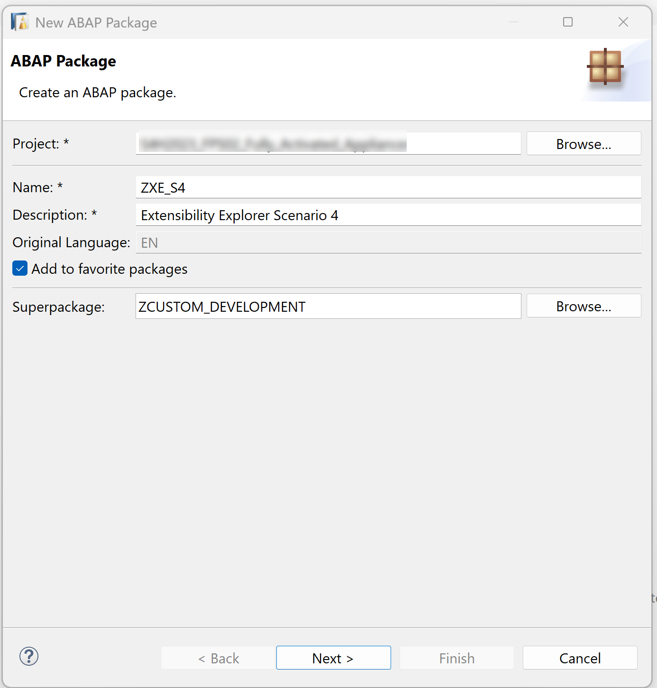

3. Select **Add to favourite packages**.

4. Choose **Next**. 

5. On the **Select Transport Request** screen, choose **Create a New Request** and enter a description. 

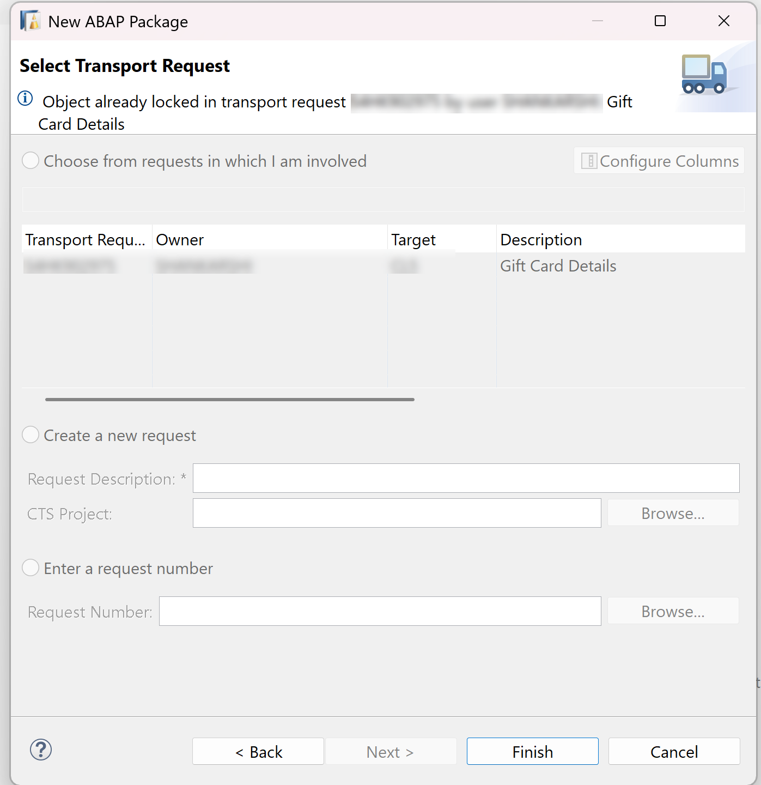

6. Choose **Finish**.

------------------------------------------------------------------------------------------------------------------------------------------------------------------

### 3️⃣ **Create Data Elements**

#### **Gift Card Number**
1. Right-click the new ABAP Package **`ZXE_S4`** and choose **`New > Other ABAP Repository Object`**.
2. Search for **Data Element**, select it, and choose **Next**.
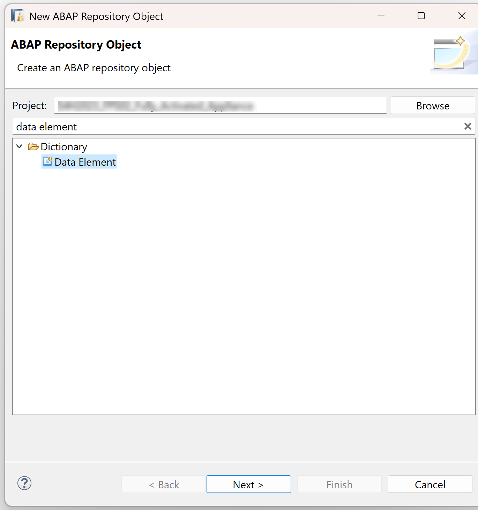

3. Provide the following details:
   - **Name:** `ZXE4_GIFTCARDNUMBER`
   - **Description:** `Gift Card Number`
 
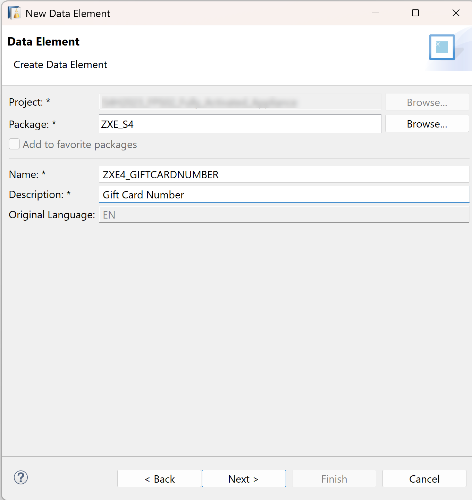

4. Choose **Next**.
   
5. Select a transport request and choose **Finish**.
   
6. In the **Data Type Information** section, enter the following data:
- **Category:** `Predefined Type`
- **Data Type:** `NUMC`
- **Length:** `10`

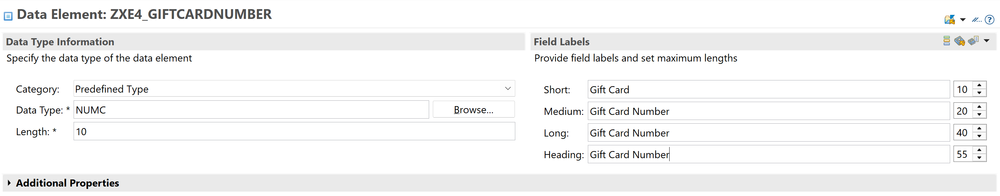

7. In the **Field Labels** section, enter the following data:
   - **Short:** `Gift Card`
   - **Medium:** `Gift Card No`
   - **Long:** `Gift Card Num`
   - **Heading:** `Gift Card Number`

8. Save and Activate.

#### **Gift Card Description**
1. Right-click the package **`ZXE_S4`** and choose **`New > Other ABAP Repository Object`**.
   
2. Search for **Data Element**, select it, and choose **Next**.
   
3. Enter the following data:
   - **Name:** `ZXE4_GIFTCARDDESC`
   - **Description:** `Gift Card Description`

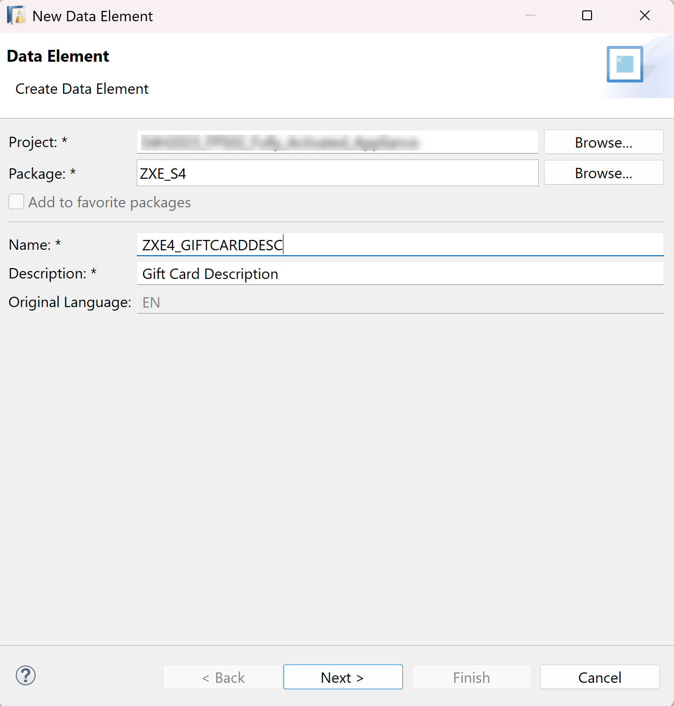

4. Choose **Next**. 

5. Select a transport request and choose **Finish**. 

6. In the **Data Type Information** section, enter the following data:In the **Field Labels** section, enter the following data:
  - **Category:** `Predefined Type`
   - **Data Type:** `CHAR`
   - **Length:** `40`

7. In the **Field Labels** section, enter the following data:
   - **Short:** `Gift Card`
   - **Medium:** `Gift Card Desc`
   - **Long:** `Gift Card Description`
   - **Heading:** `Gift Card Description`

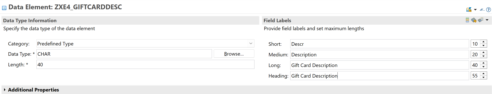

8. Save and Activate.

#### **Gift Card Amount**

1. Right-click the package **`ZXE_S4`** and choose **`New > Other ABAP Repository Object`**.
   
2. Search for **Data Element**, select it, and choose **Next**.

3. Enter the following data:
   - **Name:** `ZXE4_GIFTCARDAMT`
   - **Description:** `Gift Card Amount`
  
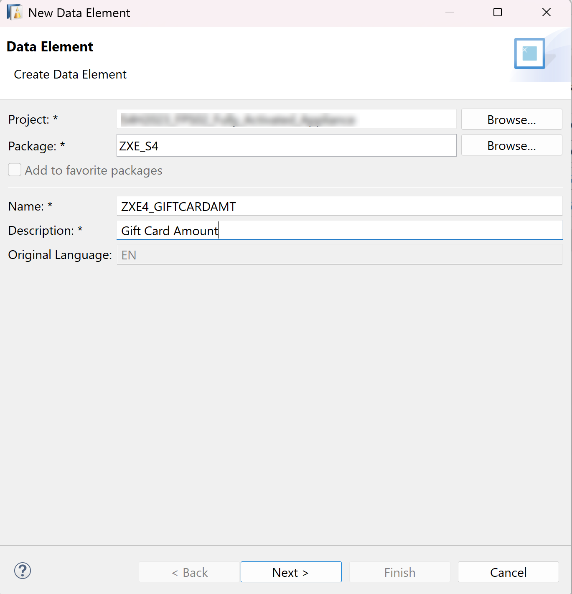

4. Choose **Next**.

5. Select a transport request and choose **Finish**.
   
6.In the **Data Type Information** section, enter the following data:
   - **Category:** `Predefined Type`
   - **Data Type:** `CURR`
   - **Length:** `15`
   - **Decimals:** `2`

7.In the **Field Labels** section, enter the following data:
   - **Short:** `Amount`
   - **Medium:** `Gift Card Amount`
   - **Long:** `Gift Card Amount`
   - **Heading:** `Gift Card Amount`

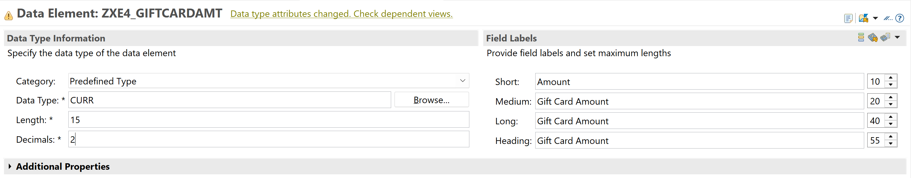

8. Save and Activate.
  
### 4️⃣ **Create a Database Table to Store Gift Card Details**

1. **Create a Database Table**
   - Right-click the package **`ZXE_S4`** and choose **New > Other ABAP Repository Object**.
   - Search for **Database Table**, select it, and choose **Next**.
     
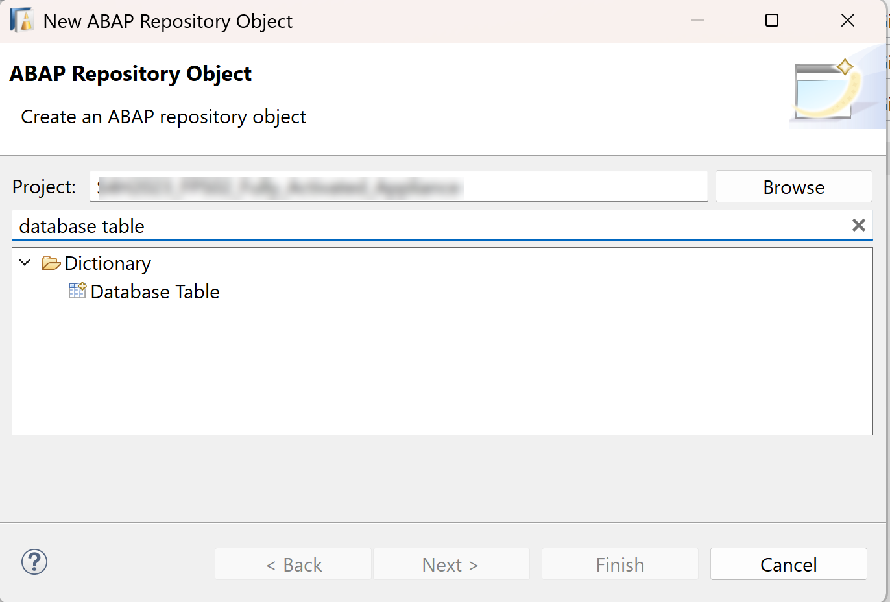
    
   - Enter the following data:  
     - **Name:** `ZXE4_GIFTCARD`  
     - **Description:** `Gift Card Details`
        
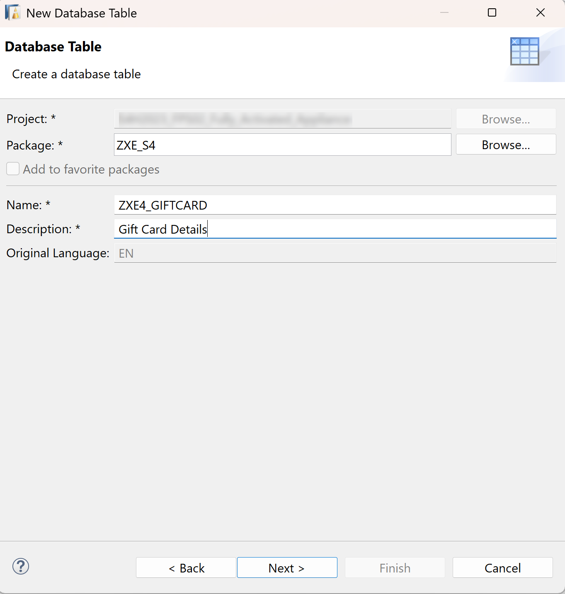
 
   - Choose **Next**.
   - Select a transport request and choose **Finish**.

2. **Replace the Generated Code**  
   Replace the generated code with the following ABAP code:

 ```abap
    
@EndUserText.label : 'Gift Card Details'
@AbapCatalog.enhancement.category : #NOT_EXTENSIBLE
@AbapCatalog.tableCategory : #TRANSPARENT
@AbapCatalog.deliveryClass : #A
@AbapCatalog.dataMaintenance : #RESTRICTED
define table zxe4_giftcard {
 
  key client            : abap.clnt not null;
  key sap_uuid          : sysuuid_x16 not null;
  giftcardnumber        : zxe4_giftcardnumber not null;
  sap_description       : zxe4_giftcarddesc not null;
  @Semantics.amount.currencyCode : 'zxe4_giftcard.amount_c'
  amount_v              : zxe4_giftcardamt;
  amount_c              : abap.cuky;
  created_by            : abp_creation_user;
  created_at            : abp_creation_tstmpl;
  local_last_changed_by : abp_locinst_lastchange_user;
  local_last_changed    : abp_locinst_lastchange_tstmpl;
  last_changed          : abp_lastchange_tstmpl;
 
}


```

3. Save and Activate.


   
--------------------------------------------------------------------------------------------------------------------------------------------------------------------

### 5️⃣ **Generate an RAP BO using RAP Generator.**

1. **Right-click the Database Table**
   - Right-click the database table **`ZXE4_GIFTCARD`** and choose **Generate ABAP Repository Objects...**.

2. **Select OData UI Service**
   - In the **ABAP RESTful Application Programming Model** dropdown, choose **OData UI Service**.

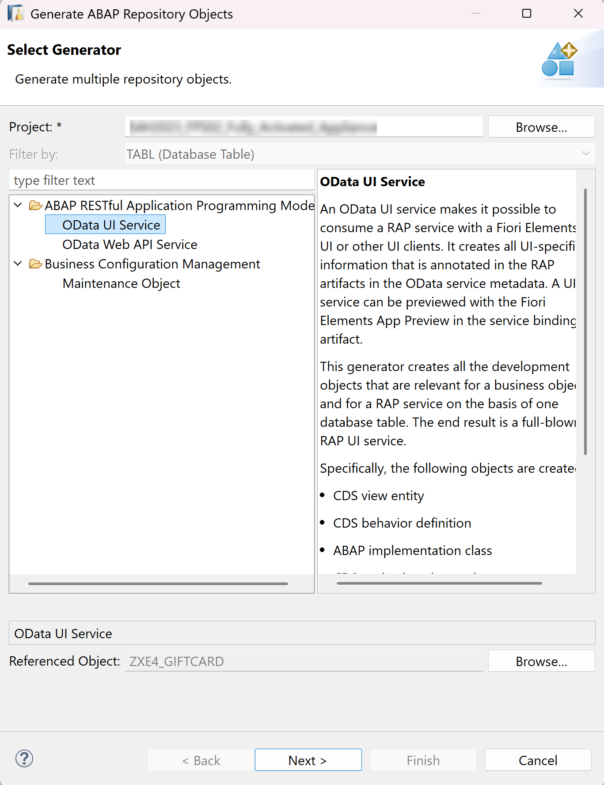


3. **Provide Package Details**
   - Choose **Next**.  
   - On the **Generate ABAP Repository Objects** screen, enter the following data:  
     - **Package:** `ZXE_S4`.

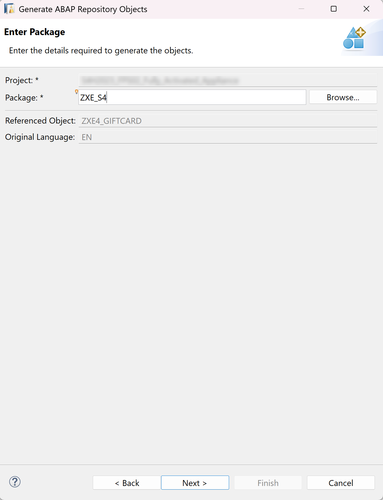

4. **Enter General Section Details**
   - Choose **Next**.  
   - In the **General** section of RAP Layers, enter the following data:  
     - **Description:** `Gift Card Details`.

 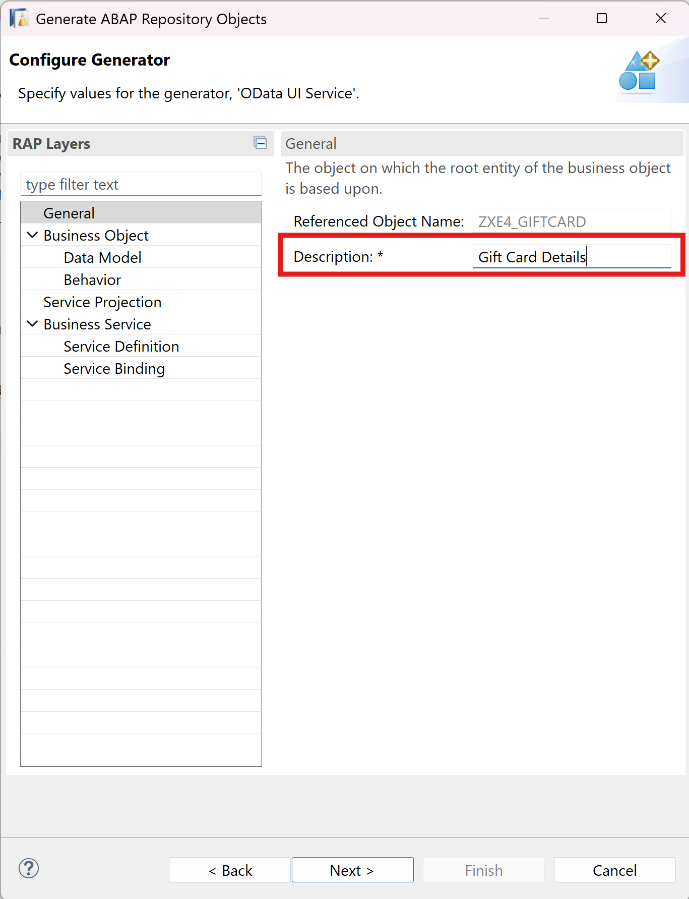

5. **Enter Data Model Details**
   - In the **Data Model** section under the **Business Object** menu of RAP Layers, enter:  
     - **Data Definition Name:** `ZXE4_I_GIFTCARD`.  
     - **Alias Name:** `GiftCard`.

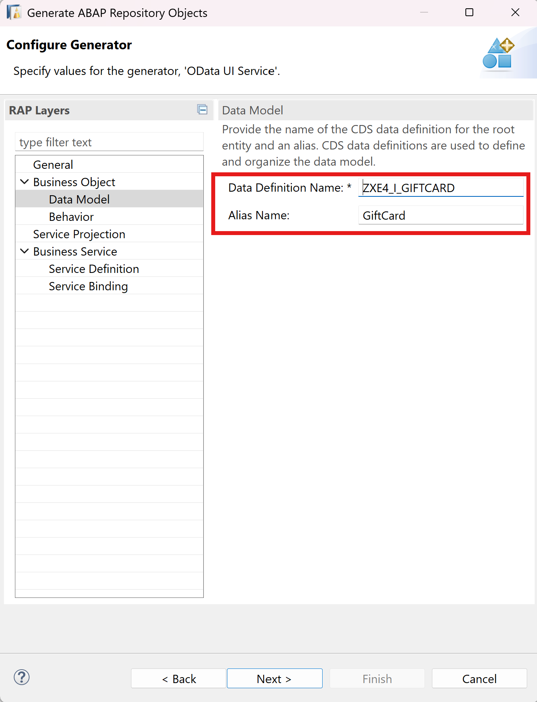

6. **Enter Behavior Section Details**
   - In the **Behavior** section under the **Business Object** menu of RAP Layers, enter:  
     - **Implementation Class:** `ZBP_XE4_I_GIFTCARD`.  
     - **Draft Table Name:** `ZXE4_GIFTCARD_D`.

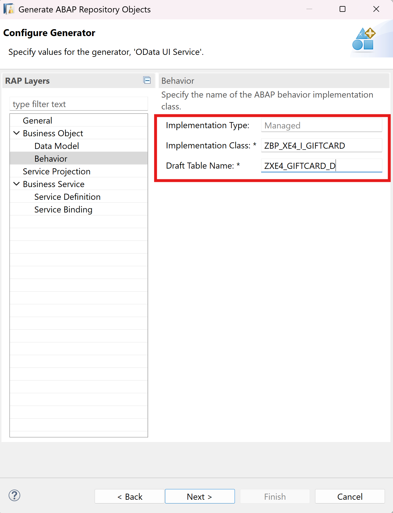

7. **Enter Service Projection Details**
   - In the **Service Projection** section of RAP Layers, enter:  
     - **Name:** `ZXE4_C_GIFTCARD`.


8. **Enter Service Definition Details**
   - In the **Service Definition** section under the **Business Service** menu of RAP Layers, enter:  
     - **Name:** `ZXE4_SD_GIFTCARD`.
  
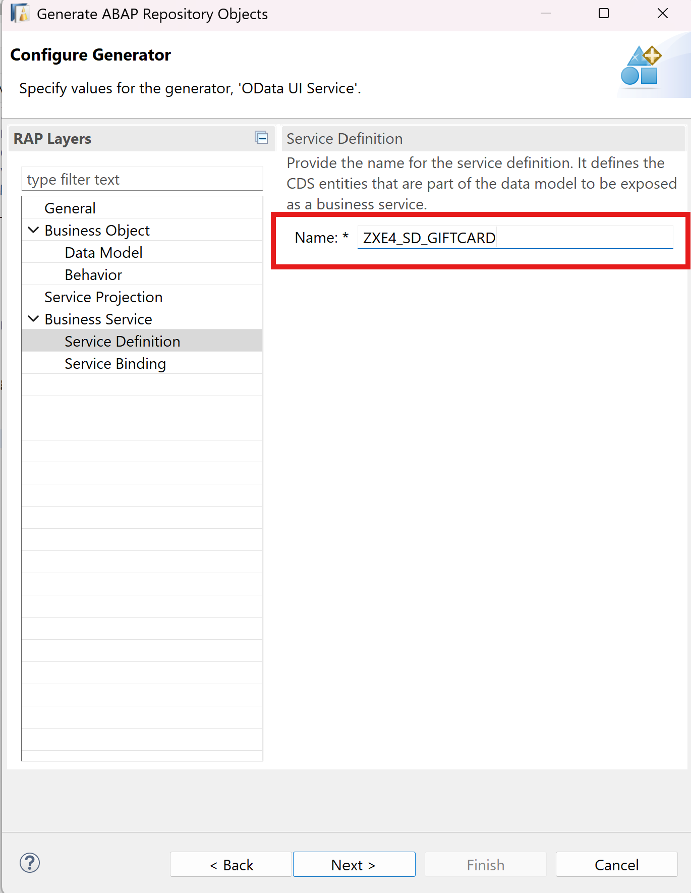

9. **Enter Service Binding Details**
   - In the **Service Binding** section under the **Business Service** menu of RAP Layers, enter:  
     - **Name:** `ZXE4_UI_GIFTCARD_V4`.  
     - **Binding Type:** `OData V4 - UI`.

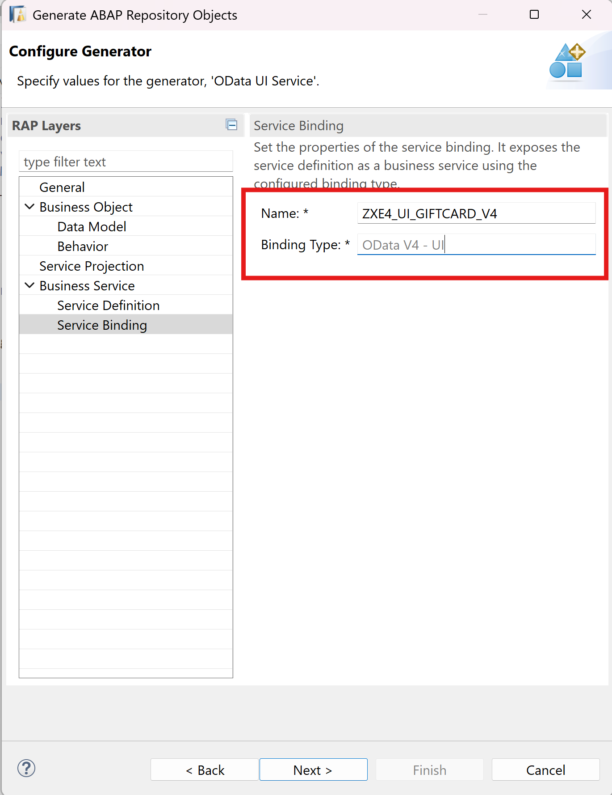

10. Choose **Next**.  
    - On the **Preview Generator Output** screen, choose **Next**.  
    - Select a transport request and choose **Finish**.

--------------------------------------------------------------------------------------------------------------------------------------------------------------------------------------------------------------------------

### 6️⃣ **Publish the Generated Service Binding**

1. **Publish the Service Binding**
   - In the **Services** section of the service binding, click on the service name **`ZXE4_SD_GIFTCARD`**.
   - Choose **Publish** to activate the service binding.
  
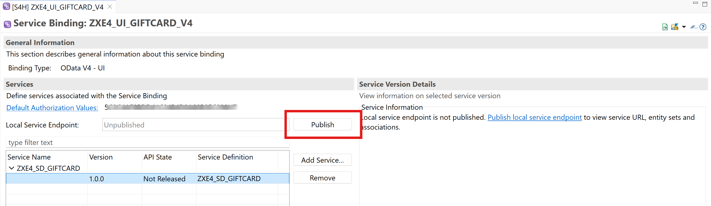

2. **Access the Service Version Details**
   - Navigate to the **Service Version Details** section.
    
3. **Select the Entity Set**
   - Under **Entity Set and Association**, choose the entity set **`GiftCard`**.
 
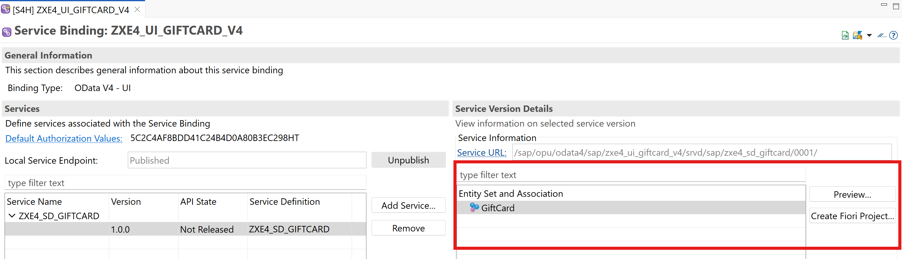

4. **Preview the Service**
   - Click on **Preview** to open the service in the browser and verify its functionality.
  


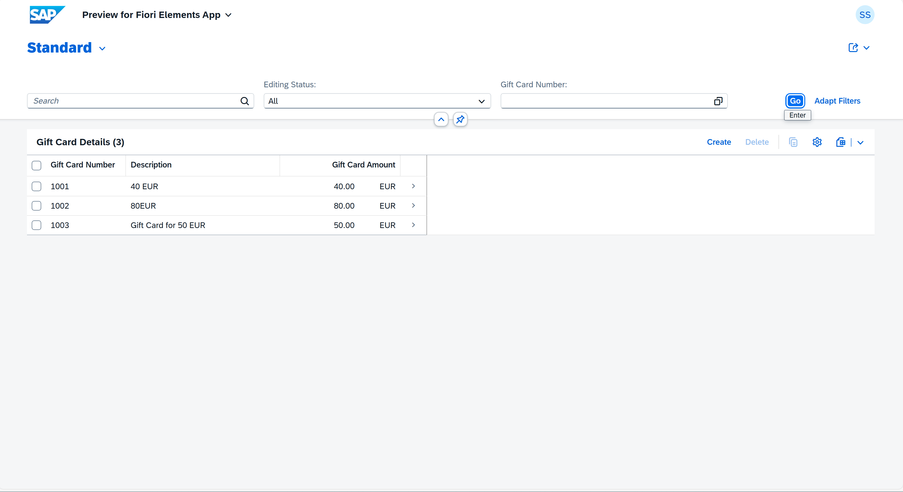

---------------------------------------------------------------------------------------------------------------------------------------------------------------------------------------------------------------------------

<!-----
➡️ [Extend Sales Order](../02-Extend-Sales-Order-RAP-BO)
----->

