# 🎁 **Extending the RAP based Sales Order Business Object for the Gift Card Scenario** 

> The object names/coding style used here, if any, is not a recommendation on coding guidelines/standards 

### 1️⃣ Create a Value Help CDS view for gift cards

1. Right-click the package **`ZXE_S4`** and choose **New > Other ABAP Repository Object**.

2. Search for **Data Definition**, select it, and choose **Next**.

3. Enter the following data:  
   - **Name:** `ZXE4_GIFTCARDVH`  
   - **Description:** `Gift Card Value Help`  
   Choose **Next**.

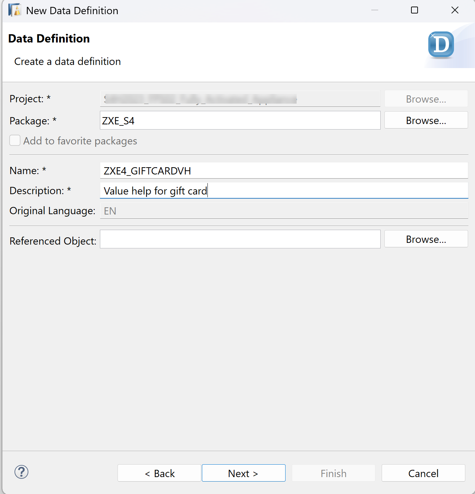

4. Select a transport request and choose **Next**.

5. On the **Templates** screen, choose **Define View Entity**.

6. Choose **Finish**.
   
7. Replace the generated code with the following ABAP code:

```abap

@AbapCatalog.viewEnhancementCategory: [#NONE]
@AccessControl.authorizationCheck: #NOT_REQUIRED
@EndUserText.label: 'Gift Card Value Help'
@ObjectModel.usageType:{
  serviceQuality: #A,
  sizeCategory: #L,
  dataClass: #MASTER
}
@ObjectModel.dataCategory: #VALUE_HELP
@Search: {
  searchable: true
}
@ObjectModel.representativeKey: 'SapUUID'
@Consumption.valueHelpDefault.fetchValues:#AUTOMATICALLY_WHEN_DISPLAYED
@Consumption.ranked: true
define view entity ZXE4_GIFTCARDVH
  as select from ZXE4_I_GIFTCARD as GiftCard
{
      @UI.hidden:true
  key GiftCard.SapUUID,
      @ObjectModel.text.element: ['SapDescription']
      GiftCard.Giftcardnumber,
      @Search: {
            defaultSearchElement: true,
            ranking: #HIGH,
            fuzzinessThreshold: 0.8 }
      @Semantics.text: true
      GiftCard.SapDescription
}
```

8. Save and Activate.

### 2️⃣ Create a CDS Abstract entity for choosing a gift card.

1. Right-click the package **`ZXE_S4`** and choose **New > Other ABAP Repository Object**.

2. Search for **Data Definition**, select it, and choose **Next**.

3. Enter the following data:  
   - **Name:** `ZXE4_ASSIGNGIFTCARDTOSOP`  
   - **Description:** `Sales Order Gift Card`
  
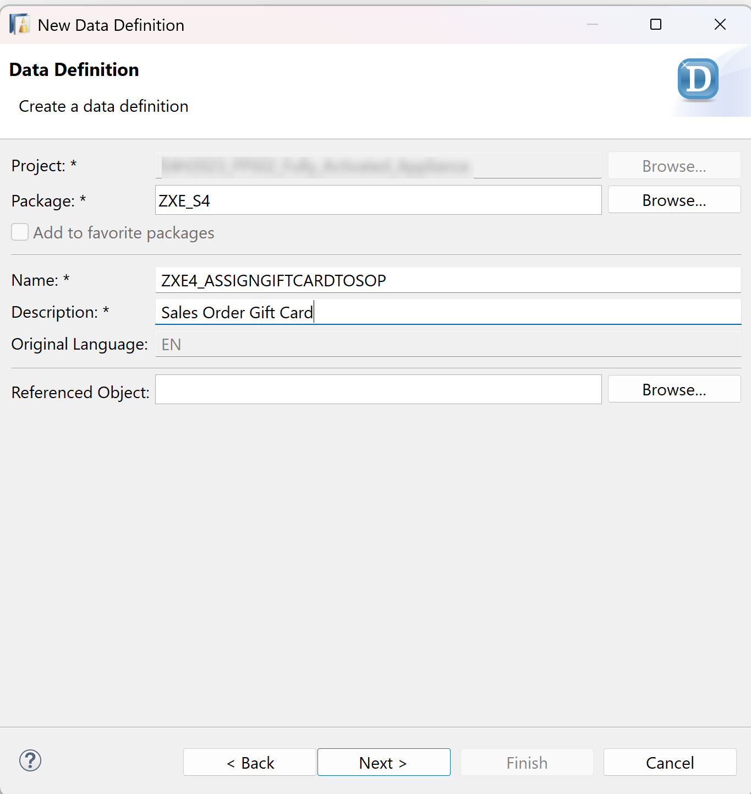

   Choose **Next**.

4. Select a transport request and choose **Next**.

5. On the **Templates** screen, choose **Define Abstract Entity with Parameters**.

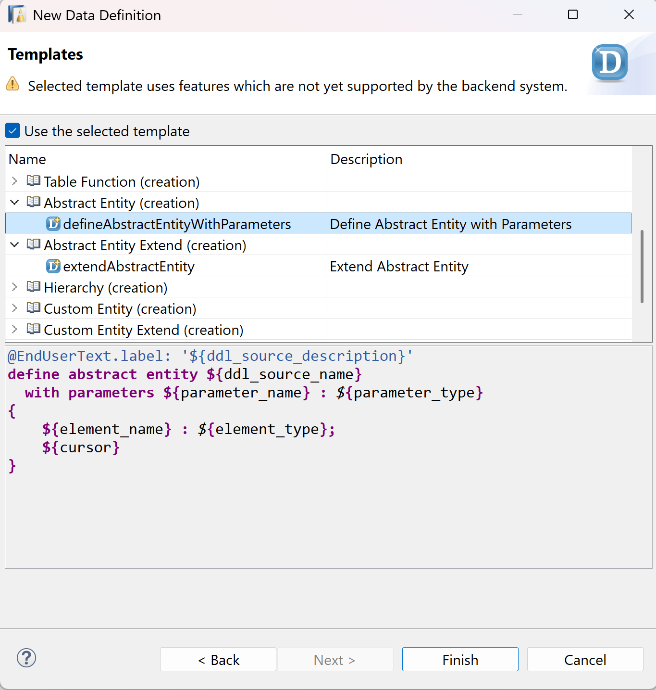

6. Choose **Finish**.

7. Replace the generated code with the following ABAP code:

```abap
@EndUserText.label: 'Sales Order Gift Card'
define abstract entity ZXE4_ASSIGNGIFTCARDTOSOP{
@Consumption.valueHelpDefinition: [{
  entity: {
    name: 'ZXE4_GIFTCARDVH',
    element: 'Giftcardnumber'
  }
}]
    @EndUserText.label: 'Gift Card'
    Giftcardnumber     : zxe4_giftcardnumber; 
}
```

### 3️⃣ Extend the SDSALESDOC _INCL_EEW_PS extension structure to include the fields for the gift card amount and currency.

1. Right click on **Favourite Objects** in the Project Explorer view, select **Add Object** and paste `SDSALESDOC_INCL_EEW_PS`.

2. In the **Project Explorer** view, right-click the `SDSALESDOC_INCL_EEW_PS` structure and choose **Append Structure**.  
   - This **'Extension Include'** allows us to extend the persistent table (`VBAK`) with additional fields.

3. Enter the following data:  
   - **Package:** `ZXE_S4`  
   - **Name:** `ZXE4_SALESORDER_APPEND`  
   - **Description:** `Sales Order Extension for Gift Card Fields`  
   Choose **Next**.

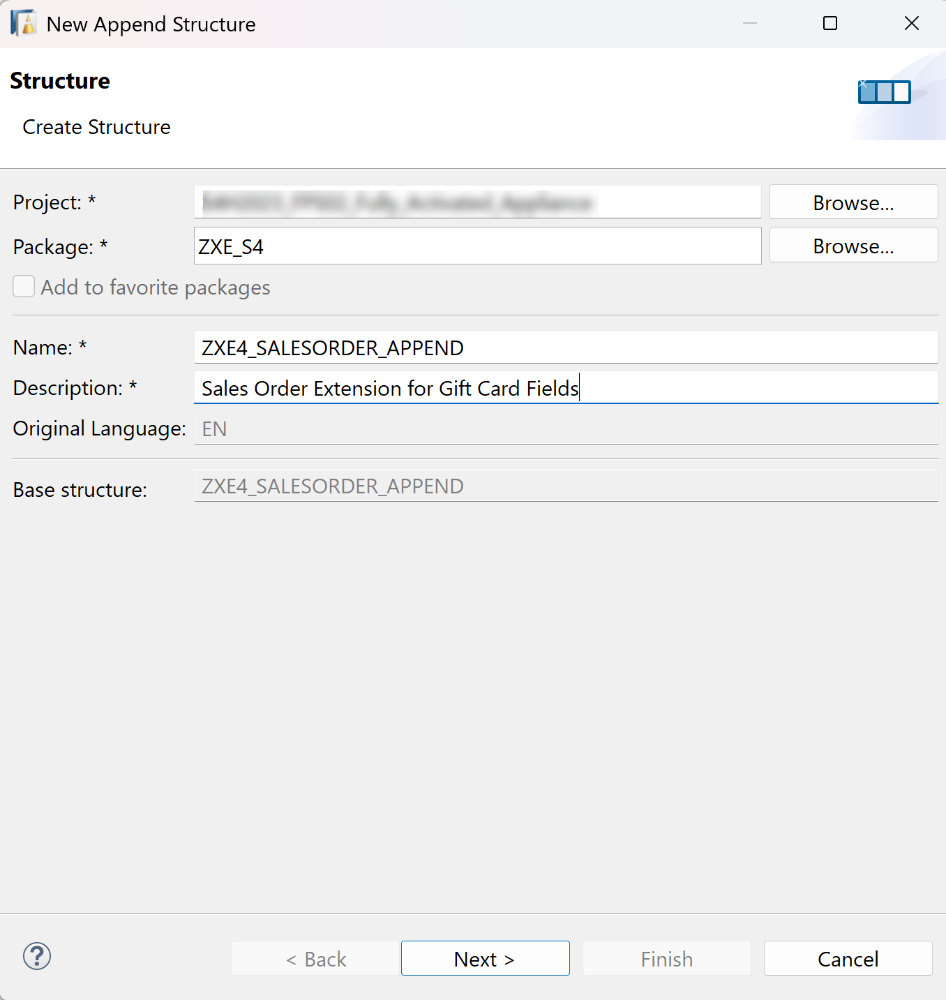


4. Select a transport request and choose **Finish**.

5. Replace the generated code with the following ABAP code:

```abap
@EndUserText.label : 'Sales Order Extension for Gift Card Fields'
@AbapCatalog.enhancement.category : #NOT_EXTENSIBLE
extend type sdsalesdoc_incl_eew_ps with zxe4_salesorder_append {

  @Semantics.amount.currencyCode : 'zxe4_salesorder_append.zz_giftcardcurrency_sdh'
  zz_giftcardamount_sdh   : zxe4_giftcardamt;
  zz_giftcardcurrency_sdh : abap.cuky;

}
```

6. Save and Activate.

### 4️⃣ Extend E_SalesDocumentBasic to include the fields for the gift card amount and the currency. 

> E_SalesDocumentBasic is the basic interface CDS view for the VBAK (Sales Order header) table.

1. Right-click the package **`ZXE_S4`** and choose **New > Other ABAP Repository Object**.

2. Search for **Data Definition**, select it, and choose **Next**.

3. Enter the following data:  
   - **Name:** `ZXE4_E_SALESDOCUMENT_EXT`  
   - **Description:** `E_SALESDOCUMENTBASIC Extension`  
   - **Referenced Object:** `E_SALESDOCUMENTBASIC`  
   Choose **Next**.

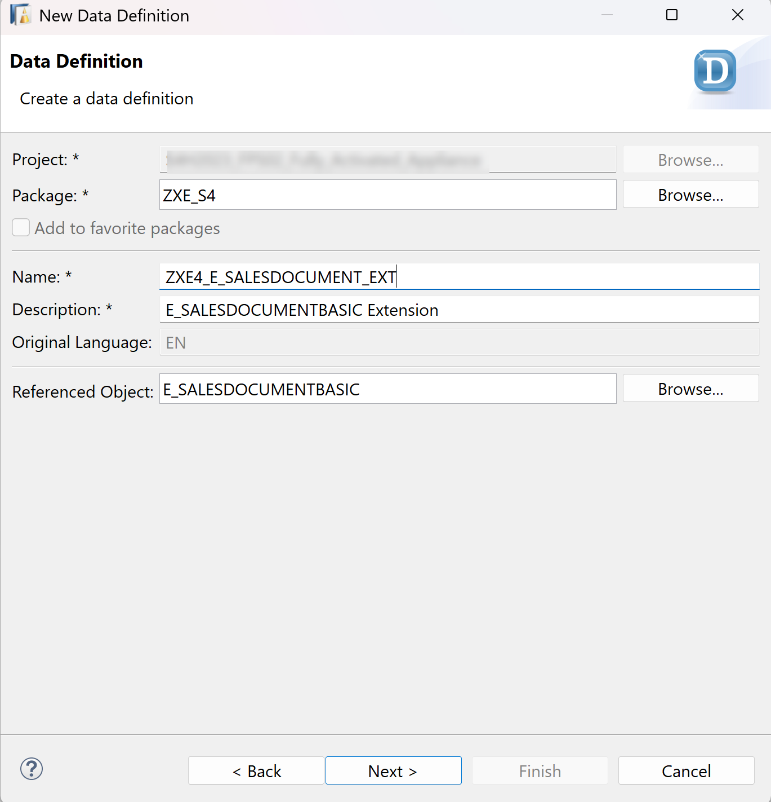

4. Select a transport request and choose **Next**.

5. On the **Templates** screen, choose **Extend View Entity**.

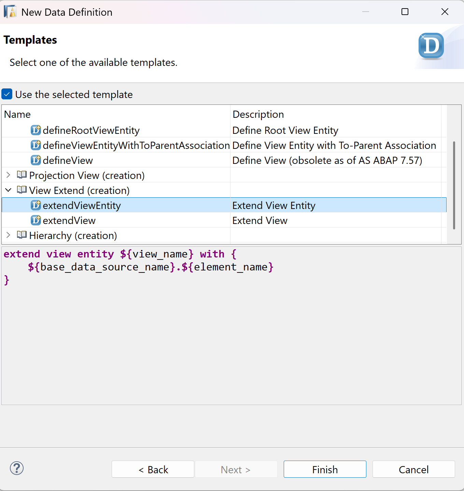

6. Choose **Finish**.

7. Replace the generated code with the following ABAP code:

```abap

extend view entity E_SALESDOCUMENTBASIC with association [0..1] to I_Currency as _zz_giftcardcurrency_sdh on $projection.zz_giftcardcurrency_sdh = _zz_giftcardcurrency_sdh.Currency 
 {
    @Semantics.amount.currencyCode: 'zz_giftcardcurrency_sdh'
    Persistence.zz_giftcardamount_sdh as zz_giftcardamount_sdh,
    @ObjectModel.foreignKey.association: '_zz_giftcardcurrency_sdh'
    Persistence.zz_giftcardcurrency_sdh as zz_giftcardcurrency_sdh,
    
    _zz_giftcardcurrency_sdh
}
```
8. Save and Activate.

### 5️⃣ Extend R_SalesOrderTP to include the fields for the gift card amount and currency. 

> R_SalesOrderTP is the RAP Business Object for the sales order.

1. In the **ABAP Developer Tools** menu bar, choose **Open ABAP Development Object**.  
   - In the **Windows Operating System**, you can access it with the keyboard shortcut **Control + Shift + A** and in **Mac**, you can access it with the keyboard shortcut **Cmd + Shift + A**.

2. Enter **`R_SalesOrderTP`** in the search bar.

3. Select **`R_SalesOrderTP (Data Definition)`** and choose **OK**.

4. In the **Project Explorer** view, choose **Link with Editor**, so that the object is visible in the Project Explorer.

5. In the **Project Explorer** view, right-click the `R_SALESORDERTP` data definition and choose **New Data Definition**.

6. Enter the following data:  
   - **Package:** `ZXE_S4`  
   - **Name:** `ZXE4_R_SALESORDERTP_EXT`  
   - **Description:** `R_SalesOrderTP Extension`  
   Choose **Next**.

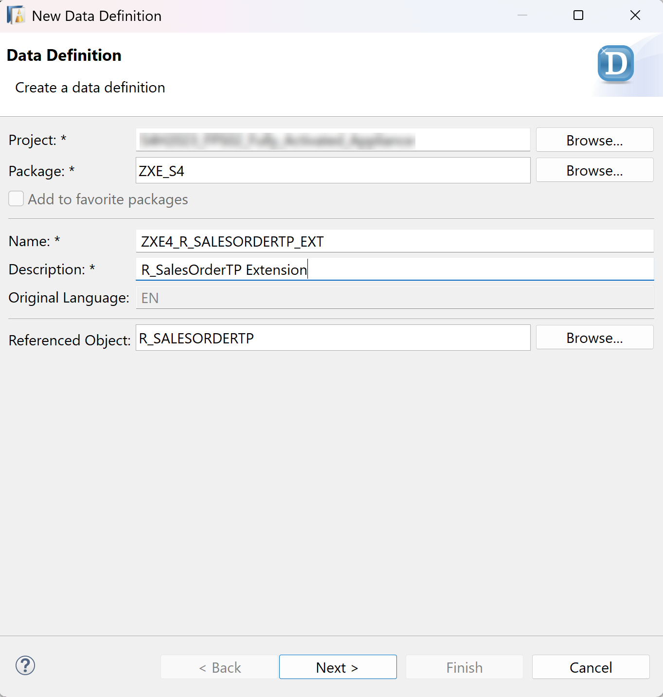

7. Select a transport request and choose **Next**.

8. Choose **Extend View Entity** as the template and choose **Finish**.

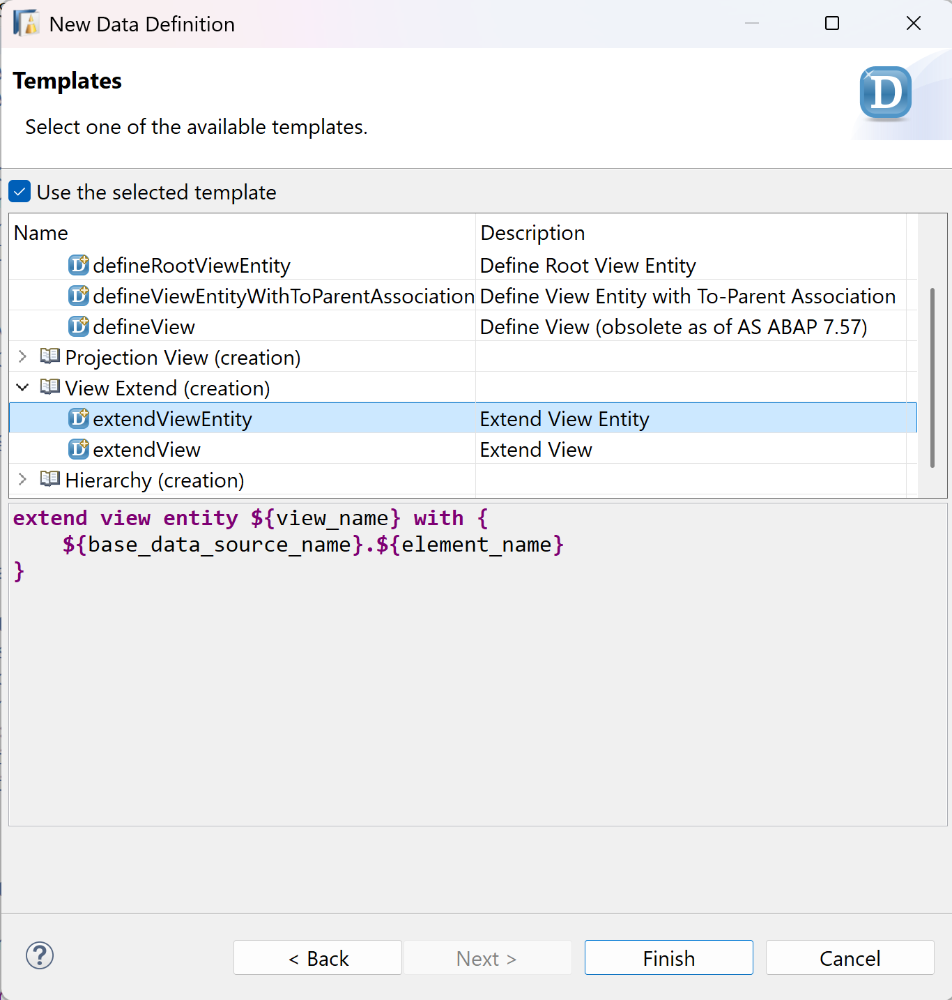

9. Replace the generated code with the following code:

```abap
extend view entity R_SALESORDERTP with { 
  @Semantics.amount.currencyCode: 'zz_giftcardcurrency_sdh' 
    _Extension.zz_giftcardamount_sdh as zz_giftcardamount_sdh, 
    _Extension.zz_giftcardcurrency_sdh as zz_giftcardcurrency_sdh 
}

```

10. Save and Activate the extension.

### 6️⃣ Extend CDS I_SalesOrderTP to include the fields for the gift card amount and the currency. 

> I_SalesOrderTP is the interface for the Sales Order RAP Business Object.

1. In the **ABAP Developer Tools** menu bar, choose **Open ABAP Development Object**.  
   - In the **Windows Operating System**, you can access it using the keyboard shortcut **Control + Shift + A** and in **Mac**, you can access it with the keyboard shortcut **Cmd + Shift + A**.

2. Enter **`I_SalesOrderTP`** in the search bar.

3. Select **`I_SalesOrderTP (Data Definition)`** and choose **OK**.

4. In the **Project Explorer** view, choose **Link with Editor**, so that the object is visible in the Project Explorer.

5. In the **Project Explorer** view, right-click the `I_SALESORDERTP` data definition and choose **New Data Definition**.

6. Enter the following data:  
   - **Package:** `ZXE_S4`  
   - **Name:** `ZXE4_I_SALESORDERTP_EXT`  
   - **Description:** `I_SalesOrderTP Extension`  

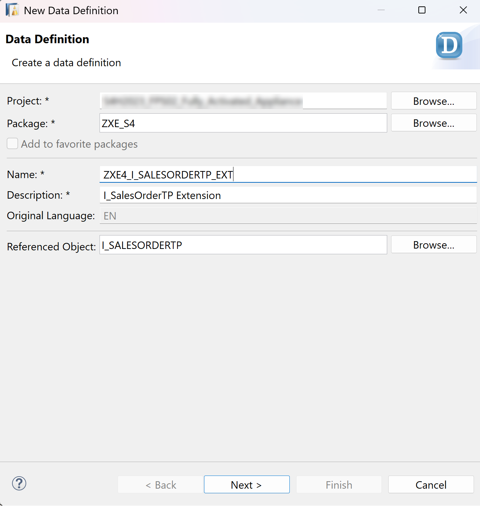

   Choose **Next**.

7. Select a transport request and choose **Next**.

8. Choose **Extend View Entity** as the template and choose **Finish**.

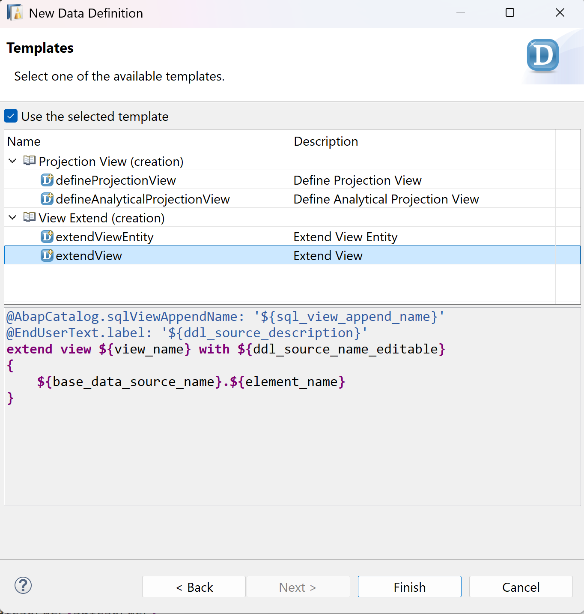

9. Replace the generated code with the following code:

```abap
extend view entity I_SALESORDERTP with { 
  @Semantics.amount.currencyCode: 'zz_giftcardcurrency_sdh' 
    SalesOrder.zz_giftcardamount_sdh as zz_giftcardamount_sdh, 
    SalesOrder.zz_giftcardcurrency_sdh as zz_giftcardcurrency_sdh 
}
```

10. Save and Activate the extension.

### 7️⃣ Extend the behavior definition of R_SalesOrderTP to include the gift card logic.

1. In the **ABAP Developer Tools** menu bar, choose **Open ABAP Development Object**.  
   - In the **Windows Operating System**, you can access it using the keyboard shortcut **Control + Shift + A** and in **Mac**, you can access it with the keyboard shortcut **Cmd + Shift + A**.

2. Enter **`R_SalesOrderTP`** in the search bar.

3. Select **`R_SalesOrderTP (Behavior Definition)`** and choose **OK**.

4. In the **Project Explorer** view, choose **Link with Editor**, so that the object is visible in the Project Explorer.

5. In the **Project Explorer** view, right-click the `R_SALESORDERTP` behavior definition and choose **New Behavior Extension**.

6. Enter the following data:  
   - **Package:** `ZXE_S4`  
   - **Name:** `ZXE4_GIFTCARD_EXT`  
   - **Description:** `I_SalesOrderTP Extension`  
   - **BO Interface:** `I_SALESORDERTP`  

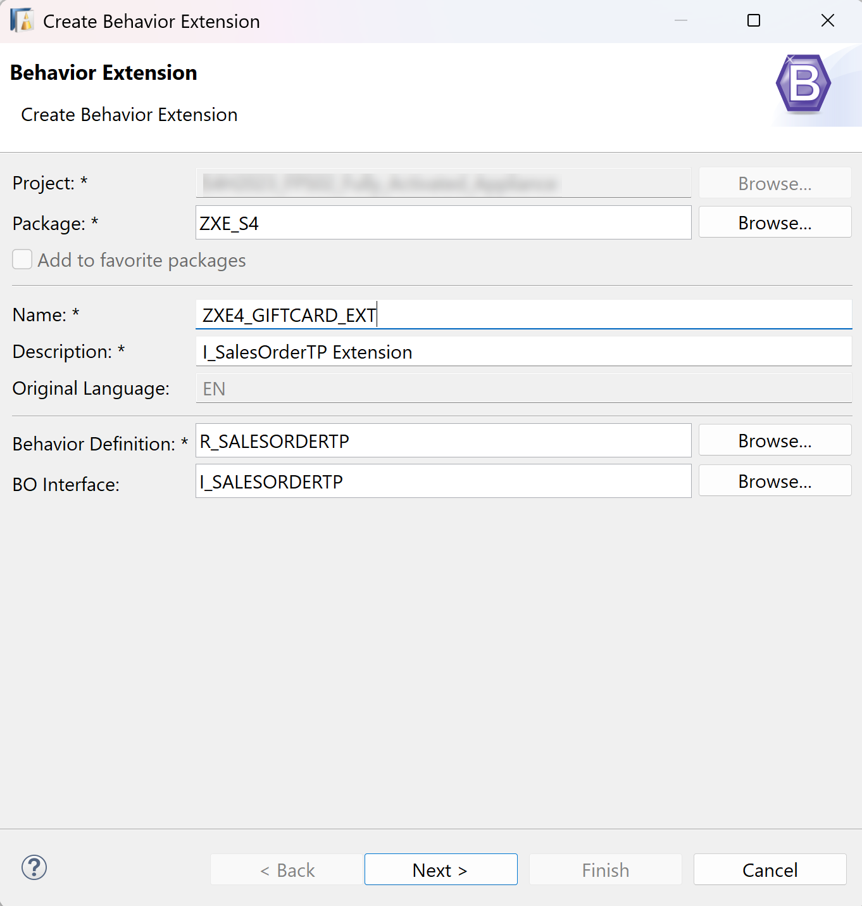

   Choose **Next**.

7. Select a transport request and choose **Next**.

8. Save and Activate.

9. In line 2 of the behavior extension, set your cursor on **`zbp_xe4_giftcard_ext`** and open the ADT Quick Assist by pressing **Ctrl + 1** (Windows) or **Cmd + 1** (MAC).

10. In the **Quick Assist Proposal** dialog box, choose **Create Behavior Implementation Class (zbp_xe4_giftcard_ext)**.

11. Enter **Behavior Implementation for ZXE4_GIFTCARD_EXT** as the description.


12. Choose **Next**.

13. Select a transport request and choose **Finish**.

14. Save and Activate the generated class.

15. Inside your behavior definition **`ZXE4_GIFTCARD_EXT`**, replace the generated code with the following code:

```abap

extension using interface i_salesordertp
implementation in class zbp_xe4_giftcard_ext unique;
extend behavior for SalesOrder
{

  action ( authorization : update , features : instance ) zz_use_gift_card
    parameter ZXE4_ASSIGNGIFTCARDTOSOP result [0..1] $self;

  field(readonly) zz_giftcardamount_sdh, zz_giftcardcurrency_sdh;

  side effects {
    action zz_use_gift_card affects entity _Item, entity _PricingElement;

  }

}

```

### 8️⃣ Provide the implementation logic for the sales order behavior definition extension.

1. Open the **`ZBP_XE4_GIFTCARD_EXT`** class.

2. Navigate to the **Local Types** tab.

3. Replace the existing code with the following code:

```abap
CLASS lhc_salesorder DEFINITION INHERITING FROM cl_abap_behavior_handler.

  PRIVATE SECTION.
    METHODS get_instance_features FOR INSTANCE FEATURES
      IMPORTING keys REQUEST requested_features FOR SalesOrder RESULT result.
    METHODS zz_use_gift_card FOR MODIFY
      IMPORTING it_keys FOR ACTION SalesOrder~zz_use_gift_card RESULT result.

ENDCLASS.

CLASS lhc_salesorder IMPLEMENTATION.

  METHOD get_instance_features.

    READ ENTITIES OF I_SalesOrderTP IN LOCAL MODE
      ENTITY SalesOrder
      FIELDS ( TotalNetAmount )
        WITH CORRESPONDING #( keys )
          RESULT DATA(lt_result_salesorder).

    result = VALUE #( FOR ls_salesorder IN lt_result_salesorder ( %tky = ls_salesorder-%tky
                                                                  %features-%action-zz_use_gift_card = COND #( WHEN ls_salesorder-TotalNetAmount< '50'
  THEN if_abap_behv=>fc-o-disabled
                                                                                                               ELSE if_abap_behv=>fc-o-enabled ) ) ).
  ENDMETHOD.

  METHOD zz_use_gift_card.

    SELECT giftcardnumber, amount_v, amount_c FROM zxe4_giftcard FOR ALL ENTRIES IN @it_keys
        WHERE giftcardnumber = @it_keys-%param-Giftcardnumber
        INTO TABLE @DATA(lt_discount).

    "action implementation
    LOOP AT it_keys REFERENCE INTO DATA(lr_key).

      READ TABLE lt_discount INTO DATA(ls_discount) WITH KEY giftcardnumber = lr_key->%param-Giftcardnumber.
      CHECK ls_discount IS NOT INITIAL.

      MODIFY ENTITIES OF i_salesordertp IN LOCAL MODE
        ENTITY salesorder
        UPDATE SET FIELDS WITH VALUE #(
        ( %tky                    = lr_key->%tky
          %data-zz_giftcardamount_sdh  = ls_discount-amount_v
          %data-zz_giftcardcurrency_sdh = ls_discount-amount_c )
         )
       CREATE BY \_pricingelement SET FIELDS WITH VALUE #(
        ( %tky    = lr_key->%tky
          %target =   VALUE #( (
            %cid                = 'CIDGIFTCARD'
            conditiontype       = 'DRV1'
            "conditiontype       = 'XXXX'
            conditionrateamount = ls_discount-amount_v * ( -1 )
            conditioncurrency   = ls_discount-amount_c ) ) ) )
        FAILED   DATA(ls_modify_failed)
        REPORTED DATA(ls_modify_reported).

      failed   = CORRESPONDING #( APPENDING BASE ( failed   ) ls_modify_failed   ).
      reported = CORRESPONDING #( APPENDING BASE ( reported ) ls_modify_reported ).

    ENDLOOP.

    READ ENTITIES OF i_salesordertp IN LOCAL MODE
      ENTITY salesorder
         ALL FIELDS WITH
         CORRESPONDING #( it_keys )
       RESULT DATA(lt_salesorder).

    result = VALUE #( FOR salesorder IN lt_salesorder ( %tky   = salesorder-%tky
                                                        %param = CORRESPONDING #( salesorder ) ) ).


  ENDMETHOD.

ENDCLASS.

CLASS lsc_R_SALESORDERTP DEFINITION INHERITING FROM cl_abap_behavior_saver.
  PROTECTED SECTION.

    METHODS cleanup_finalize REDEFINITION.

ENDCLASS.

CLASS lsc_R_SALESORDERTP IMPLEMENTATION.

  METHOD cleanup_finalize.
  ENDMETHOD.

ENDCLASS.

```

4. Save and Activate.

###  9️⃣ Extend the sales order projection view to include the gift card fields.

1. Right-click the package **`ZXE_S4`** and choose **New > Other ABAP Repository Object**.

2. Search for **Data Definition**, select it, and choose **Next**.

3. Enter the following data:  
   - **Name:** `ZXE4_C_SALESORDERMANAGE_EXT`  
   - **Description:** `Sales Order Projection View Extension`  
   - **Referenced Object:** `C_SALESORDERMANAGE`  

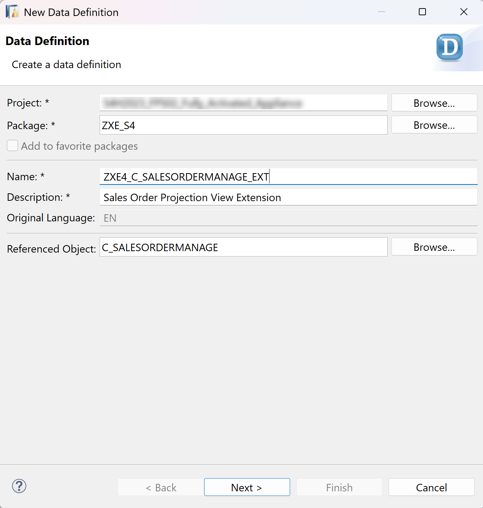

   Choose **Next**.

4. Select a transport request and choose **Finish**.

5. On the **Templates** screen, choose **Extend View Entity**.

6. Choose **Finish**.

7. Replace the generated code with the following ABAP code:

```abap
@EndUserText.label: 'Sales Order Projection View Extension'
extend view C_SalesOrderManage with ZXE4_C_SALESORDERMANAGE_EXT  
    association [0..1] to I_Currency as _zz_giftcardcurrency_sdh on $projection.zz_giftcardcurrency_sdh = _zz_giftcardcurrency_sdh.Currency 
 {
    @Semantics.amount.currencyCode: 'zz_giftcardcurrency_sdh'
    @UI: {
    fieldGroup:[{qualifier: 'OrderData', importance: #HIGH, type: #FOR_ACTION, dataAction: 'zz_use_gift_card', label: 'Use Gift Card' }]}
@UI.lineItem: [{ position: 65, importance:#HIGH }]
    SalesOrder.zz_giftcardamount_sdh as zz_giftcardamount_sdh,
    @ObjectModel.foreignKey.association: '_zz_giftcardcurrency_sdh'
    SalesOrder.zz_giftcardcurrency_sdh as zz_giftcardcurrency_sdh,
    
    _zz_giftcardcurrency_sdh
}
```

8. Save and Activate.

### 🔟 Extend the behavior definition of C_SALESORDERMANAGE to include the gift card action.

1. In the **ABAP Developer Tools** menu bar, choose **Open ABAP Development Object**.

2. Enter **`C_SALESORDERMANAGE`** in the search bar.

3. Select **`C_SALESORDERMANAGE (Behavior Definition)`** and choose **OK**.

4. In the **Project Explorer** view, choose **Link with Editor**, so that the object is visible in the Project Explorer.

5. In the **Project Explorer** view, right-click the **`C_SALESORDERMANAGE`** behavior definition and choose **New Behavior Extension**.

6. Enter the following data:  
   - **Package:** `ZXE_S4`  
   - **Name:** `ZXE4_C_SALESORDERMANAGE_B_EXT`  
   - **Description:** `Sales Order Extension for Gift Card`  

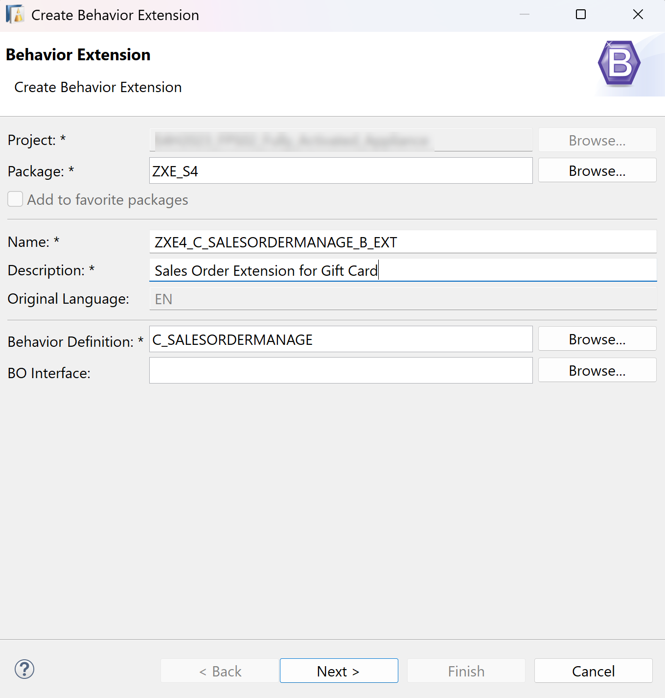

   Choose **Next**.

7. Select a transport request and choose **Finish**.

8. Replace the generated code with the following ABAP code:

```abap

extension for projection;

extend behavior for SalesOrder
{
use action zz_use_gift_card;
}

extend behavior for SalesOrderItem
{
}
```

9. Save and Activate.

--------------------------------------------------------------------------------------------------------------------------------------------------------------------------------------------------------------------------

<!-----
➡️ [Manage Sales Order](../03-Adapt-Manage-Sales-Orders)
----->
