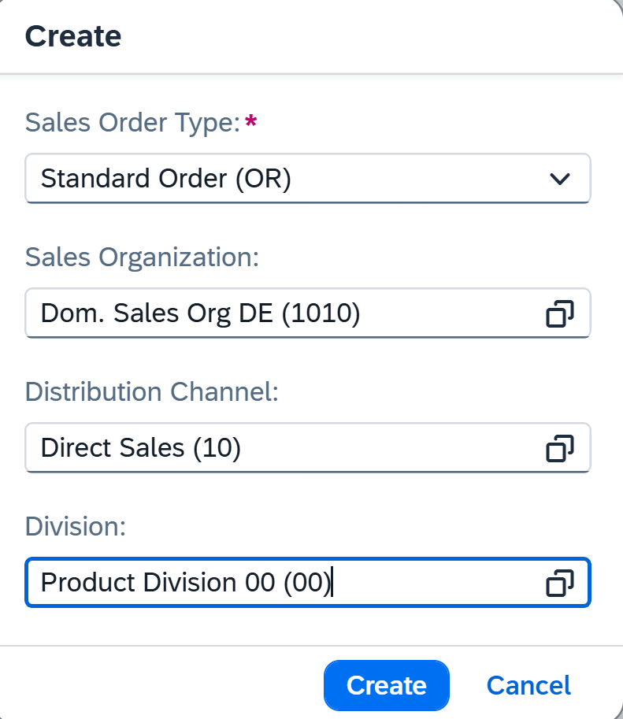
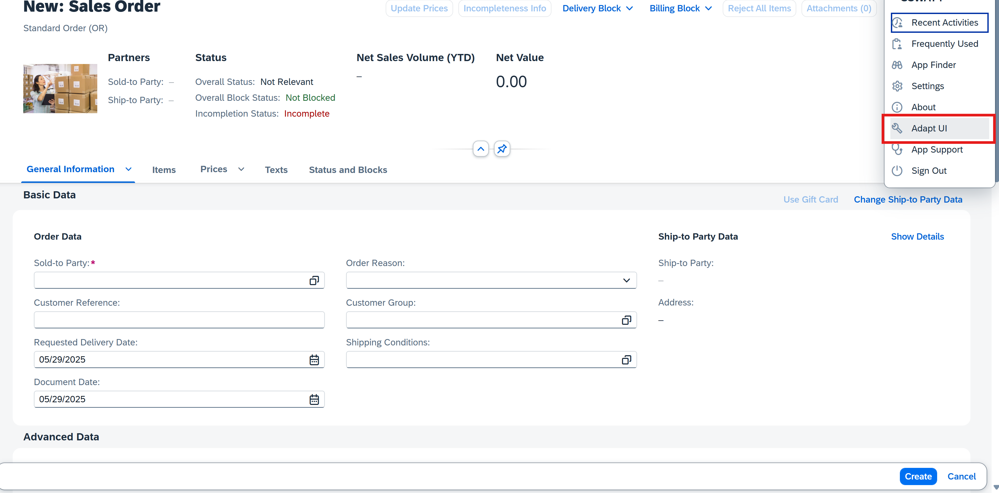
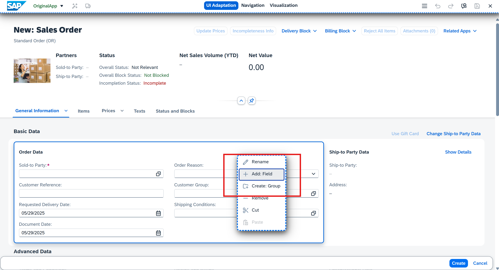
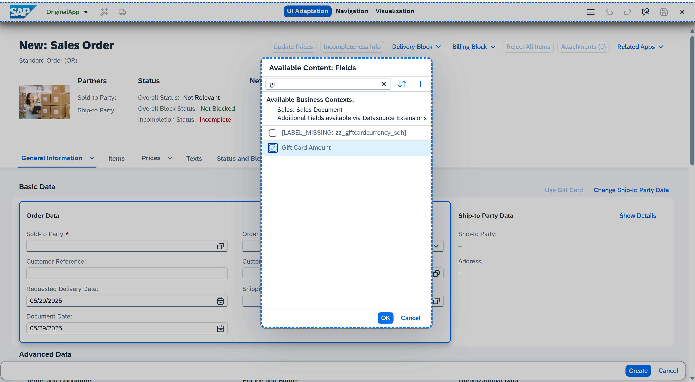
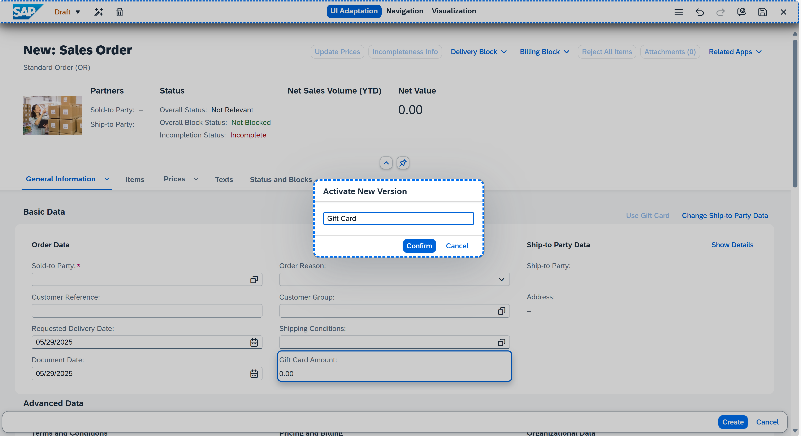
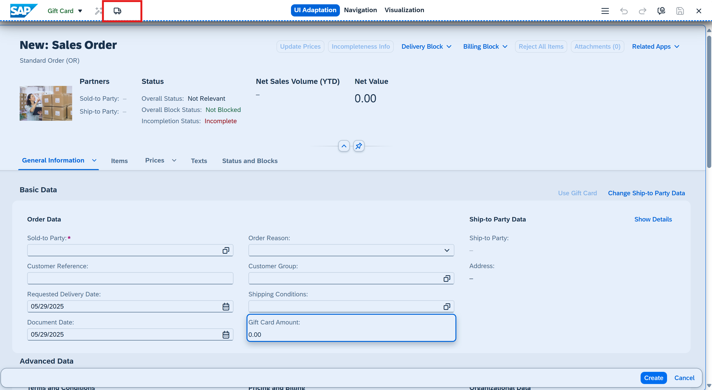
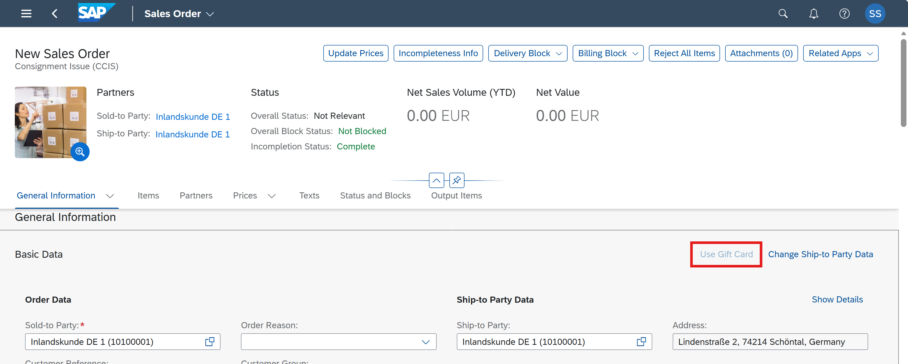

# 🎁 **Adapting the Manage Sales Orders - Version 2 App to Display Gift Card Amount and Currency Fields**

1. Log on to the **customizing client (100)** of the development system with a user that contains the business role based on these business role templates:  
   - **Extensibility Specialist (SAP_BR_EXTENSIBILITY_SPEC)**  
   - **Internal Sales Representative (SAP_BR_INTERNAL_SALES_REP)**  

<!--
   **Note:**  
   If the SAP Cloud ERP (SAP S/4HANA Cloud) system is on the SAP S/4HANA Cloud 2302 release, then the Key-User Extensibility business catalogs are available under the **Administrator (SAP_BR_ADMINISTRATOR)** business role template.
-->

2. Adapt the **Manage Sales Orders - Version 2** SAP Fiori UI at runtime using **Key User Adaptation**.  
   - Go to **SAP Fiori launchpad**, search for, and select **Manage Sales Orders - Version 2**.  
   - Choose **Create > Create Sales Order**.  
   - Enter the following data:  
     - **Sales Order Type:** Standard Order (OR)  
     - **Sales Organization:** Dom. Sales Org DE (1010)  
     - **Distribution Channel:** DE distribution chan (10)  
     - **Division:** Product Division 00 (00)  

3. Go to the **Actions** menu and choose **Adapt UI**.  
   - When you're in the adaptation mode of an object page, you can edit all UI elements (such as fields, groups of fields, or sections) that are highlighted when you hover over them or select them.

4. On the **General Information** tab, in the **Basic Data** section, under **Order Data**, right-click the UI element container and choose **Add: Field** from the context menu.  

5. In the **Available Contents: Fields** menu, search for and select **Gift Card Amount**, and choose **OK**.

6. On the page header, choose **Activate New Version** to activate the current draft or a selected version that is not currently active, so that it becomes a new version.  
   - In the **Activate New Version** menu, enter **Gift Card** as the version name and choose **Confirm**.

7. On the page header, choose **Publish Version** to publish a version of a changed app or an app variant in a target system.

8. The **gift card amount** is now visible in the **Order Data** section.
9. The **use gift card** is also visible on the top right corner. If this doesnt reflect check if the metadata is updated in the `C_SALESORDERMANAGE_EXT`. Refer to point 9️⃣ Extend the Sales Order projection view to include the gift card fields in [02-Extend Sales Order RAP BO](../02-Extend-Sales-Order-RAP-BO/readme.md).

**For more information:**  
Refer to [Adapting SAP Fiori UIs at Runtime - Key User Adaptation](https://help.sap.com/docs/SAP_S4HANA_CLOUD/4fc8d03390c342da8a60f8ee387bca1a/5c424437bf794f809087fdce391149f2.html).

--------------------------------------------------------------------------------------------------------------------------------------------------------------------------------------------------------------------------
<!-----
 [Deploying SAP FIORI APP Using SAP BUSINESS APPLICATION STUDIO](../04-SAP-FIORI-APP-using-SAP-BAS)
 ----->
