# 📡 Setting Up SAP Event Mesh in Business Technology Platform Cockpit

Find your service entitlement and set up a service instance in your SAP Business Technology Platform (SAP BTP) cockpit subaccount.


## 📋 Prerequisites

✅ You have an **enterprise account** with SAP BTP.  
[*Getting Started with a Customer Account: Workflow in the Cloud Foundry Environment*](https://help.sap.com/viewer/65de2977205c403bbc107264b8eccf4b/Cloud/en-US/56440ab2380041e092c29baf2893ef97.html)

✅ You have a **global account** that has the entitlement to use **Event Mesh**.  
[*Getting a Global Account*](https://help.sap.com/viewer/65de2977205c403bbc107264b8eccf4b/Cloud/en-US/d61c2819034b48e68145c45c36acba6e.html#loiod61c2819034b48e68145c45c36acba6e)
 
*(Available entitlements are listed in the service table on the Entitlements page. If your global account is missing this entitlement, contact your BTP cockpit administrator and request the entitlement)*

✅ You've created a **subaccount**.  
[*Create a Subaccount in the Cloud Foundry Environment*](https://help.sap.com/viewer/65de2977205c403bbc107264b8eccf4b/Cloud/en-US/05280a123d3044ae97457a25b3013918.html)

✅ You’ve created a **space** within the subaccount in which Cloud Foundry is enabled.  
[*Managing Orgs and Spaces Using the Cockpit*](https://help.sap.com/viewer/65de2977205c403bbc107264b8eccf4b/Cloud/en-US/c4c25cc63ac845779f76202360f98694.html)


---

## 🚀 Procedure

1️⃣ Go to your **SAP BTP Cockpit - global account and subaccount**.  
[*Navigate in the Cockpit*](https://help.sap.com/docs/BTP/65de2977205c403bbc107264b8eccf4b/0874895f1f78459f9517da55a11ffebd.html)

2️⃣ Choose:**Entitlements** and click on **Edit**.

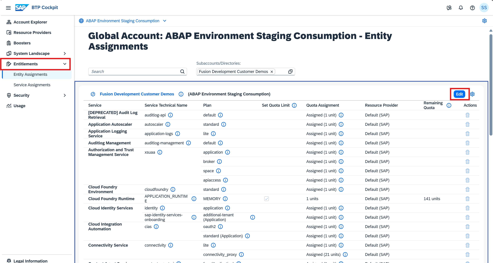

3️⃣ In the dialog box, choose your service **Event Mesh**.

4️⃣ In the **Service Details: Event Mesh** window, choose the **service plan**.


5️⃣ Choose: **Add Service Plans**
> [!WARNING]
> Addition of service instances/entitlements may incur cost

6️⃣ Choose **Add 1 Service Plans** to add this entitlement for the Event Mesh service in your subaccount.

---

## 🎯 Results

✅ A save message appears at the top of the screen.  

After setting up **Event Mesh** in the SAP BTP cockpit, you can create an **Event Mesh service instance**.


## 🚀 Creating SAP Event Mesh Instance in SAP BTP Cockpit

1️⃣ Open SAP BTP Cockpit
- Open the **SAP Business Technology Platform cockpit**, Cloud Foundry environment.
- Navigate to your **subaccount**.
- Expand **Services → Instances and Subscriptions**.
- Choose **Create**.

---

2️⃣ Create Event Mesh Instance

> [!WARNING]
> Addition of service instances/entitlements may incur cost

- Select **Event Mesh** and then:`default` service plan (for Factory landscape)

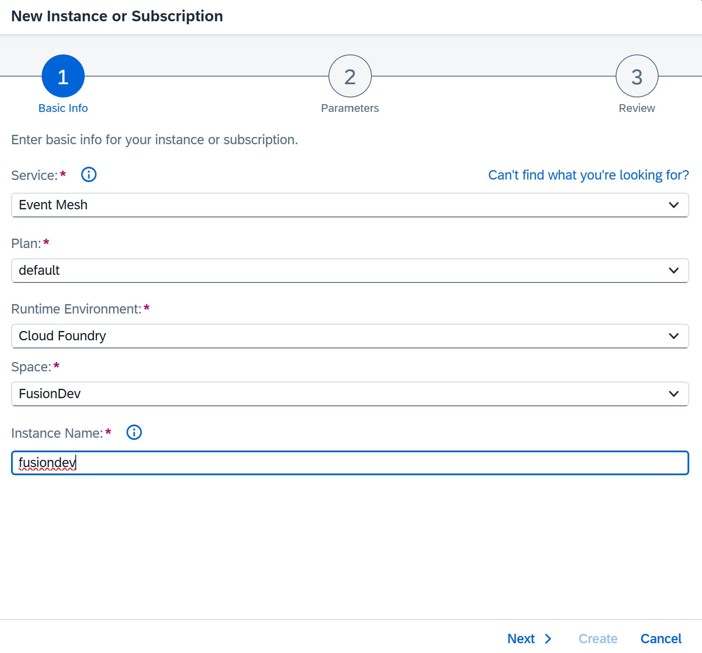

- Select **Cloud Foundry** as the runtime environment.
- Select your space, then enter an instance name **fusiondev**.
- Choose **Next**.

> 📝 *For this use case, we consider only the Cloud Foundry runtime environment.*

---

3️⃣ Specify Parameters Using JSON File

📄 Note - The namespace should not exceed 24 characters. [Click here for more details](https://me.sap.com/notes/0003577288)

### 🎯 For `default` Plan:
```json
{
  "emname": "<yourmessageclientname>",
  "namespace": "<yourorgname>/<yourmessageclientname>/<uniqueID>",
  "version": "1.1.0",
  "options": {
    "management": true,
    "messagingrest": true,
    "messaging": true
  },
  "rules": {
    "queueRules": {
      "publishFilter": [
        "${namespace}/*"
      ],
      "subscribeFilter": [
        "${namespace}/*"
      ]
    },
    "topicRules": {
      "publishFilter": [
        "${namespace}/*"
      ],
      "subscribeFilter": [
        "${namespace}/*"
      ]
    }
  }
}

```

| Parameter   | Description                                                                                                      |
| ----------- | ---------------------------------------------------------------------------------------------------------------- |
| `emname`    | Name of the message client (unique in subaccount).                                                               |
| `namespace` | Ensures unique identification of message client within a subaccount. Recommended: `orgName/clientName/uniqueId`. |
| `options`   | Defines the **access channels** for the message client (`management`, `messagingrest`, `messaging`).             |
| `rules`     | Defines **access privileges** for queues and topics, allowing publish/subscribe filters.                         |


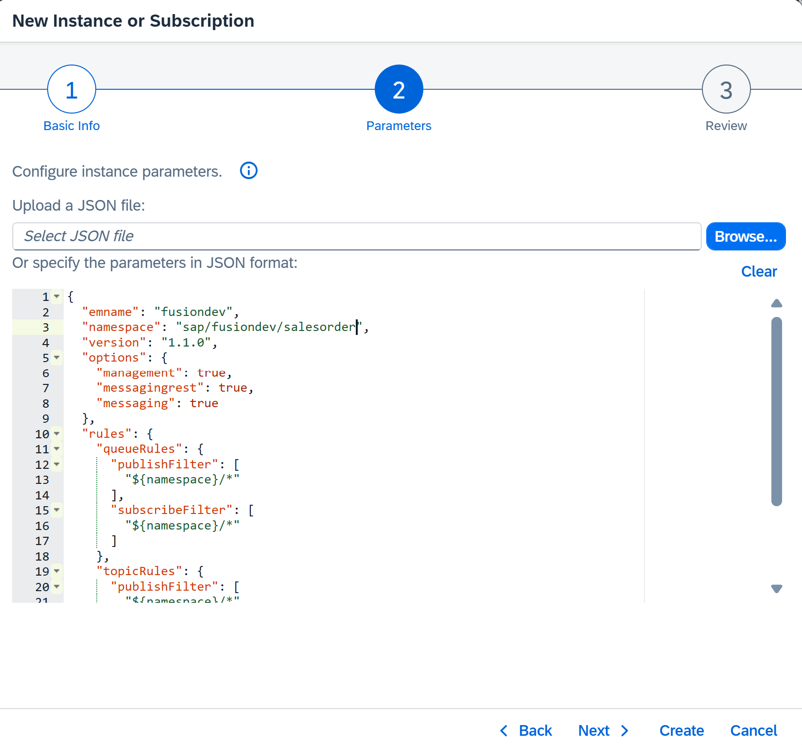

Review the information you provided. Choose **Create**.

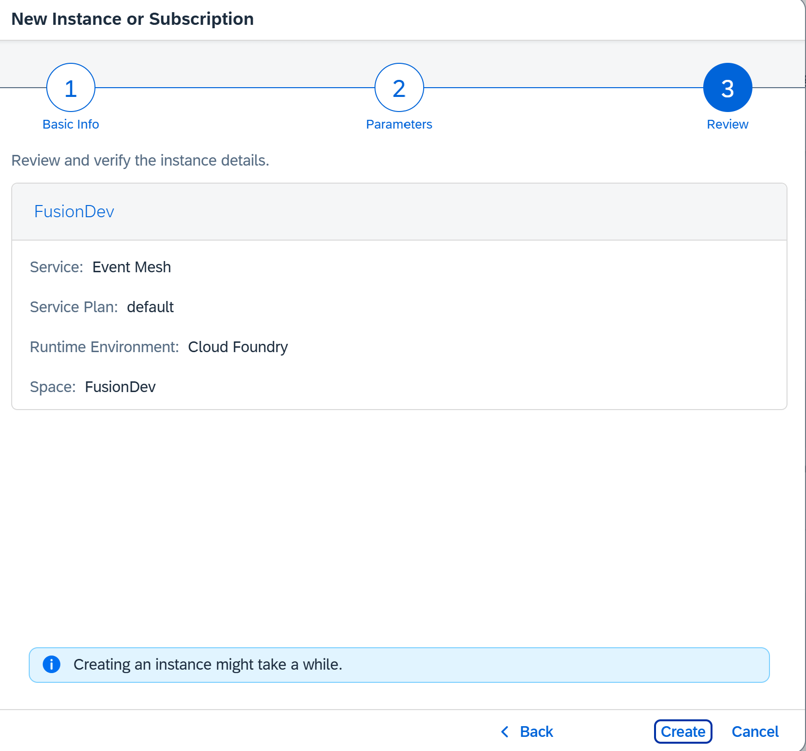


You can see your newly created instance under **Services->Instances** on the left side of the page.

---


## 🔑 Creating and Viewing a Service Key for SAP Event Mesh Instance

When an instance of **SAP Event Mesh** is created, it stores the information about:
- Protocols
- Corresponding Endpoints
- Authorizations  

This information is required to **bind the instance to an Application**.

A **Service Key** holds this information.  
You can create a Service Key for the instance using the following steps.

---

### 📝 Steps to Create Service Key

1️⃣ Click on the **Instances** menu. Click on **Create** under **Service Keys** section.
  
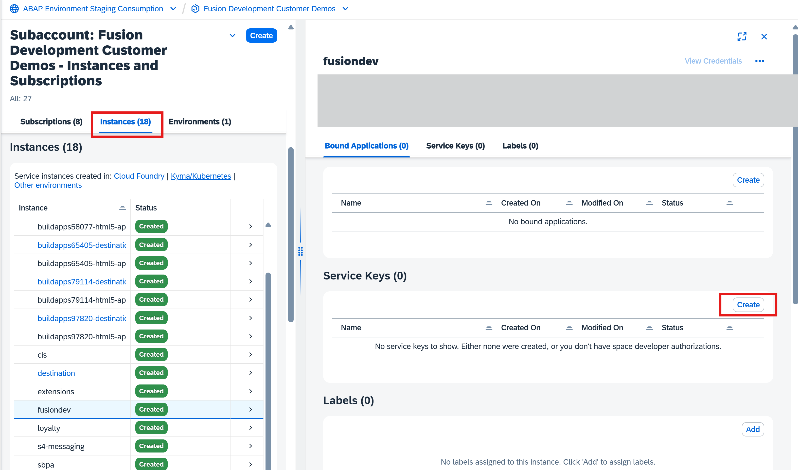

2️⃣ Provide a name for the service key - `fusiondevservicekey`.
 
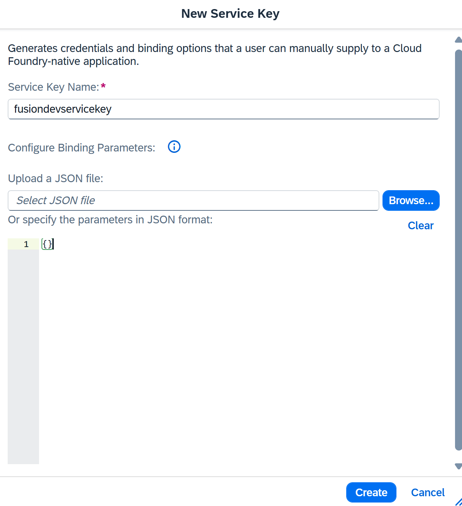

3️⃣ View the created service key details.  

---

### 📄 Template: Service Key of SAP Event Mesh Instance

Below is an example JSON structure of a Service Key:

```json
{
  "xsappname": "<app-name>",
  "serviceinstanceid": "<instance-id>",
  "messaging": [
    {
        "oa2": {
            "clientid": "<client_id>",
            "clientsecret": "<client_secret>",
            "tokenendpoint": "https://<app-url>/oauth/token",
            "granttype": "client_credentials"
        },
        "protocol": ["amqp10ws"],
        "broker": {
            "type": "sapmgw"
        },
        "uri": "wss://<app-url>/protocols/amqp10ws"
    },
    {
        "oa2": {
            "clientid": "<client_id>",
            "clientsecret": "<client_secret>",
            "tokenendpoint": "https://<app-url>/oauth/token",
            "granttype": "client_credentials"
        },
        "protocol": ["mqtt311ws"],
        "broker": {
            "type": "sapmgw"
        },
        "uri": "wss://<app-url>/protocols/mqtt311ws"
    },
    {
        "oa2": {
            "clientid": "<client_id>",
            "clientsecret": "<client_secret>",
            "tokenendpoint": "https://<app-url>/oauth/token",
            "granttype": "client_credentials"
        },
        "protocol": ["httprest"],
        "broker": {
            "type": "saprestmgw"
        },
        "uri": "https://<app-url>/"
    }
  ],
  "management": [
    {
        "oa2": {
            "clientid": "<client_id>",
            "clientsecret": "<client_secret>",
            "tokenendpoint": "https://<app-url>/oauth/token",
            "granttype": "client_credentials"
        },
        "uri": "https://<app-url>/"
    }
  ]
}
```

### 📝Note
>The management segment appears in the service key only if the management option was set to true during instance creation.
>The httprest segment appears only if the messagingrest option was set to true during instance creation.

---

## 📄 Steps to Access and Manage Event Mesh

1️⃣ Open SAP Business Technology Platform Cockpit
- Log in to **SAP Business Technology Platform Cockpit**.


2️⃣ Subscribe to Event Mesh
- Click on the **Subscriptions** menu.
- Find and **subscribe** to **SAP Event Mesh**.

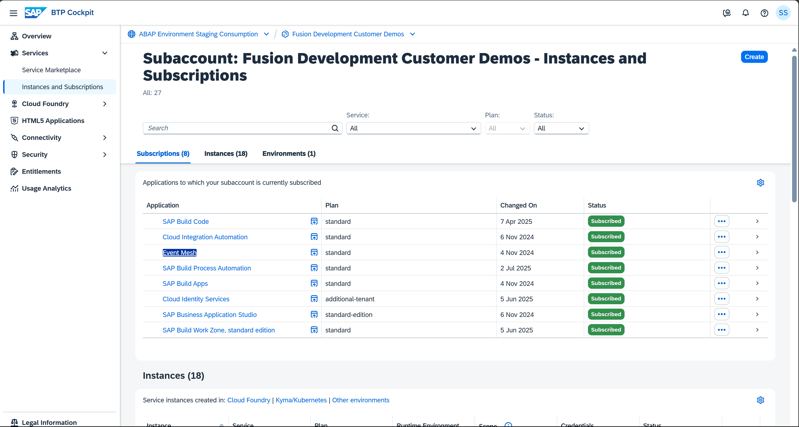


3️⃣ Open Application
- After subscribing, click on **Go to Application**.

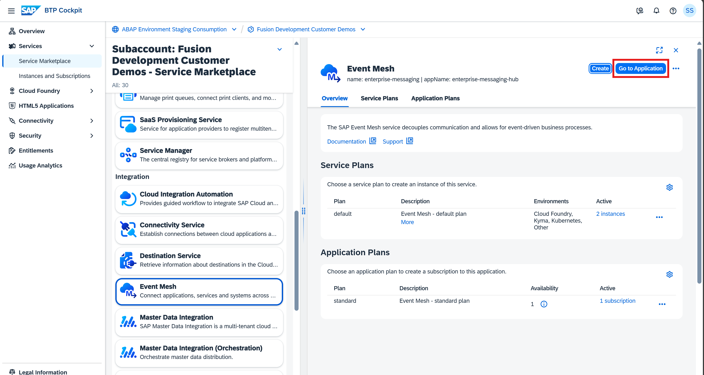

#### 🖥️ Service Instance

- This opens the **SAP Event Mesh Management Dashboard**.
- The management dashboard allows you to manage different **messaging clients**.

---

4️⃣ Select Message Client
- In the dashboard, select the desired **message client** - `fusiondev`.

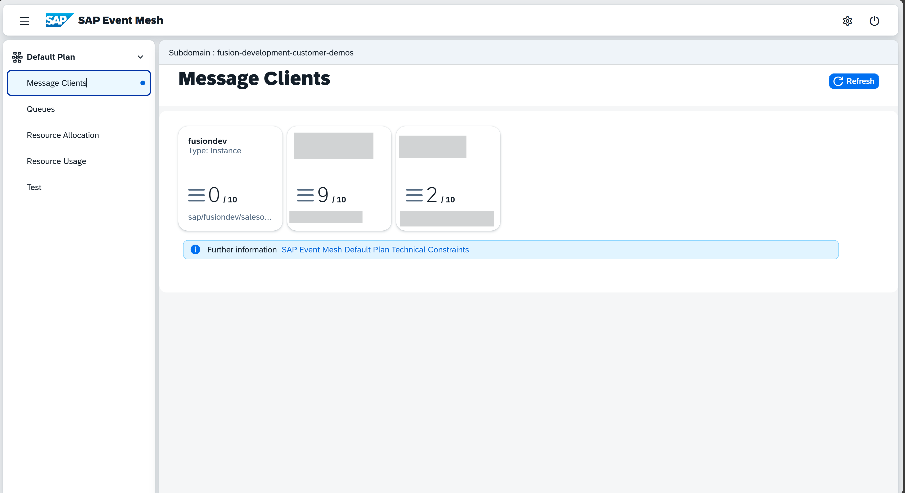

- This opens the **SAP Event Mesh Management Dashboard → Overview tab** for the selected message client.

---

# 📋 Managing Queues and Queue Subscriptions in SAP Event Mesh

## Managing Queues

On the **Management Dashboard**, you can create a **queue** to work with SAP Event Mesh.  

Queues enable **point-to-point communication** between two applications.  
An application can subscribe to a queue to receive messages.

---

### Create a Queue

- On the dashboard, click on **Create Queue**.

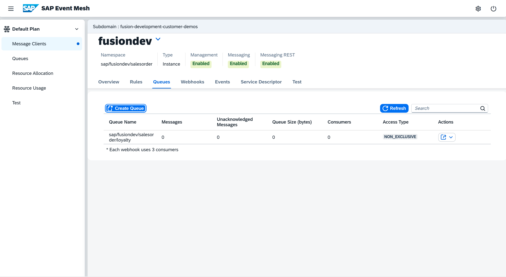

- Enter the **name of the queue** (e.g., `loyalty`).

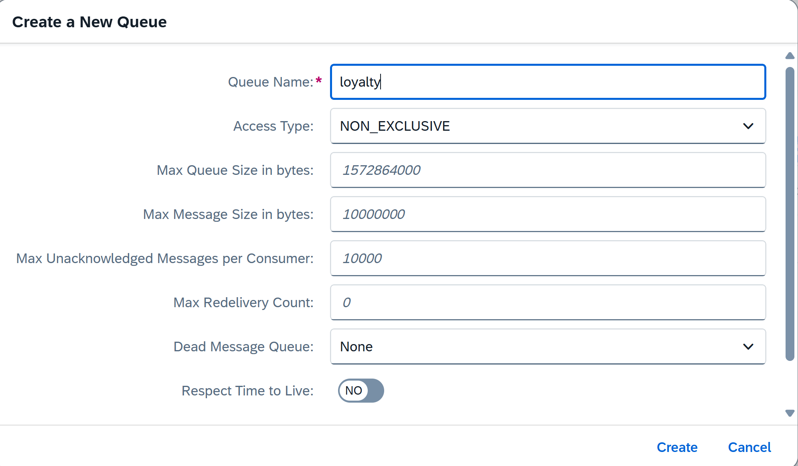

> 📝 The name of the queue must follow the **pattern** you specified in the JSON descriptor when you created the SAP Event Mesh service instance.  

---

### View Rules

- Click on the **View Rules** tab to see:
  - List of rules
  - Type to which each rule belongs
  - Permissions defined for each rule

> 📝 Follow the pattern specified in the rules when naming your queue.  
After creation, the queue name is appended to the **namespace** - `sap/fusiondev/salesorder/loyalty` and displayed on the UI.

---


## Managing Queue Subscriptions

SAP Event Mesh enables a sending application to publish **messages/events** to a **topic**.  
Applications must **subscribe** to a topic and be **active** when the message is sent.  
> 📝 Topics do **not retain messages**.  

---

### 🎯 Create a Queue Subscription
If you want to **retain messages** sent to a topic, subscribe a queue to that topic.

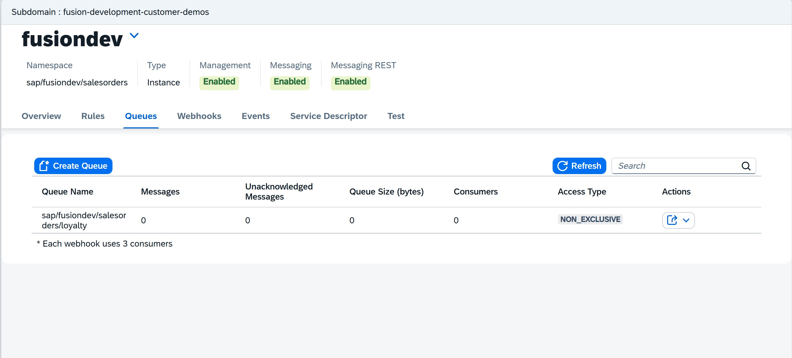

---

- Click the **Queue Subscriptions** icon under *Actions*.  

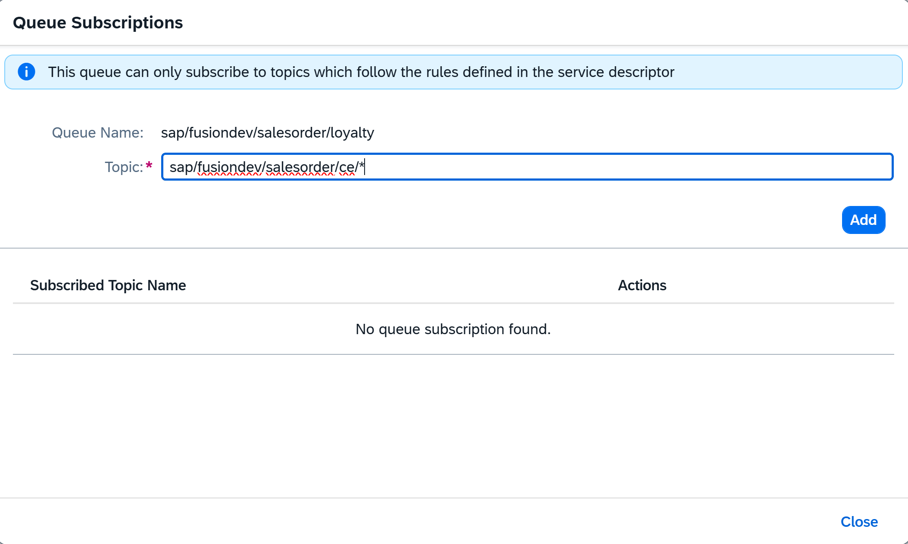

- The **Queue Subscription** screen is displayed.  
- Create `<yourtopic>` - `sap/fusiondev/salesorder/loyalty/ce/*`  topic and subscribe to `<your queue>`-`sap/fusiondev/salesorderloyalty`.

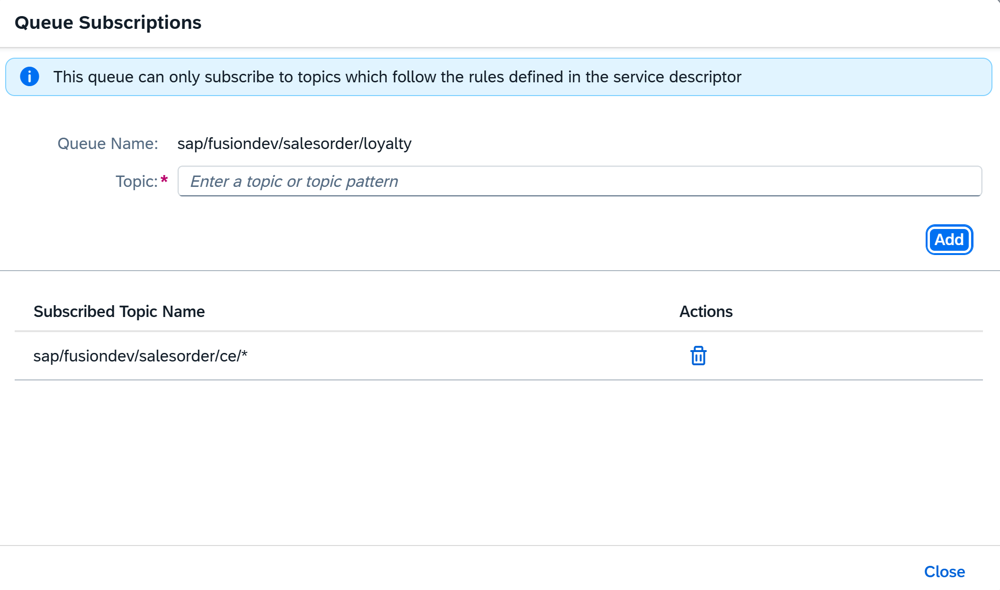


## 📦 Result: SAP Event Mesh Instance

An instance of SAP Event Mesh is created.
Each instance represents a message client with a set of queues and topics.
All queues and topics within different message clients in a subaccount can exchange messages/events using their unique credentials.

---

### Reference

**[Event-Mesh](https://pages.community.sap.com/topics/event-mesh)**

**[enterprisemessaging-instance-create](https://developers.sap.com/tutorials/cp-enterprisemessaging-instance-create.html#7e94f606-60e3-4e98-bd1e-7a370772a1ba)**

**[cp-enterprisemessaging-queue-queuesubscription](https://developers.sap.com/tutorials/cp-enterprisemessaging-queue-queuesubscription.html#5c83b91c-f4b9-4ee9-80e3-a95a0d67d003)**

---

<!-----

➡️ [Send and Receive Events](../02-SEND-RECEIVE-EVENTS)

----->


