# 🧪 Send and receive Events

> The object names/coding style used here, if any, is not a recommendation on coding guidelines/standards

## Scope

### Create RAP based events in the Cloud ERP system and publish them to Event Mesh on SAP Business Technology Platform (SAP BTP)

✅ Create **Event Bindings**

✅ Create **Sender Channel**

✅ Configure **Outbound Event Topic Bindings** 

### Consume events into SAP BTP ABAP Environment from the Event Mesh Queue 

✅ Create **Event Consumption model** in the Cloud ERP system.

✅ Create **Receiver Channel** on the BTP ABAP Environment system.  

✅ Configure **Inbound Event Topic Bindings** in the BTP ABAP Environment system.  

---

## ✅ Prerequisites

- A **service instance** for **SAP Event Mesh** has been created.
- The **service key** contains required details like endpoints and credentials.
- The **Enterprise Event Enablement** framework will use this key to automatically create:
  - A **Destination**
  - An **OAuth 1.0 Client Configuration**

The **service key** is crucial. It includes:

- All connection details
- Auto-creation of destination and OAuth 1.0 config when used in the communication arrangement

> 💡 Using the service key eliminates manual configuration steps.

📝 **Note**: The namespace in the SAP Event Mesh instance can be **max 24 characters**.

---


## 1. 📡 Create RAP based events in the Cloud ERP system and publish them to Event Mesh on SAP Business Technology Platform (BTP)


### 1.1 Creating a new Derived Event based on existing sales order event.

<details>
  <summary> 🔵 Click to Expand</summary>


> 📝 **Note**: As the standard event doesnt have all the relevant context data required for our scenario,we will be extending standard sales order event with custom payload via [derived event](https://help.sap.com/docs/abap-cloud/abap-rap/derived-business-events).

RAP entity events are defined via the Behavior Definition (BDEF) on the root node level. Entity events can have a parameter or can be defined without any parameter.

#### Event Definition with Parameter

The parameter is an abstract entity.
Example payload when parameter is used:

```abap

event ZZCreated on Created parameter ZI_Salesorder;

```

#### Create RAP Entity Event parameter

If no parameter is specified, the payload consists of the entity key fields.

> ℹ️ **Note**: The event payload data will include both the key fields of the entity and the fields of the abstract parameter entity.


### 1.1.1 Define RAP Entity Event in Behavior Definition (BDEF)

1. Right-click the package `ZXE_S4` and choose **New > Other ABAP Repository Object**.

2. Search for **Data Definition**, select it, and choose **Next**.

3. Enter the following data:  
   - **Name:** ` ZI_Salesorder`  
   - **Description:** `Derived Event Parameter`  
   - **Referenced Object:** `I_SalesOrder`  
   Choose **Next**.


4. Select a transport request and choose **Finish**.

5. On the **Templates** screen, choose **Extend View Entity**.

6. Choose **Finish**.

7. Replace the generated code with the following ABAP code:

> You could replace 'JAD' in the following code with the system ID of your Cloud ERP (S/4HANA Cloud) system

```abap
@AccessControl.authorizationCheck: #NOT_REQUIRED
@EndUserText.label: 'Derived Event Parameter'
define view entity ZI_Salesorder
  as select from I_SalesOrder
  association [0..1] to I_ProductTP_2 as _Product on $projection.product = _Product.Product
{
  key SalesOrder,
      SalesOrderType,
      CreatedByUser,
      LastChangedByUser,
      CreationDate,
      CreationTime,
      LastChangeDate,
      LastChangeDateTime,
      SalesOrganization,
      DistributionChannel,
      OrganizationDivision,
      SalesGroup,
      SalesOffice,
      SoldToParty,
      SalesOrderDate,
      TotalNetAmount,
      TransactionCurrency,
      _Item.Product,
      _Item.RequestedQuantityUnit,
      _Item.RequestedQuantity,
      _Item,
      _Product,
      _Partner,
      _Partner.FullName as PartnerName,
      'JAD'             as SourceSystem
}


```

### 1.1.2 Define RAP Entity Event in Behavior Definition (BDEF)


1. Create the Behavior Definition

- In the **Project Explorer**, right-click on the `ZXE_S4` package.
- Navigate to: **New > Other > Core Data Services > Behavior Definition (BDEF)**

2. Create SAP Object Type `ZSALESORDER`
- In the **Project Explorer**, right-click on the `ZXE_S4` package.
- Navigate to: **New > Other > Core Data Services >  SAP Object Type**

 

3. Create SAP Object Node Type `zsalesorder`
- In the **Project Explorer**, right-click on the `ZXE_S4` package.
- Navigate to: **New > Other > Core Data Services > SAP Object Node Type**

- 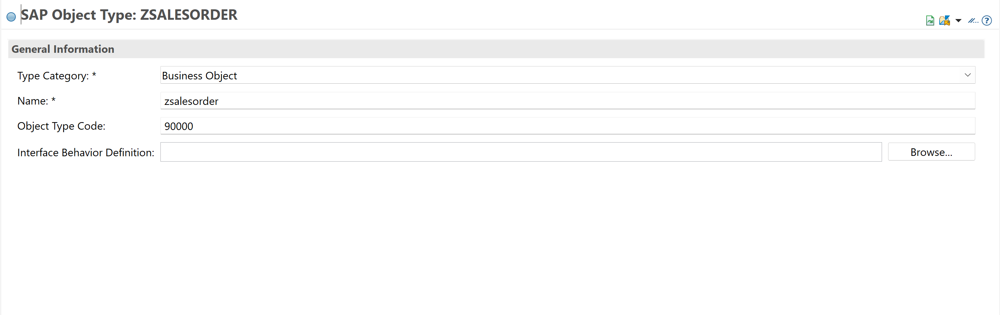

4. Choose a Name and Object Type
- Enter the **name** - `ZR_SALESORDERTP`
- Select the appropriate **business object** to extend - `ZI_SALESORDER`

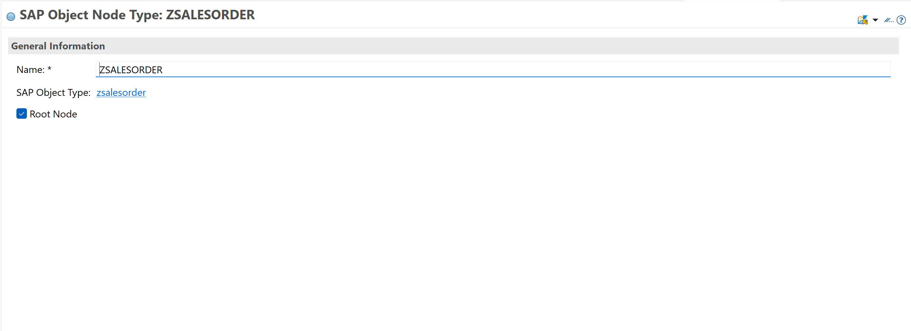


5. Define Extension Requirements

Use the interface to ensure your behavior complies with standard contracts. Replace with the following code.


```abap
extension using interface I_SALESORDERTP;

extend behavior for SalesOrder
{
managed event ZZCreated on Created parameter ZI_Salesorder;

}

```

### 1.1.3. Create Event Binding

An event binding is needed to map an event type to a RAP entity event.


1. Create a new Event Binding
   In the ABAP Developer Tools, the event binding is a sub-node of business services.


2. Provide Name as **ZS_SALESORDER_ZZCREATED** and Description as **Sales order created derived event binding**

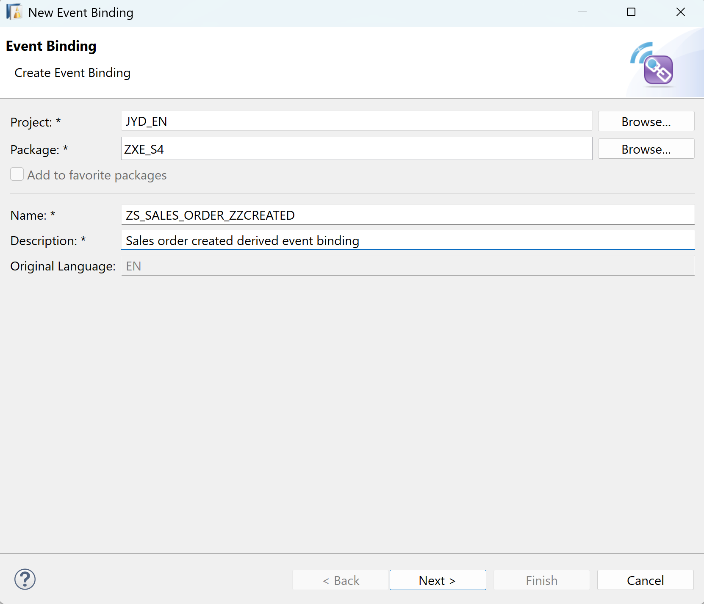

3. Maintain Event Type
   - Namespace of the event - `zevt`
   - Business Object → should be an SAP Object Type (SOT) - `zsalesorder`
   - Operation - `zzcreated`

  > The warning will disappear  once the entity event name is added.This is done in the next step.


4. After saving the event binding, the resulting event type (also called "topic") is shown.

   * `*` denotes different event versions represented by different mappings to entity events.

5. Map the Event Type
   - Click on **add** under the **event version** section.
   - Add the **entity name** - `I_SALESORDERTP` and **entity event name** - `ZZCREATED`

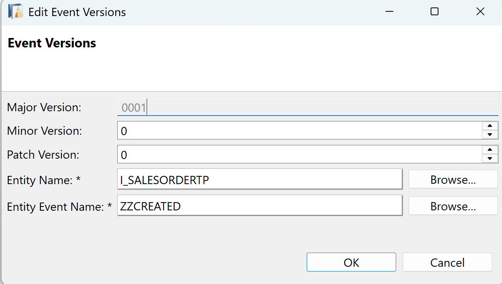

6. Save and Activate the event binding.
  
> ℹ️ **Note**: The event payload data can be viewed on clicking **event summary**.

</details>

---

### 1.2 Assign Event to Outbound Channel

<details>
  <summary> 🔵 Click to Expand</summary>


### 1.2.1 🎯Create a Communication Arrangement


1️. **Log on** to the **SAP Fiori Launchpad** in the **Cloud ERP (S/4HANA Cloud) system**.  

2️. Under **Communication Management**, select the **Communication Arrangements** tile.  

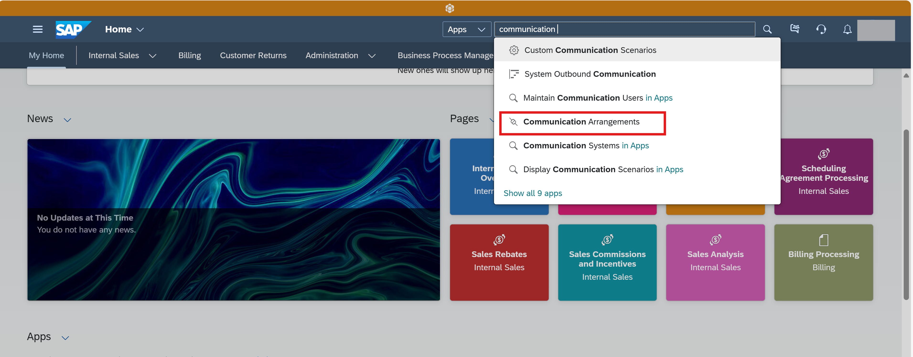

3️. Press **New** to create a new communication arrangement.  

4️. Select the scenario: `SAP_COM_0092` (**Enterprise Eventing Integration**).  

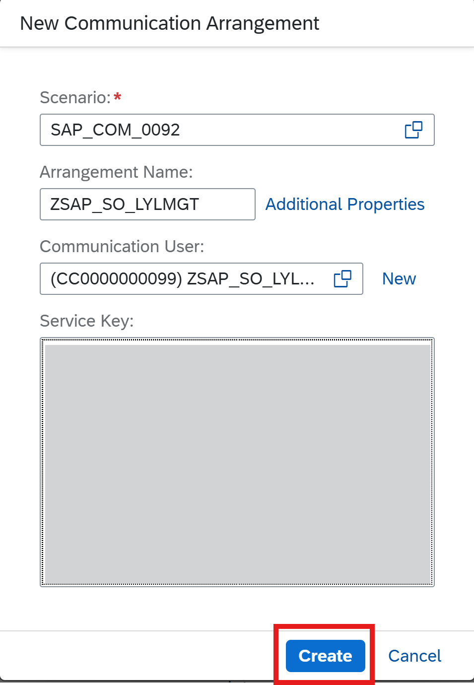

5️- Adapt the **Arrangement Name** - `ZSAP_SO_LYLMGT`.  

> ⚠️ If channel name is not specified under Additional Properties, it defaults to the **Arrangement Name**.

---

### 🧩 Add Additional Properties

- Press **Additional Properties**  
- Add:  
  - **Channel** → specify a channel name  
  - **QoS**:
    - `0` (at most once)
    - `1` (at least once)
  - **Reconnect Attempts**:
    - `0` → infinite retries  
    - `>0` → retries n times  
  - **Reconnect Waittime** (in seconds):
    - default: `10`  
    - max: `1800`  
    - wait time increases per retry  

> 💡 Description field is optional; it gets a default if left blank.

---

### 1.2.2  🔐 Select Communication User

1. Create a new **Communication User**:
  - Enter any **Name** and **Description**
  - Propose or enter a **Password** (📌 *store user/password for later use*)
  - Press **Save**.  
✅ The **Inbound User** is created and added to the communication system.

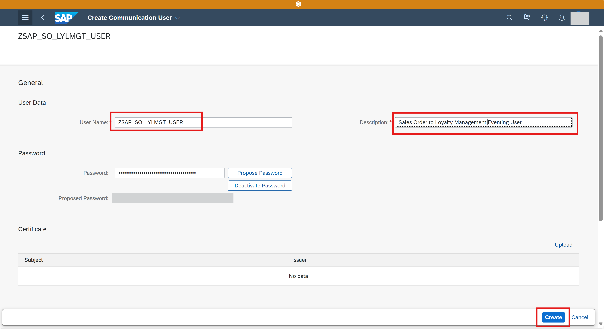


2. Copy and paste the **service key** from the event mesh instance.  

3. Press **Create**  
✅ The connection will be checked automatically.  
❌ If it fails, the creation will not proceed, and you'll be shown the reasons.

---

### 1.2.3 🔧 Maintain a Communication Arrangement

Even after creation, you can still:

- Change parameters via **Service Key**
- Modify:
  - **QoS**
  - **Reconnect Attempts**
  - **Reconnect Waittime**
  - **Topic Space**

> ⚠️ Events are published **only if** the topic space matches the SAP Event Mesh namespace.

---

**To Update Connection Details:**

- Press **Update via Service Key**
- Paste the new service key
- Press **Update**

**To Edit Additional Properties:**

- Press **Edit**
- Press **Close** to exit.

---

📌 **Summary**:
- Use `SAP_COM_0092` for Enterprise Eventing.
- Service key simplifies setup.
- QoS, reconnect values can be tuned.
- Ensure **channel name** and **topic space** match your Event Mesh configuration.


</details>


---

### 1.3 🔧 Configure Channel Binding for Enterprise Event Enablement in the Cloud ERP (S/4HANA Cloud) System

<details>
  <summary> 🔵 Click to Expand</summary>

1. Open the **Enterprise Event Enablement - Configure Channel Binding** app.
    
2. Search for all channels and select the channel you created before.

3. In the same UI, click **Outbound Bindings**.

4. Select an **active channel** (green indicator).

5. Click **New Outbound Binding**.

6. Use **search help** for the topic to find valid entries.

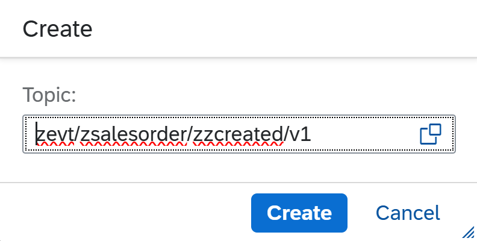

7. Select:
   - **Producer** 
   - **Topic**

8. Your selected topic will now appear in the outbound bindings list - `zevt/zsalesorder/create/v1`.

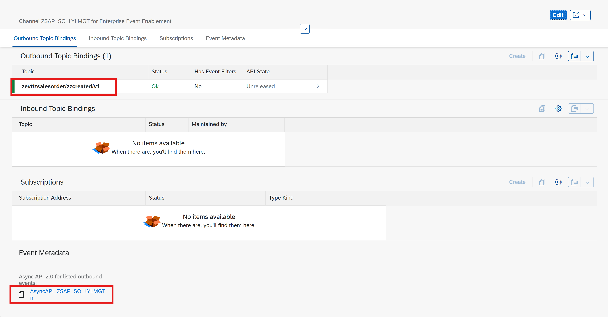

9. Click on save.

10.Download the metadata in the json format. 

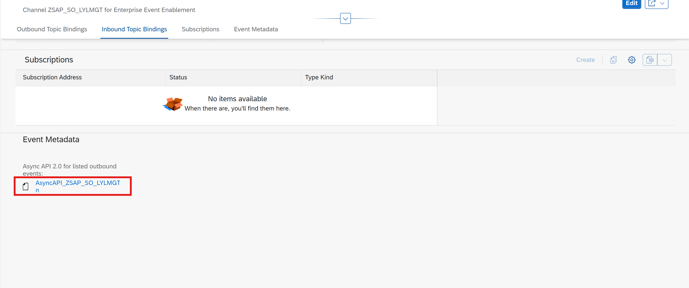

</details>

---

## 2. 📡 Consume events in the SAP BTP ABAP Environment from the Event Mesh Queue


An **Event Consumption Model** is a set of ABAP artifacts which allows you to receive events from external applications and to consume them within your business application. 
The received events must be compliant with **CloudEvents v1.0** standard.  
🔗 [CloudEvents Specification](https://cloudevents.io)


#### ✅ Prerequisites

- You have an **AsyncAPI JSON file** that contains:
  - All the relevant cloud event information
  - Event types and their corresponding payload structure

> ℹ️ The AsyncAPI file must be compliant with the specification `2.0.0` from the [AsyncAPI Initiative](https://www.asyncapi.com).

> 💡 **Note:** If an error occurs during the process, it will be shown at the top. A more specific message may appear under the **Issue** section. You must resolve all issues to proceed.


### 2.1 Development of Event Consumption Model

<details>
  <summary> 🔵 Click to Expand</summary>

### 2.1.1 Start the Wizard

You can start the wizard using:

- The **main menu**
- The **toolbar**
- A **shortcut**
- The **Project Explorer**

---

### 2.1.2 Select Repository Object

- Select `ABAP Repository Object` → **Event Consumption Model**
- Click **Next**

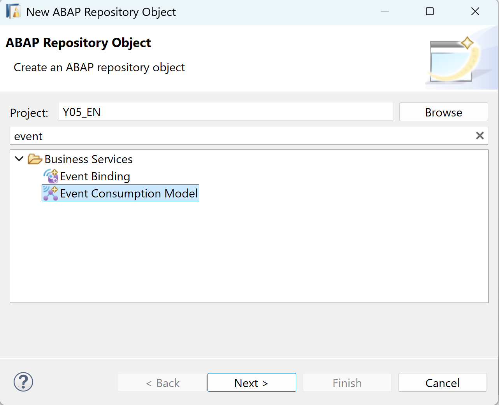

---

### 2.1.3. Fill Out the Details

| Field | Description |
|-------|-------------|
| **Project** | Enter the project name (if not already filled) |
| **Package** | Enter the package |
| **Name** | Disabled - auto-derived from the event name |
| **Description** | Enter a meaningful description |
| **Original Language** | Derived from project settings |
| **Namespace / Prefix / Identifier** | Use your package namespace, provide prefix and identifier |
| **Event Specification File** | Upload a JSON file (AsyncAPI specification) |

You can choose to enter the following details:

| **Description** | Sales Order Event for Loyalty |        
| **Namespace / Prefix / Identifier** | ZSOLYLMGT |

.png)

Click **Next** to continue.

---

### 2.1.4.Entity Selection

Shows event types extracted from the uploaded spec file.
Select at least **one event type** to continue.

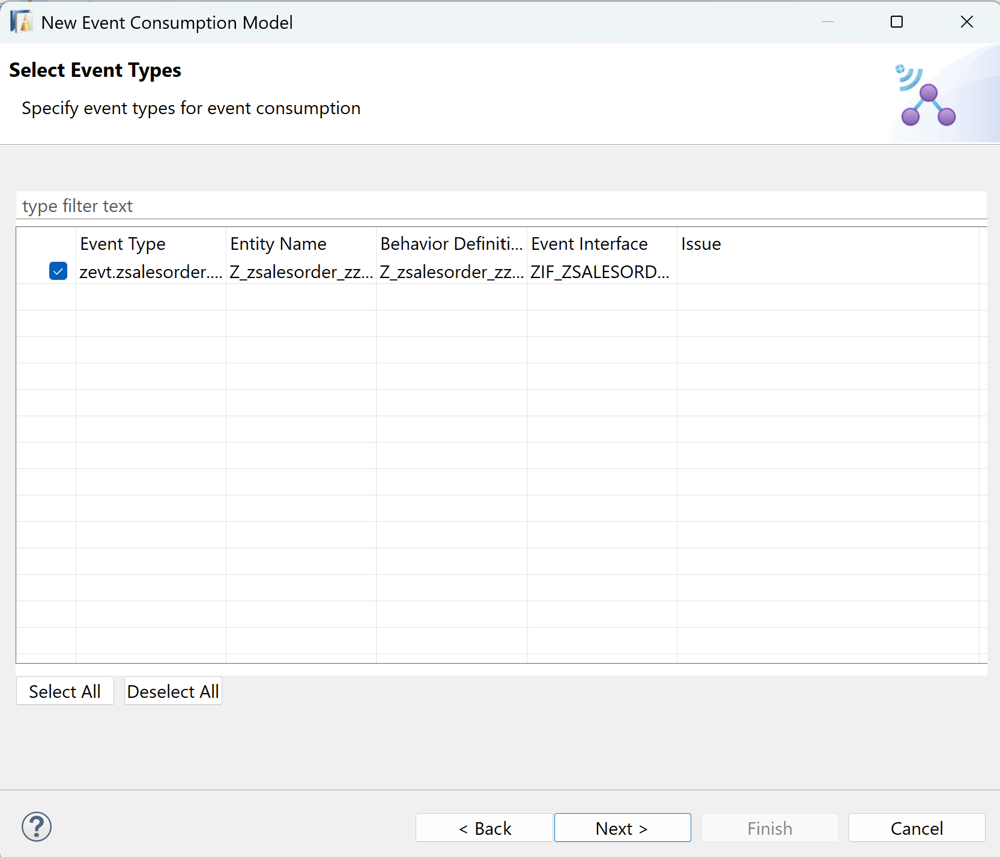

You may optionally:
- Rename the **Entity Name** (used for both **abstract entity** and **behavior definition** name) - `ZLYMGT_R_SALESORDER_CREATED`.
- Rename the **Event Interface Name** - `ZLYMGT_IF_SALESORDER_CREATED`.


These definitions will be used to:
- Represent event payloads.
- Type event data in the consumer extension class.

Click **Next** to proceed.

---

### 2.1.5 Define Consumer Artifacts

You can rename the proposed names for:

- **Consumer Class**: Base consumer class (should not be changed later) - `ZLYMGT_CL_SOEVENT_BASE`.
- **Consumer Extension Class**: Where event-handling logic is implemented - `ZLYMGT_CL_SOEVENT`.
- **Consumer Interface**: Used to pass typed event data to the extension class - `ZLYMGT_IF_SO_EVENT_HANDLER`.

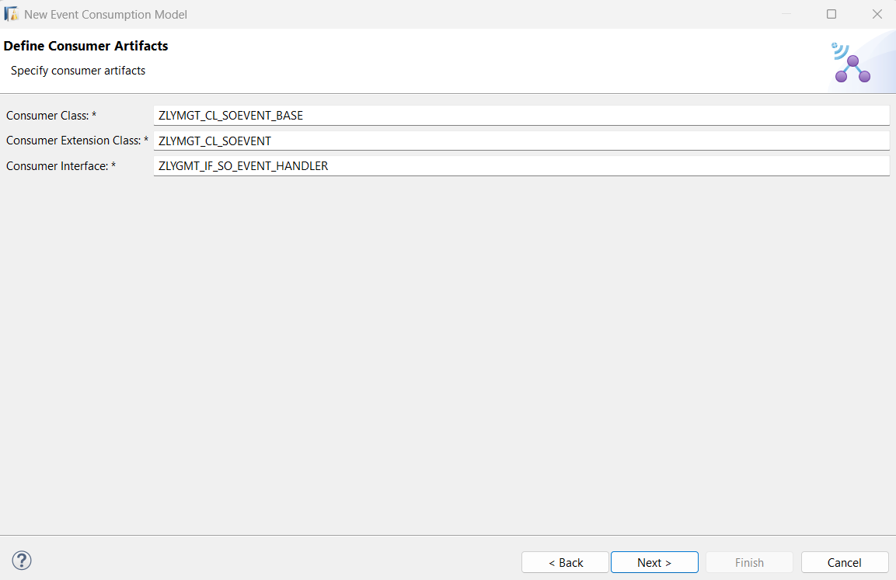

Click **Next** to proceed.

---

### 2.1.6 Artifact Generation Summary

- Displays all artifacts to be created based on your configuration.
- Review the list and click **Next**.

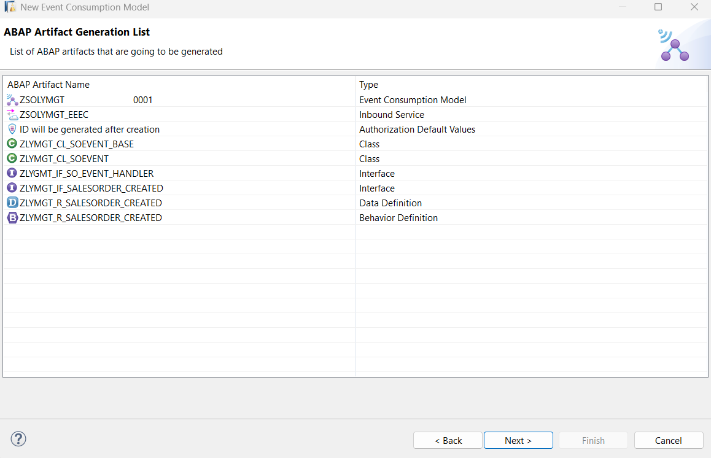

---

### 2.1.7 Transport Request

- Choose a **transport request** to include the generated model and artifacts.
- Click **Finish** to start the generation.

> ⏳ Generation time can vary from a few seconds to a minute depending on the number of artifacts.

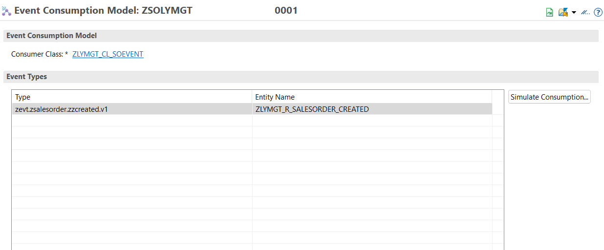

---


</details>

---

### 2.2 Generated Artefacts

<details>
    <summary> 🔵 Click to Expand</summary>


Once generation completes, the following artifacts are created:

- For each event type:
- Abstract Entity
- Behavior Definition
- Typed Event Interface
- Consumer Artifacts:
- Consumer Base Class
- Consumer Extension Class
- Communication Artifacts:
- Inbound Service
- Authorization default proposals

All artifacts are visible under the **Event Consumption Model subtree** in the **ABAP Developer Tools Explorer**.

</details>

---


### 2.3 Implementation of Consumer Extension Class

<details>
  <summary> 🔵 Click to Expand</summary>
  
1. Navigate to **new ABAP Development Object**.

2. Define an interface named **`zlymgt_if_constants`** that is `PUBLIC`.
                                                                                                                                                                        
3. Include a set of constants to standardize values across applications, for **number ranges and other operations**(this was already done while implementing Loyalty Mangement Application).  

The selected ABAP code defines an interface named **`zlymgt_if_constants`** that is `PUBLIC`.  
It contains a set of constants to standardize values across applications, especially for **workflow statuses and workflow operations**.  


### Workflow Status Constants


Replace the code with the below code.

```abap

INTERFACE zlymgt_if_constants
  PUBLIC .
  CONSTANTS:
    workflow_status_active   TYPE zlymgt_tierstatus VALUE 'A',
    workflow_status_inactive TYPE zlymgt_tierstatus VALUE 'I',
    workflow_status_pending  TYPE zlymgt_tierstatus VALUE 'W',
    workflow_status_rejected TYPE zlymgt_tierstatus VALUE 'R',
    nr_obj_value             TYPE cl_numberrange_runtime=>nr_object VALUE 'ZLYMGT_MID',
    nr_range_nr              TYPE cl_numberrange_runtime=>nr_interval VALUE '01',
    draft                    TYPE abp_behv_flag VALUE '00',
    cid                      TYPE abp_behv_cid VALUE '01',
* Below constants will be used for Workflow
    lylpts_wf_usertask       TYPE if_swf_cpwf_api=>cpwf_def_id_long  VALUE 'eu12.fusion-development-customer-demos.loyaltytierapproval.approve_Tier',
    lylpts_retention_days    TYPE if_swf_cpwf_api=>retention_time VALUE '30',
    callback_class           TYPE if_swf_cpwf_api=>callback_classname VALUE 'zlymgt_cl_membshiptierapproval',
    consumer                 TYPE string VALUE 'DEFAULT'.

ENDINTERFACE.


```

- **`workflow_status_active`** → `'A'` (Type: `zlymgt_tierstatus`)  
  Represents an *Active* workflow status.  
- **`workflow_status_inactive`** → `'I'` (Type: `zlymgt_tierstatus`)  
  Represents an *Inactive* workflow status.  
- **`workflow_status_pending`** → `'W'` (Type: `zlymgt_tierstatus`)  
  Represents a *Pending* workflow status.  
- **`workflow_status_rejected`** → `'R'` (Type: `zlymgt_tierstatus`)  
  Represents a *Rejected* workflow status.  

### Behavior and CID
- **`draft`** → `'00'` (Type: `abp_behv_flag`)  
  Used for draft-related behaviors.  
- **`cid`** → `'01'` (Type: `abp_behv_cid`)  

### Workflow-Related Constants
- **`lylpts_wf_usertask`** → `'eu12.fusion-development-customer-demos.loyaltytierapproval.approve_Tier'`  
  (Type: `if_swf_cpwf_api=>cpwf_def_id_long`)  
  Identifier for workflow user task.  

- **`lylpts_retention_days`** → `30` (Type: `if_swf_cpwf_api=>retention_time`)  
  Defines workflow retention time.  

- **`callback_class`** → `'zlymgt_cl_membshiptierapproval'`  
  (Type: `if_swf_cpwf_api=>callback_classname`)  
  Specifies the callback class name for workflow handling.  


### Consumer
- **`consumer`** → `'DEFAULT'` (Type: `string`)  


✅ These constants ensure **consistency** in handling **workflow statuses, and workflow operations** across implementations of this interface.  


In the consumer extension class, the event processing logic can be implemented. You can open the consumer extension class by opening your Event Consumption Model and clicking on the link to the class next to **Consumer Class** at the top.

In the generated class, you can find for each event type of the Event Consumption Model a respective `handle_event` method. In each method, the corresponding event type and the typed business data for this event can be found. The latter is commented out so that you can implement your own logic.

Inside of the `handle_event` method, you have access to the typed event object that offers the following methods:

- `get_arrival_timestamp` - Get the time stamp of the arrival in the system.
- `get_business_data` - Get the business data of an event in provider format as defined in the abstract entity and behavior definition.
- `get_cloud_event_id` - Get the ID of the received cloud event.
- `get_cloud_event_source` - Get the source value from the cloud event envelope.
- `get_cloud_event_timestamp` - Get the published time stamp of the cloud event, might not be set in the cloud event envelope.
- `get_cloud_event_type` - Get the event type from the cloud event envelope.
- `get_custom_ext_attr_value` - Get value of specified custom extension attribute if it exists.


### 2.3.1 Consumer Extension Class

1. Navigate to the behavior definition `ZLYMGT_R_MEMBERSHIP`. Add the following content

   - **`field ( readonly : update ) Customer,Customername, Sourcesystemid;`**
     
2. Event to trigger UI refresh when membership tier data changes
  
   - **`event UpdateUI for side effects;`**

 3. When UpdateUI event is raised, refresh membership record, related tiers, and specifically Tierstatus field
   - **`  side effects
  {
      event UpdateUI affects entity _MembershipTiers, $self, field _MembershipTiers.Tierstatus;
  }`**
 
4. Navigate to the projection behaviour Definition `ZLYMGT_C_MEMBERSHIP` .Add the following content

   - **`  use event UpdateUI; `**
  
5. Navigate to the consumer extension class `ZLYLMGT_CL_SOEVENT`. Replace the code with the following code.

```abap

CLASS zlymgt_cl_soevent DEFINITION
  PUBLIC
  INHERITING FROM zlymgt_cl_soevent_base
  FINAL
  CREATE PUBLIC .

  PUBLIC SECTION.

    METHODS zlygmt_if_so_event_handler~handle_zsalesorder_zzcrea_5ffc
        REDEFINITION .
  PROTECTED SECTION.
  PRIVATE SECTION.
ENDCLASS.


CLASS zlymgt_cl_soevent IMPLEMENTATION.


  METHOD zlygmt_if_so_event_handler~handle_zsalesorder_zzcrea_5ffc.

    " Event Type: zevt.zsalesorder.zzcreated.v1

    " Data declarations
    DATA ls_business_data TYPE STRUCTURE FOR HIERARCHY zlymgt_r_salesorder_created.

    ls_business_data = io_event->get_business_data( ).


    SELECT SINGLE Membershipuuid FROM zlymgt_c_membership
          WHERE Customer = @ls_business_data-SoldToParty
          INTO @DATA(loyaltymembershipuuid).


    IF sy-subrc <> 0.
*Incase of a new Loyalty Membership, Create a new entry with the current sales order as transaction.

      SELECT SINGLE * FROM zlymgt_tierconfg
      WHERE tierstatus = @zlymgt_if_constants=>workflow_status_active
      INTO @DATA(ls_config).

      MODIFY ENTITIES OF zlymgt_r_membership
             ENTITY LoyaltyMembership
             CREATE FIELDS ( Customer Customername Sourcesystemid ) WITH
             VALUE #( ( %cid     = 'cidso'
                        Customer = ls_business_data-SoldToParty
                        Customername = ls_business_data-PartnerName
                        Sourcesystemid = ls_business_data-SourceSystem
                        ) )
             CREATE BY  \_MembershipTiers
             FIELDS ( Tierid Tierstatus Conversionfactor ) WITH
             VALUE #( ( %cid_ref = 'cidso'
                        %target  = VALUE #( ( %cid   = 'cidso_tier'
                                              Tierid = ls_config-tierid
                                              Tierstatus = ls_config-tierstatus
                                              Conversionfactor = ls_config-conversionfactor ) ) ) )

             CREATE BY  \_MembershipTransactions
             FIELDS ( Transactiondate Transactionvalue Transactioncurrency Salesorderid ) WITH
             VALUE #( ( %cid_ref = 'cidso'
                        %target  = VALUE #( ( %cid                = 'cidso_trans'
                                              Transactiondate     = cl_abap_context_info=>get_system_date( )
                                              Transactionvalue    = ls_business_data-TotalNetAmount
                                              Transactioncurrency = ls_business_data-TransactionCurrency
                                              Salesorderid        = ls_business_data-SalesOrder ) ) ) )
             MAPPED DATA(mapped)
             REPORTED DATA(reported)
             FAILED DATA(failed).

      IF mapped IS NOT INITIAL.
        COMMIT ENTITIES
               RESPONSE OF zlymgt_r_membership
               REPORTED DATA(reported_commit)
               FAILED DATA(failed_commit).
      ENDIF.
    ELSE.
*Incase of an already existing Membership, update the existing Membership with the current transaction
      READ ENTITIES OF zlymgt_r_membership
           ENTITY LoyaltyMembership
           ALL FIELDS
           WITH VALUE #( (  Membershipuuid = loyaltymembershipuuid ) )
           RESULT DATA(pgm_hdr)
           BY \_MembershipTransactions ALL FIELDS WITH VALUE #( ( Membershipuuid = loyaltymembershipuuid  ) )
           RESULT DATA(pgm_txns).

      MODIFY ENTITIES OF zlymgt_r_membership
             ENTITY LoyaltyMembership
             CREATE BY \_MembershipTransactions
             FIELDS ( Transactiondate Transactionvalue Transactioncurrency Salesorderid ) WITH
             VALUE #( ( Membershipuuid = loyaltymembershipuuid
                        %target        = VALUE #( ( %cid                = 'cidso_trans'
                                                    Transactiondate     = cl_abap_context_info=>get_system_date( )
                                                    Transactionvalue    = ls_business_data-TotalNetAmount
                                                    Transactioncurrency = ls_business_data-TransactionCurrency
                                                    Salesorderid        = ls_business_data-SalesOrder  ) ) ) )
             MAPPED mapped
             REPORTED reported
             FAILED failed.
      IF mapped IS NOT INITIAL.
        COMMIT ENTITIES
               RESPONSE OF zlymgt_r_membership
               REPORTED reported_commit
               FAILED failed_commit.


      ENDIF.
    ENDIF.

  ENDMETHOD.
ENDCLASS.

```

</details>

---

### 2.4 Creation of the Communication Scenario for Event Consumption

<details>
  <summary> 🔵 Click to Expand</summary>

This section provides guidance on how to create the communication scenario for the previously generated Event Consumption Model and the necessary steps to enable event consumption.

Eventually, this communication scenario will be used in the productive system to create a communication arrangement with the previously generated Event Consumption Model. Additionally, a standard `SAP_COM_0092` communication scenario will be required in the productive system, which connects the system to the Event Mesh instance in SAP BTP. These two scenarios together enable event consumption using the generated Event Consumption Model.

---

To create a new **communication scenario** for the Event Consumption Model, follow these steps:

### 2.4.1. Log into ADT
   Log on to your development system in the ABAP Development Tools (ADT).

### 2.4.2. Create Communication Scenario
   - Right-click on your ABAP project → `New` → `Other ABAP Repository Object`  
   - Navigate to `Cloud Communication Management` → `Communication Scenario`  
   - Click `Next`

### 2.4.3. Fill in Scenario Details  
   - Select a **Package**  
   - Provide a **Name** - `ZSO_LYLMGT` and **Description** - `Communication scenario for Loyalty Management`

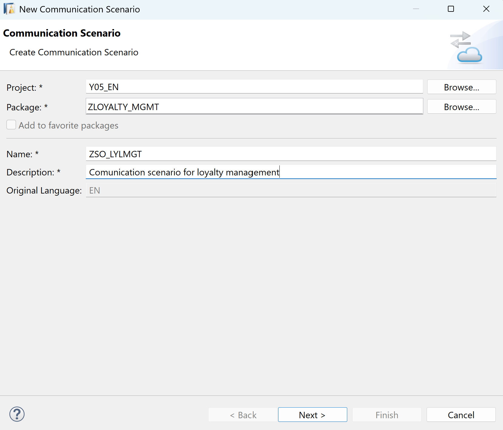

   - Click `Next`

### 2.4.4. **Transport Request**  
   - Choose or create a new transport request  
   - Click `Finish`

### 2.4.5. **General Settings**  
   - The new Communication Scenario will open automatically  
   - Under the **General** tab:
     - Set `Communication Scenario Type` to **Customer Managed**
     - Choose an appropriate **Allowed Instances** option:
       - `One instance per scenario & communication system`: Single arrangement
       - `Multiple instances per scenario & communication system`: Multiple arrangements (e.g., for different Event Mesh instances)

### 2.4.6. **Add Inbound Service**
   - Navigate to the **Inbound** tab of the communication scenario.
   - Under **Inbound Services**, click `Add...`
   - In the pop-up, enter the **Inbound Service ID** of the Event Consumption Model  

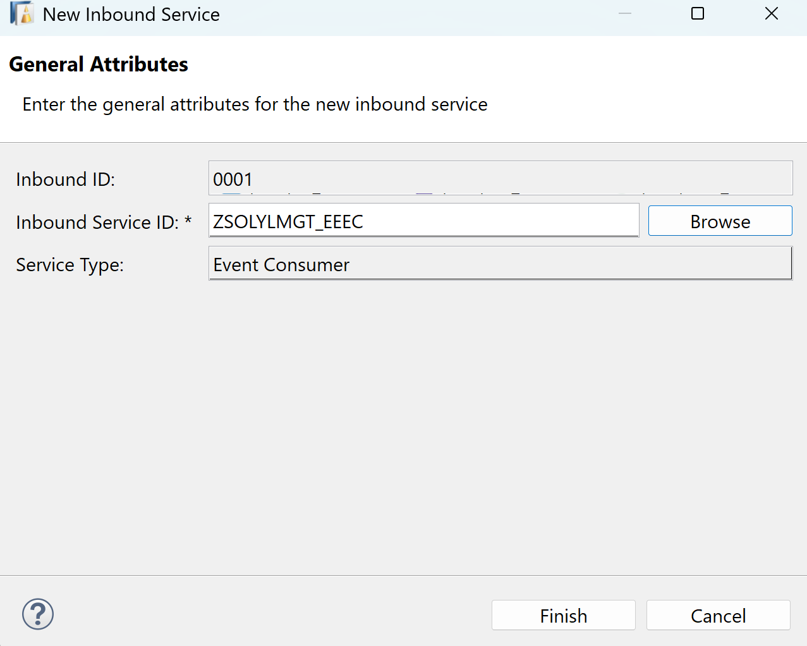

   - Click `Finish`

> The Inbound Service ID is the name of the Event Consumption Model (without version) + suffix `_EEEC`.  
> For example:  
> - If the model name is `ZSOLYLMGT 0001`, the inbound service ID will be `ZSOLYLMGT_EEEC`.

</details>


---

### 2.5 Testing 

<details>
  <summary> 🔵 Click to Expand</summary>

To test the communication scenario locally with the Event Consumption Model:
- Click `Publish Locally` in the Communication Scenario editor

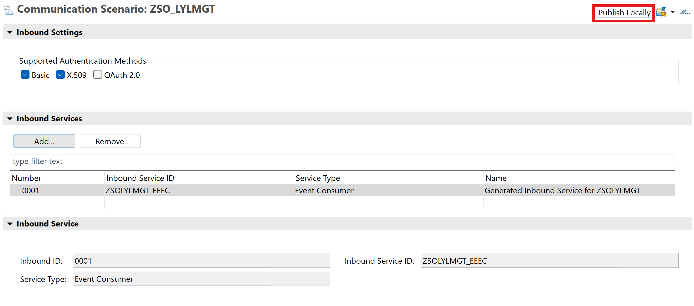

</details>

---

### 2.6 Create a Communication Arrangement

<details>
  <summary> 🔵 Click to Expand</summary>

1️. **Log on** to the **SAP Fiori Launchpad** in the **SAP BTP, ABAP Environment system**.  

2️. Under **Communication Management**, select the **Communication Arrangements** tile.  

3️. Press **New** to create a new communication arrangement.  

4️. Select the scenario: `SAP_COM_0092` (**Enterprise Eventing Integration**).  


5️. Adapt the **Arrangement Name**.  

> ⚠️ If channel name is not specified under Additional Properties, it defaults to the **Arrangement Name**.

---

#### 🧩 Add Additional Properties

- Press **Additional Properties**  
- Add:  
  - **Channel** → specify a channel name  
  - **QoS**:
    - `0` (at most once)
    - `1` (at least once)
  - **Reconnect Attempts**:
    - `0` → infinite retries  
    - `>0` → retries n times  
  - **Reconnect Waittime** (in seconds):
    - default: `10`  
    - max: `1800`  
    - wait time increases per retry  

> 💡 Description field is optional; it gets a default if left blank.


</details>

---

### 2.7 Select Communication User

<details>
  <summary> 🔵 Click to Expand</summary>

1. Create a new **Communication User**:
- Enter any **Name** and **Description**
- Propose or enter a **Password** (📌 *store user/password for later use*)
- Press **Save**.  
✅ The **Inbound User** is created and added to the communication system.

2. Copy and paste the **service key** from the event mesh instance.  

3. Press **Create**  
✅ The connection will be checked automatically.  
❌ If it fails, the creation will not proceed, and you'll be shown the reasons.


</details>

---

### 2.8 Maintain a Communication Arrangement

<details>
  <summary> 🔵 Click to Expand</summary>

Even after creation, you can still:

- Change parameters via **Service Key**
- Modify:
  - **QoS**
  - **Reconnect Attempts**
  - **Reconnect Waittime**
  - **Topic Space**

> ⚠️ Events are published **only if** the topic space matches the SAP Event Mesh namespace.

---

**To Update Connection Details:**

- Press **Update via Service Key**
- Paste the new service key
- Press **Update**

**To Edit Additional Properties:**

- Press **Edit**
- Press **Close** to exit.

---

📌 **Summary**:
- Use `SAP_COM_0092` for Enterprise Eventing.
- Service key simplifies setup.
- QoS, reconnect values can be tuned.
- Ensure **channel name** and **topic space** match your Event Mesh configuration.

</details>

---

## 3. Create a Communication Arrangement for Consumption Communication Scenario `ZSO_LYLMGT`

### 3.1 Create a Communication Arrangement for the Consumption Model

<details>
  <summary> 🔵 Click to Expand</summary>

1️. **Log on** to the **SAP Fiori Launchpad** in the **SAP BTP ABAP Environment system**.  

2️. Under **Communication Management**, select the **Communication Arrangements** tile.  

3️. Press **New** to create a new communication arrangement.  

4️. Select the scenario: `ZSO_LYLMGT` (**Enterprise Eventing Integration**).  

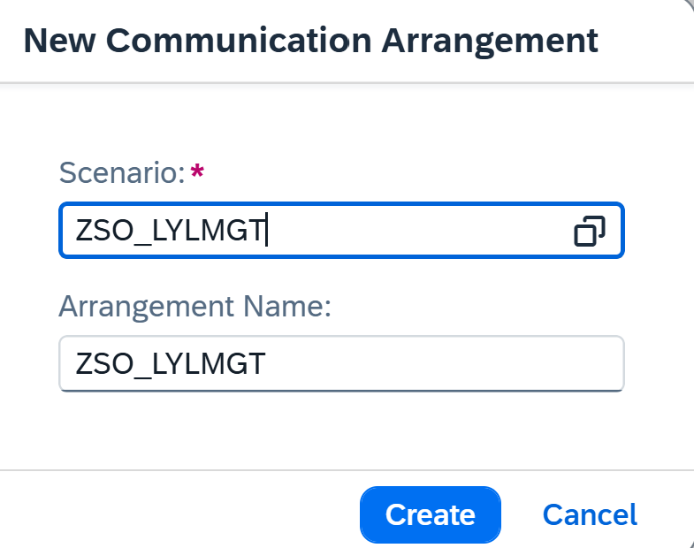

5️. Adapt the **Arrangement Name** - ZSO_LYLMGT.  

> ⚠️ If channel name is not specified under Additional Properties, it defaults to the **Arrangement Name**.

</details>

---

### 3.2 Create a Communication System

<details>
  <summary> 🔵 Click to Expand</summary>

1. Create a new **Communication System**: `ZSO_LYLMGT`.

2. Enter a **System ID** and **Name**.

3. Click **Create**.


</details>

---

### 3.3 Enable SAP Event Mesh

<details>
  <summary> 🔵 Click to Expand</summary>

1. Turn on the **Event Exchange Infrastructure** option.

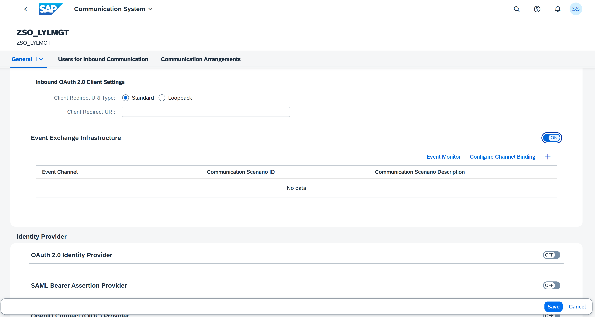

2. Add the **Event Channel**- `ZSAP_SO_LYLMGT` as the channel created in the SAP_COM_0092 Communication Arrangement (`ZSAP_COM_0092`)


3. Save the **Communication System**
  
</details>

---

### 3.4 Add a New Inbound User

<details>
  <summary> 🔵 Click to Expand</summary>

1. Go to **Inbound Communication** in the communication Arrangement.

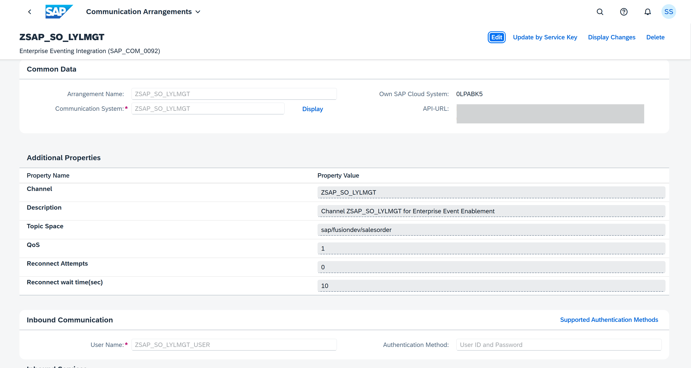

2. Add a new **Inbound User** for authentication
   
3. You can add the user already created for `ZSAP_COM_0092`.
   
4. Activate the inbound service under **inbound services'

</details>

---

### 3.5 Save Configuration

<details>
  <summary> 🔵 Click to Expand</summary>

Complete and **Save** the **Communication Arrangement**.

</details>

---

## 4. Configure Channel Binding for Enterprise Event Enablement in the BTP, ABAP Environment system

<details>
  <summary> 🔵 Click to Expand</summary>


### 4.1   Open the **Enterprise Event Enablement - Configure Channel Binding** app.  
### 4.2  Search for all channels and select the channel you created before.
### 4.3  Create Subscriptions

1. Navigate to the **details page**.
 
2. Go to the **Subscriptions** tab.

3. After clicking on 'Edit', create the subscription with the following:
   - **Queue Name**: `sap/fusiondev/salesorder/loyalty`

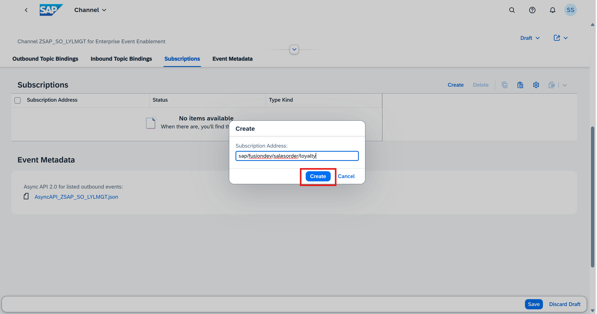

 4. Ensure the **Status** is **Acknowledged**.

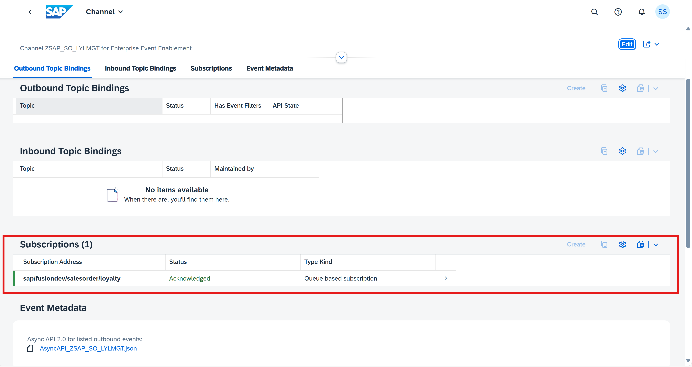


### 4.4 Check Inbound Topic Bindings

 - The event types should also be bound to the Channel
 - Event types of consumption model can be found in ADT

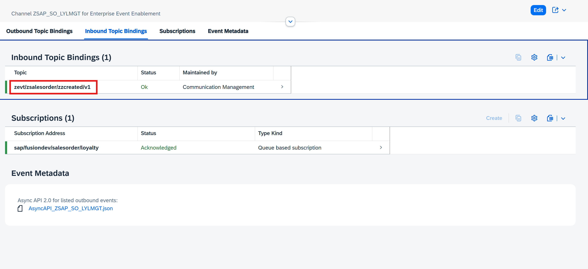

</details>

----

<!-----
➡️[ Build Process Automation Flow ](../../../../03-REUSE/02-INTEGRATION/01-SAP_BUILD_PROCESS_AUTOMATION)
----->


