[Home - Loyalty Points App](../../README.md)

# Create a Loyalty Points Management Solution Using SAP BTP ABAP Environment

> The object names/coding style used here, if any, is not a recommendation on coding guidelines/standards

## Table of Contents

- **1 Overview**
  - **1.1 Highlights**
  - **1.2 Business Scenario**
- **2 Preparation**
  - **2.1 Prerequisites**
- **3 Implementation Steps**
  - **3.1 Creating a Custom BO and Service for Loyalty Program Membership Details**
  - **3.2 Creating a Business Configuration Maintenance Object**
  - **3.3 Establishing Data Model Through Compositions**
  - **3.4 Creating Metadata Extensions**
  - **3.5 Inserting Business Logic into Behaviour Implementation Class**

## 1 Overview

In this exercise, you will create a **Loyalty Program Membership** application using SAP BTP ABAP Environment and deploy them as Fiori apps.  

This application allows you to manage loyalty memberships for customers (business partners from SAP Cloud ERP, maintain categories, record transactions, and control points management based on membership category. You will develop this app side-by-side to SAP Cloud ERP on SAP BTP.

> Refer to the [SAP BTP ABAP Environment Documentation](https://pages.community.sap.com/topics/btp-abap-environment) for the latest information.

### 1.1 Highlights
- Creation of an SAP Fiori app using the ABAP RESTful Application Programming Model (RAP) on SAP BTP ABAP Environment
- Use of **Number Range Reuse Service**
- Deployment of the app using **SAP Business Application Studio**
- Integration with SAP Cloud ERP

### 1.2 Business Scenario

> ℹ️ **Note:**  
> This sample scenario is for learning purposes only. You may need to adapt it based on product changes or documentation updates.

This scenario illustrates a **points-based loyalty program** that rewards customers based on repeated purchases and subscriptions.  
Organizations may use similar programs to retain customers with incentives and foster brand loyalty.  
With this app, you can create, update, and delete loyalty memberships for business partners in SAP Cloud ERP, where point management is based on the assigned customer category.

--- 

## 2 Preparation

### 2.1 Prerequisites

| **Prerequisites** | **Details** |
|--------------------|-------------|
| **SAP Business Technology Platform - Entitlements** | You have an SAP BTP subaccount (multi-environment) with an entitlement to create an SAP ABAP Environment Instance.<br>You have an SAP BTP subaccount (multi-environment) with an entitlement for SAP Business Application Studio.<br><br>For more information about SAP BTP accounts, refer to [SAP Business Technology Platform](https://www.sap.com/products/technology-platform.html).<br><br> > **Note**<br> > For non-productive or testing purposes, you can use an SAP BTP trial account. For more information, refer to [this tutorial](https://developers.sap.com/tutorials/hcp-create-trial-account.html). |
| **SAP Business Technology Platform - Roles** | Ensure that the authorizations required for managing the subaccount are assigned.<br>The role collection `Business_Application_Studio_Developer` is generated automatically once you subscribe to SAP Business Application Studio. Assign this role collection to your UI developers. |
| **SAP Business Technology Platform - Configuration** | **Configure Destinations in SAP BTP**<br><br>The destination is configured and the API endpoint of the SAP S/4HANA Cloud system (`…-api.s4hana…`) is used in the URL field. Create a destination to connect to SAP Business Application Studio.<br><br>For creating a destination, refer to **Create a Destination to Connect to SAP Business Application Studio**.<br><br>Use the **Download Trust** button in the Destinations menu to download the subaccount certificate. |
| **SAP BTP ABAP Environment** | - The `Administrator (SAP_BR_ADMINISTRATOR)` business role is assigned to your user.<br>- The `Developer (SAP_BR_DEVELOPER)` business role is assigned to your user.<br> - These are assigned after logging into the system via the Fiori Launchpad and using the 'Maintain Business Roles' application |


---

## 3 Implementation Steps

### 3.1 Creating a Custom Business Object and Service for Loyalty Program Membership.

The Loyalty Program Business Object allows you to maintain the Loyalty Program Membership details along with Customer Category and transaction details. This RAP BO supports transactional capabilities such as create, read, update, and delete.

1. Log on to the ABAP instance using the URL via the ABAP Developer Tools (ADT).
2. Log on to the system to start development with valid user credentials.

---

### 3.1.1 Creating a Package

<details>
     <summary>🔽 Click to expand! </summary>


To create an ABAP package:

1. Choose `ZLOYALTY_MGMT > New ABAP Package`.
2. Enter the following data:
   - **Name**: `ZLOYALTY_MGMT`
   - **Description**: `Loyalty Management Application`
3. Select **Add to favorite packages**.
4. In the **Package Type** field, select `Development`.
5. Choose **Next**.
6. On the ABAP package screen, enter the following data:
   - **Software Component**: `ZLOYALTYMGMT`
7. Create a new request and add a description.
8. Choose **Finish**.
   
</details>

---

### 3.1.2 Creating CDS View for Loyalty Membership Details

#### 1. Create a Domain for Membership ID
<details>
     <summary>🔽 Click to expand! </summary>

1. Right-click the package `ZLOYALTY_MGMT` and choose **New > Other ABAP Repository Object**.
2. Search for **Domain**, select it, and choose **Next**.
3. Enter:
   - **Name**: `ZLYMGT_MEMBERSHIPID`
   - **Description**: `Membership Id`
4. Choose **Next**.
5. Select a transport request and choose **Finish**.
6. In the **Format Information** section, enter:
   - **Data Type**: `NUMC`
   - **Length**: `10`
   - **Output Length**: `10`
7. Save and Activate.

</details>


#### 2. Create a Data Element for Membership ID
<details>
     <summary>🔽 Click to expand! </summary>

1. Right-click the package and choose **New > Other ABAP Repository Object**.
2. Search for **Data Element**, select it, and choose **Next**.
3. Enter:
   - **Name**: `ZLYMGT_MEMBERSHIPID`
   - **Description**: Loyalty Points Membership ID
4. Choose **Next**.
5. Select a transport request and choose **Finish**.
6. In **Data Type Information**, enter:
   - **Category**: Domain
   - **Type Name**: `ZLYMGT_MEMBERSHIPID`
   - **Data Type**: `NUMC`
   - **Length**: `10`
7. In **Field Labels**, enter:
   - **Short**: `ID`
   - **Medium**: `Membership ID`
   - **Long ID**: `Membership ID`
   - **Heading**: `Membership ID`
8. Save and Activate.

</details>


#### 3. Create a Data Element for Customer ID
<details>
     <summary>🔽 Click to expand! </summary>

1. Right-click the package and choose **New > Other ABAP Repository Object**.
2. Search for **Data Element**, select it, and choose **Next**.
3. Enter:
   - **Name**: `ZLYMGT_CUSTOMER`
   - **Description**: `Customer from ERP System`
4. Choose **Next**.
5. Select a transport request and choose **Finish**.
6. In **Data Type Information**, enter:
   - **Category**: Predefined Type
   - **Data Type**: `CHAR`
   - **Length**: `10`
7. In **Field Labels**, enter:
   - **Short**: `Customer`
   - **Medium**: `Customer`
   - **Long ID**: `Customer`
   - **Heading**: `Customer`
8. Save and Activate.

</details>


#### 4. Create a Data Element for Source system ID
<details>
     <summary>🔽 Click to expand! </summary>

1. Right-click the package and choose **New > Other ABAP Repository Object**.
2. Search for **Data Element**, select it, and choose **Next**.
3. Enter:
  - **Name**: `ZLYMGT_SRCSYSID`
   - **Description**: `Source System for Loyalty Membership`
4. Choose **Next**.
5. Select a transport request and choose **Finish**.
6. In **Data Type Information**, enter:
   - **Category**: Predefined Type
   - **Data Type**: `CHAR`
   - **Length**: `3`
7. In **Field Labels**, enter:
   - **Short**: `Source Sys`
   - **Medium**: `Source System`
   - **Long ID**:`Source System`
   - **Heading**: `Source System`
8. Save and Activate.

</details>


#### 5. Create a Database Table to Store Loyalty Program Membership Details
<details>
     <summary>🔽 Click to expand! </summary>

1. Right-click the package and choose **New > Other ABAP Repository Object**.
2. Search for **Database Table**, select it, and choose **Next**.
3. Enter:
   - **Name**: `ZLYMGT_MEMBSHIP`
   - **Description**: `Membership Details for Loyalty Management`

   

4. Choose **Next**.
5. Select a transport request and choose **Finish**.
6. Replace the generated code with:

```abap
@EndUserText.label : 'Membership Details for Loyalty Management'
@AbapCatalog.enhancement.category : #EXTENSIBLE_ANY
@AbapCatalog.tableCategory : #TRANSPARENT
@AbapCatalog.deliveryClass : #A
@AbapCatalog.dataMaintenance : #RESTRICTED
define table zlymgt_membship {

  key client         : abap.clnt not null;
  key membershipuuid : sysuuid_x16 not null;
  membershipid       : zlymgt_membershipid not null;
  customer           : zlymgt_customer not null;
  customername       : abap.char(30);
  sourcesystemid     : zlymgt_srcsysid;
  createdby          : abp_creation_user;
  createdat          : abp_creation_tstmpl;
  lastchangedby      : abp_locinst_lastchange_user;
  locallastchangedat : abp_locinst_lastchange_tstmpl;
  lastchangedat      : abp_lastchange_tstmpl;

}
```

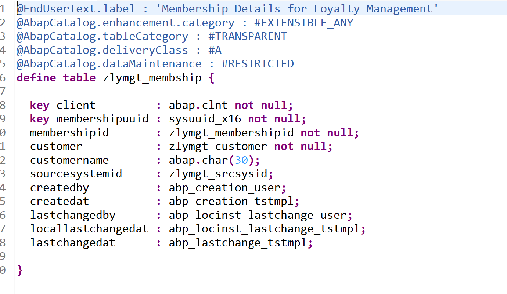


7. Save and Activate the database table.

</details>


#### 6.Generate a RAP BO using the ABAP Repository Object Generator..

<details>
  
  <summary>🔽 Click to expand! </summary>
  

 1. Right-click on your database table `ZLYMGT_MEMBSHIP`.
 2. Select **Generate ABAP Repository Objects** from the context menu.
    
    
 
 
 3. In the **ABAP RESTful Application Programming Model** dropdown, select the entry **OData UI Service** in the wizard and click **Next**.  

    

 4. Maintain your package name `ZLOYALTY_MGMT` and click **Next**.  

    

 5. Enter **General** section details.In the General section, enter the following data:

     **Project Name** : `LYMGT_MEMBSHIP`.

 6. In the **Data Model** section under the **Business Object** menu, enter:  
     **CDS Entity Name**: `ZLYMGT_R_MEMBERSHIP`.

    

 7. In the **Behavior** section under the **Business Object** menu, enter:  
     **Behavior Implementation Class**: `ZLYMGT_BP_R_MEMBERSHIP`  
     **Draft Table Name**: `ZLYMGT_MEMBSHIP_D`.

    

 8. In the **Service Projection Entity** section under the **Service Projection** section, enter:  
     **Name:** `ZLYMGT_C_MEMBERSHIP`.

    
    
 9. In the **Service Projection Behavior** section under the **Service Projection** menu, enter:  
     **Name:** `ZLYMGT_BP_C_MEMBERSHIP`.

    


 10. In the **Service Definition** section under the **Business Service** menu, enter:  
     **Name:** `ZLYMGT_UI_MEMBERSHIP_04`.
   
     

 11. In the **Service Binding** section under the **Business Service** menu, enter:  
     **Name:** `ZLYMGT_UI_MEMBERSHIP_04`.  
     **Binding Type:** `OData V4 - UI`.

     

 12. Choose **Next**.In the ABAP Artifacts Generation/Modification List,You will be able to preview the list of repository objects that are going to be generated.

     

 13. On the **Preview Generator Output** screen, choose **Next**.
     
 14. Select a transport request and choose **Finish**.

     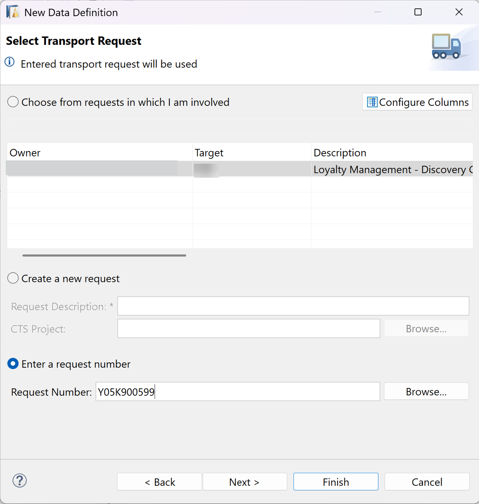


</details>


#### 7. Publish the Generated Service Binding

<details>
  
  <summary>🔽 Click to expand! </summary>

1. **Publish the Service Binding**
   - In the **Services** section of the service binding, click on the service name `ZLYMGT_UI_MEMBERSHIP_04`.
   - Choose **Publish** to activate the service binding.

     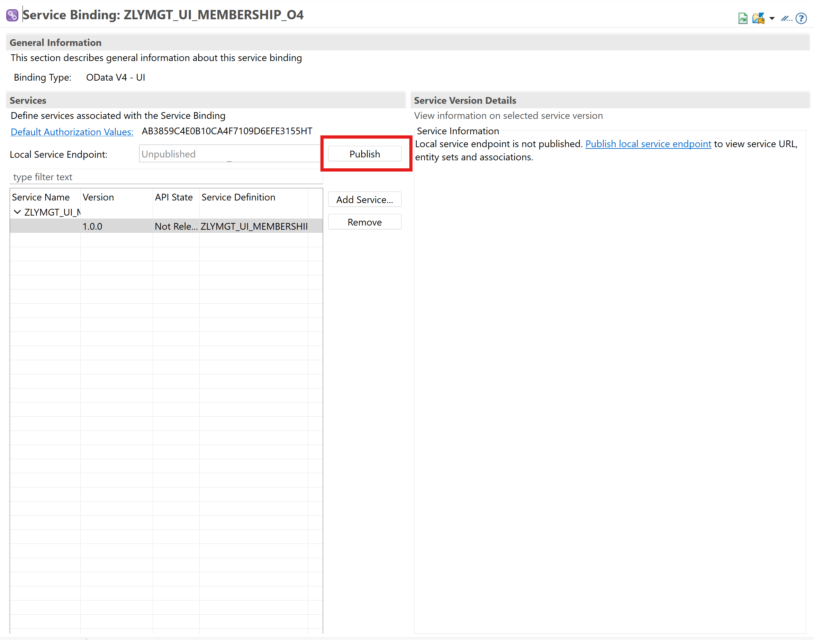

2. **Access the Service Version Details**
   - Navigate to the **Service Version Details** section.
    
3. **Select the Entity Set**
   - Under **Entity Set and Association**, choose the entity set `ZLYMGT_C_MEMBERSHIP`.
 

4. **Preview the Service**
   - Click on **Preview** to open the service in the browser and verify its functionality.
        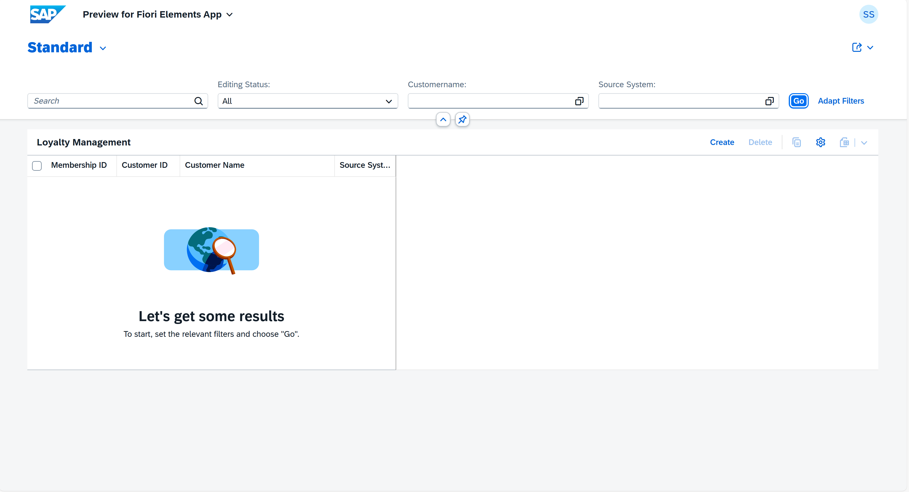
      
  

</details>

---

### 3.1.3 Creating CDS View for Membership Transactions

#### 1. Create a Data Element for Transaction Date

<details>
  
  <summary>🔽 Click to expand! </summary>

1. Right-click the package `ZLOYALTY_MGMT` and choose **New Other ABAP Repository Object**.
2. Search for **Data Element**, select it, and choose **Next**.
3. Enter the following data:  
   - **Name**: `ZLYMGT_TRANSACTIONDATE`  
   - **Description**: *Transaction Date*  
4. Choose **Next**.
5. Select a transport request and choose **Finish**.
6. In the **Data Type Information** section:  
   - **Category**: `Domain`  
   - **Type Name**: `Predefined Type`  
   - **Data Type**: `DATS`  
   - **Length**: `8`  
7. In the **Field Labels** section:  
   - **Short**: `Trans Date`  
   - **Medium**: `Transaction Date`  
   - **Long**: `Transaction Date`  
   - **Heading**: `Transaction Date`  
8. Save and Activate.

</details>

#### 2. Create a Data Element for Transaction Value

<details>
  
  <summary>🔽 Click to expand! </summary>

1. Right-click the package `ZLOYALTY_MGMT` and choose **New Other ABAP Repository Object**.
2. Search for **Data Element**, select it, and choose **Next**.
3. Enter the following data:  
   - **Name**: `ZLYMGT_TRANSACTIONVALUE`  
   - **Description**: *Transaction Value for the sales order*  
4. Choose **Next**.
5. Select a transport request and choose **Finish**.
6. In the **Data Type Information** section:  
   - **Category**: `Predefined Type`  
   - **Data Type**: `CURR`  
   - **Length**: `10`
   - **Decimal**:`2`  
7. In the **Field Labels** section:  
   - **Short**: `TransValue`  
   - **Medium**: `Transaction Value`  
   - **Long**: `Transaction Value`  
   - **Heading**: `Transaction Value`  
8. Save and Activate.

</details>

#### 3. Create a Data Element for Transaction Currency

<details>
  
  <summary>🔽 Click to expand! </summary>

1. Right-click the package `ZLOYALTY_MGMT` and choose **New Other ABAP Repository Object**.
2. Search for **Data Element**, select it, and choose **Next**.
3. Enter the following data:  
   - **Name**: `ZLYMGT_TRANSACTIONCURRENCY`  
   - **Description**: *Transaction Value for the sales order*  
4. Choose **Next**.
5. Select a transport request and choose **Finish**.
6. In the **Data Type Information** section:  
   - **Category**: `Domain`
   - **Type Name**:`WAERS` 
   - **Data Type**: `Cuky`  
   - **Length**: `5`
7. In the **Field Labels** section:  
   - **Short**: `Trans Cuky`  
   - **Medium**: `Transaction Currency`  
   - **Long**: `Transaction Currency`  
   - **Heading**: `Transaction Currency`  
8. Save and Activate.

</details>

#### 4. Create a Data Element for Loyalty points

<details>
  
  <summary>🔽 Click to expand! </summary>

1. Right-click the package `ZLOYALTY_MGMT` and choose **New Other ABAP Repository Object**.
2. Search for **Data Element**, select it, and choose **Next**.
3. Enter the following data:  
   - **Name**: `ZLYMGT_LOYALTYPOINTS`  
   - **Description**: *Loyalty points for Transaction*  
4. Choose **Next**.
5. Select a transport request and choose **Finish**.
6. In the **Data Type Information** section:  
   - **Category**: `Predefined`
   - **Data Type**: `INT4`  
   - **Length**: `10`
7. In the **Field Labels** section:  
   - **Short**: `LoyaltyPts`  
   - **Medium**: `Loyalty Points`  
   - **Long**: `Loyalty Points`  
   - **Heading**: `Loyalty Points`  
8. Save and Activate.

</details>


#### 5. Create a Data Element for Sales Order ID

<details>
  
  <summary>🔽 Click to expand! </summary>

1. Right-click the package `ZLOYALTY_MGMT` and choose **New Other ABAP Repository Object**.
2. Search for **Data Element**, select it, and choose **Next**.
3. Enter the following data:  
   - **Name**: `ZLYMGT_SALESORDERID`  
   - **Description**: *sales order ID*  
4. Choose **Next**.
5. Select a transport request and choose **Finish**.
6. In the **Data Type Information** section:  
   - **Category**: `Predefined`
   - **Data Type**: `NUMC`  
   - **Length**: `10`
7. In the **Field Labels** section:  
   - **Short**: `SalesOrdId`  
   - **Medium**: `Sales Order Id`  
   - **Long**: `Sales Order Id`  
   - **Heading**: `Sales Order Id`  
8. Save and Activate.

</details>


#### 6. Create a Database Table for Loyalty Management Transaction Details

<details>  
  <summary>🔽 Click to expand! </summary>

1. Right-click the package `ZLOYALTY_MGMT` and choose **New Other ABAP Repository Object**.
2. Search for **Database Table**, select it, and choose **Next**.
3. Enter the following data:  
   - **Name**: `ZLYMGT_TRANSCTNS`  
   - **Description**: *Transaction Details for Loyalty Management*  
4. Choose **Next**.
5. Select a transport request and choose **Finish**.
6. Replace the generated code with the following code:

```abap
   
@EndUserText.label : 'Transaction Details for Loyalty Management'
@AbapCatalog.enhancement.category : #NOT_EXTENSIBLE
@AbapCatalog.tableCategory : #TRANSPARENT
@AbapCatalog.deliveryClass : #A
@AbapCatalog.dataMaintenance : #RESTRICTED
define table zlymgt_transctns {

  key client          : abap.clnt not null;
  key transactionuuid : sysuuid_x16 not null;
  membershipuuid      : sysuuid_x16 not null;
  transactiondate     : zlymgt_transactiondate not null;
  @Semantics.amount.currencyCode : 'zlymgt_transctns.transactioncurrency'
  transactionvalue    : zlymgt_transactionvalue;
  transactioncurrency : zlymgt_transactioncurrency;
  loyaltypoints       : zlymgt_loyaltypoints;
  sourcesystemid      : zlymgt_srcsysid;
  salesorderid        : zlymgt_salesorderid;
  createdby           : abp_creation_user;
  createdat           : abp_creation_tstmpl;
  lastchangedby       : abp_locinst_lastchange_user;
  locallastchangedat  : abp_locinst_lastchange_tstmpl;
  lastchangedat       : abp_lastchange_tstmpl;
  
   }
    
   ```
</details>

#### 7. Create CDS Data Model for Loyalty Management - Transaction Details

<details>
  
  <summary>🔽 Click to expand! </summary>

1. Right-click the package `ZLOYALTY_MGMT` and choose **New > Other ABAP Repository Object**.

2. Search for **Data Definition**, select it, and choose **Next**.

3. Enter the following data:
   - **Name**: `ZLYMGT_R_TRANSACTION`
   - **Description**:`Transaction View`

4. Choose **Next**.

5. Select a transport request and choose **Finish**.

6. Replace the generated code with the following ABAP code:

```abap

@AbapCatalog.viewEnhancementCategory: [#NONE]
@AccessControl.authorizationCheck: #NOT_REQUIRED
@EndUserText.label: 'Transaction View'
define view entity ZLYMGT_R_TRANSACTION as select from zlymgt_transctns
{
  key transactionuuid as Transactionuuid,
  membershipuuid as Membershipuuid,
  transactiondate as Transactiondate,
  transactionvalue as Transactionvalue,
  transactioncurrency as Transactioncurrency,
  loyaltypoints as Loyaltypoints,
  salesorderid as Salesorderid,
  createdby as Createdby,
  createdat as Createdat,
  lastchangedby as Lastchangedby,
  locallastchangedat as Locallastchangedat,
  lastchangedat as Lastchangedat
}

```

</details>

#### 8. **Create a CDS Projection View for Loyalty Mangement Transaction Details**
 
<details>
      <summary>🔽 Click to expand! </summary>

1. Right-click the package `ZLOYALTY_MGMT` and choose **New Other ABAP Repository Object**.
2. Search for **Data Definition**, select it, and choose **Next**.
3. Enter the following data:  
   - **Name**: `ZLYMGT_C_TRANSACTION  `  
   - **Description**: *Transaction Consumption view*  
   - **Referenced Object**: `ZLYMGT_R_TRANSACTION`  
4. Choose **Next**.
5. Select a transport request and choose **Finish**.
6. Replace the generated code with the following ABAP code:

```abap
@AccessControl.authorizationCheck: #NOT_REQUIRED
@EndUserText.label: 'Transaction Consumption view'
@Metadata.allowExtensions: true
define view entity ZLYMGT_C_TRANSACTION as projection on ZLYMGT_R_TRANSACTION
{
  key Transactionuuid,
  Membershipuuid,
  Transactiondate,
  Transactionvalue,
  @Consumption.valueHelpDefinition: [ {
      entity: {
      name: 'I_Currency',
      element: 'Currency'
      },
      useForValidation: true
      } ]
  Transactioncurrency,
  Loyaltypoints,
  Salesorderid,
  Createdby,
  Createdat,
  Lastchangedby,
  Locallastchangedat,
  Lastchangedat
}


```
7. Save and Activate.
   
</details>

---

### 3.1.4 Creating CDS View for Membership Tier


1. **Create a Domain for Membership Tier ID**

<details>
  
  <summary>🔽 Click to expand! </summary>
  
   - Right-click the package `ZLOYALTY_MGMT` and choose **New > Other ABAP Repository Object**.  
   - Search for **Domain**, select it, and click **Next**.  
   - Enter:  
     - **Name**: `ZLYMGT_MEMBERSHIPTIERID`  
     - **Description**: `ID for membership tier`  
   - Select a transport request and click **Finish**.  
   - In the **Format Information** section:  
     - **Data Type**: `NUMC`  
     - **Length**: `5`  
     - **Output Length**: `5`  
   - Save and Activate.
  
  </details>
  


2. **Create a Domain for Tier Status**

<details>
  <summary>🔽 Click to expand! </summary>  
  
   - **Name**: `ZLYMGT_TIERSTATUS`  
   - **Description**: `Status for membership tier`  
   - In the **Format Information** section:  
     - **Data Type**: `CHAR`  
     - **Length**: `1`  
   - In the **Fixed Values** section:  
     - `A`: Active  
     - `I`: InActive
     - `R`: Rejected
     - `W`: Awaiting Approval  
   - Save and activate.  


  </details>
  

  

3. **Create a Data Element for Tier ID**

<details>
      <summary>🔽 Click to expand! </summary>
   
   - Name: `ZLYMGT_TIERID`  
   - Description: Loyalty Program Category ID  
   - **Category**: `Predefined Type`  
   - **Data Type**: `NUMC`
   - **Length**: 5  
   - Field Labels:  
     - Short: `Tier ID`  
     - Medium: `Tier ID` 
     - Long ID: `Tier ID` 
     - Heading: `Tier ID` 
   - Save and Activate.

</details>


4. **Create a Data Element for Tier Status**

<details>
      <summary>🔽 Click to expand! </summary>
   
   - Name: `ZLYMGT_TIERSTATUS`  
   - Description: Tier Status  
   - **Category**: Domain  
   - **Type Name**: `ZLYMGT_TIERSTATUS`  
   - **Data Type**: CHAR  
   - **Length**: 1  
   - Field Labels:  
     - Short: `Status` 
     - Medium: `Tier Status`  
     - Long ID: `Tier Status`   
     - Heading: `Tier Status`   
   - Save and Activate.

</details>


     
5. **Create a Data Element for Conversion factor**

<details>
      <summary>🔽 Click to expand! </summary>

   
   - Name: ` ZLYMGT_CONVERSIONFACTOR`  
   - Description: `Conversion factor for membership tier`
   - **Category**: Domain  
   - **Type Name**: `Predefined Type`  
   - **Data Type**:`DEC`
   - **Length**: `3`
   - **Decimals**:`2`  
   - Field Labels:  
     - Short: `ConvFactor`
     - Medium: `Conversion Factor`
     - Long ID: `Conversion Factor` 
     - Heading: `Conversion Factor`
   - Save and Activate.

</details>


6. **Create a Database Table to store Tier Details**

<details>
      <summary>🔽 Click to expand! </summary>
   
   - Name: `ZLYMGT_MEMSPTIER`  
   - Description: `Membership Tier details`
   - Choose **Next**.
   - Select a transport request and choose **Finish**.
   - Replace generated code with:  

```abap
@EndUserText.label : 'Membership Tier details'
@AbapCatalog.enhancement.category : #NOT_EXTENSIBLE
@AbapCatalog.tableCategory : #TRANSPARENT
@AbapCatalog.deliveryClass : #A
@AbapCatalog.dataMaintenance : #RESTRICTED
define table zlymgt_memsptier {

  key client         : abap.clnt not null;
  key tieruuid       : sysuuid_x16 not null;
  membershipuuid     : sysuuid_x16 not null;
  tierid             : zlymgt_tierid not null;
  tierstatus         : zlymgt_tierstatus;
  conversionfactor   : zlymgt_conversionfactor;
  createdby          : abp_creation_user;
  createdat          : abp_creation_tstmpl;
  lastchangedby      : abp_locinst_lastchange_user;
  locallastchangedat : abp_locinst_lastchange_tstmpl;
  lastchangedat      : abp_lastchange_tstmpl;

}
}
```

   - Save and Activate.

</details>


7. **Create CDS Data Model for Tier Details**

<details>
      <summary>🔽 Click to expand! </summary>
   
   - Name: `ZLYMGT_R_MEMBERSHIPTIER`  
   - Description: `Membership Tier View`
   - Choose **Next**.
   - Select a transport request and choose **Finish**.
   - Replace code with:  

```abap
@AccessControl.authorizationCheck: #NOT_REQUIRED
@EndUserText.label: 'Membership Tier View'
define view entity ZLYMGT_R_MEMBERSHIPTIER as select from zlymgt_memsptier
{
  key tieruuid as Tieruuid,
  membershipuuid as Membershipuuid,
  tierid as Tierid,
  tierstatus as Tierstatus,
  conversionfactor as Conversionfactor,
  createdby as Createdby,
  createdat as Createdat,
  lastchangedby as Lastchangedby,
  locallastchangedat as Locallastchangedat,
  lastchangedat as Lastchangedat

}

```

   - Save and Activate.

</details>

8. **Create a CDS Projection View for Loyalty Program Tier Details**
 
<details>
      <summary>🔽 Click to expand! </summary>

1. Right-click the package `ZLOYALTY_MGMT` and choose **New Other ABAP Repository Object**.
2. Search for **Data Definition**, select it, and choose **Next**.
3. Enter the following data:  
   - **Name**: `ZLYMGT_C_MEMBERSHIPTIER `  
   - **Description**: *Membership Tier Consumption View*  
   - **Referenced Object**: `ZLYMGT_R_MEMBERSHIPTIER`  
4. Choose **Next**.
5. Select a transport request and choose **Finish**.
6. Replace the generated code with the following ABAP code:

```abap
@AccessControl.authorizationCheck: #NOT_REQUIRED
@EndUserText.label: 'Membership Tier Consumption View'
@Metadata.ignorePropagatedAnnotations: true
@Metadata.allowExtensions: true
define view entity ZLYMGT_C_MEMBERSHIPTIER  
  as projection on ZLYMGT_R_MEMBERSHIPTIER
{
  key Tieruuid,
  Membershipuuid,
   @UI.textArrangement: #TEXT_LAST
      @ObjectModel.text.element: ['Tierdescription']
  Tierid,
  Conversionfactor,
  Createdby,
  Createdat,
  Lastchangedby,
  Locallastchangedat,
  Lastchangedat,
 
}

```
7. Save and Activate.
   
</details>

---


### 3.2 Creating a Business Configuration Maintenance Object

### 📘 3.2.1 Create Database Table: Tier Configuration Text Table

<details>
      <summary>🔽 Click to expand! </summary>


1. Right-click the package `ZLOYALTY_MGMT` > **New > Other ABAP Repository Object**
2. Search and select **Database Table**, click **Next**
3. Enter the following data:
   * **Name:** `ZLYMGT_TIERCONFG`
   * **Description:** *Tier config details for Membership Tier*
4. Choose **Next**, select transport request, click **Finish**
5. Replace generated code with:

```abap
@EndUserText.label : 'Tier config details for Membership Tier'
@AbapCatalog.enhancement.category : #NOT_EXTENSIBLE
@AbapCatalog.tableCategory : #TRANSPARENT
@AbapCatalog.deliveryClass : #C
@AbapCatalog.dataMaintenance : #ALLOWED
define table zlymgt_tierconfg {

  key client         : abap.clnt not null;
  key tierid         : zlymgt_tierid not null;
  tierdescription    : abap.char(50);
  conversionfactor   : zlymgt_conversionfactor;
  tierstatus         : zlymgt_tierstatus;
  createdby          : abp_creation_user;
  createdat          : abp_creation_tstmpl;
  lastchangedby      : abp_locinst_lastchange_user;
  locallastchangedat : abp_locinst_lastchange_tstmpl;
  lastchangedat      : abp_lastchange_tstmpl;

}
```

6. Save and Activate.

</details>

---

### 📘 3.2.2 Create Business Configuration Maintenance Object.

<details>
      <summary>🔽 Click to expand! </summary>

A **Business Configuration Maintenance Object** declares a **Service Binding** as relevant for business configuration. They are listed in the **Custom Business Configurations** app. Selecting an entry in the app renders an **SAP Fiori elements-based UI** to maintain the business configuration.  

**ABAP Repository Object Generator** allows you to create the required repository objects, including:  
1. RAP business object  
2. Service binding  
3. Business configuration maintenance object  

*For more information*, see **[ABAP Repository Generator documentation](https://help.sap.com/docs/btp/sap-business-technology-platform/generating-business-configuration-maintenance-object-with-generate-abap-repository-objects-wizard)**.


</details>

---

### 📘 3.2.3 Generate Business Configuration maintanance object with generate ABAP repository objects wizard.

<details>
  
  <summary>🔽 Click to expand! </summary>

Creating a **Fiori App** to maintain customizing tables involves several development objects that usually need to be created manually.  

Using this **wizard**, you can automatically create all the required development objects based on a database table. These objects enable you to maintain:  
- The content of the basis database table  
- (Optionally) The content of **foreign key-associated tables**  
- (Optionally) **text tables**  

All maintenance is done via the **Custom Business Configurations App**.  
You can further enhance the generated business object structure or add additional functions later.  

### Prerequisites  

The wizard distinguishes between three types of tables:  
1. **Basic database table** – the main table in which context the wizard is executed.  
2. **Additional tables** – with a foreign key relation of type `#KEY` to the basis database table.  
3. **Text tables** – with a foreign key relation of type `#TEXT_KEY` to one of the tables above.  

#### All tables must:  
- Have a **client key field**.  
- Have a **delivery class C**.  
- Allow **data maintenance**.  
- *(Optional)* Have a **timestamp field** with data element `ABP_LOCINST_LASTCHANGE_TSTMPL`.  
  - If missing, **concurrency control** will not be active.  

#### Basic database tables must also:  
- Have a **timestamp field** with data element `ABP_LASTCHANGE_TSTMPL`.  
  - If not present, the ETag is handled by CDS entity `I_CstmBizConfignLastChgd`.  
- *(See also: RAP Reuse Data Elements.)*  

#### Additional tables must:  
- Have a **foreign key of type `#KEY`** that fully matches the **primary key** of the base table.  

#### Text tables must also:  
- Have a **language key field** of type `LANG`.  
- Have a **foreign key of type `#TEXT_KEY`** that fully matches the primary key of one of the other tables.  

> **Note:**  
> The software component of the target package and the table package must be **changeable**.  


### Procedure  

The wizard cannot overwrite existing objects or create only a subset of objects.  
All generated objects will have the **same ABAP language version** as the target package. In SAP BTP, ABAP Environment, this would be language version 5.  

1. Right-click the table **`ZLYMGT_TIERCONFG`** and choose **Generate ABAP Repository Objects…**  

   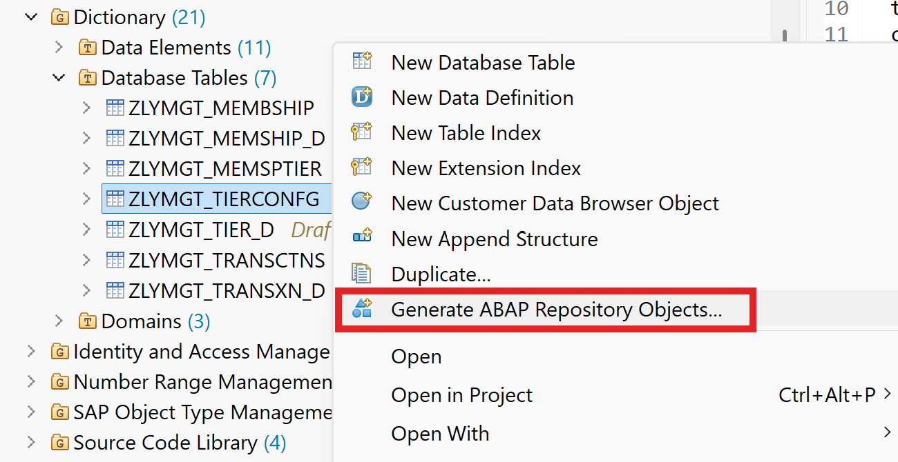

2. In the generator dialog, select **Business Configuration Maintenance Object** and click **Next >**.  

   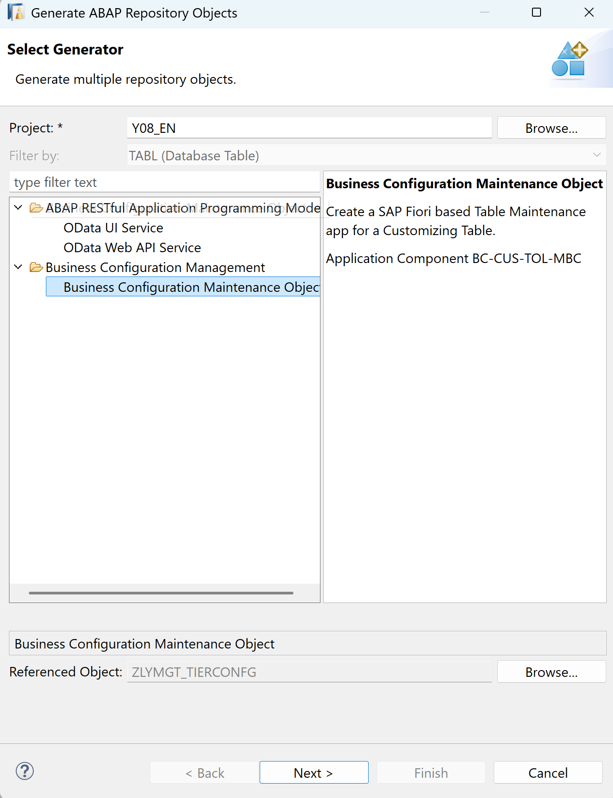

3. Enter the **target package** and click **Next >**.  

   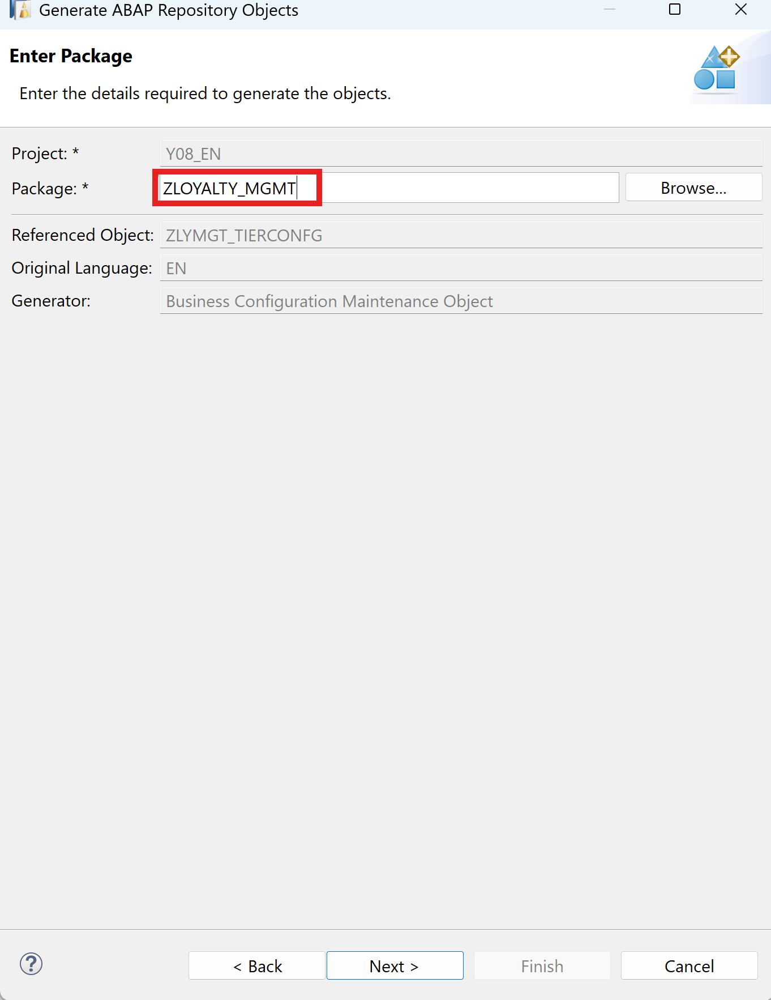

4. The system automatically generates **proposed names and values** for all input fields based on the table description, following SAP naming conventions.  

   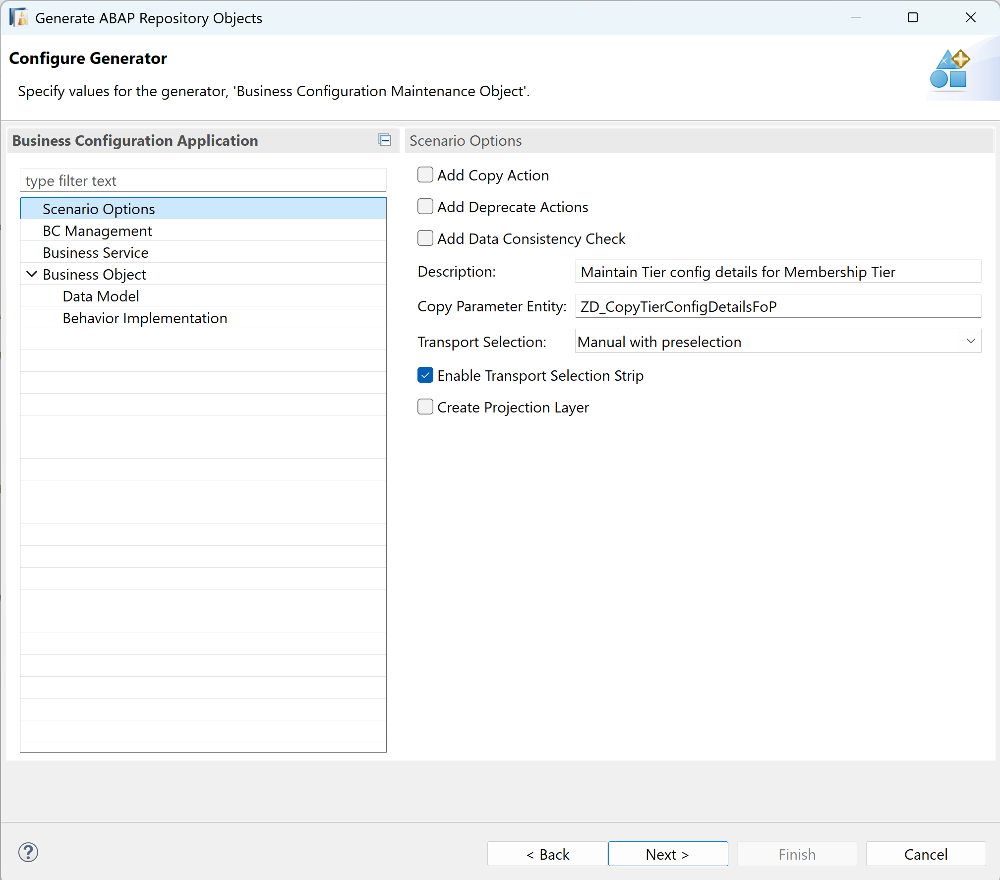

   - **Description:** ` Maintain Tier config details for Membership Tier`.
   - **Copy Parameter Entity:** `ZD_CopyTierConfigDetailsFoP`
   - **Transport Selection:** `Manual with preselection`
     
   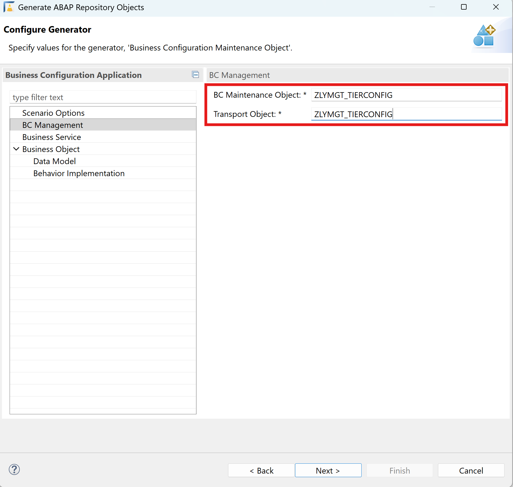
    
   - **BC Maintainance Object:** `ZLYMGT_TIERCONFIG`
   - **Transport Object:** `ZLYMGT_TIERCONFIG`

   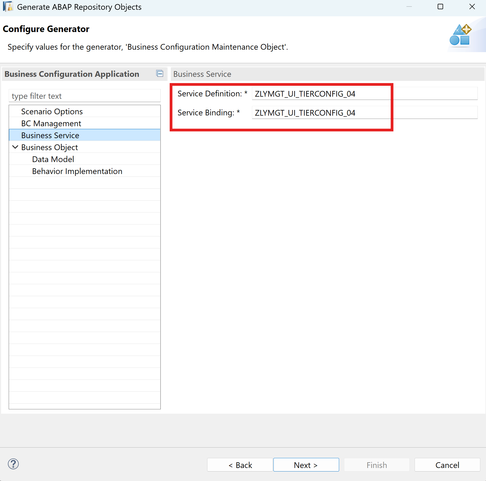
    
   - **Service Defintion:** `ZLYMGT_UI_TIERCONFIG_04`
   - **Service Binding:** `ZLYMGT_UI_TIERCONFIG_04`

   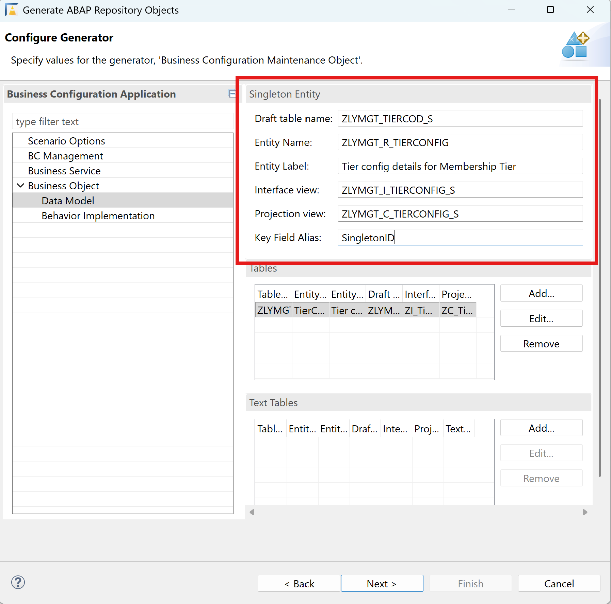     

| Field | Value |
|-------|-------|
| **Draft Table Name** | ZLYMGT_TIERCOD_S |
| **Entity Name** | ZLYMGT_R_TIERCONFIG |
| **Entity Label** | Tier config details for Membership Tier |
| **Interface View** | ZLYMGT_I_TIERCONFIG_S |
| **Projection View** | ZLYMGT_C_TIERCONFIG_S |
| **Key Field Alias** | SingletonID |


  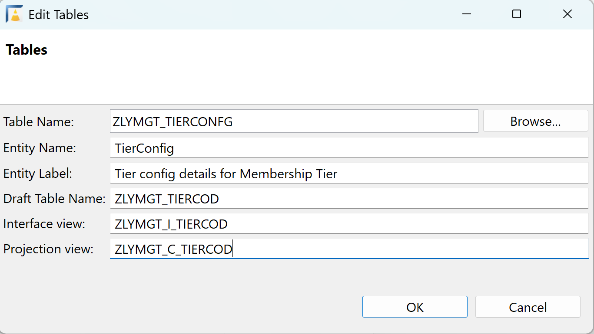 


5. Right click on **Edit** under the **Tables Sections**. Update the following fields.


| Table Name              | Draft Table Name        | Entity Name | Entity Label                                      | Interface View            | Projection View             |
|-------------------------|-------------------------|-------------|--------------------------------------------------|---------------------------|-----------------------------|
| ZLYMGT_TIERCONFG       | ZLYMGT_TIERCOD         | TierConfig  | Tier config details for Membership Tier          | ZLYMGT_I_TIERCOD      | ZLYMGT_C_TIERCOD        |


   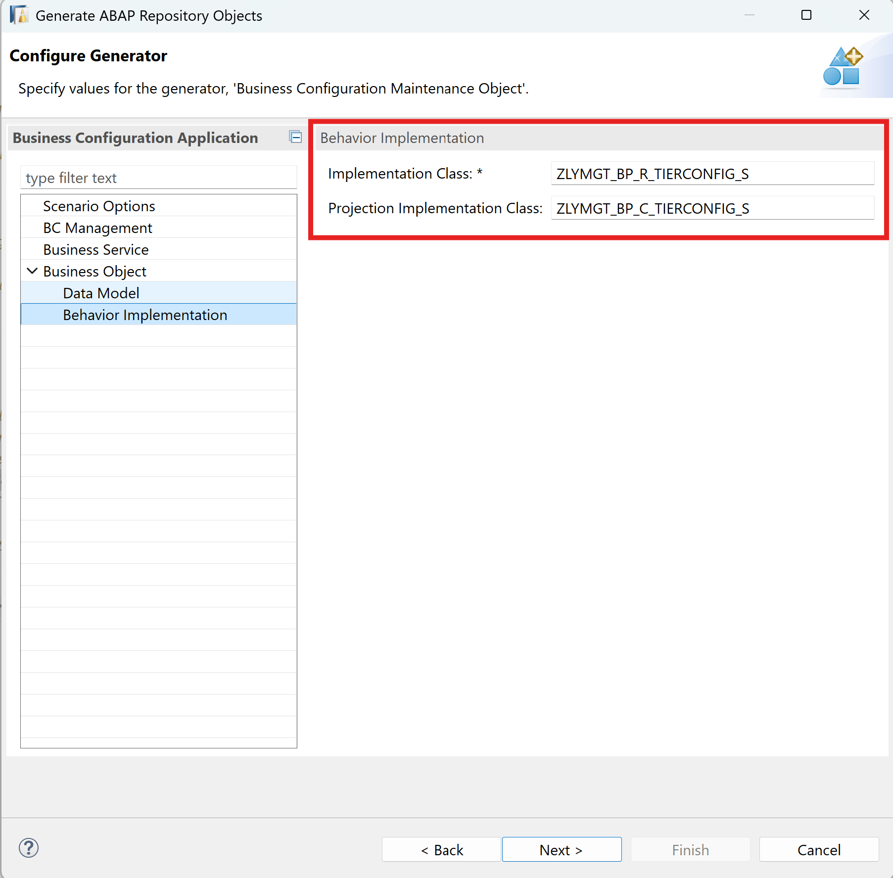   

   - **Implementation Class:** `ZLYMGT_BP_R_TIERCONFIG_S`
   - **Projection Implementation class:** `ZLYMGT_BP_C_TIERCONFIG_S`

   Click **Next >**.

6. A list of repository objects to be generated is displayed. Review the list, then click **Next >**.

   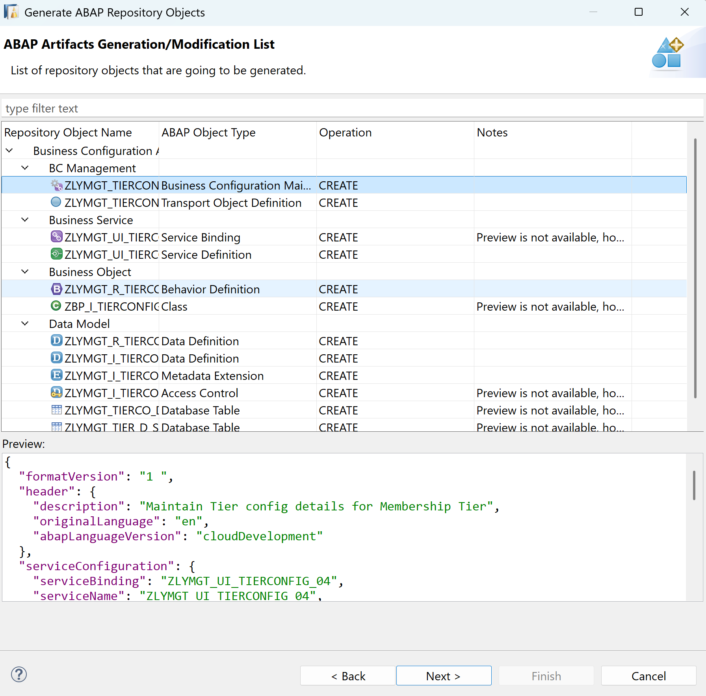   
 

7. **Select a transport request** and click **Finish**.  

    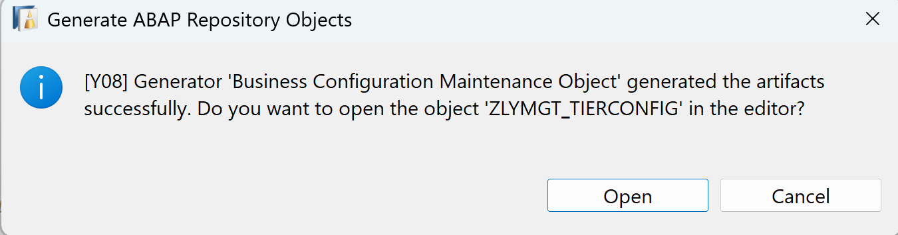   

   When the generation completes, the new **Business Configuration Maintenance Object** is displayed.
   Publish the service binding.

    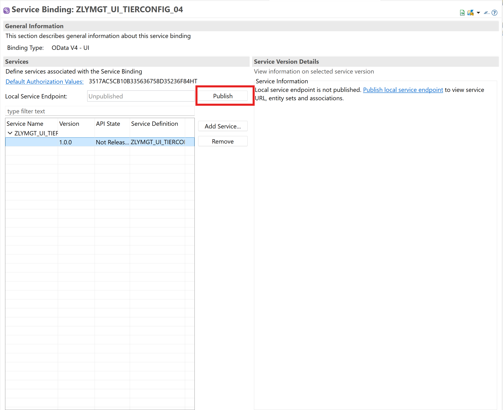  

   You can find detailed **documentation for the object attributes** in the SAP help portal.  

After generation, you can perform the following adjustments and configurations:

1. **Edit the class** `ZLYMGT_BP_R_TIERCONFIG_S`, section **Local Types**.  
   - Delete the content of the method:  
     ```
     LHC_ZLYMGT_R_TIERCONFIG_S → GET_GLOBAL_AUTHORIZATIONS
     ```  
   - Save and Activate the class.  

2. In all **generated CDS views** - `ZLYMGT_I_TIERCOD` , `ZLYMGT_I_TIERCONFIG_S` , ` set the annotation:  
   ```abap
   @AccessControl.authorizationCheck: #NOT_ALLOWED


### Use the Custom Business Configurations App  

The **Custom Business Configurations app** serves as the entry point to configuration objects provided by various SAP applications or partners.  
You can use this app to **adjust configuration objects** that control or influence system behavior.  

The required business catalog is included in the **SAP_BR_BPC_EXPERT (Configuration Expert – Business Process Configuration)** business role template.  
Ensure this role is assigned to the user responsible for maintaining the business configuration.  

### Step 1: Launch and Maintain Configuration  

1. **Launch the SAP Fiori Launchpad.**  
2. **Log on** with the user responsible for maintaining the business configuration.  
3. **Open the Custom Business Configurations app:**  
   - If you do not see the tile, use the **search** function and enter “Custom Business Configurations.”  
   - You can also locate it via the **App Finder**.  

   *Start Custom Business Configurations app.*

4. **Select your business configuration.**  

   *Select business configuration.*

5. **Click Edit.**  
   - When the Edit action is performed, a **customizing transport request** is automatically determined.  
   - You can view this transport request in the **header area**.  
   - For technical reference, see method `get_transport_request` of interface `if_mbc_cp_rap_tdat_cts`.  

   *Click Edit.*

6. **Enter the following values:**  

| Tier Id | Tier Description | Conversion Factor | Tier Status |
|---------|-----------------|-----------------|------------|
| 1       | Bronze          | 0.10            | A          |
| 2       | Silver          | 0.20            | A          |
| 3       | Gold            | 0.30            | A          |


7. **Click Save.**  
   - If the system automatically determines a customizing request (or if you are using an SAP BTP trial account with the prior adjustments), the save process completes successfully.  
   - You can now set this step to **Done** and proceed to the next step.  
   - If not, you will be **prompted to select a transport request**.  

8. **Click the input help button** to open the list of available transport requests.  
   - If a task of a modifiable transport request is already assigned to your user, select it and click **Select Transport Request**.  
   - If no transport request exists, proceed to **create a new one** (see next section).  

---

### Step 2: Create a Transport Request (If Needed)  

1. Return to the **SAP Fiori Launchpad home page**.  
2. Open the **Export Customizing Transports app.**  

   *Start Export Customizing Transports app.*

3. Click **Create**.  

   *Create new transport request.*

4. Enter the following details:  
   | Field | Value |
   |--------|--------|
   | Description | `Tier Config` |
   | Technical Type | `Customizing Request` |  

   Click **Create**.  

5. Return to the **Custom Business Configurations app**.  
6. Click **Save** again.  
7. Use the **input help** to select the newly created transport request, then click **Select Transport Request**.  
   - If the transport request doesn’t appear, try **reloading the app**.  

   *Select transport request in Custom Business Configurations app.*

8. Once the transport request is selected, the **data is recorded** in the transport request.  

> **Note:**  
> Business configuration content can be recorded in both **business configuration** and **development software components**.  
> For the transport request, the attribute `SAP_CUS_TRANSPORT_CATEGORY` must be set to either:  
> - `DEFAULT_CUST`  
> - `MANUAL_CUST`

</details>

---


### 📘 3.2.4 Create CDS View: Tier Value Help

<details>
  
  <summary>🔽 Click to expand! </summary>

1. Right-click the package `ZLOYALTY_MGMT` and choose **New > Other ABAP Repository Object**.

2. Search for **Data Definition**, select it, and choose **Next**.

3. Enter the following data:
   - **Name**: `ZLYMGT_VH_TIERCONFIG`
   - **Description**:`Value help for Tier`
   - **Referenced Object**: `ZLYMGT_I_TIERCOD`  

4. Choose **Next**.

5. Select a transport request and choose **Finish**.

6. Replace the generated code with the following ABAP code:

```abap
@AccessControl.authorizationCheck: #NOT_REQUIRED
@EndUserText.label: 'Value help for Tier'
@Metadata.ignorePropagatedAnnotations: true
define view entity ZLYMGT_VH_TIERCONFIG provider contract transactional_query
  as projection on ZLYMGT_I_TIERCOD
{
      
      key Tierid,
      Tierdescription,
      Tierstatus,
      Conversionfactor
     
}


```
</details>

---

### 📘 3.2.5 Create CDS View: Value Help for Tier Status Text

<details>
  
  <summary>🔽 Click to expand! </summary>

1. Right-click the package `ZLOYALTY_MGMT` and choose **New > Other ABAP Repository Object**.

2. Search for **Data Definition**, select it, and choose **Next**.

3. Enter the following data:
   - **Name**: `ZLYMGT_VH_TIERSTATUSTEXT`
   - **Description**:`Tier Status Text Value Help`
   - **Referenced Object**: `DDCDS_CUSTOMER_DOMAIN_VALUE_T`  

4. Choose **Next**.

5. Select a transport request and choose **Finish**.

6. Replace the generated code with the following ABAP code:

```abap
@AccessControl.authorizationCheck: #NOT_REQUIRED
@EndUserText.label: 'Tier Status Text Value Help'
@Metadata.ignorePropagatedAnnotations: true
define view entity ZLYMGT_VH_TIERSTATUSTEXT 
as select from DDCDS_CUSTOMER_DOMAIN_VALUE_T( p_domain_name : 'ZLYMGT_TIERSTATUS' )
  association [0..1] to I_Language as _Language on $projection.language = _Language.Language
{
      @UI.hidden: true
  key domain_name,
      @UI.hidden: true
  key value_position,
      @UI.hidden: true
  key language,
      @EndUserText.label: 'Tier Status'
      @ObjectModel.text.element: ['Text']
      value_low as Tierstatus,
      @EndUserText.label: 'Text'
      @Semantics.text: true
      text,
      _Language
}
where
  language = $session.system_language


```

7. Save and Activate.

</details>

---
### 📘 3.2.6 Create CDS Interface View: Value Help for Business User

<details>
  
  <summary>🔽 Click to expand! </summary>

1. Right-click the package `ZLOYALTY_MGMT` and choose **New > Other ABAP Repository Object**.

2. Search for **Data Definition**, select it, and choose **Next**.

3. Enter the following data:
   - **Name**: `ZLYMGT_I_BUSINESSUSERVH`
   - **Description**:`Business User - Value Help`
   - **Referenced Object**: `I_BusinessUserVH`  

4. Choose **Next**.

5. Select a transport request and choose **Finish**.

6. Replace the generated code with the following ABAP code:

```abap
@AbapCatalog.viewEnhancementCategory: [#NONE]
@AccessControl.authorizationCheck: #NOT_REQUIRED
@EndUserText.label: 'Business User - Value Help'
@Metadata.ignorePropagatedAnnotations: true
@ObjectModel.usageType:{
  serviceQuality: #X,
  sizeCategory: #S,
  dataClass: #MIXED
}
define view entity ZLYMGT_I_BusinessUserVH as select from I_BusinessUserVH
{
  key BusinessPartner,
      BPIdentificationNumber,
      UserID,
      FirstName,
      LastName,
      DefaultEmailAddress,
      PersonFullName,
      Building,
      RoomNumber,
      Department,
      IsBusinessPurposeCompleted,
      AuthorizationGroup
}

```

7. Save and Activate.

</details>

---


### 3.3 Establishing Data Model Through Compositions

### 3.3.1 Establish composition in ZLYMGT_R_MEMBERSHIP.

<details>
  
  <summary>🔽 Click to expand! </summary>


1. Choose **Open ABAP Development Object**.
2. Enter the CDS view name: `ZLYMGT_R_MEMBERSHIP`.
3. Select the CDS view and choose **OK**.
4. Replace the existing code with the following:

```abap
@AccessControl.authorizationCheck: #NOT_REQUIRED
@EndUserText.label: 'Loyalty Membership'
@ObjectModel.sapObjectNodeType.name: 'ZLYMGT_MEMBSHIP'
define root view entity ZLYMGT_R_MEMBERSHIP
  as select from zlymgt_membship
  composition [1..*] of ZLYMGT_R_TRANSACTION    as _MembershipTransactions
  composition [1..*] of ZLYMGT_R_MEMBERSHIPTIER as _MembershipTiers
{
  key membershipuuid     as Membershipuuid,
      membershipid       as Membershipid,
      customer           as Customer,
      customername       as Customername,
      sourcesystemid     as Sourcesystemid,
      @Semantics.user.createdBy: true
      createdby          as Createdby,
      @Semantics.systemDateTime.createdAt: true
      createdat          as Createdat,
      @Semantics.user.localInstanceLastChangedBy: true
      lastchangedby      as Lastchangedby,
      @Semantics.systemDateTime.localInstanceLastChangedAt: true
      locallastchangedat as Locallastchangedat,
      @Semantics.systemDateTime.lastChangedAt: true
      lastchangedat      as Lastchangedat,
      _MembershipTransactions,
      _MembershipTiers
}

```

5.Save the code, but **don’t activate** it yet.

</details>

---

### 3.3.2 Establish composition in ZLYMGT_R_MEMBERSHIPTIER.

<details>
  
  <summary>🔽 Click to expand! </summary>


1. Choose **Open ABAP Development Object**.
2. Enter the CDS view name: `ZLYMGT_R_MEMBERSHIPTIER`.
3. Select the CDS view and choose **OK**.
4. Replace the existing code with the following:

```abap


@AccessControl.authorizationCheck: #NOT_REQUIRED
@EndUserText.label: 'Membership Tier View'
define view entity ZLYMGT_R_MEMBERSHIPTIER as select from zlymgt_memsptier
association   to parent ZLYMGT_R_MEMBERSHP as _LoyaltyMembership on $projection.Membershipuuid = _LoyaltyMembership.Membershipuuid
 association [1..1] to    ZLYMGT_I_TIERCOD                   as _TierConfig                 on $projection.Tierid = _TierConfig.Tierid
//this association is used in cview for tier status text
 association [1..1] to ZLYMGT_VH_TIERSTATUSTEXT as _TierStatusText on $projection.Tierstatus = _TierStatusText.Tierstatus
{
  key tieruuid as Tieruuid,
  membershipuuid as Membershipuuid,
  tierid as Tierid,
  tierstatus as Tierstatus,
  conversionfactor as Conversionfactor,
  createdby as Createdby,
  createdat as Createdat,
  lastchangedby as Lastchangedby,
  locallastchangedat as Locallastchangedat,
  lastchangedat as Lastchangedat,
  _LoyaltyMembership,
  _TierConfig,
  _TierStatusText

}

```

5.Save the code, but **don’t activate** it yet.

</details>

---

### 3.3.3 Establish composition in ZLYMGT_I_TIERCOD.

<details>
  
  <summary>🔽 Click to expand! </summary>


1. Choose **Open ABAP Development Object**.
2. Enter the CDS view name: `ZLYMGT_I_TIERCOD`.
3. Select the CDS view and choose **OK**.
4. Replace the existing code with the following:

```abap
@EndUserText.label: 'Tier config details for Membership Tier'
@AccessControl.authorizationCheck: #NOT_ALLOWED
@Metadata.allowExtensions: true
define view entity ZLYMGT_I_TIERCOD
  as select from zlymgt_tierconfg
  association to parent ZLYMGT_I_TIERCONFIG_S as _ZLYMGT_R_TIERCONFIG on $projection.SingletonID = _ZLYMGT_R_TIERCONFIG.SingletonID
  association [1..1] to ZLYMGT_VH_TIERSTATUSTEXT     as _TierStatusText      on $projection.Tierstatus = _TierStatusText.Tierstatus
  
{
  key tierid as Tierid,
  tierdescription as Tierdescription,
  conversionfactor as Conversionfactor,
  tierstatus as Tierstatus,
  @Semantics.user.createdBy: true
  createdby as Createdby,
  @Semantics.systemDateTime.createdAt: true
  createdat as Createdat,
  @Semantics.user.localInstanceLastChangedBy: true
  @Consumption.hidden: true
  lastchangedby as Lastchangedby,
  @Semantics.systemDateTime.localInstanceLastChangedAt: true
  @Consumption.hidden: true
  locallastchangedat as Locallastchangedat,
  @Semantics.systemDateTime.lastChangedAt: true
  lastchangedat as Lastchangedat,
  @Consumption.hidden: true
  1 as SingletonID,
  _ZLYMGT_R_TIERCONFIG,
  _TierStatusText
}

```

5.Save the code, but **don’t activate** it yet.

</details>

---

### 3.3.4 Establish composition in ZLYMGT_R_TRANSACTION.

<details>
  
  <summary>🔽 Click to expand! </summary>


1. Choose **Open ABAP Development Object**.
2. Enter the CDS view name: `ZLYMGT_R_TRANSACTION`.
3. Select the CDS view and choose **OK**.
4. Replace the existing code with the following:

```abap
@AbapCatalog.viewEnhancementCategory: [#NONE]
@AccessControl.authorizationCheck: #NOT_REQUIRED
@EndUserText.label: 'Transaction View'
define view entity ZLYMGT_R_TRANSACTION as select from zlymgt_transctns
association to parent ZLYMGT_R_MEMBERSHIP as _LoyaltyMembership 
on $projection.Membershipuuid = _LoyaltyMembership.Membershipuuid
{
  key transactionuuid as Transactionuuid,
  membershipuuid as Membershipuuid,
  transactiondate as Transactiondate,
  transactionvalue as Transactionvalue,
  transactioncurrency as Transactioncurrency,
  loyaltypoints as Loyaltypoints,
  salesorderid as Salesorderid,
  createdby as Createdby,
  createdat as Createdat,
  lastchangedby as Lastchangedby,
  locallastchangedat as Locallastchangedat,
  lastchangedat as Lastchangedat,
  _LoyaltyMembership
}


```

5. Save the code and and choose **Activate all** to activate all the 7 CDS views before proceeding to the next steps.

</details>

### 3.3.5 Establish composition in ZLYMGT_I_MEMBERSHIP by creating CDS Interface View.

<details>
  
  <summary>🔽 Click to expand! </summary>

1. Right-click the package `ZLOYALTY_MGMT` and choose **New > Other ABAP Repository Object**.
2. Search for **Data Definition**, select it, and choose **Next**.
3. Enter the following data:
   - **Name**: `ZLYMGT_I_MEMBERSHIP`
   - **Description**:`Membership Interace View`
   - **Referenced Object**: `ZLYMGT_R_MEMBERSHIP`  
4. Choose **Next**.
5. Select a transport request and choose **Finish**.
6. Replace the generated code with the following ABAP code:

```abap
@AccessControl.authorizationCheck: #NOT_REQUIRED
@EndUserText.label: 'Membership Interface View'
define root view entity ZLYMGT_I_MEMBERSHIP
  provider contract transactional_interface
   as projection on ZLYMGT_R_MEMBERSHIP
{
  key Membershipuuid,
  Membershipid,
  Customer,
  Customername,
  Sourcesystemid,
  Createdby,
  Createdat,
  Lastchangedby,
  Locallastchangedat,
  Lastchangedat,
  _MembershipTransactions : redirected to composition child ZLYMGT_I_TRANSACTION,
  _MembershipTiers         : redirected to composition child ZLYMGT_I_MEMBERSHIPTIER
  
}

```

7. Save the code, but **don’t activate** it yet.

</details>

---

### 3.3.6 Establish composition in ZLYMGT_I_MEMBERSHIPTIER by creating CDS Interface View.

<details>
  
  <summary>🔽 Click to expand! </summary>

1. Right-click the package `ZLOYALTY_MGMT` and choose **New > Other ABAP Repository Object**.
2. Search for **Data Definition**, select it, and choose **Next**.
3. Enter the following data:
   - **Name**: `ZLYMGT_I_MEMBERSHIPTIER`
   - **Description**:`Membership Tier Interace View`
   - **Referenced Object**: `ZLYMGT_R_MEMBERSHIPTIER`  
4. Choose **Next**.
5. Select a transport request and choose **Finish**.
6. Replace the generated code with the following ABAP code:

```abap
@AccessControl.authorizationCheck: #NOT_REQUIRED
@EndUserText.label: 'MembershipTier Interface View'
define view entity ZLYMGT_I_MEMBERSHIPTIER 
as projection on ZLYMGT_R_MEMBERSHIPTIER
{
  key Tieruuid,
  Membershipuuid,
  Tierid,
  Tierstatus,
  Conversionfactor,
  Createdby,
  Createdat,
  Lastchangedby,
  Locallastchangedat,
  Lastchangedat,
  _LoyaltyMembership : redirected to parent ZLYMGT_I_MEMBERSHIP,
  _TierConfig,
  _TierStatusText
}


```

7. Save the code, but **don’t activate** it yet.

</details>

---
### 3.3.7 Establish composition in ZLYMGT_I_TRANSACTION by creating CDS Interface View.

<details>
  
  <summary>🔽 Click to expand! </summary>

1. Right-click the package `ZLOYALTY_MGMT` and choose **New > Other ABAP Repository Object**.
2. Search for **Data Definition**, select it, and choose **Next**.
3. Enter the following data:
   - **Name**: `ZLYMGT_I_TRANSACTION`
   - **Description**:`Transaction Interace View`
   - **Referenced Object**: `ZLYMGT_R_TRANSACTION`  

4. Choose **Next**.
5. Select a transport request and choose **Finish**.
6. Replace the generated code with the following ABAP code:

```abap
@AccessControl.authorizationCheck: #NOT_REQUIRED
@EndUserText.label: 'Transaction Interface view'
define view entity ZLYMGT_I_TRANSACTION 
as projection on ZLYMGT_R_TRANSACTION
{
  key Transactionuuid,
  Membershipuuid,
  Transactiondate,
  Transactionvalue,
  Transactioncurrency,
  Loyaltypoints,
  Salesorderid,
  Createdby,
  Createdat,
  Lastchangedby,
  Locallastchangedat,
  Lastchangedat,
  _LoyaltyMembership : redirected to parent ZLYMGT_I_MEMBERSHIP
}


```

7. Save the code and and choose **Activate all** to activate all the 7 CDS views.

</details>

---

### 3.4 Creating Metadata Extensions

### 3.4.1. Metadata Extension for the Projection View `ZLYMGT_C_MEMBERSHIP`

<details>
<summary>🔽 Click to Expand </summary>

1. Navigate to your meta data extension `ZLYMGT_C_MEMBERSHIP`,which was already generator by RAP BO Generator.
2. Enter the **Name** as:  `ZLYMGT_C_MEMBERSHIP`
3. Enter the **Description** as:  `Metadata for Loyalty Program Header`
4. Replace the generated code of the metadata extension with the following ABAP code:


```abap

@Metadata.layer: #CORE
@Search.searchable: true
@UI: {
  headerInfo: {
                typeName: 'Loyalty Management',
                typeNamePlural: 'Loyalty Management ',
                title: { type: #STANDARD, label: 'Loyalty Management', value: 'Membershipid' }},
  presentationVariant: [{ sortOrder: [{ by: 'Membershipid', direction:  #ASC }] }] }
annotate entity ZLYMGT_C_MEMBERSHIP with
{
  @UI.facet: [
    {
      id: 'LoyaltyMembership',
      purpose: #STANDARD,
      label: 'Membership Details',
      type: #IDENTIFICATION_REFERENCE,
      position: 10
    },
   {
      id: 'Transactions',
      label: 'Transactions',
      type: #LINEITEM_REFERENCE,
      position: 20,
      targetElement: '_MembershipTransactions'
   },
   {
      id: 'Tiers',
      label: 'Tiers',
      type: #LINEITEM_REFERENCE,
      position: 30,
      targetElement: '_MembershipTiers'
   }
   ]

  @UI.hidden: true
  Membershipuuid;
  
  @UI: {  identification  : [ { position: 10, label: 'Membership ID' } ,
     { type: #FOR_ACTION,  dataAction: 'UpgradeTier' , label: 'Request Tier Upgrade' , position: 60 , targetElement: 'Membershipuuid'}] ,
          lineItem        : [ { position: 10, label: 'Membership ID' }] 
       }

  Membershipid;

  @UI: {  identification  : [ { position: 20, label: 'Customer ID' } ],
        lineItem        : [ { position: 20, label: 'Customer ID' } ]
     }

  Customer;

  @UI: {  identification  : [ { position: 30, label: 'Customer Name' } ],
        lineItem        : [ { position: 30, label: 'Customer Name' } ],
        selectionField : [ { position: 30 } ]
     }
@Search.defaultSearchElement: true
  Customername;
  
  @UI: {  identification  : [ { position: 40, label: 'Source System' } ],
      lineItem        : [ { position: 40, label: 'Source System' } ],
      selectionField : [ { position: 40 } ]
   }
  Sourcesystemid;

  @UI.hidden: true
  Createdat;
  @UI.hidden: true
  Createdby;
  @UI.hidden: true
  Lastchangedat;
  @UI.hidden: true
  Locallastchangedat;
  @UI.hidden: true
  Lastchangedby;
}

```

7. Save and Activate.

</details>

---

### 3.4.2. Create a Metadata Extension for the Projection View `ZLYMGT_C_MEMBERSHIPTIER`

<details>
<summary>🔽 Click to Expand </summary>

1. **Right-click** your data definition `ZLYMGT_C_MEMBERSHIPTIER` and choose **New Metadata Extension**.
2. Enter the **Name** as:  `ZLYMGT_C_MEMBERSHIPTIER`
3. Enter the **Description** as:  `Metadata for Loyalty Program Header`
4. Choose **Next**.
5. Select a **transport request** and choose **Finish**.
6. Replace the generated code of the metadata extension with the following ABAP code:


```abap

@Metadata.layer: #CORE
@UI: {
  headerInfo: { typeName: 'Loyalty Membership Tier',
                typeNamePlural: 'Loyalty Membership Tiers',
                title: { type: #STANDARD, label: 'Loyalty Membership Tiers', value: 'TierId' } },
  presentationVariant: [{ sortOrder: [{ by: 'Tierstatus', direction:  #ASC }] }] }
annotate entity ZLYMGT_C_MEMBERSHIPTIER with
{
  @UI.facet: [
      {
       id: 'Tiers',
       purpose: #STANDARD,
       label: 'Tiers',
       type: #FIELDGROUP_REFERENCE,
       targetQualifier: 'LoyaltyMembershipTiers'
      }]
  @UI.hidden: true
  Membershipuuid;

  @UI.hidden: true
  Tieruuid;

  @UI: {
         identification   : [ { position: 10, importance: #MEDIUM, label: 'Tier ID'  } ],
         lineItem         : [ { position: 10, importance: #MEDIUM, label: 'Tier ID'  } ],
         fieldGroup: [{ position: 10, label: 'Tier ID', qualifier: 'LoyaltyMembershipTiers' } ]

       }
  @Consumption.valueHelpDefinition: [{ entity: { name: 'ZLYMGT_VH_TIERCONFIG', element: 'Tierid' },
                                       additionalBinding: [{ localElement: 'Tierstatus', element: 'Tierstatus', usage: #RESULT },{ localElement: 'Conversionfactor', element: 'Conversionfactor', usage: #RESULT }],
                                       label: 'Loyalty Membership Tier' }]
  Tierid;

  @UI: {
         identification   : [ { position: 30, importance: #MEDIUM, label: 'Tier Status'  } ],
         lineItem         : [ { position: 30, importance: #MEDIUM, label: 'Tier Status'  } ],
         fieldGroup: [{ position: 20, label: 'Tierstatus', qualifier: 'LoyaltyMembershipTiers' }]
       }
  @Consumption.valueHelpDefinition: [{
       entity: { name: 'ZLYMGT_VH_TIERSTATUSTEXT', element: 'Tierstatus' },
      label: 'Tier Status'
                               }]
  Tierstatus;

  @UI: {
        identification   : [ { position: 40, importance: #MEDIUM, label: 'Conversion Factor'  } ],
        lineItem         : [ { position: 40, importance: #MEDIUM, label: 'Conversion Factor'  } ],
        fieldGroup: [{ position: 30, label: 'Conversion Factor', qualifier: 'LoyaltyMembershipTiers' }]
      }
  Conversionfactor;
  
  @UI.hidden: true
  Createdat;
  @UI.hidden: true
  Createdby;
  @UI.hidden: true
  Lastchangedat;
  @UI.hidden: true
  Locallastchangedat;
  @UI.hidden: true
  Lastchangedby;


}

```

7. Save and Activate.

</details>

---


### 3.4.3. Create a Metadata Extension for the Projection View `ZLYMGT_C_TRANSACTION`

<details>
<summary>🔽 Click to Expand </summary>

1. **Right-click** your data definition `ZLYMGT_C_TRANSACTION` and choose **New Metadata Extension**.
2. Enter the **Name** as:  `ZLYMGT_C_TRANSACTION`
3. Enter the **Description** as:  `Metadata for Loyalty Program Header`
4. Choose **Next**.
5. Select a **transport request** and choose **Finish**.
6. Replace the generated code of the metadata extension with the following ABAP code:

```abap

@Metadata.layer: #CORE
@UI: {
  headerInfo: { typeName: 'Loyalty Membership Transaction',
                typeNamePlural: 'Loyalty Membership Transactions',
                title: { type: #STANDARD, label: 'Loyalty Membership Transactions', value: 'Transactiondate' } } }
annotate entity ZLYMGT_C_TRANSACTION
  with 
{
@UI.facet: [
    {
     id: 'Transactions',
     purpose: #STANDARD,
     label: 'Transactions',
     type: #IDENTIFICATION_REFERENCE
    }
  ]
  @UI.hidden: true
 Membershipuuid;
  @UI.hidden: true
 Transactionuuid;
  @UI: {
         identification   : [ { position: 10, label: 'Date'  } ],
         lineItem         : [ { position: 10, label: 'Date'  } ]
       }
  @EndUserText.label: 'Transaction Date'
  Transactiondate;


  @UI: {
         identification   : [ { position: 20, label: 'Transaction value'  } ],
         dataPoint: {  qualifier: 'Transaction value'   },
         lineItem         : [ { position: 20, label: 'Transaction value'  } ]
       }
  @EndUserText.label: 'Transaction value'
  Transactionvalue;


  @UI: {  identification  : [ { position: 30, label: 'Loyalty Points' } ],
  lineItem        : [ { position: 30, label: 'Loyalty Points' } ],
  selectionField : [ { position: 30 } ] }
Loyaltypoints;


  @UI: {  identification  : [ { position: 40, label: 'Sales Order ID' } ],
    lineItem        : [ { position: 40, label: 'Sales Order ID' } ],
    selectionField : [ { position: 40 } ]
  }
Salesorderid;
@UI.hidden: true
  Createdat;
  @UI.hidden: true
  Createdby;
  @UI.hidden: true
  Lastchangedat;
  @UI.hidden: true
  Locallastchangedat;
  @UI.hidden: true
  Lastchangedby;
}

```

7. Save and Activate.

</details>

---

### 3.5 Inserting Business Logic into Behaviour Implementation class

### 3.5.1 Create an Interface to standardize values

<details>
      <summary>🔽 Click to expand! </summary>

1. Navigate to **new ABAP Development Object**.                                                                    
2. Define an interface named **`zlymgt_if_constants`** that is `PUBLIC`.  
3. Include a set of constants to standardize values across applications, for **number ranges and other operations**.  


### Number Range Constants
- **`nr_obj_value`** → `'ZLYMGT_MID'` (Type: `cl_numberrange_runtime=>nr_object`)  
  Defines a *Number Range Object*. We will create these shortly  
- **`nr_range_nr`** → `'01'` (Type: `cl_numberrange_runtime=>nr_interval`)  
  Defines a *Number Range Interval*. We will create these shortly 

4. Replace the existing code with the following code:

```abap

INTERFACE zlymgt_if_constants
  PUBLIC .
  CONSTANTS:
    workflow_status_active   TYPE zlymgt_tierstatus VALUE 'A',
    workflow_status_inactive TYPE zlymgt_tierstatus VALUE 'I',
    workflow_status_pending  TYPE zlymgt_tierstatus VALUE 'W',
    workflow_status_rejected TYPE zlymgt_tierstatus VALUE 'R',
    nr_obj_value             TYPE cl_numberrange_runtime=>nr_object VALUE 'ZLYMGT_MID',
    nr_range_nr              TYPE cl_numberrange_runtime=>nr_interval VALUE '01',
    draft                    TYPE abp_behv_flag VALUE '00',
    cid                      TYPE abp_behv_cid VALUE '01',
* Below constants will be used for Workflow
    lylpts_wf_usertask       TYPE if_swf_cpwf_api=>cpwf_def_id_long  VALUE 'eu12.fusion-development-customer-demos.loyaltytierapproval.approve_Tier',
    lylpts_retention_days    TYPE if_swf_cpwf_api=>retention_time VALUE '30',
    callback_class           TYPE if_swf_cpwf_api=>callback_classname VALUE 'zlymgt_cl_membshiptierapproval',
    consumer                 TYPE string VALUE 'DEFAULT'.

ENDINTERFACE.

```
---

✅ These constants ensure **consistency** in handling **number ranges** across implementations of this interface.  


</details>


### 3.5.2 Creating a Number Range Object for Membership ID

<details>
      <summary>🔽 Click to expand! </summary>


1. Right-click the package `ZLOYALTY_MGMT` and choose **`New > Other ABAP Repository Object`**
2. Search and select `Number Range Object`, and choose **Next**.
3. Enter the following data:
   * **Name**: `ZLYMGT_MID`
   * **Description**:`Number Range Object for Membership ID`
4. Choose **Next**.
5. Select a transport request and choose **Finish**.
6. In the **Interval** section, enter:
   * **Number Length Domain**: `ZLYMGT_MEMBERSHIPID`
   * **Percent Warning**: `10`
   * **Check**: `Rolling`
7. In the **Configuration** section:
   * **Buffering**: `Main Memory Buffering`
   * **Buffered Numbers**: `1`
8. Save and Activate.
9. In Fiori Launchpad, go to number range interval and select the number range object **ZLYMGT_MID**
10. In number ranges column, click on **Create** to define the number range, lower limit, upperlimit. 
11. Once defined, click on **Create**.

   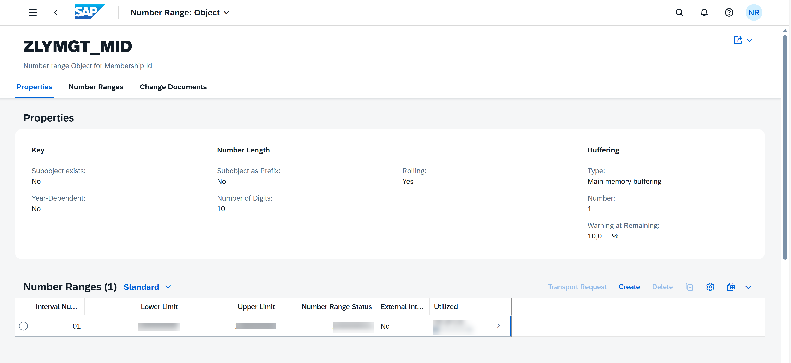

   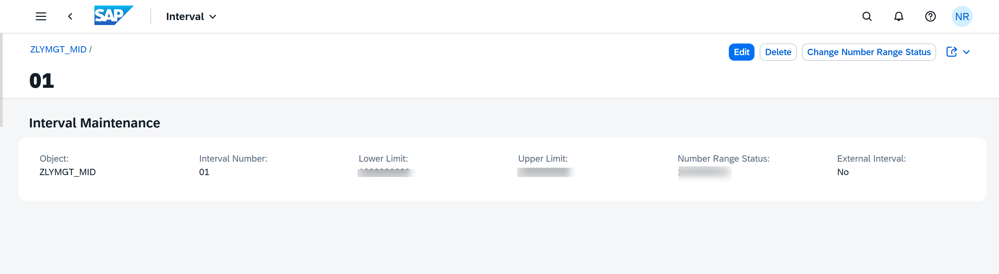

</details>


### 3.5.3 Inserting Business Logic into Behavior Implementation Classes

<details>
      <summary>🔽 Click to expand! </summary>

1. Open ABAP Development Environment.
2. Navigate to the behavior definition `ZLYMGT_R_MEMBERSHIP`. Add the following content:            
     **` determination SetMembershipId on save { create; }`**
   Your code should look like this.

```abap

managed implementation in class ZCL_LYMGT_R_MEMBERSHIP unique;
strict ( 2 );
with draft;
extensible;
define behavior for ZLYMGT_R_MEMBERSHP alias ZlymgtRMembership
persistent table ZLYMGT_MEMBSHIP
extensible
draft table ZLYMGT_MEMBSHP_D
etag master Locallastchangedat
lock master total etag Lastchangedat
authorization master( global )
{
  field ( readonly )
   Membershipuuid,
   Createdby,
   Createdat,
   Lastchangedby,
   Locallastchangedat,
   Lastchangedat;

  field ( numbering : managed )
   Membershipuuid;


  create;
  update;
  delete;
 //Assign Membershipid from number range for new memberships on save
  determination SetMembershipId on save { create; }


  draft action Activate optimized;
  draft action Discard;
  draft action Edit;
  draft action Resume;
  draft determine action Prepare;

  mapping for ZLYMGT_MEMBSHIP corresponding extensible
  {
    Membershipuuid = membershipuuid;
    Membershipid = membershipid;
    Customer = customer;
    Customername = customername;
    Sourcesystemid = sourcesystemid;
    Createdby = createdby;
    Createdat = createdat;
    Lastchangedby = lastchangedby;
    Locallastchangedat = locallastchangedat;
    Lastchangedat = lastchangedat;
  }
  association _MembershipTiers{create;}
  association _MembershipTransactions{create;}

}

define behavior for ZLYMGT_R_MEMBERSHIPTIER alias ZlymgtRMembershipTier
persistent table ZLYMGT_MEMSPTIER
extensible
draft table ZLYMGT_MEMTIER_D
etag master Locallastchangedat
lock dependent
authorization master( global )
{
  field ( readonly ) Tieruuid, Membershipuuid;
  update;
  delete;
  association _LoyaltyMembership{}

}
define behavior for ZLYMGT_R_TRANSACTION alias ZlymgtRTransaction
persistent table ZLYMGT_TRANSCTNS
extensible
draft table ZLYMGT_TRANSCT_D
etag master Locallastchangedat
lock dependent
authorization master( global )
{
  field ( readonly ) Transactionuuid, Membershipuuid;
  update;
  delete;
  association _LoyaltyMembership{}

}

```
    
4. In the above code using **Quick Fixes**, create the draft table for transaction `ZLYMGT_TRANSCT_D` and membership tier `ZLYMGT_MEMTIER_D`.
5. Enter class name: `ZLYMGT_BP_R_MEMBERSHIP`
6. Go to the **Local Types** tab. Add the method for SetMembershipId.
7. Replace the generated code with the following sample ABAP logic:

```abap
*"* use this source file for the definition and implementation of
*"* local helper classes, interface definitions and type
*"* declarations
CLASS LHC_ZLYMGT_R_MEMBERSHIP DEFINITION INHERITING FROM CL_ABAP_BEHAVIOR_HANDLER.
  PRIVATE SECTION.
    METHODS:
      GET_GLOBAL_AUTHORIZATIONS FOR GLOBAL AUTHORIZATION
        IMPORTING
           REQUEST requested_authorizations FOR ZlymgtRMembership
        RESULT result,
      SetMembershipId FOR DETERMINE ON SAVE
            IMPORTING keys FOR ZlymgtRMembership~SetMembershipId.
ENDCLASS.

CLASS LHC_ZLYMGT_R_MEMBERSHIP IMPLEMENTATION.
  METHOD GET_GLOBAL_AUTHORIZATIONS.
  ENDMETHOD.
  METHOD SetMembershipId.
  
   DATA membershipid_max TYPE zlymgt_membershipid.
    "---CHECK IF A MEMBERSHIP ID IS ALREADY ASSIGNED---
    " Read memberships
    READ ENTITIES OF zlymgt_r_membershp IN LOCAL MODE
         ENTITY ZlymgtRMembership
         FIELDS ( Membershipuuid  Membershipid )
         WITH CORRESPONDING #( keys )
         RESULT DATA(memberships).

    "Remove memberships that already have an ID (idempotence)
    DELETE memberships WHERE Membershipid IS NOT INITIAL.
    "Exit if no memberships need ID assignment
    IF memberships IS INITIAL.
      RETURN.
    ENDIF.
    "---END OF CHECK FOR EXISTING MEMBERSHIP ID---
    " Request sequential numbers from Number Range Object
    TRY.
        cl_numberrange_runtime=>number_get( EXPORTING nr_range_nr       = zlymgt_if_constants=>nr_range_nr
                                                      object            = zlymgt_if_constants=>nr_obj_value
                                                      quantity          = CONV #( lines( memberships ) )
                                            IMPORTING number            = DATA(number_range_key) ).
      CATCH cx_number_ranges INTO DATA(nr_allocation_failed).
        INSERT VALUE #( %msg = new_message_with_text( severity = if_abap_behv_message=>severity-error
                                                        text     = nr_allocation_failed->get_text( ) ) )
               INTO TABLE reported-zlymgtrmembership.
        EXIT.
    ENDTRY.

    " Update memberships with sequential ID
    MODIFY ENTITIES OF zlymgt_r_membershp IN LOCAL MODE
           ENTITY ZlymgtRMembership
           UPDATE FIELDS ( Membershipid )
           WITH VALUE #(
                         ( %tky     = memberships[ 1 ]-%tky
                           Membershipid = number_range_key ) ).

  ENDMETHOD.

ENDCLASS.


```

7. Save and Activate.  

The SetMembershipId determination is responsible for automatically assigning a sequential Membership ID to new loyalty membership records during the save process.

- Read Memberships Needing an ID  
The method first reads all membership instances being saved and filters out those that already have a Membership ID. This ensures idempotency, meaning IDs are assigned only once.

- Request New Numbers from Number Range Object, It then calls the ABAP Number Range runtime to generate sequential numbers based on the configured number range object.
   
- Any errors during number allocation are caught and returned as messages.
  
- Assign the Generated Membership ID.
  
- Using EML, the method updates the membership record with the newly generated Membership ID.

</details>


---

### 3.5.4 Update the Behaviour projection defintion ZLYMGT_C_MEMBERSHIP

<details>
      <summary>🔽 Click to expand! </summary>

1. Open ABAP Development Environment.
2. Navigate to the behavior definition `ZLYMGT_C_MEMBERSHIP`.
   Replace the existing code with the following ABAP code:


```abap

projection;
strict ( 2 );

use draft;
use side effects;
define behavior for ZLYMGT_C_MEMBERSHIP alias LoyaltyMembership
use etag

{
  use create;
  use update;
  use delete;

  use action Edit;
  use action Activate;
  use action Discard;
  use action Resume;
  use action Prepare;

  use action UpgradeTier;

  use event UpdateUI;
  use association _MembershipTransactions { create; with draft; }
  use association _MembershipTiers { create; with draft; }
}

define behavior for ZLYMGT_C_TRANSACTION alias MembershipTransactions
{
  use update;
  use delete;

  field ( readonly ) Salesorderid;

  use association _LoyaltyMembership { with draft; }
}

define behavior for ZLYMGT_C_MEMBERSHIPTIER alias MembershipTiers
{
  use update;
  use delete;

  use association _LoyaltyMembership { with draft; }
}

```

3. Save and Activate.

</details>

### 3.5.5 Update the service definition

<details>
      <summary>🔽 Click to expand! </summary>

1. Open ABAP Development Environment.
2. Navigate to the service definition `ZLYMGT_UI_MEMBERSHIP_O4`.
   Replace the existing code with the following ABAP code:

```abap

@EndUserText: {
  label: 'Service Definition for lty MEMBERSHIP'
}
@ObjectModel: {
  leadingEntity: {
    name: 'ZLYMGT_C_MEMBERSHIP'
  }
}
define service ZLYMGT_UI_MEMBERSHIP_O4
  provider contracts odata_v4_ui {
  expose ZLYMGT_C_MEMBERSHIP;
  expose ZLYMGT_C_MEMBERSHIPTIER;
  expose ZLYMGT_C_TRANSACTION;
}


```

3. Save and Activate.

</details>

---


<!-----
➡️ [Integration with Event Mesh](../../../01-SAP-Cloud-ERP/02-INTEGRATION/01-EVENT-MESH)
----->


