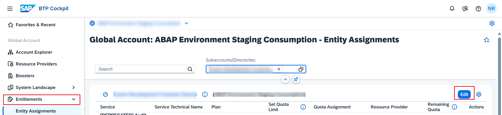
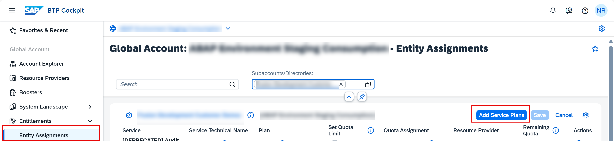
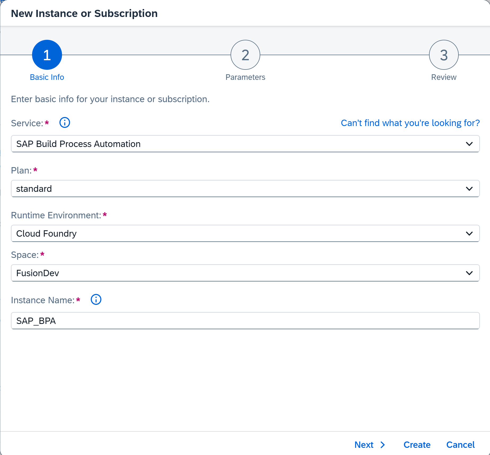
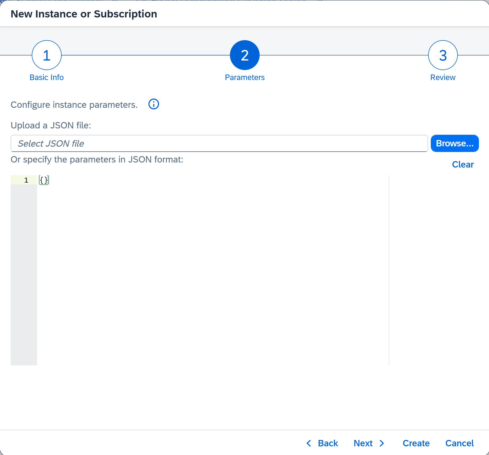
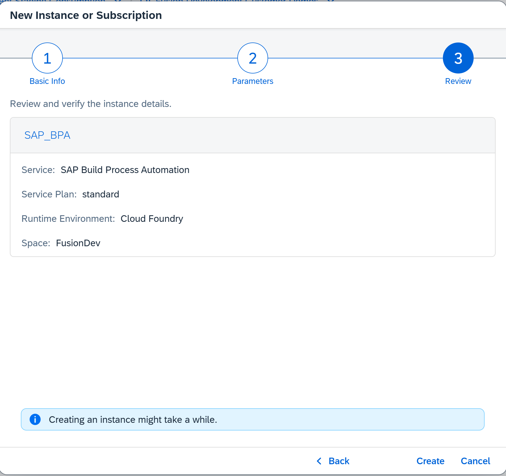
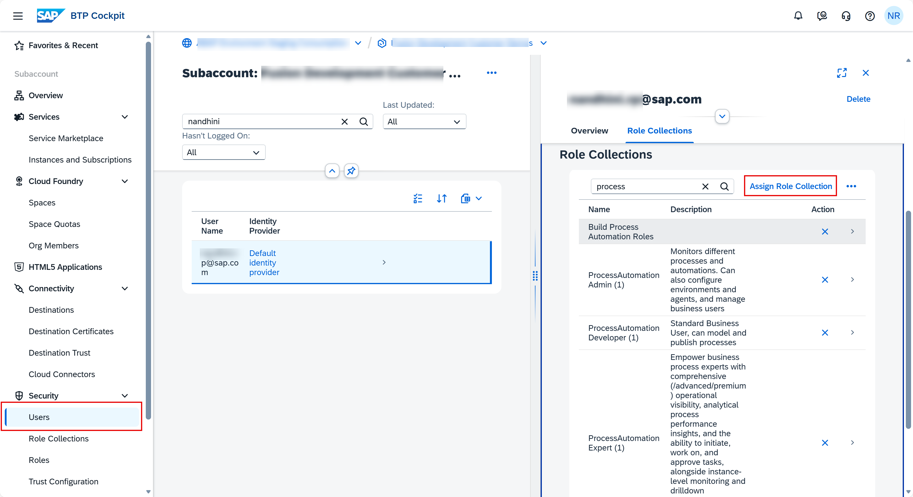
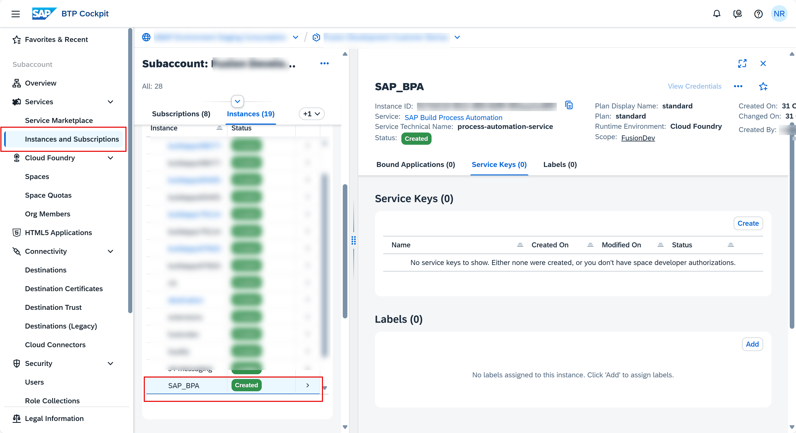
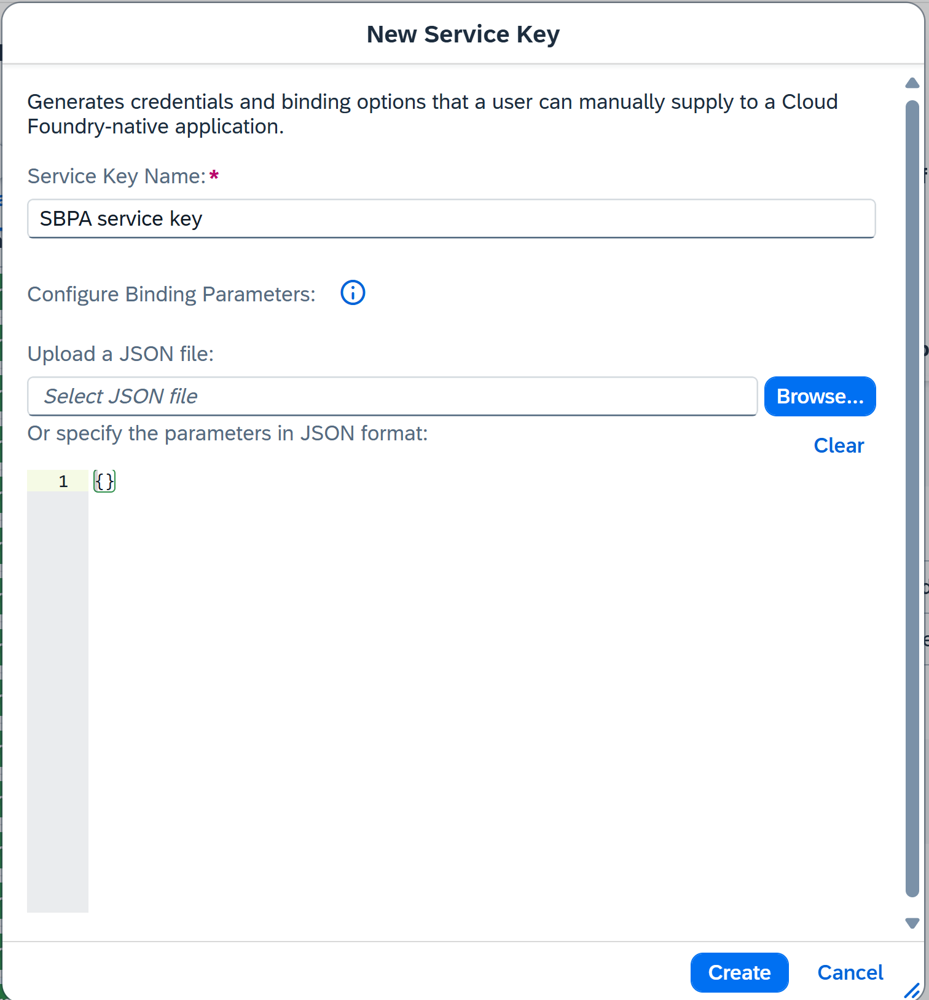
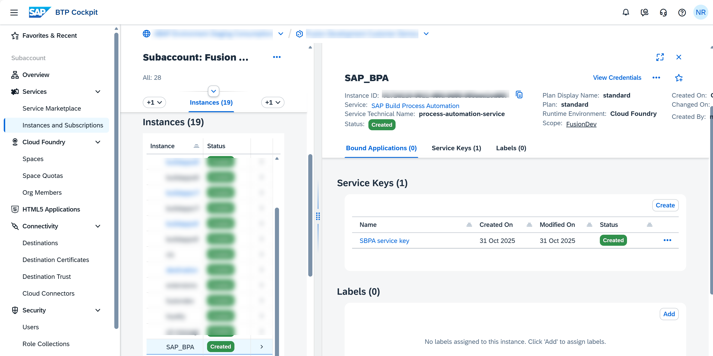
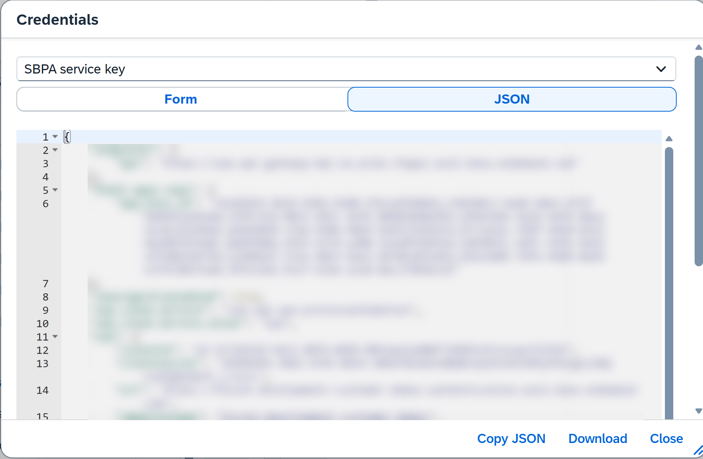

# 📡 Set Up SAP Build Process Automation 

Find your service entitlement and set up a service instance of SAP Build Process Automation in your subaccount via your SAP Business Technology Platform (SAP BTP) Cockpit.

---

## 📋 Prerequisites
✅ You have an **enterprise account** with SAP Business Technology Platform (SAP BTP).  
[*Getting Started with a Customer Account: Workflow in the Cloud Foundry Environment*](https://help.sap.com/viewer/65de2977205c403bbc107264b8eccf4b/Cloud/en-US/56440ab2380041e092c29baf2893ef97.html)

✅ You have a **global account** that has the entitlement to use Event Mesh.  
[*Getting a Global Account*](https://help.sap.com/viewer/65de2977205c403bbc107264b8eccf4b/Cloud/en-US/d61c2819034b48e68145c45c36acba6e.html#loiod61c2819034b48e68145c45c36acba6e)

✅ Your global account must have an entitlement to use **SAP Build Process Automation**.  
*(Available entitlements are listed in the service table on the Entitlements page. If your global account is missing this entitlement, contact your BTP cockpit administrator and request the entitlement.)*

> [!WARNING]
> This may incur additional cost

✅ You created a **subaccount**.  
[*Create a Subaccount in the Cloud Foundry Environment*](https://help.sap.com/viewer/65de2977205c403bbc107264b8eccf4b/Cloud/en-US/05280a123d3044ae97457a25b3013918.html)

✅ You’ve created a **space** within the subaccount in which Cloud Foundry is enabled.  
[*Managing Orgs and Spaces Using the Cockpit*](https://help.sap.com/viewer/65de2977205c403bbc107264b8eccf4b/Cloud/en-US/c4c25cc63ac845779f76202360f98694.html)

---

## 🚀 Procedure

1️⃣ Go to the global account and subaccounts section of your **SAP BTP Cockpit**.  
[*Navigate in the Cockpit*](https://help.sap.com/docs/BTP/65de2977205c403bbc107264b8eccf4b/0874895f1f78459f9517da55a11ffebd.html)

2️⃣ Choose **Entitlements** and choose **Edit**.

3️⃣ Click on **Add Service Plans**.

4️⃣ Search for **Service Details: SAP Build Process Automation**, choose the service plan.

5️⃣ Choose the **standard** plan.

6️⃣ Click **Add Service Plans** to add this entitlement for the SAP Build Process Automation service in your subaccount and save the changes.

---

## 🎯 Results

After setting up **SAP Build Process Automation** in the SAP BTP cockpit, you can create an **SAP Build Process Automation service instance**.

> [!WARNING]
> This may incur cost

# 🚀 Creating SAP Build Process Automation Instance in SAP BTP Cockpit

## 🔷 Open SAP BTP Cockpit

1️⃣ Open the **SAP Business Technology Platform cockpit**, Cloud Foundry environment.

2️⃣ Navigate to your **subaccount**.

3️⃣ Expand **Services → Instances and Subscriptions**.

4️⃣ Choose **Create**.

---

## 📄 Create SAP Build Process Automation Instance

1️⃣ Select **SAP Build Process Automation** in the service field.

2️⃣ Select **standard** in the plan field.

3️⃣ Select your space.

4️⃣ Enter an instance name: **SAP_BPA**.

5️⃣ Choose **Next**.
  

> 📝 *For this use case, we consider only the Cloud Foundry runtime environment.*

6️⃣ In the configure parameters, choose **Next**.

7️⃣ In the review dialog box review and verify the instance details and choose **Create**.

## Assign Role to users

1️⃣ Go to users tab, under security, and select your user.

2️⃣ In Role Collections section, choose **Assign Role Collection**.

3️⃣ In the Assign Role Collection window type 'process' in the search bar to find **Process Automation Roles**.

4️⃣ Select the 3 following roles:
   - **ProcessAutomationAdmin**
   - **ProcessAutomationDeveloper**
   - **ProcessAutomationParticipant**

5️⃣ Choose **Assign Role Collection**.

6️⃣ Navigate to **Instances and Subscriptions**.

---

### 📝 Steps to Create Service Key

 1️⃣ Click on the **Instances** menu. Click on **Create** under **Service Keys** section.

2️⃣ Provide a **name for the Service Key** - `SBPA service key` and click **Create**.
  

3️⃣ View the created Service Key details.  

---

### Get SAP Build Process Automation Service Key.

In the BTP Cockpit navigate to your development subaccount.

1️⃣ Click **Services and Instances**.

2️⃣ Click **Instances**.

3️⃣ Click the name of your SAP Build Process Automation instance.

4️⃣ From the navigation pane choose **Service keys**.

5️⃣ Select **Copy JSON** and copy the service key.

> This service key will be used while creating new commmunication arrangement.

---

<!-----
➡️ [Communication Arrangement for SAP Build Process Automation Workflow](/03-REUSE/02-INTEGRATION/01-SAP_BUILD_PROCESS_AUTOMATION/02_communication_arrangement/)
----->

