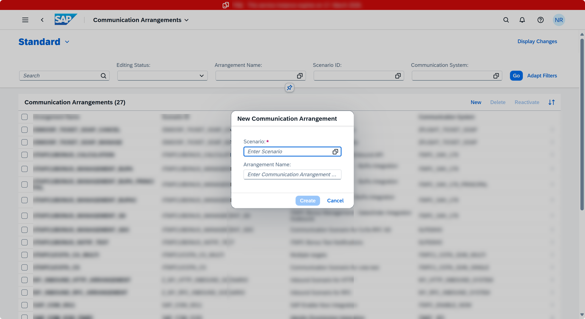
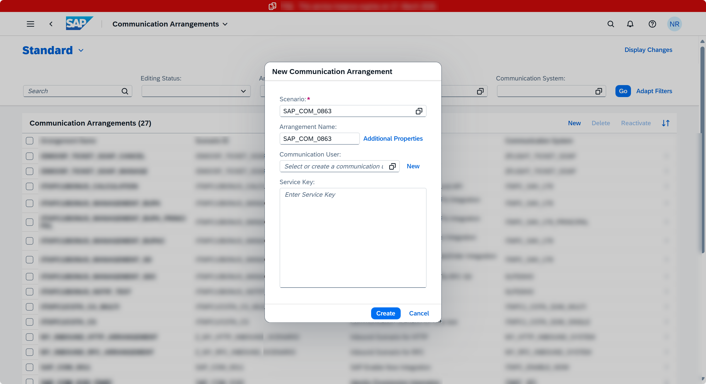
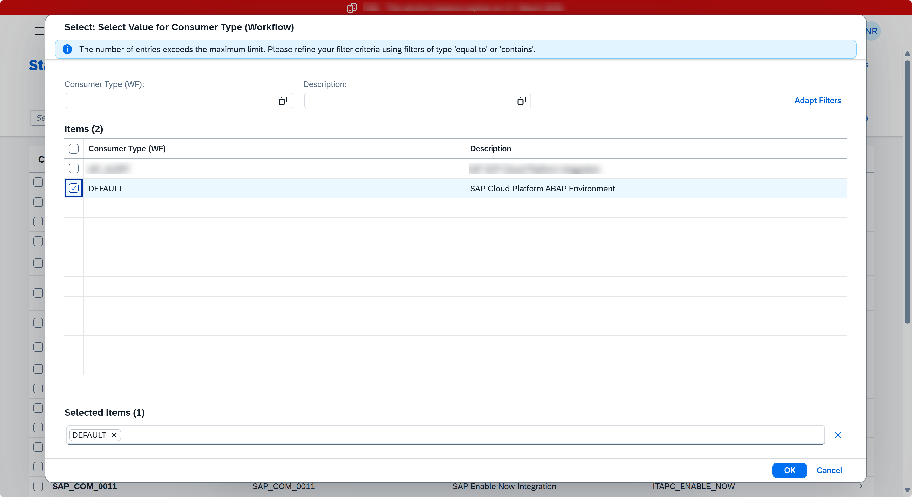
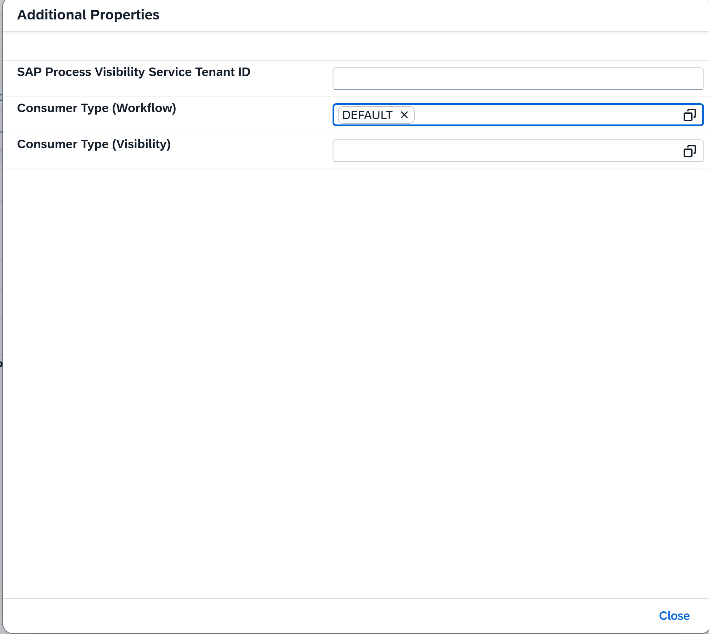
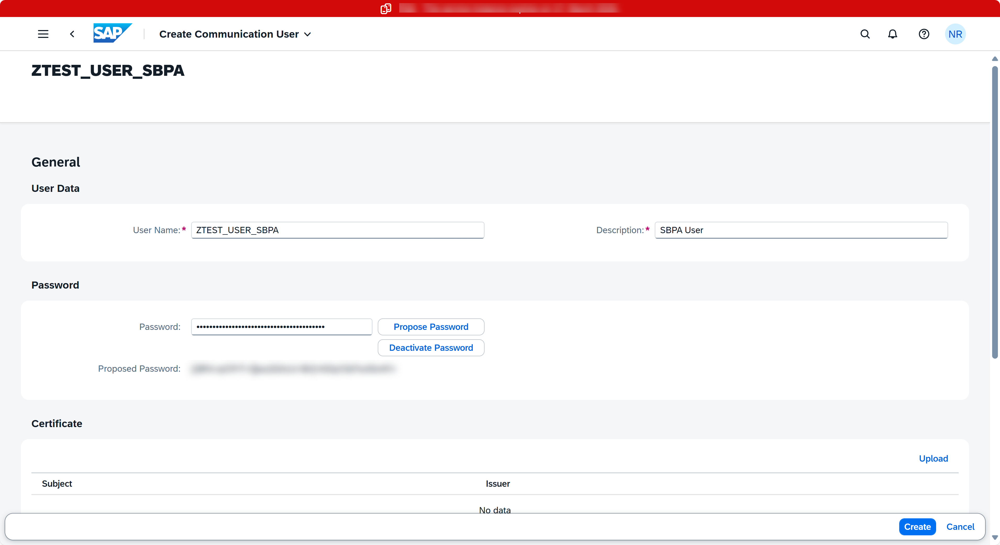
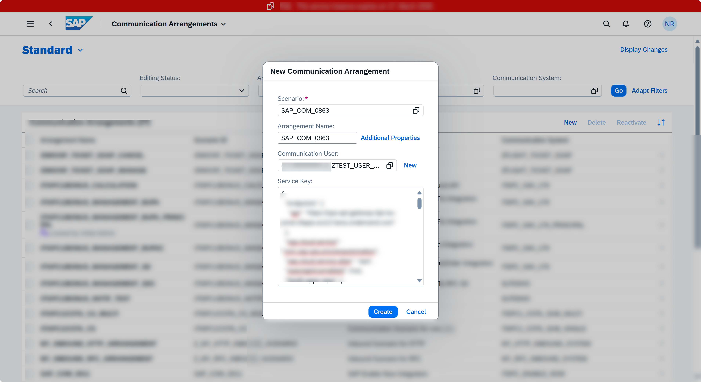
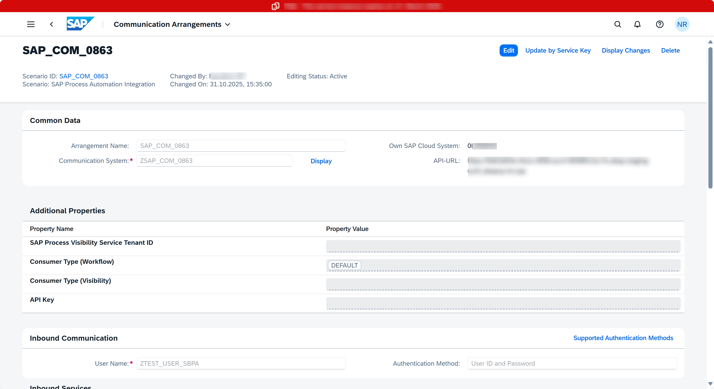

# 🌐 Creation of a Communication Arrangement for SAP Build Process Automation Workflows

To integrate SAP BTP ABAP environment with External Systems or Services like SAP Build Process Automation you create a Communication Arrangement.

A Communication Arrangement describes which communication partners communicate with each other in the scenario, and how they communicate. Communication Arrangement is formed by combining the below artifacts.

- **Communication Scenario**: Communication Scenario is a design time description of how two communication partners communicate with each other. It consists of technical information like inbound and/or outbound services example OData or SOAP as well as supported authentication methods. There are various standard communication scenarios provided by SAP which are ready to use, like in this we would be using **SAP_COM_0863**.

- **Communication System**: The communication system represents the communication partner within a communication e.g., SAP Build Process Automation in this case.

- **Communication User**: Communication users are used by Communication Systems to authenticate themselves to be able to connect to your system in BTP ABAP Environment.

## Create Communication Arrangement

 Create a communication arrangement in the **ABAP system** on SAP BTP ABAP Environment using **service key of SAP Build Process Automation Instance**.
 
> 📝 Communication Arrangement is not transported between systems but created locally by the system administrator.

1. Open the Communication Arrangement app in your SAP BTP ABAP Environment.

2. In the Fiori launchpad open **Communication Arrangement**.
   
3. Click on **New** to create communication arrangement called **SAP_COM_0863**.
    

> 🏷️ Communication Scenario SAP_COM_0863 is a ready-to-use communication scenario provided by SAP for integration with SAP Build Process Automation.

4. Set Additional Properties.

Once the scenario is selected, a pop-up window extends with pre-filled communication arrangement name and option to set additional properties, enter, or create a communication user and to enter a service key.

5. Click on **Additional Properties**, set given value, and click **Close**.
 - Consumer Type (Workflow) - DEFAULT

> 📝 The consumer type is used to identify the default communication arrangement i.e., if the SAP Build Process Automation Communication Arrangement has Consumer Type (Workflow) set to DEFAULT then the system will try to invoke all workflows in SBPA by default. Therefore, default assignment can be done only on one Communication arrangement for a Consumer Type.

6. Create a New Communication User.  
Select a Communication User (of which you know the password) or create a new one to use for inbound communication (from SAP Build Process Automation to your BTP ABAP environment).

7. Clicking on **New** navigates to the **Create Communication User** app. Enter the below info and click on **Create**.
 - **User Name**: ZTEST_USER_SBPA
 - **Description**: SBPA User
 - **Password**: Click on **Propose Password**. Save the password for later use.

> 📝 Save the proposed password and user name as that would be required during creation of callback destination.

8. In the field **Service Key** paste the SAP Build Process Automation instance service key that we retrieved as part of ‘Get SAP Build Process Automation Service Key’ and click **Create**.

 9. The Communication Arrangement will be saved.

> 📝Save the highlighted API-URL for later use while creating callback destination.

<!-----
➡️ [Callback destination from SAP Build Process Automation to SAP BTP ABAP environment](/03-REUSE/02-INTEGRATION/01-SAP_BUILD_PROCESS_AUTOMATION/03_callback_destinations/)
----->

