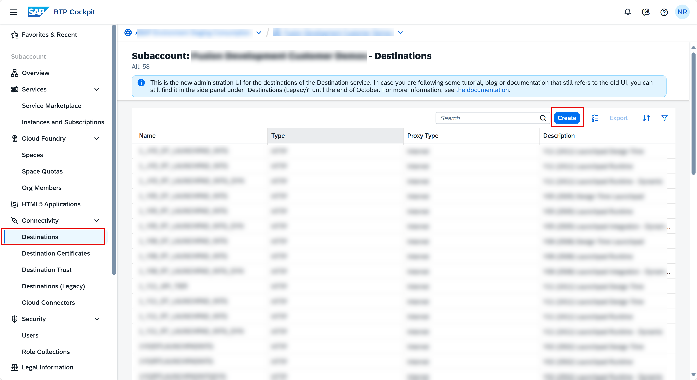
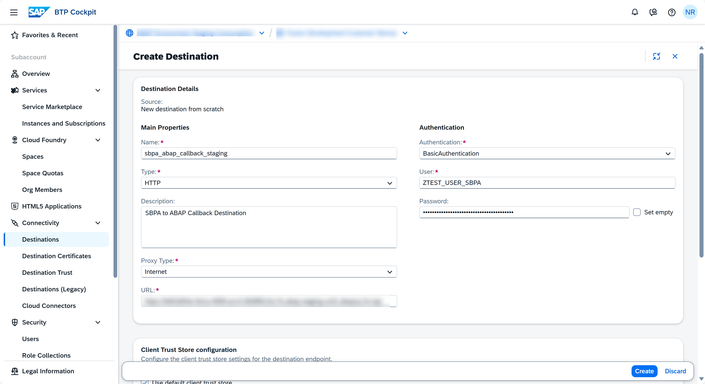
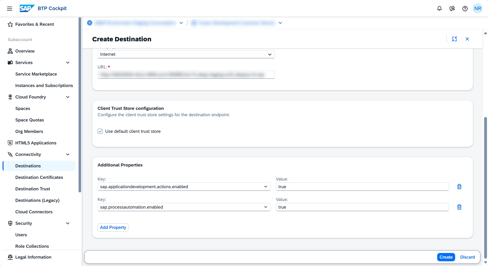
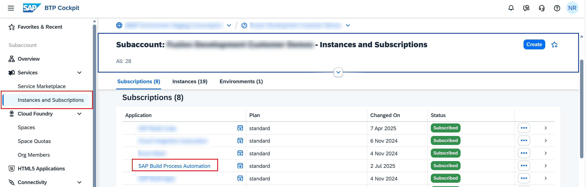
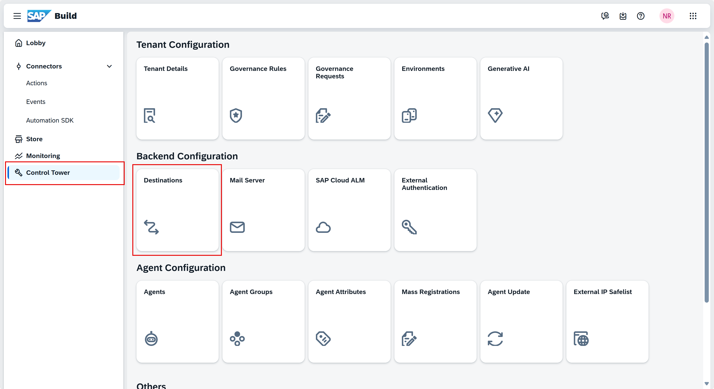
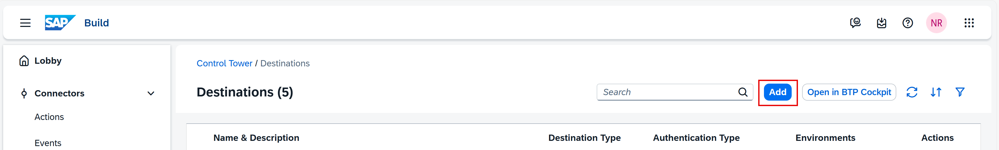
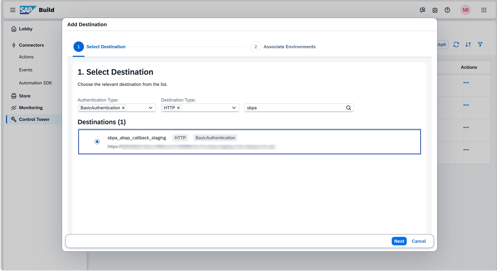
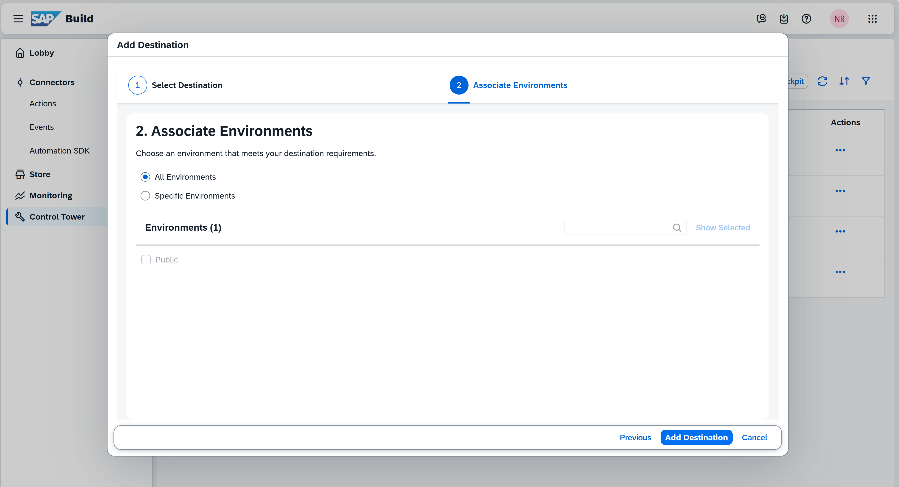

# 🎯 Creation of callback destination from SAP Build Process Automation to SAP BTP ABAP Environment

## Create Callback Destination

Create a destination in the SAP BTP subaccount, to enable the inbound communication to the BTP ABAP Environment. In addition, the destination must be enabled for use in SAP Build Process Automation.

The destination will be used for the callback to the SAP BTP ABAP Environment from SAP Build Process Automation. The callback is invoked on the completion of workflow process on SAP Build Process Automation.

1️⃣ In the SAP BTP Cockpit navigate to your development **subaccount**.

2️⃣ Navigate to **Connectivity > Destination > Create Destination**.

3️⃣ Choose **Blank Template** and enter the following data, then click on **Create**.

   - **Name**: sbpa_abap_callback_staging (Any Name)
   - **Type**: HTTP
   - **Description**: SBPA to ABAP Callback Destination
   - **URL**: Enter the API-URL saved during communication arrangement creation. If not saved access the communication arrangement and copy the API URL displayed under **Common Data > API-URL**. It is the API URL for       BTP ABAP Environment instance.
   - **Proxy Type**: Internet
   - **Authentication**: BasicAuthentication
   - **User**: Enter the Inbound Communication User created during Communication Arrangement creation.
   - **Password**: Enter the Password of the (inbound) communication user in the Communication Arrangement.
   - **Additional Properties**: Click on New Properties and add Additional Properties:
     - **sap.applicationdevelopment.actions.enabled → true**
     - **sap.processautomation.enabled → true**

> 📝 The addition of Additional Properties **sap.applicationdevelopment.actions.enabled** and **sap.processdevelopment.enabled** enables the destination for use in SAP Build Process Automation.

## Add a callback destination in SAP Build Process Automation.

1️⃣ Open SAP Build Process automation from your subaccount.

    - Subaccount > Instances and Subscriptions > Subscriptions > SAP Build Process Automation.

2️⃣ Click on **SAP Build Process Automation** to open the application.

3️⃣ Navigate to **Control Tower** > **Destinations**.

4️⃣ Choose **Destinations > Add**.

5️⃣ Select the destination that you have created in SAP BTP cockpit and click **Add Destination**.

<!-----

➡️ [Business Process Workflow in SAP Build Process Automation](/03-REUSE/02-INTEGRATION/01-SAP_BUILD_PROCESS_AUTOMATION/04_workflow_setup/)

----->

