# 🔄 Create a Business Process Workflow in SAP Build Process Automation.

## ✅ Prerequisites

Access to a SAP Business Technology Platform (SAP BTP) tenant with SAP Build Process Automation.

## Create a Business Project and Custom Process to Build and Extend Business Processes.

### 1. Create a Business Process Project.
<details>
    <summary> 🔵 Click to Expand</summary>
<br>

1️⃣ In the lobby choose **Create**.

> 💡 The lobby is a central page for creating, accessing, and managing your projects in SAP Build. You can access business application processes, company configured templates, and other resources for your end-to-end business process.

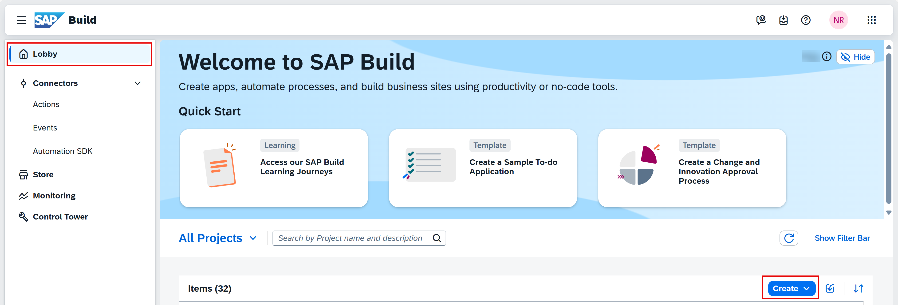


2️⃣	In the **Create Project** dialog box, choose the **Automated Process** then click **Next**.

   
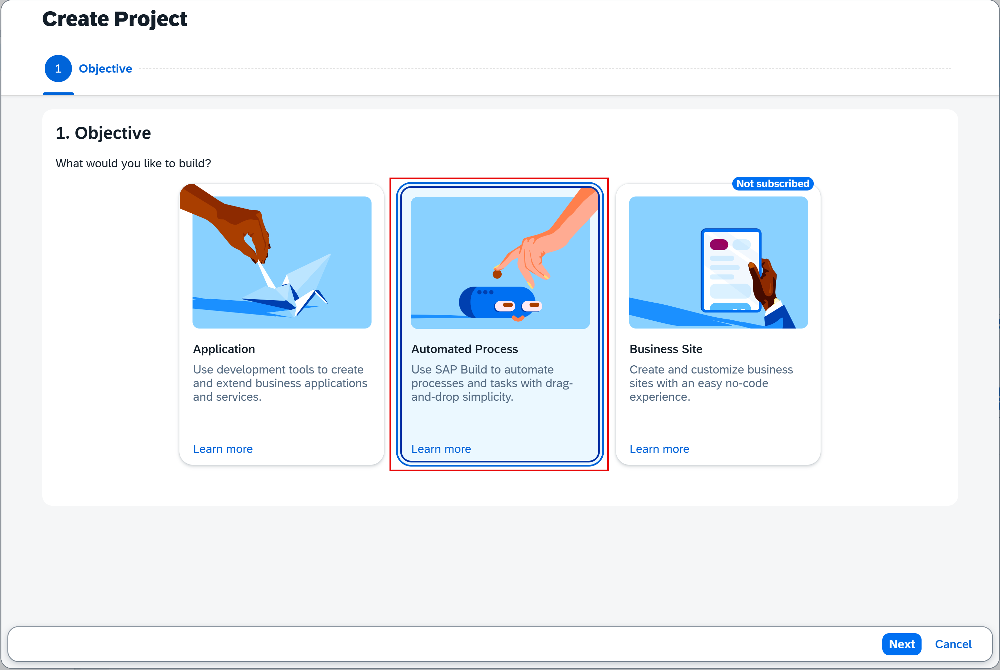


3️⃣	Select the **Process** and choose **Next**.
   
> 💡 Business Process Projects are a collection of skills in SAP Build Process Automation. Projects are part of the internal business processes of a company and are defined based on business scenarios. A project can contain a set of processes, forms, automations, and decisions, which are reusable artefacts.

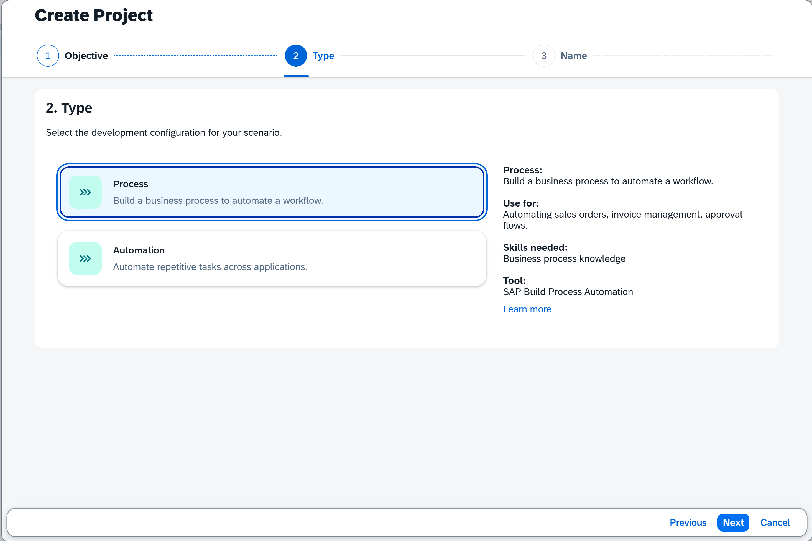

   
4️⃣ In the **Name** dialog box, enter the following ifnromation;
   
   - **Project Name**: Loyalty Management Tier Upgrade
   - **Description**: Loyalty Membership Tier Upgrade

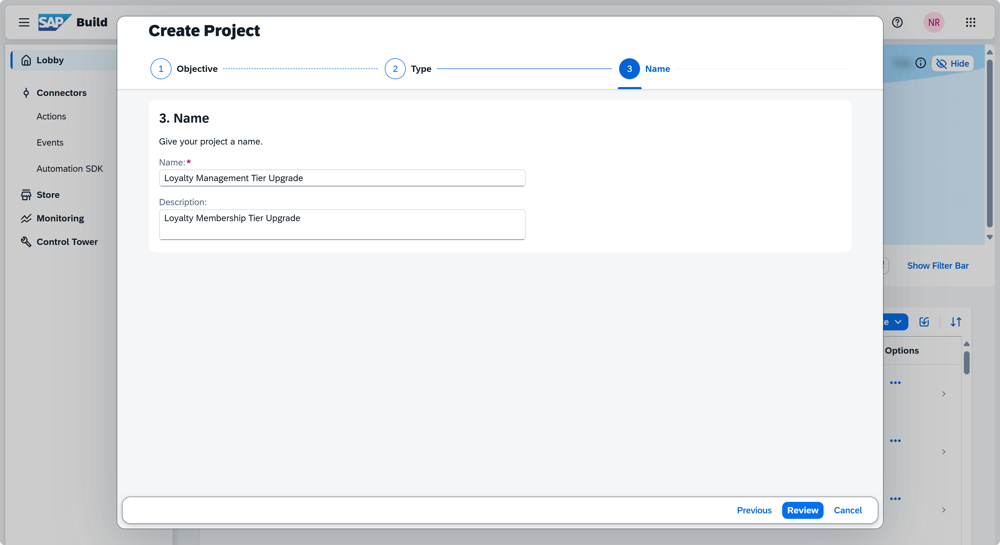


5️⃣ Review your project details in the **Summary** page, then choose **Create**.
   
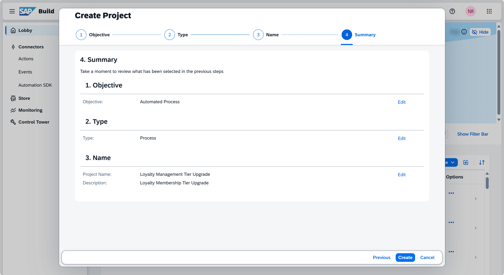
   
</details>

### 2. Create a Business Process

<details>
    <summary> 🔵 Click to Expand</summary>    
<br>
    
1️⃣	A new tab opens with the newly created project.
   
2️⃣	In the **Create Process** dialog box, provide the following:
   - **Name**: Approve Tier Upgrade
   - **Description** for your process: Approve Loyalty Membership Tier Upgrade
   - Choose **Create**
     
> 📝 Inside a project, you can create a process. This process is equivalent to a workflow in any business scenario. As part of the process flow, you could create various artefacts such as forms, decisions, automations.

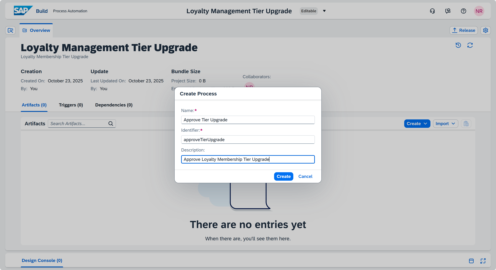

> 💡 The Identifier field is auto filled.
 
</details>

### 3. Create an API Trigger for the Process.
<details>
    <summary> 🔵 Click to Expand</summary>
 <br>
    
A business process is started by defining a trigger, an event that indicates to your SAP Build Process Automation tenant to start a process instance.
Process triggers can be a form, such as a request form, an API call, where an external system starts the process or an Event.  

#### ✅ Prerequisites

You have created a **Business Project and Process in SAP Build Process Automation** as described above.

---

1️⃣ Open process **Approve Tier Upgrade**.

2️⃣ To add an API trigger for the process, click on the **Add API trigger**.

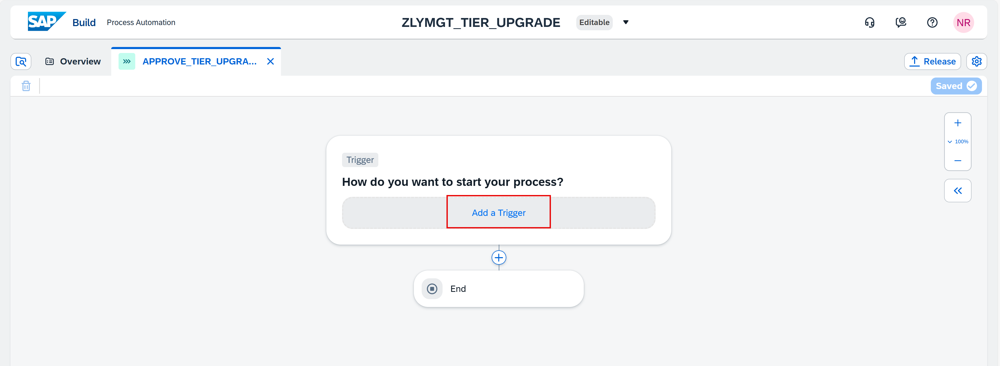   

3️⃣ Choose **Call an API** as we are creating an **API based trigger** so that we can trigger the process from external system (SAP BTP ABAP Environment).

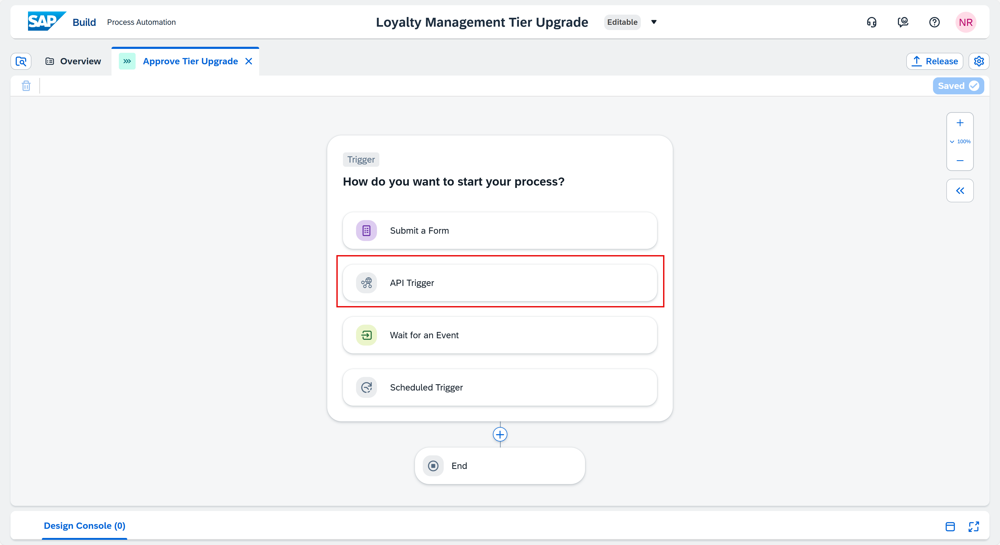

4️⃣ Enter the below details for the trigger, and then choose **Create**:

    - **Name**: Loyalty Membership Tier Upgrade API  	
    - **Description**: Loyalty Membership Tier Upgrade via API

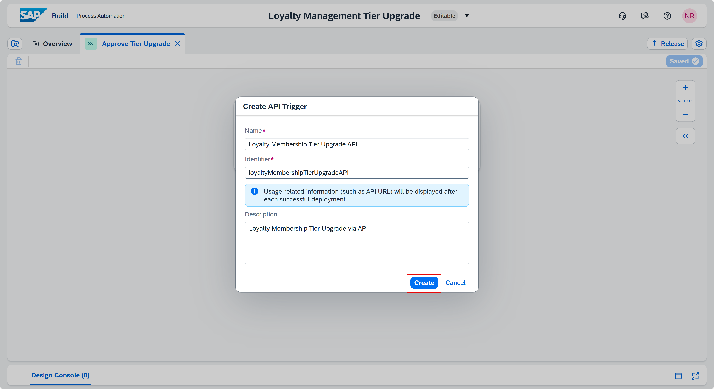  	

> 📝 Please note that the identifier will be filled by itself.

</details>

### 4. Create Input for the Process

<details>
    <summary> 🔵 Click to Expand</summary>
<br>
    
1️⃣ Open the **Process Details** by clicking on the Canvas.

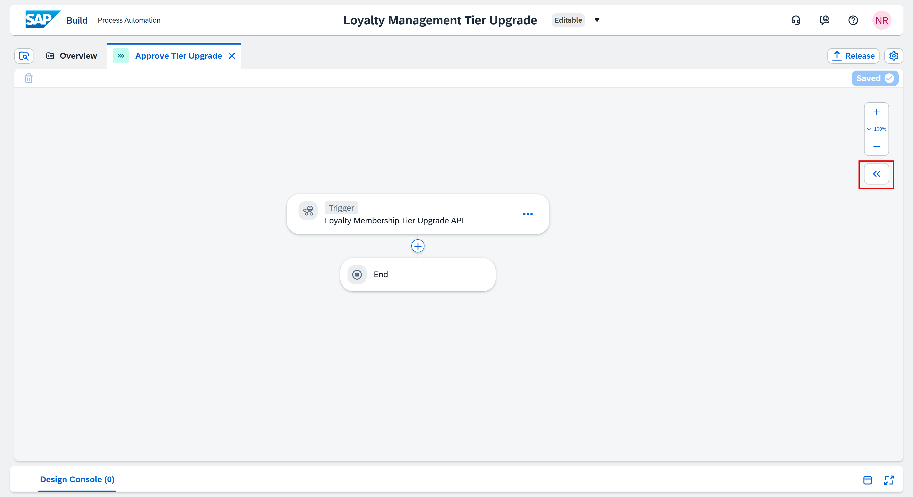  

2️⃣	Choose **Variables**. Then choose **Configure** to configure process inputs.

> 💡 Process inputs are variables that store data passed into the workflow when it is triggered.

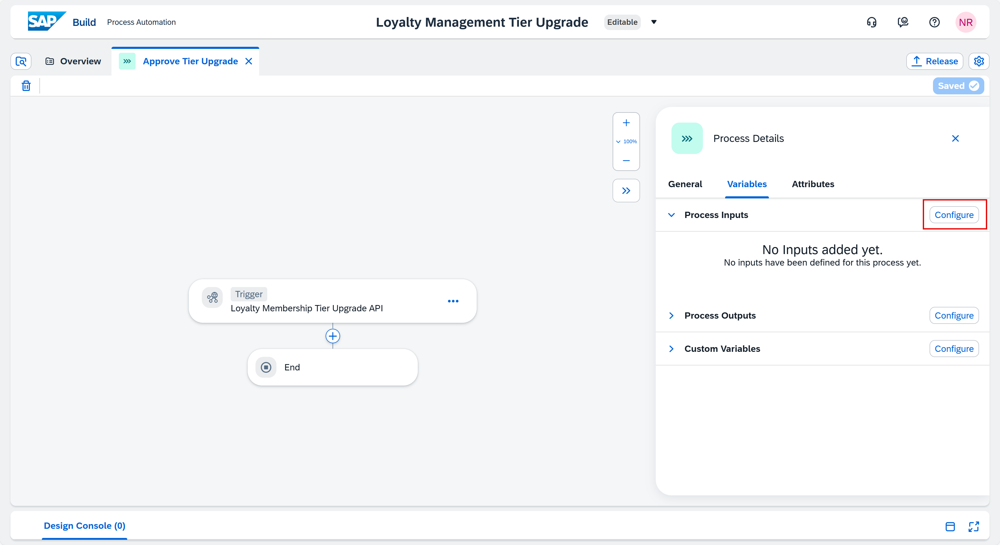   

3️⃣	In the Configure Process Inputs window, choose **Add Input** to add parameters. Define the input parameters required for the process. Add the following inputs:
    - **membershipid** – Membership Identifier (String, Required)
    - **customername** – Customer Name (String)
    - **currenttier** – Current Tier (String)
    - **newtier** – New Tier (String)
    - **validfrom** – Valid From (Date)

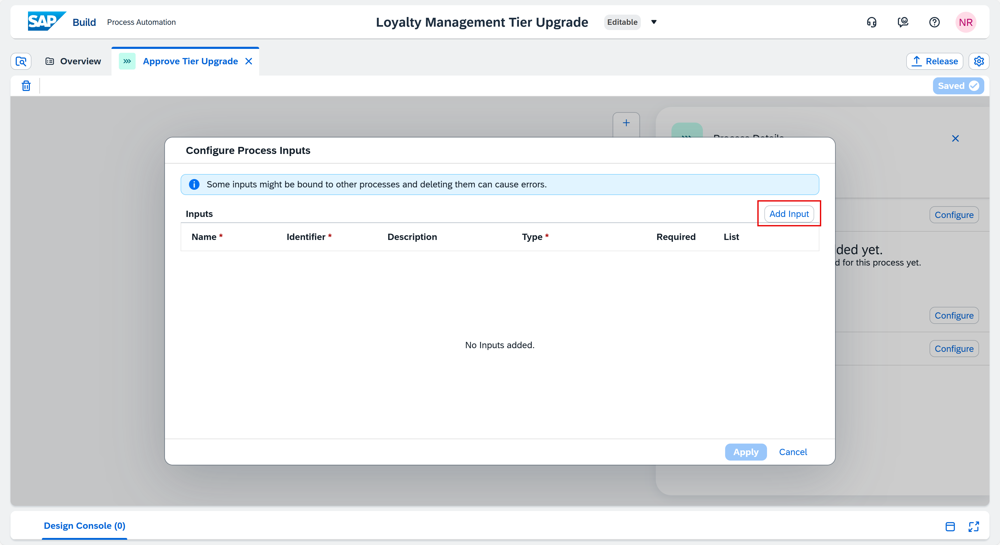

4️⃣ After defining all inputs, choose **Apply**. Process Input fields are now visible in the Process Details.

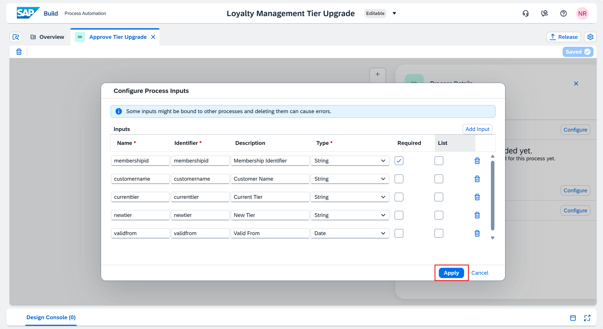


5️⃣  Configure Custom variable, choose **Configure**. In the Configure Custom Variables dialog box, select **Add Variable** to add parameter. Define the custom variable details as follows:
   - Name – **Decision**
   - Identifier – **decision**
   - Description – **Workflow Decision**
   - Type – **String**

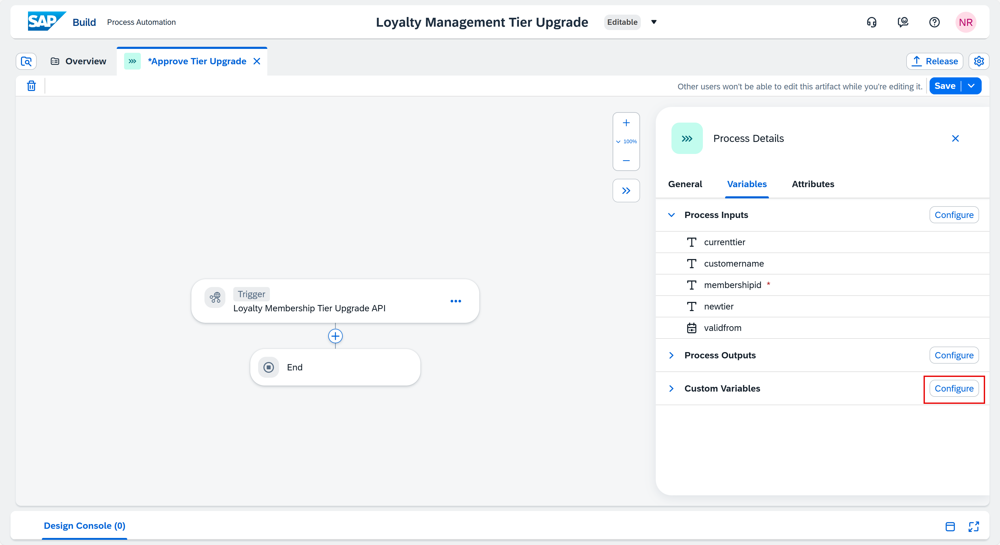

6️⃣ After configuring the variable, choose **Apply**.

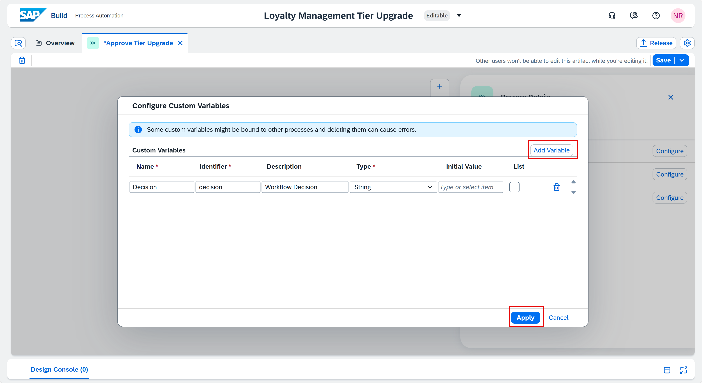

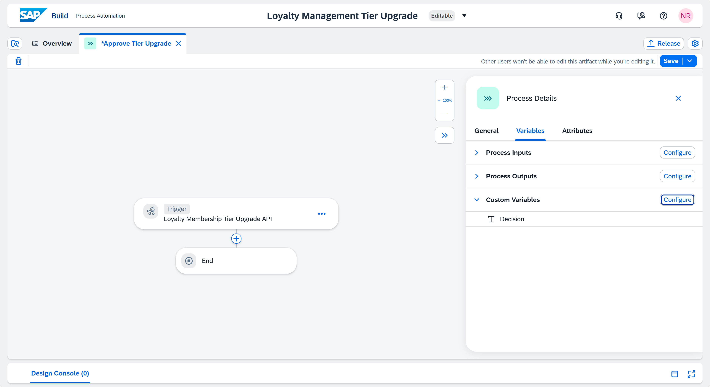

7️⃣ In the **General** section of the **Process Details**, set the **Business Key** to **membershipid** to uniquely identify the process instance.

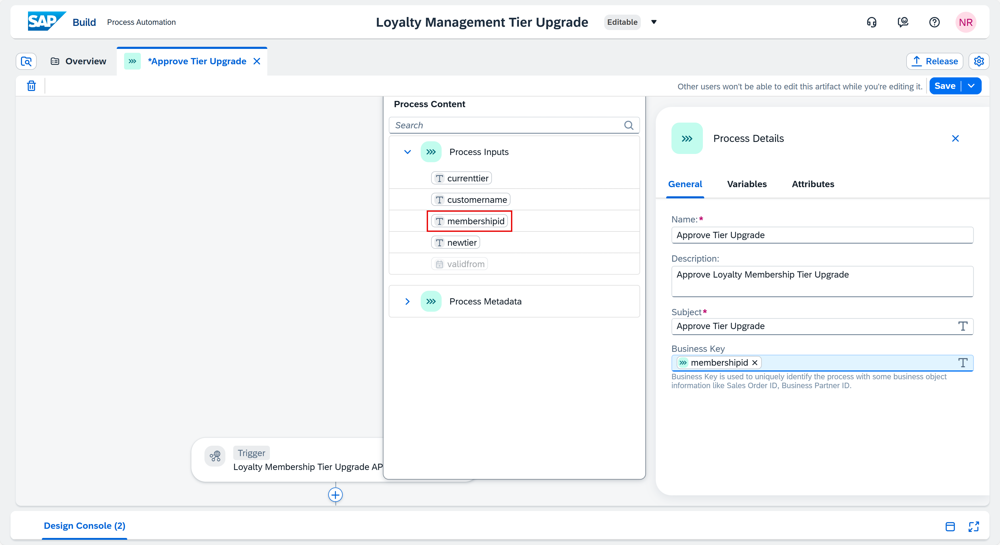 

8️⃣ Save the project.

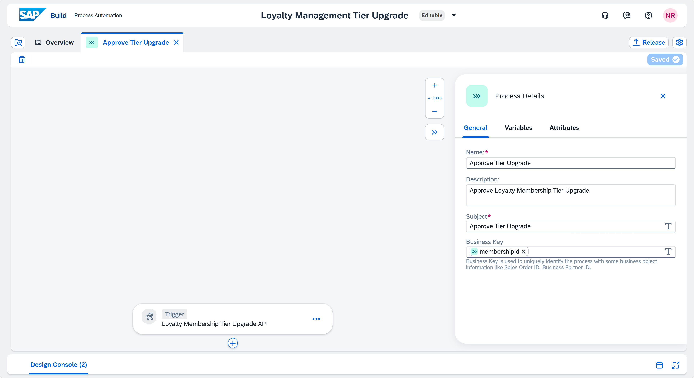

9️⃣ Once the trigger is created successfully, you can view the trigger under the **Triggers** Section in the **Overview** page.

</details> 

### 5. Create and Configure Tier Upgrade Request Form.

<details>
    <summary> 🔵 Click to Expand</summary>
<br>
    
Tasks are a part of any business process. 
SAP Build Process Automation helps you to create forms that are made available to the business users in their inboxes to take relevant action.
These interactive forms can be created by dragging and dropping the text elements and input fields into the canvas. 
Once a form has been created, it can then be used as an approval step in the business process.

#### ✅Prerequisites

- You have created a **Business Project and Process in SAP Build Process Automation** as described above.
- You have created a **API Process Trigger** as described above.

---

### 5.1 Create an Tier Upgrade Request Form

> 💡 The approval form will be used to get faster and easier approvals from the business users to take informed decisions and replacing manual processes. These approval forms could be about approving or rejecting sales orders, invoices, IT requests etc. The forms are then converted into tasks in an automated workflow which will appear in the approvers' inbox and can be accessed using My Inbox integrated with SAP Build Process Automation.

1️⃣ Go to process **Approve Tier Upgrade** and choose **+** below the trigger.

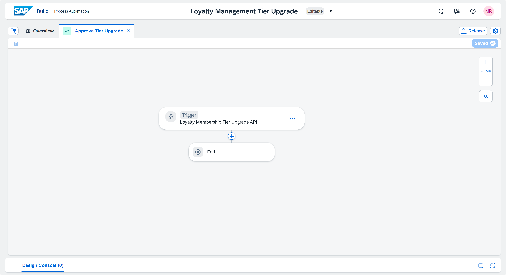

2️⃣	Choose **Approval** from the available options.

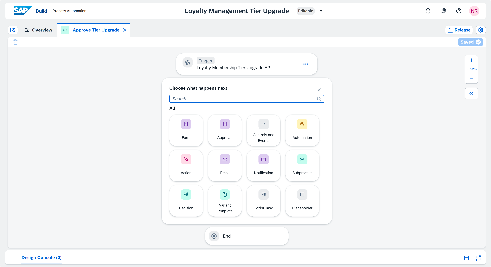

3️⃣ Choose **Blank Approval**.

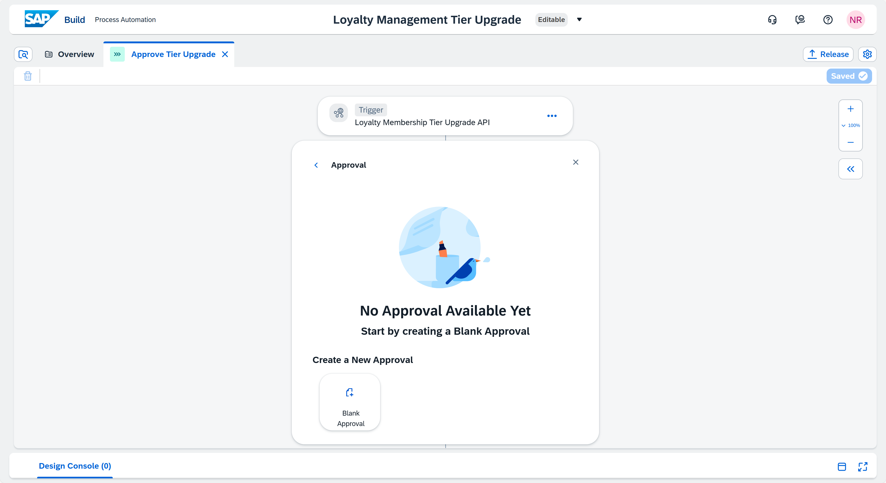

4️⃣ In the **Create Approval** dialog box, do the following:
    - In the Name field enter: **Tier Upgrade Request**.
    - In the Description field enter: **Loyalty Membership Details of the Customer that Requested Upgrade**.
    - Choose **Create**.

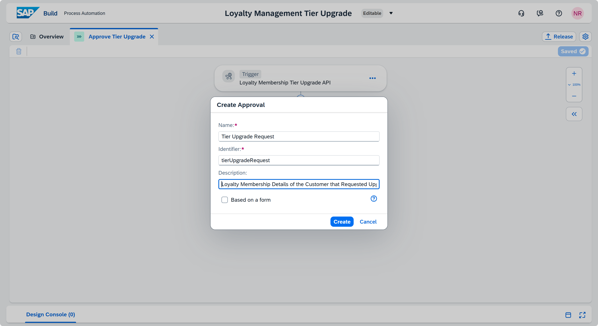

5️⃣ Choose **Open Editor** of the Tier Upgrade Request Form.

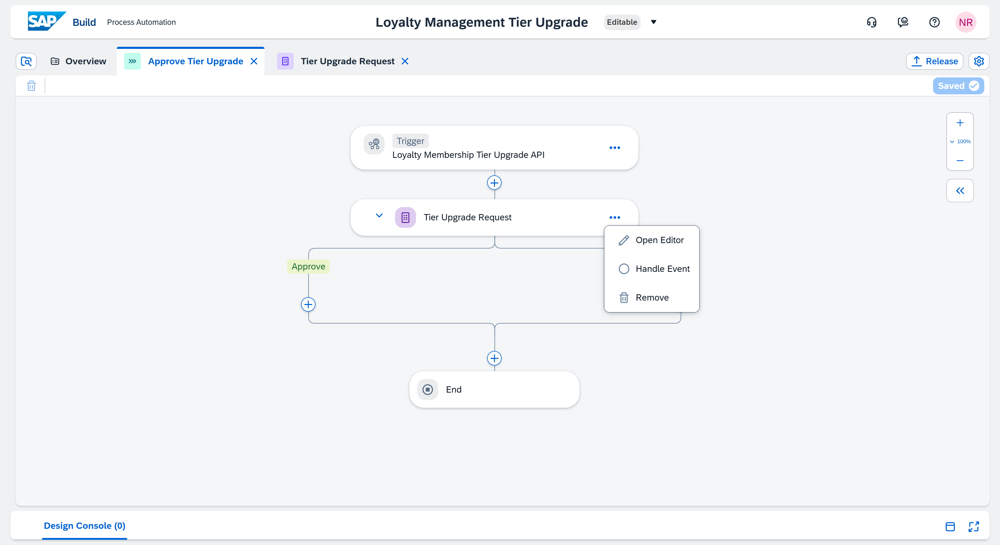

6️⃣ Design the Tier Upgrade Request Form in the form builder by dragging-and-dropping fields into the form editor and configuring respective field settings.
    - Add Input Fields, enter the labels and select the **Read Only** checkbox.  
    - These fields will take value from the input of the process i.e., fields sent from the external system.

    | Form Field | Field Setting with Label |
    |-------|-------------|
    | **Text** | Membership Id |
    | **Text** | Customer Name |
    | **Text** | Current Tier |
    | **Text** | New Tier |
    | **Date** | Valid From |

7️⃣ Configure the Membership Id field by enabling input validation for numeric values and marking the field as Read Only, ensuring that the approver cannot modify the value and that only digits are allowed as per the regular expression.

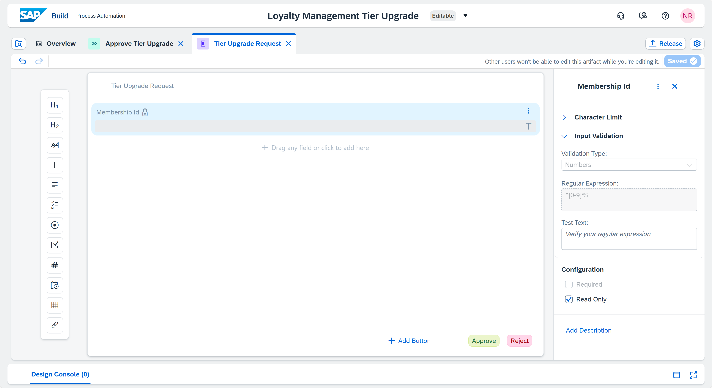

8️⃣ All fields in the Tier Upgrade Request form - Membership Id, Customer Name, Current Tier, New Tier, and Valid From - are configured as **Read Only**, ensuring that approvers only view the incoming data from the external system without making any modifications.

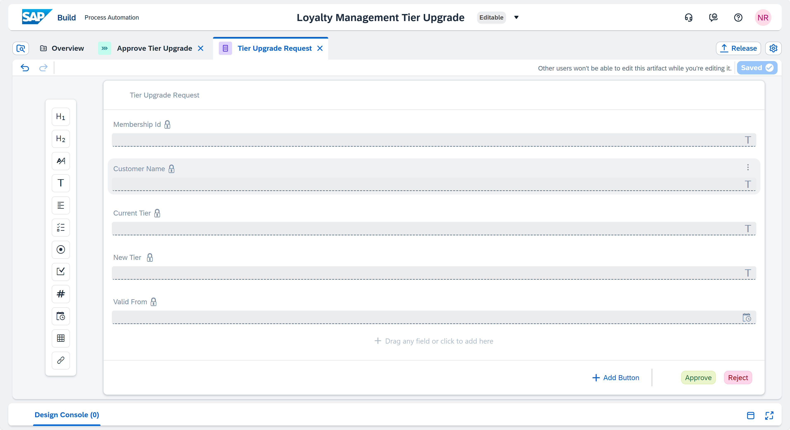

9️⃣ Save the form.

### 5.2 Configure the Tier Upgrade Request Form in the Process Flow.

Once the Tier Upgrade Request form is created its time to include it in the process flow and configure it to take the read only field values from Process Input.

1️⃣ Select the Tier Upgrade Request Form to configure the General Information Section.

    - Set the title of the task that will be displayed in the Inbox, enter the below details.

    | Form Field | Field Setting with Label |
    |-------|-------------|
    | **Subject** | Approve Tier for **customername**[Select **customername** from Process Input} |
    | **Description** | Approve Tier |
    | **Priority** | Medium |

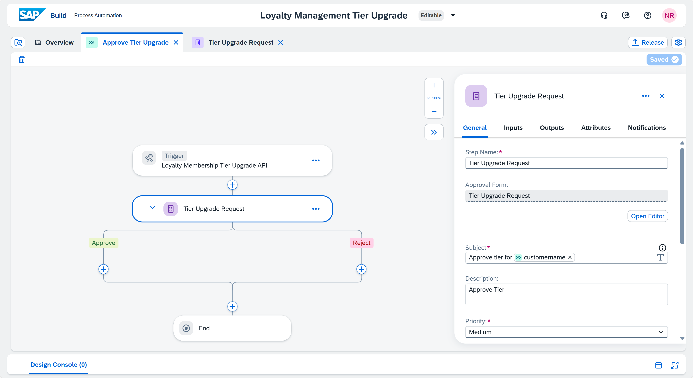

    - Set the Recipient Group **LoyaltyTierApprovers**. It is assigned to ensure that all tier upgrade requests are routed only to authorized approvers responsible for reviewing and deciding the outcome.

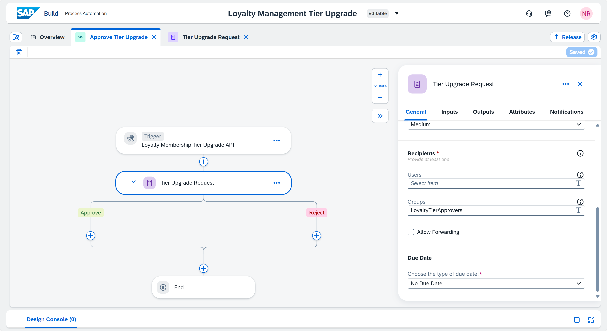

2️⃣ In the Due Date section select **No Due Date** as type of due date. The Due Date is set to No Due Date, meaning the approver can take action on the tier upgrade request without any time-based deadline.

> 💡 As the task appears in the My Inbox, there will be duration information shown to the recipients such as "Overdue" if the task was not completed within deadline. This refers to the due date to approve or reject the form.

3️⃣ Similarly, go to the Inputs section and map the different input fields, which were marked as read-only in the approval form, by selecting the respective Process Input entry.

| Form Input Field | Process Input Entry |
|-------|-------------|
| Membership Id | membershipid |
| Customer Name | customername |
| Current Tier | currenttier  |
| New Tier | newtier |
| Valid From | validfrom |

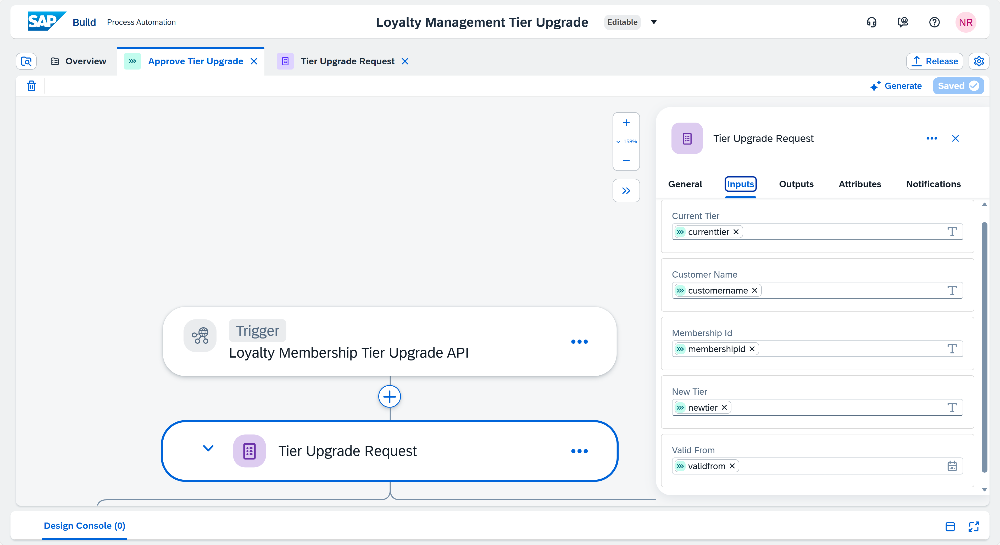

> The Process Inputs will highlight the entries with the same data type of the input field. For example: if the input field is of Number type, then Process Inputs will show only number-type entries.

4️⃣ Save the process. The process should look like below:

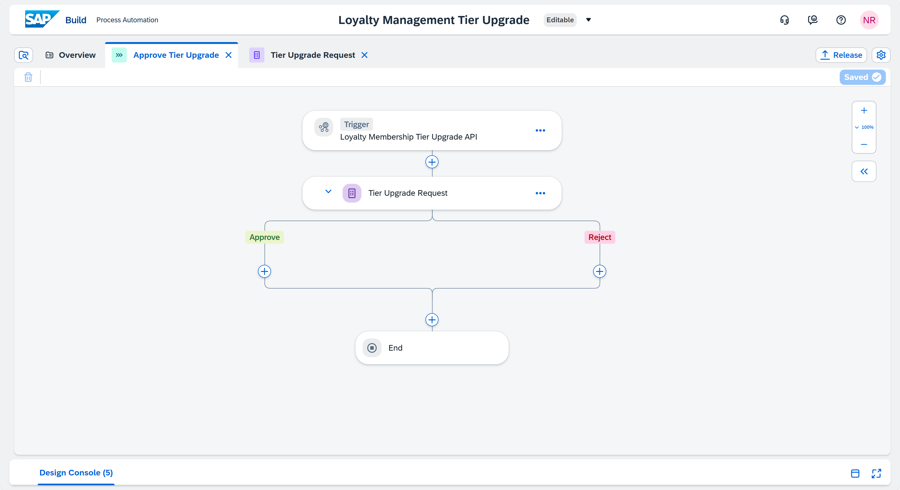

</details>

### 6. Create and Configure Workflow Script Task

<details>
    <summary> 🔵 Click to Expand</summary>
<br>

The Script Task is used to set the approval outcome inside the workflow context, allowing the process to store whether the request was Approved or Rejected.

1️⃣ After the  Approve path, click the plus (+) icon to define the next step.
 

 
 2️⃣ From the action palette, choose the Script option to add a script task. This task will enable you to add custom logic that should run automatically after a tier upgrade request is approved.

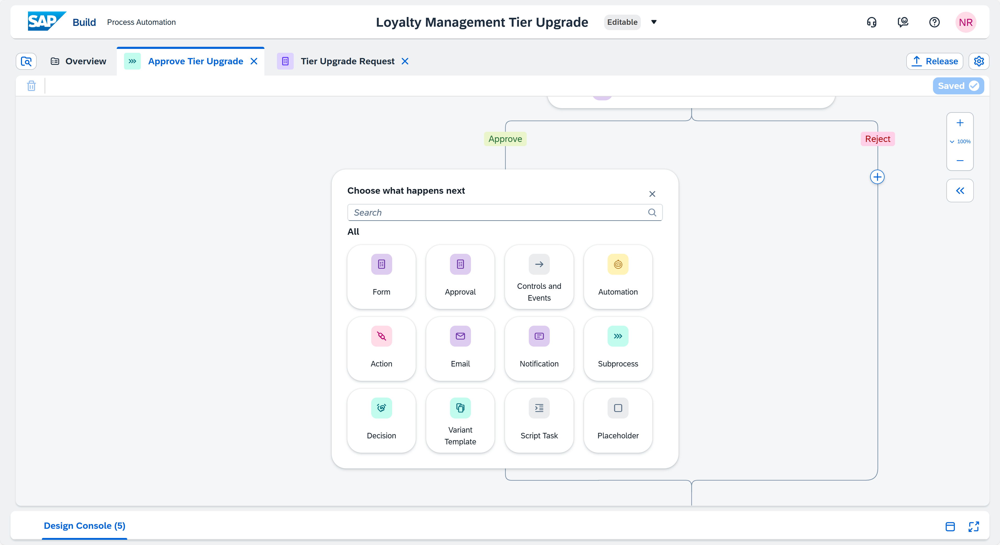
 
 3️⃣ Rename the step to **Workflow Approved** and open the script editor to define the logic that should run after a successful tier-upgrade approval.

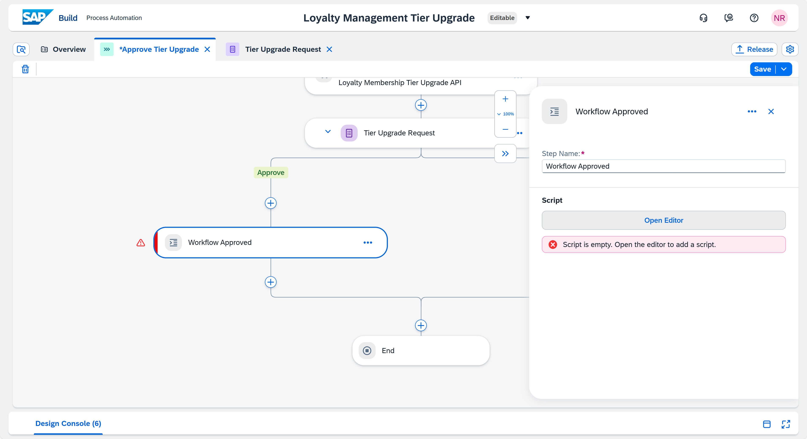

4️⃣ Click on Open Editor. In the script editor, you'll define the necessary logic for processing the approval decision. A script could include setting a variable to mark the decision as "Approved". 
Enter this **$.context.custom.decision = 'Approved';**

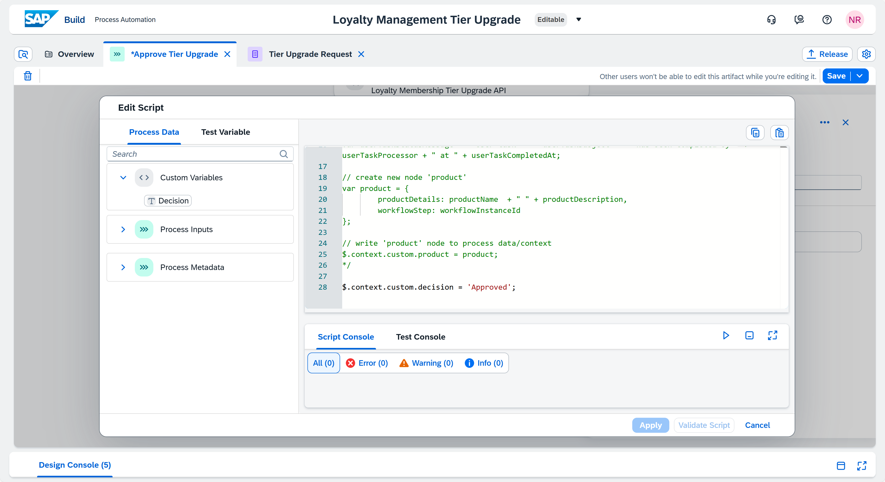

5️⃣ Click **Apply** to save the script. Be sure to validate the script to ensure it runs correctly.

6️⃣ Then click the plus (+) icon under the reject path. 

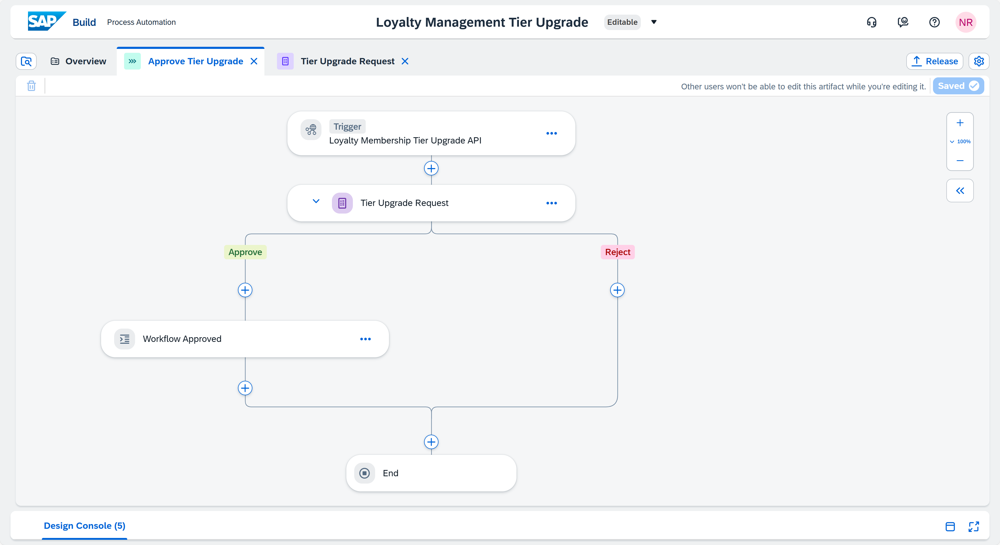

7️⃣ Add a script task from the action palette.

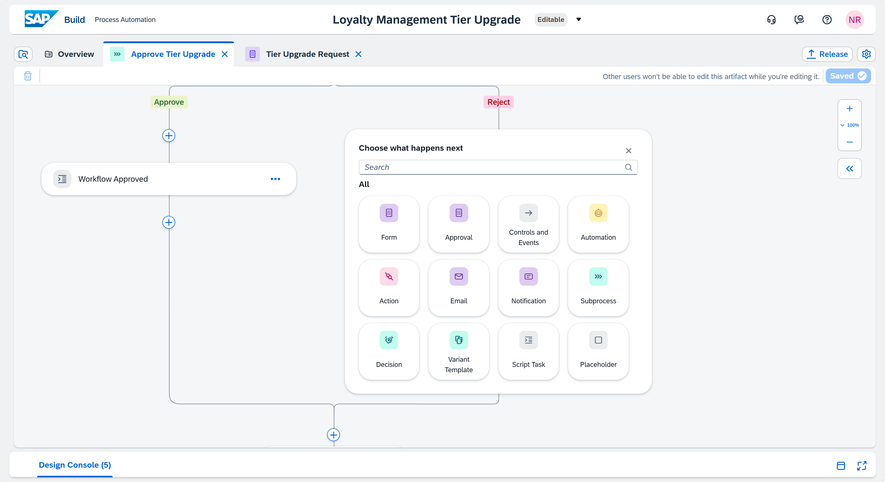

8️⃣ Enter the Step Name as **Workflow Rejected**.

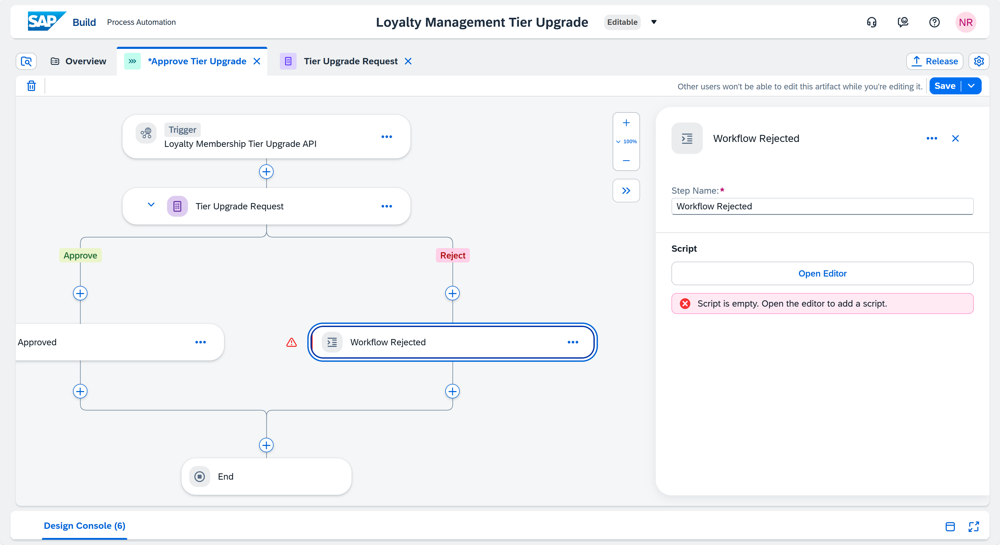

9️⃣ Click on **Open Editor**. In the Script Editor add this logic **$.context.custom.decision = 'Rejected';**

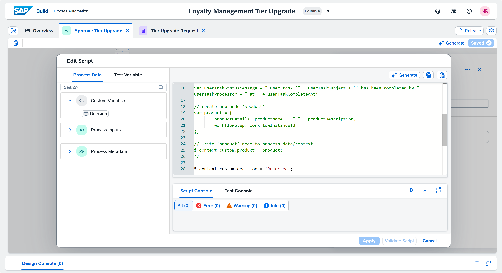

🔟 Save the process.

</details>

# Create and Configure Action in the process flow

## ✅ Prerequisites

- You have created a Business Project and Process in SAP Build Process Automation as described above.
- You have created a process trigger as described above.
- You have created a configured an Approval form as described above. 

Action is a feature in SAP Build Process Automation to connect processes with external systems, be it SAP or non-SAP systems. This is an important piece of the puzzle especially if you want to automate or extend your business processes for any available LoB processes such as with Cloud ERP, **SAP BTP ABAP Environment**, SuccessFactors etc. These extensions can be easily built using SAP Build Process Automation, and using actions you can connect to your given SAP S/4HANA, **SAP BTP ABAP Environment**, Ariba or other SAP LoB systems to make calls using GET, POST, PATCH, etc.

Lets create an action project based on Open API. The Workflow Notification API is an OData V4 service available to send the notification at the completion of a workflow step back to the calling system. You will use the POST call from SAP Build Process Automation to BTP ABAP environment to notify if the  request has been Approved or Rejected on completion of workflow.

## 1. Create an Action Project

<details>
    <summary> 🔵 Click to Expand</summary> 
<br>
    
1️⃣ Open SAP Build **Lobby**. Under **Connectors**, select **Actions**. 

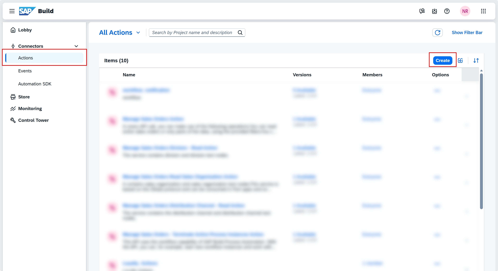

2️⃣ Save the below **Open API Specification file** as local **.edmx file**. You can do this by pasting the snippet below in your text editor and clicking on **Save As** and then giving the filename an extension of **.edmx**.
  
```edmx
<?xml version="1.0" encoding="utf-8"?>
<edmx:Edmx Version="4.0"
           xmlns:edmx="http://docs.oasis-open.org/odata/ns/edmx"
           xmlns="http://docs.oasis-open.org/odata/ns/edm">

    <edmx:Reference Uri="/sap/opu/odata/IWFND/CATALOGSERVICE;v=2/Vocabularies(TechnicalName='%2FIWBEP%2FVOC_COMMON',Version='0001',SAP__Origin='LOCAL')/$value">
        <edmx:Include Namespace="com.sap.vocabularies.Common.v1" Alias="SAP__common"/>
    </edmx:Reference>

    <edmx:Reference Uri="/sap/opu/odata/IWFND/CATALOGSERVICE;v=2/Vocabularies(TechnicalName='%2FIWBEP%2FVOC_MEASURES',Version='0001',SAP__Origin='LOCAL')/$value">
        <edmx:Include Namespace="Org.OData.Measures.V1" Alias="SAP__measures"/>
    </edmx:Reference>

    <edmx:Reference Uri="/sap/opu/odata/IWFND/CATALOGSERVICE;v=2/Vocabularies(TechnicalName='%2FIWBEP%2FVOC_CORE',Version='0001',SAP__Origin='LOCAL')/$value">
        <edmx:Include Namespace="Org.OData.Core.V1" Alias="SAP__core"/>
    </edmx:Reference>

    <edmx:Reference Uri="/sap/opu/odata/IWFND/CATALOGSERVICE;v=2/Vocabularies(TechnicalName='%2FIWBEP%2FVOC_CAPABILITIES',Version='0001',SAP__Origin='LOCAL')/$value">
        <edmx:Include Namespace="Org.OData.Capabilities.V1" Alias="SAP__capabilities"/>
    </edmx:Reference>

    <edmx:Reference Uri="/sap/opu/odata/IWFND/CATALOGSERVICE;v=2/Vocabularies(TechnicalName='%2FIWBEP%2FVOC_AGGREGATION',Version='0001',SAP__Origin='LOCAL')/$value">
        <edmx:Include Namespace="Org.OData.Aggregation.V1" Alias="SAP__aggregation"/>
    </edmx:Reference>

    <edmx:Reference Uri="/sap/opu/odata/IWFND/CATALOGSERVICE;v=2/Vocabularies(TechnicalName='%2FIWBEP%2FVOC_VALIDATION',Version='0001',SAP__Origin='LOCAL')/$value">
        <edmx:Include Namespace="Org.OData.Validation.V1" Alias="SAP__validation"/>
    </edmx:Reference>

    <edmx:Reference Uri="/sap/opu/odata/IWFND/CATALOGSERVICE;v=2/Vocabularies(TechnicalName='%2FIWBEP%2FVOC_CODELIST',Version='0001',SAP__Origin='LOCAL')/$value">
        <edmx:Include Namespace="com.sap.vocabularies.CodeList.v1" Alias="SAP__CodeList"/>
    </edmx:Reference>

    <edmx:Reference Uri="/sap/opu/odata/IWFND/CATALOGSERVICE;v=2/Vocabularies(TechnicalName='%2FIWBEP%2FVOC_UI',Version='0001',SAP__Origin='LOCAL')/$value">
        <edmx:Include Namespace="com.sap.vocabularies.UI.v1" Alias="SAP__UI"/>
    </edmx:Reference>

    <edmx:Reference Uri="/sap/opu/odata/IWFND/CATALOGSERVICE;v=2/Vocabularies(TechnicalName='%2FIWBEP%2FVOC_HTML5',Version='0001',SAP__Origin='LOCAL')/$value">
        <edmx:Include Namespace="com.sap.vocabularies.HTML5.v1" Alias="SAP__HTML5"/>
    </edmx:Reference>

    <edmx:Reference Uri="/sap/opu/odata/IWFND/CATALOGSERVICE;v=2/Vocabularies(TechnicalName='%2FIWBEP%2FVOC_PDF',Version='0001',SAP__Origin='LOCAL')/$value">
        <edmx:Include Namespace="com.sap.vocabularies.PDF.v1" Alias="SAP__PDF"/>
    </edmx:Reference>

    <edmx:Reference Uri="/sap/opu/odata/IWFND/CATALOGSERVICE;v=2/Vocabularies(TechnicalName='%2FIWBEP%2FVOC_SESSION',Version='0001',SAP__Origin='LOCAL')/$value">
        <edmx:Include Namespace="com.sap.vocabularies.Session.v1" Alias="SAP__session"/>
    </edmx:Reference>

    <edmx:Reference Uri="/sap/opu/odata/IWFND/CATALOGSERVICE;v=2/Vocabularies(TechnicalName='%2FIWBEP%2FVOC_ODM',Version='0001',SAP__Origin='LOCAL')/$value">
        <edmx:Include Namespace="com.sap.vocabularies.ODM.v1" Alias="SAP__ODM"/>
    </edmx:Reference>

    <edmx:Reference Uri="/sap/opu/odata/IWFND/CATALOGSERVICE;v=2/Vocabularies(TechnicalName='%2FIWBEP%2FVOC_HIERARCHY',Version='0001',SAP__Origin='LOCAL')/$value">
        <edmx:Include Namespace="com.sap.vocabularies.Hierarchy.v1" Alias="SAP__hierarchy"/>
    </edmx:Reference>

    <edmx:DataServices>
        <Schema Namespace="com.sap.gateway.default.api_workflow_notification.v0001" Alias="SAP__self">

            <Annotation Term="SAP__core.SchemaVersion" String="1.0.0"/>

            <ComplexType Name="CT_NOTIFICATION_RESULT">
                <Property Name="notificationProcessed" Type="Edm.Boolean" Nullable="false"/>
            </ComplexType>

            <Action Name="ProcessCompleted">
                <Parameter Name="workflowInstanceId" Type="Edm.String" Nullable="false" MaxLength="36"/>
                <Parameter Name="outcome" Type="Edm.String" Nullable="false" MaxLength="255"/>
                <ReturnType Type="com.sap.gateway.default.api_workflow_notification.v0001.CT_NOTIFICATION_RESULT"
                            Nullable="false"/>
            </Action>

            <EntityContainer Name="Container">
                <ActionImport Name="ProcessCompleted"
                              Action="com.sap.gateway.default.api_workflow_notification.v0001.ProcessCompleted"/>
            </EntityContainer>

            <Annotations Target="SAP__self.Container">

                <Annotation Term="SAP__capabilities.FilterFunctions">
                    <Collection>
                        <String>eq</String><String>ne</String><String>gt</String><String>ge</String>
                        <String>lt</String><String>le</String><String>and</String><String>or</String>
                        <String>contains</String><String>startswith</String><String>endswith</String>
                        <String>any</String><String>all</String>
                    </Collection>
                </Annotation>

                <Annotation Term="SAP__capabilities.SupportedFormats">
                    <Collection>
                        <String>application/json</String>
                        <String>application/pdf</String>
                    </Collection>
                </Annotation>

                <Annotation Term="SAP__PDF.Features">
                    <Record>
                        <PropertyValue Property="DocumentDescriptionReference"
                                       String="../../../../default/iwbep/common/0001/$metadata"/>
                        <PropertyValue Property="DocumentDescriptionCollection" String="MyDocumentDescriptions"/>
                        <PropertyValue Property="ArchiveFormat" Bool="true"/>
                        <PropertyValue Property="Border" Bool="true"/>
                        <PropertyValue Property="CoverPage" Bool="true"/>
                        <PropertyValue Property="FitToPage" Bool="true"/>
                        <PropertyValue Property="FontName" Bool="true"/>
                        <PropertyValue Property="FontSize" Bool="true"/>
                        <PropertyValue Property="HeaderFooter" Bool="true"/>
                        <PropertyValue Property="IANATimezoneFormat" Bool="true"/>
                        <PropertyValue Property="Margin" Bool="true"/>
                        <PropertyValue Property="Padding" Bool="true"/>
                        <PropertyValue Property="ResultSizeDefault">
                            <Null/>
                        </PropertyValue>
                        <PropertyValue Property="ResultSizeMaximum">
                            <Null/>
                        </PropertyValue>
                        <PropertyValue Property="Signature" Bool="true"/>
                        <PropertyValue Property="TextDirectionLayout" Bool="true"/>
                        <PropertyValue Property="Treeview" Bool="true"/>
                        <PropertyValue Property="UploadToFileShare" Bool="true"/>
                    </Record>
                </Annotation>

                <Annotation Term="SAP__capabilities.KeyAsSegmentSupported"/>
                <Annotation Term="SAP__capabilities.AsynchronousRequestsSupported"/>

            </Annotations>

            <Annotations Target="SAP__self.ProcessCompleted/outcome">
                <Annotation Term="SAP__core.OptionalParameter"/>
            </Annotations>

        </Schema>
    </edmx:DataServices>

</edmx:Edmx>

```

3️⃣ Choose **Create**. In the **Choose an API Source** popup, under **API Specification**, select **Upload API Specification**.

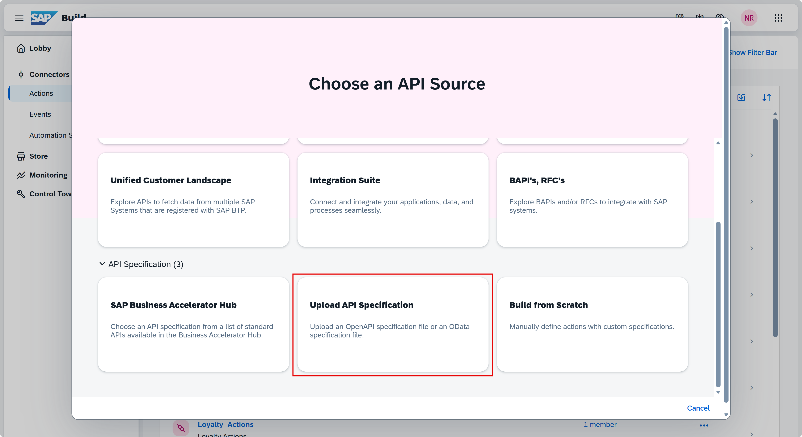

4️⃣ Drag and drop or click **Browse Files** to upload open specification file saved in step above.

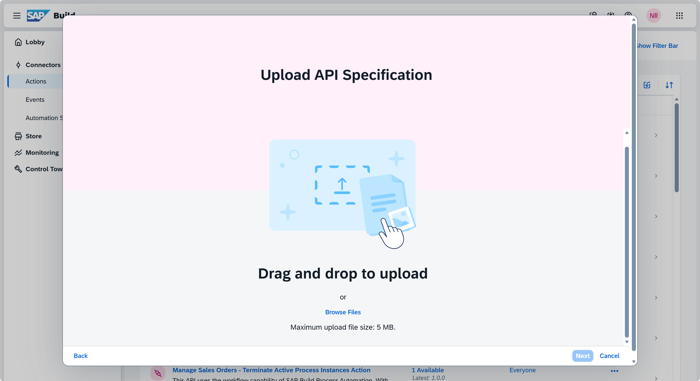

5️⃣ Choose **Next**.

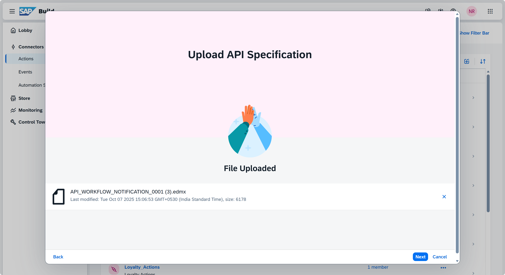

6️⃣ In the Create an Action Project Popup enter the following information:

   - Enter the Project Name as **Notify Lymgt Tier Upgrade Outcome**.
   - Enter the Description as **Workflow Completion Notification for Loyalty Membership Tier Upgrade**.
   - Click **Create**.

As soon as the **Notify Lymgt Tier Upgrade Outcome** Action gets created, SAP Build Actions will automatically open and the **Add Actions to Notify Lymgt Tier Upgrade Outcome** pop up will appear.
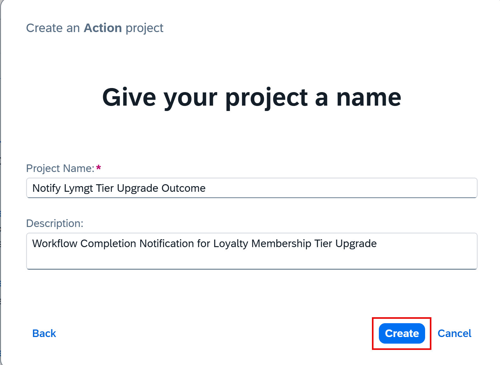

7️⃣ Select Service Operation **Post**. Click on **Add**.

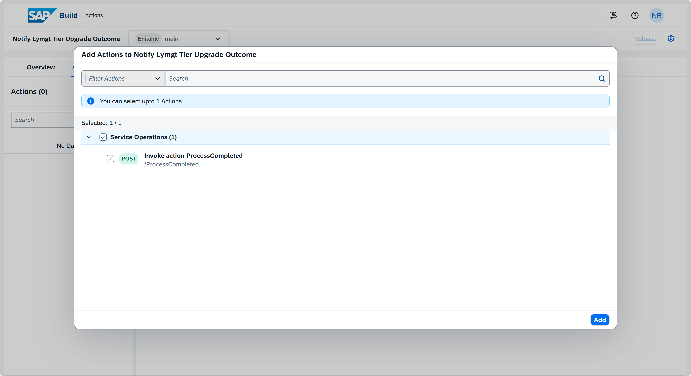

8️⃣ SAP Build Actions will open with the selected APIs which can be further configured based on the requirements. To update the project name, click on the pencil icon next to the project name.

> 💡 This action project name will help you search your action project from your API list, once published in action repository.

Change the name to **Workflow Completion Notification**.
Once done, Select **Update** to submit the changes.

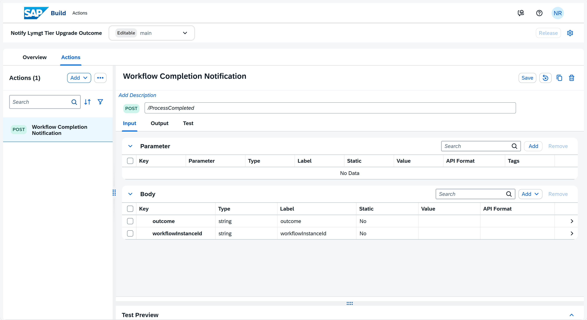

9️⃣ As SAP BTP ABAP environment APIs need CSRF token, you need to enable it. Select **Settings icon.**
- **Enable CSRF** by selecting YES
- Under the **Token Fetch End Point** enter: /

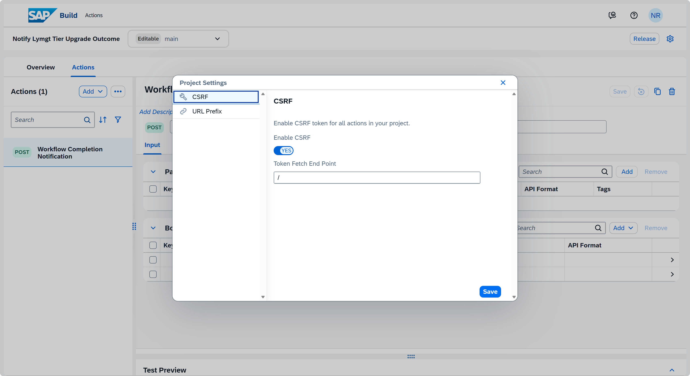

🔟 In the Project Settings Window, select **URL prefix** and enter the following resource path: **/sap/opu/odata4/sap/api_workflow_notification/default/sap/api_workflow_notification/0001.**

> 💡Resource Path is required to create the Final Action URL by combining {Destination URL} + {Resource Path} + {API Endpoint}. If you’re exposing multiple services from the same system, you don’t have to create different destinations to access those services. By configuring the resource path, you can set only one destination. Resource paths must begin with / and can’t end with /.

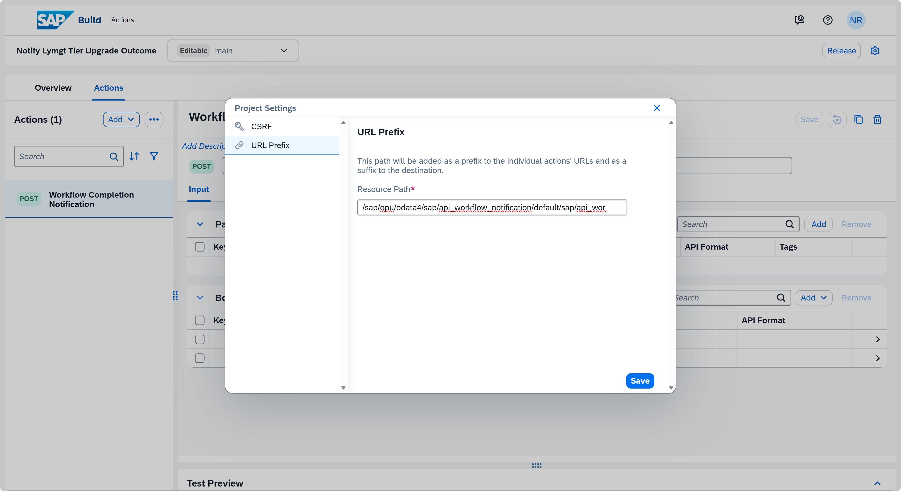

11. Save the Action Project.

12. Release the Action Project.

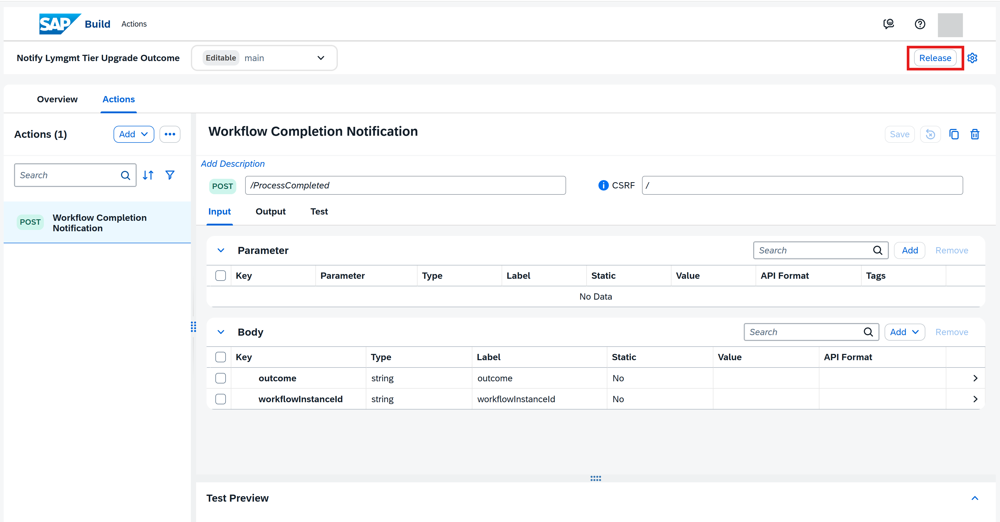

You will now release the action project to create version(s) and then publish a selected version in the action repository. It is then these published actions that can be used in different processes and applications to connect to external systems.

To release a version of the action project click Release from top-right corner.
Enter the Release Notes: Workflow Completion Notification V1.

15. Publish the Action Project.

Once the action project is released, you can then publish any release version of the action by clicking Publish to Library from top-right corner.

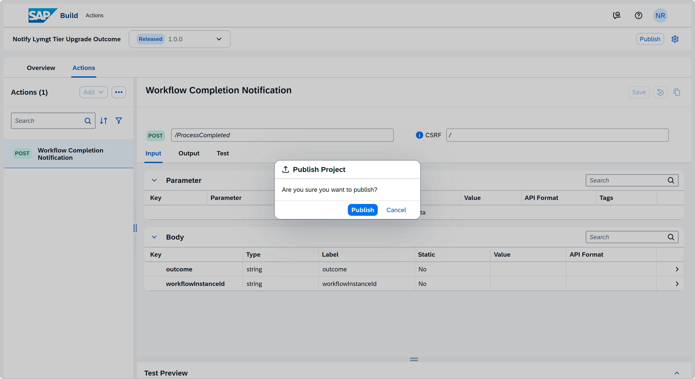

🎉 With this you have successfully completed creating, configuring, releasing, and publishing of action project. Now you will use this published action to connect workflow business process to external systems via API.

</details>

## 2. Add Action Project to Business Process

<details>
    <summary> 🔵 Click to Expand</summary> 
<br>

> Add the action in the business process to connect and send the workflow completion notification back to the system that invoked the workflow. You can do this by choosing the relevant action from the actions library and then configuring the actions parameters.

1️⃣ Go to lobby and open project Loyalty Management Tier Upgrade. Navigate to open the process builder canvas for Tier Upgrade Request and click on **Expand > for the Approval form**.

2️⃣ To add the callback action once the form is Approved, click on the **+** below workflow scripts .

3️⃣ From the options select **Action**.

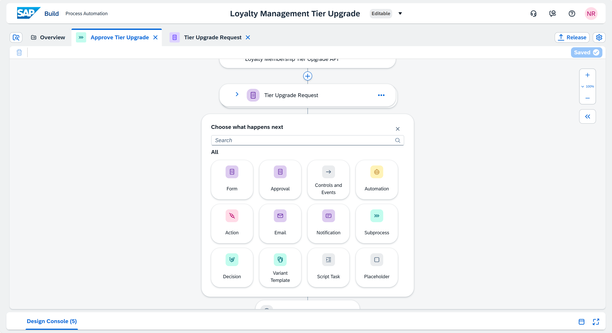

4️⃣ In the Browse Action library pop up, enter the action name that you just created like in this case ‘Workflow Completion Notification’ in the search field, to find the actions published by you in the library. Once you find your action project click on **Add**, this will add the action to your business process.

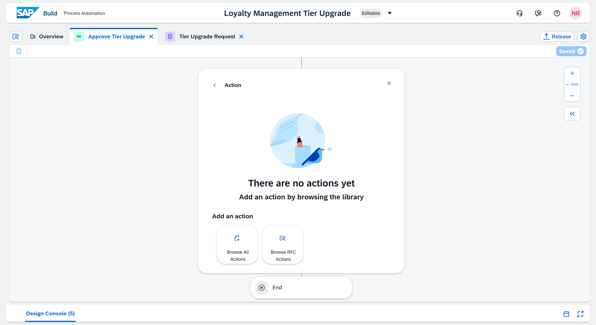

5️⃣ Configure action for approval.

By clicking the add button your action will be added to the business flow and a pop-up window will open to configure the action settings for Destination, input and output parameter mapping.

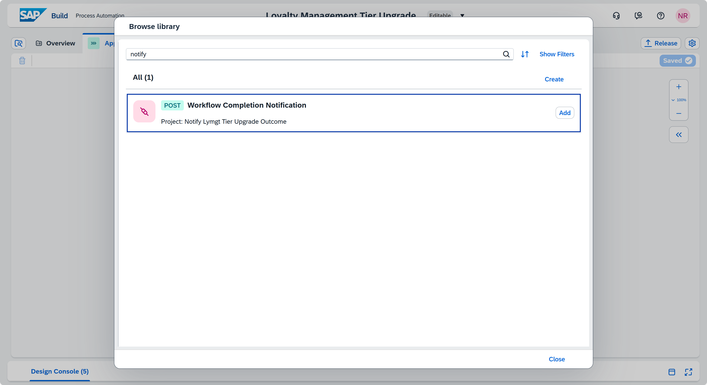

In the General tab of action parameters, expand Destination variable and choose **Create Destination Variable**.

6️⃣ In the pop-up window for Create Destination Variable, fill in the below values and choose **Create**.

    | Input Field |	Value |
    |-------|-------------|
    | Identifier |	CallBack_Destination |
    | Description |	CallBack Destination |

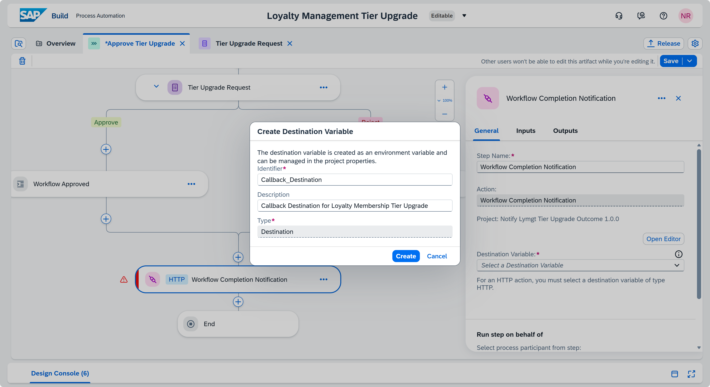

> A Destination variable is required to connect the action to a configured system. The actual destination value is selected on the deployment of the Business Process.

7️⃣ Click Inputs tab and map each input to the actual process content.

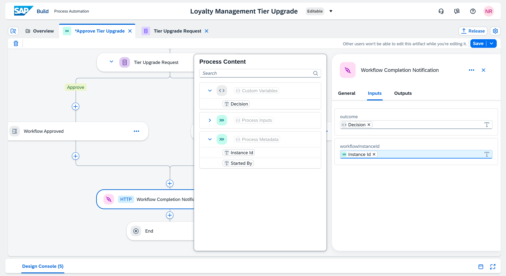

Please note that set the value for Outcome as Decision from the Custom Variables.  
To set the value for WorkflowInstanceId click on the field and select **Process Instance ID** from the Process Metadata.

8️⃣ Save the business process.

</details>

# 🚀 Release and Deploy Business Process Project.

To Run the Business Process Project, you need to first release and deploy it.

## ✅ Prerequisites

- You have created a Business Project and Process in SAP Build Process Automation as described above .
- You have created a process trigger as described above.
- You have created and configured an Approval form as described above.
- You have created an Action and included it in the process flow as described above.

<details>
    <summary> 🔵 Click to Expand</summary> 
<br>
    
📄 Till now you have created and saved your business process project along with the callback action. You will now **release** and **deploy** your project. The release process allows for semantic version control with format X.Y.Z. Deploying your project will allow you to set the proper parameters like destination, if necessary, to allow for project execution.

There are two possible situations during Release:

- When you are releasing a new business process project, enter a summary of the changes in the Release Notes (optional) then choose Release.

- When you are releasing a **modified version** of a business process project that is already released, in the release version contains dialogue, select one of the following:

   - Select **Bug Fix** to indicate bug fixes. It updates the third digit (Z) of the version number.
   - Select **Minor Changes** to indicate small modifications. It updates the second digit (Y) of the version number.
   - Select **Major Changes** to indicate important modifications potentially leading to incompatibility between versions. It updates the first digit (X) of the version number.

### 1. Release Business Process Project

Releasing a project creates a version or snapshot of the changes.

1️⃣ In the Process Builder choose **Release** on the top right corner.

Add a Version Comment if needed and choose **Release**.

> 📝 You are releasing the Project for the first time thus the version starts with 1.0.0. The next time you release there will be options to choose from – i.e if the new version is a major, minor, or patch update; version numbers will be automatically updated.


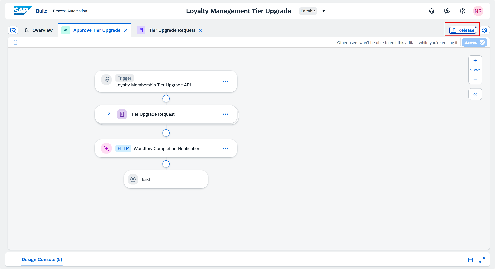

2️⃣ The project released successfully and is ready to be deployed.

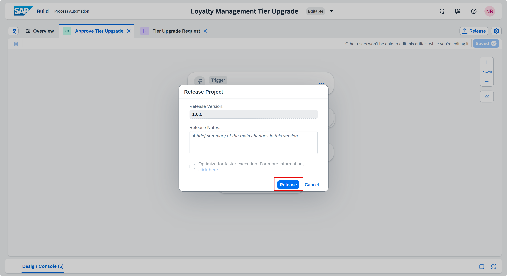

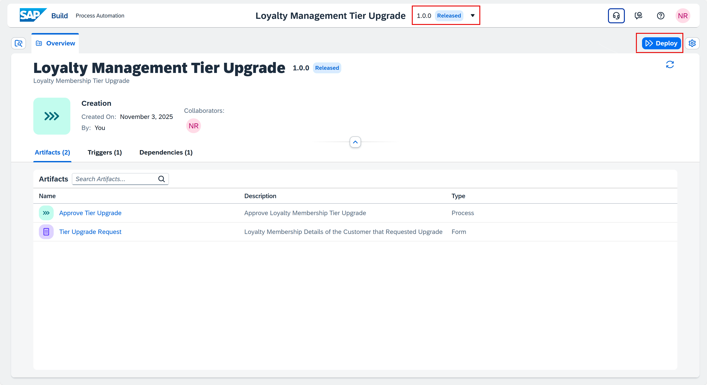

### 2. Deploy the Released Business Process Project

You can deploy Business Process projects from each released version of the project in the Process Builder or through the Lobby. Deploying the project makes it available for others to use it. Please note that you can only deploy a released version of the project.

1️⃣ From the released version of the Business Process project in the Process Builder, choose **Deploy** > Select **Environment Public** > choose **Deploy**.

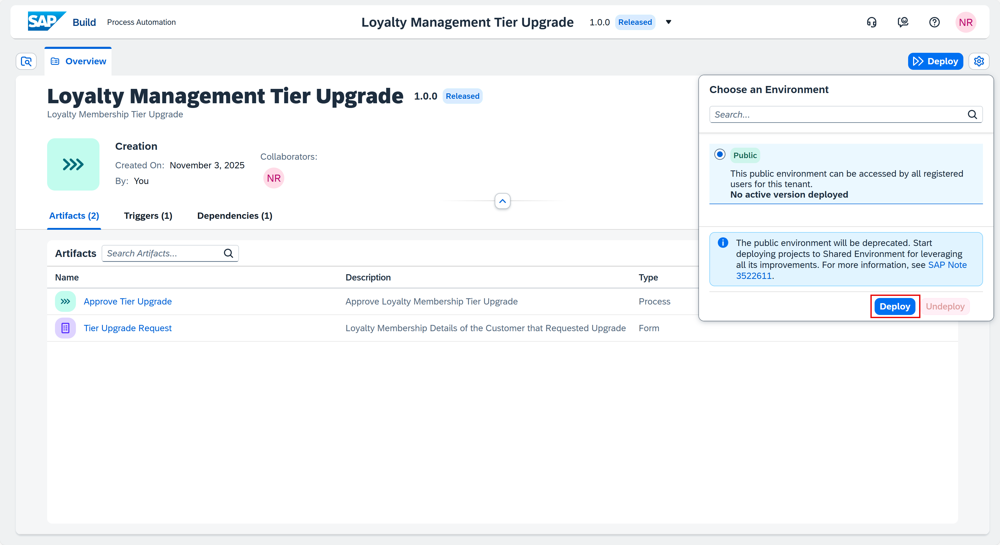

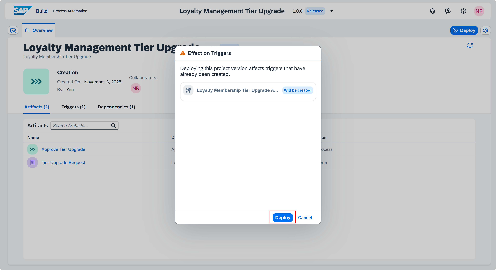

Deploy will take a couple of seconds/minutes depending upon how big your project is and how many different skills it has. Any errors during the deployment will be shown in the Design Console.

2️⃣ You will now set the **runtime variables**. From the drop-down select the destination **sbpa_abap_callback_staging** and click **Deploy**.

> 💡 This is the callback destination that we created in the BTP Subaccount and pulled in SAP Build Process Automation as part of **Integration of BTP ABAP environment with SAP Build Process Automation**.

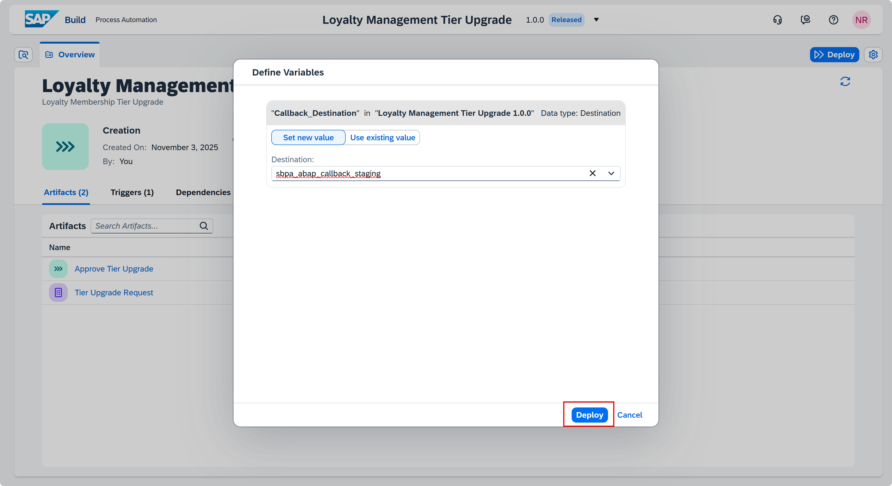

> Variables allow you to reuse certain information for a given business process project deployment.<br> You use variables to pass parameters to automations. You can create variables in the Process Builder for which you can later set values when deploying the business process project. For example, in the current use case, you have created a Destination variable.
  

3️⃣ 🎉 The successfully deployed project is ready for running and monitoring.

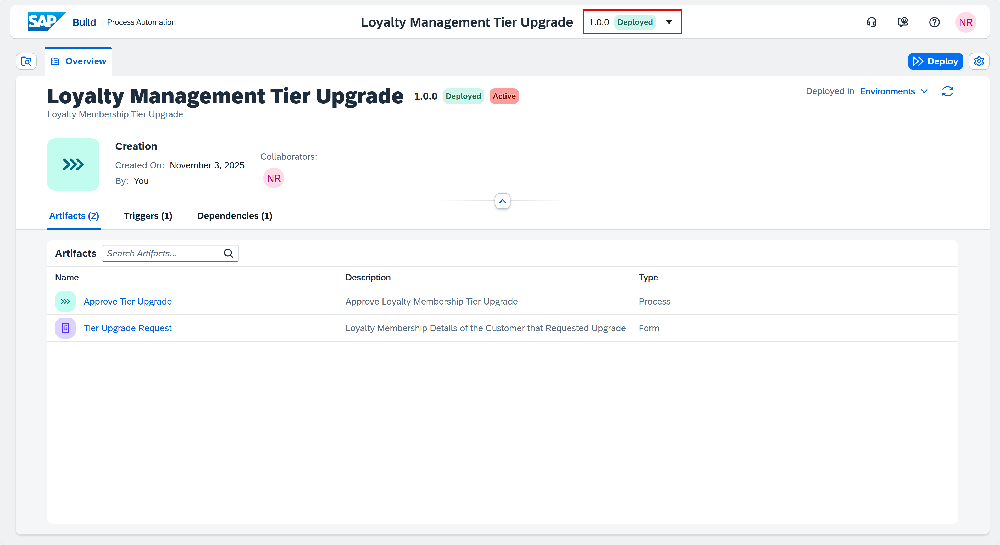

</details>

<!-----

➡️ [Create and Implement the Workflow Handler Class](/03-REUSE/02-INTEGRATION/01-SAP_BUILD_PROCESS_AUTOMATION/05_HandlerClass/)

----->
