# Create and Implement the Workflow Handler Class

Create and implement the workflow handler class to invoke the workflow and handle callbacks from SAP Build Process Automation to receive workflow completion notifications and outcome.

Once you have created a basic loyalty application by following steps in tutorial. You would now create a new class in the application package to handle workflow related implementations i.e., method to create workflow trigger and method to handle callbacks to receive outcome of workflow from SAP Build Process Automation once the process is completed.

In case of Loyalty Management Tier upgrade Workflow, the callback applies the accept / reject decision of the workflow to the Accept Tier upgrade / Reject upgrade tier statuses of the related instance.

> The object names/coding style used here, if any, is not a recommendation on coding guidelines/standards

## 1. Create a workflow handler class

The workflow handler class will contain all the method implementations, constants, interface data types to exchange information with SAP Build Process Automation for workflow.

To create the class, follow the below steps:

1️⃣ Right click on your **Package** and select **New > ABAP Class**.


2️⃣ Enter the below values to create the class.

 - Name: **ZLYMGT_CL_MEMBSHIPTIERAPPROVAL**
 - Description: **Callback for membershiptier approval**

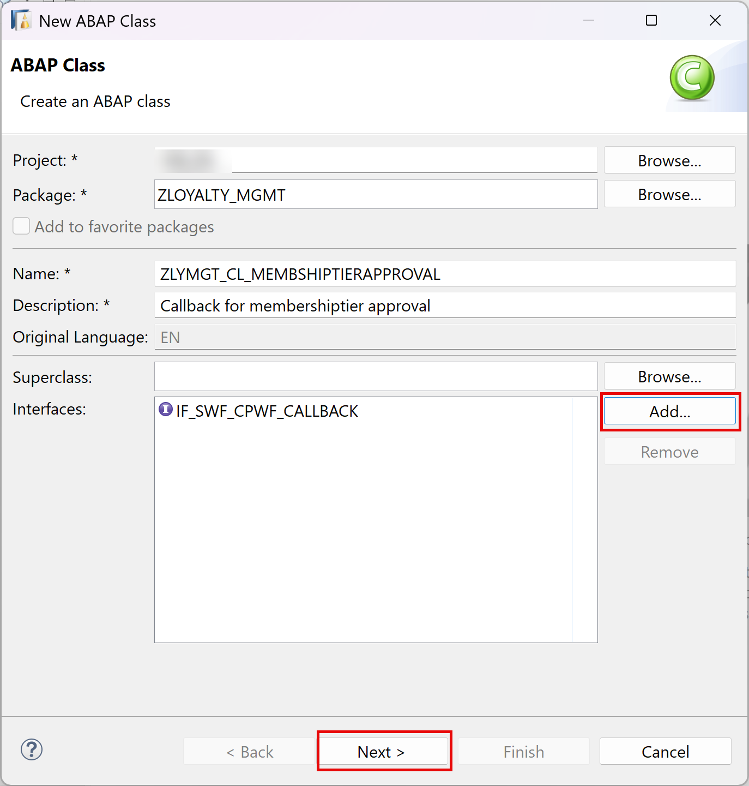

 - Click **Add** to enter Interface and search for callback Interface **IF_SWF_CPWF_CALLBACK**.
 - Click **OK** once found.

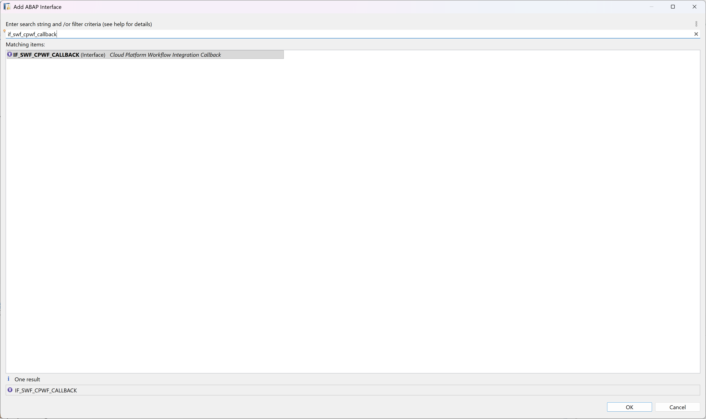

3️⃣ Click **Next**. Select the **transport request** for your application and click **Finish**.

The class is now created. You can see that the interface addition came with the method **workflow_instance_completed** which would be triggered during callback post completion of workflow in SAP Build Process Automation.

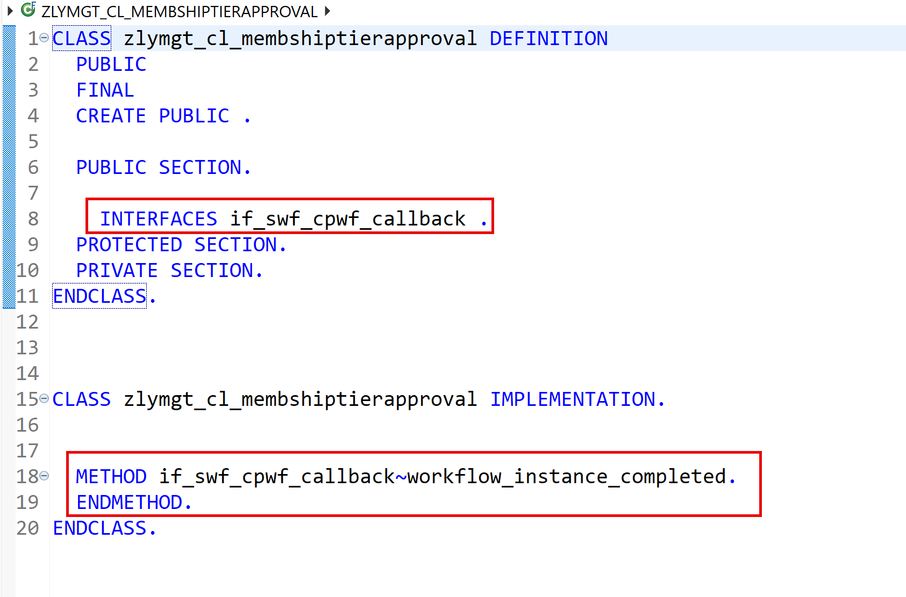

In the later steps we will implement this method to receive workflow decision/notification.
Thus to enable a class to be a callback class we need to add Interface **IF_SWF_CPWF_CALLBACK** to it.

> **IF_SWF_CPWF_CALLBACK** is the interface required to handle callbacks. The method **WORKFLOW_INSTANCE_COMPLETED** of this interface is invoked in background once the Action Workflow Completion Notification is triggered in SAP Build Process Automation after the Approval Form is acted upon by the Approver (Accepted/Rejected).

To troubleshoot/debug this method you would use the background workflow user **SAP_WFRT**.

## 2. Enrich the class definition with Constants, Types and Methods

Define the class artefacts required for workflow processing.

1️⃣ Define the Context(payload) type in the private section of the class. Insert the below code. 
 
 ```abap
        CLASS zlymgt_cl_membshiptierapproval DEFINITION
          PUBLIC
          FINAL
          CREATE PUBLIC .
          PUBLIC SECTION.
        
            "payload: Data sent to SAP Build Process Automation  Workflow (JSON format).
            TYPES: BEGIN OF wf_payload,
                     membershipid TYPE string,
                     customername TYPE string,
                     currenttier  TYPE string,
                     newtier      TYPE string,
                     validfrom    TYPE datum,
                     approver     TYPE string,
                   END OF wf_payload,
        
                   "Workflow decision data returned by SAP Build Process Automation after approval/rejection.
                   BEGIN OF custom,
                     decision TYPE string,
                   END OF custom.
            INTERFACES: if_swf_cpwf_callback.
          PROTECTED SECTION.
          PRIVATE SECTION.
        ENDCLASS.
 ```
   
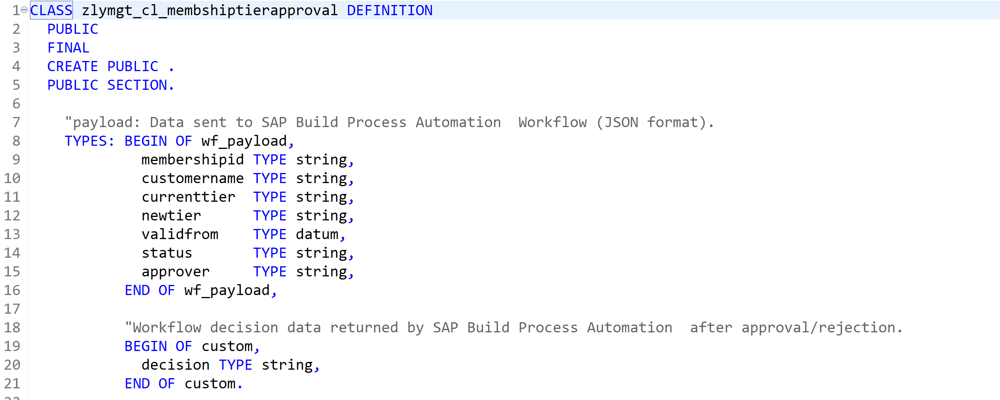

This should be same as the data type context structure declared in SAP Build Process Automation.

2️⃣ Get the **Workflow Definition ID** from SAP Build Process Automation.

  a. Login to SAP Build Process Automation.  
  
  b. Navigate to **Control Tower > Environments**.

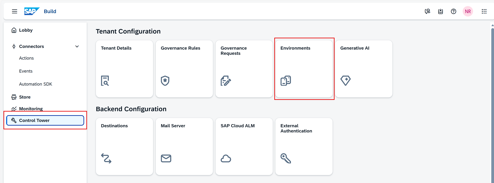

  c. Once you select the public environment, click on the **process and workflow definition**.  
  
  d. Choose your project name from the drop down > Select the project name. 
  
  e. Copy the entire text in ID highlighted below, that is your Workflow Definition ID.

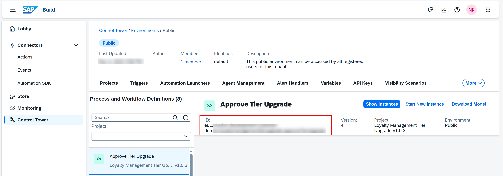

> Do not forget to replace the values for **Workflow Definition ID & Callback class values** for your implementation.

3️⃣ Create an Interface to standardize values

   - Navigate to new ABAP Development Object.
   - Define an interface named **zlymgt_if_constants** that is PUBLIC.
   - Include a set of constants to standardize values across applications, for number ranges and other operations.

  ```abap
INTERFACE zlymgt_if_constants
  PUBLIC .
  CONSTANTS:
    workflow_status_active   TYPE zlymgt_tierstatus VALUE 'A',
    workflow_status_inactive TYPE zlymgt_tierstatus VALUE 'I',
    workflow_status_pending  TYPE zlymgt_tierstatus VALUE 'W',
    workflow_status_rejected TYPE zlymgt_tierstatus VALUE 'R',
    nr_obj_value             TYPE cl_numberrange_runtime=>nr_object VALUE 'ZLYMGT_MID',
    nr_range_nr              TYPE cl_numberrange_runtime=>nr_interval VALUE '01',
    draft                    TYPE abp_behv_flag VALUE '00',
    cid                      TYPE abp_behv_cid VALUE '01',
* Below constants will be used for Workflow
    lylpts_wf_defid       TYPE if_swf_cpwf_api=>cpwf_def_id_long  VALUE '<WORKFLOW_DEFINITION_ID>',
    lylpts_retention_days    TYPE if_swf_cpwf_api=>retention_time VALUE '30',
    callback_class           TYPE if_swf_cpwf_api=>callback_classname VALUE 'zlymgt_cl_membshiptierapproval',
    consumer                 TYPE string VALUE 'DEFAULT'.

ENDINTERFACE.

```
- Number Range Constants  
nr_obj_value → 'ZLYMGT_MID' (Type: cl_numberrange_runtime=>nr_object) - Defines a Number Range Object.  
nr_range_nr → '01' (Type: cl_numberrange_runtime=>nr_interval) - Defines a Number Range Interval.

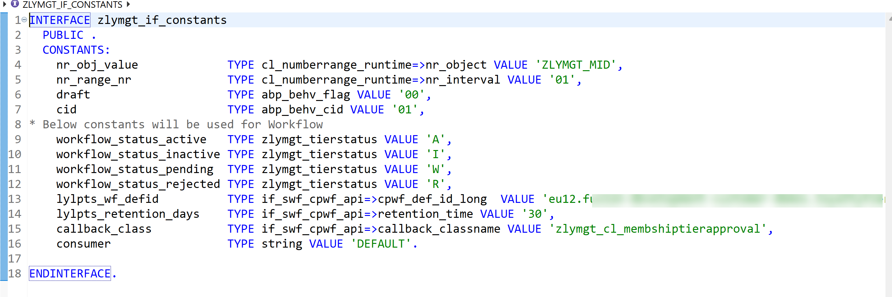


| Constant Name | Use | Values |
|-------|--------------------------------------------------------------------------------------------------------------------|------------------------------------------------------|
| workflow_status | To store the allowed value of the overall status of a instance | Possible values can be  Active (A), Rejected (R), Awaiting Approval (W), Inactive (I) |
| lylpts_wf_defid   | Definition ID of the workflow we created in SBPA | Set the value to the Workflow definition ID retrieved from SAP Build Process Automation |
| lylpts_retention_days | Retention time is the time we keep the database entry post completion of Workflow instance. After the retention days are passed the database entry will be deleted automatically.| Set the retention days to 30 |
| callback_class | Class we created with callback interface to be used while Registering the SAP Build Process Automation Workflow using RAP Facade | Set the Value to **ZLYMGT_CL_MEMBSHIPTIERAPPROVAL** |
| consumer | Tells the information on where to trigger the workflow. In the Communication Arrangement for SAP Build Process Automation we have set the consumer type (Workflow) as default | Set the Value to DEFAULT |
4. Define Method to trigger workflow in public section.

The method interface will consist of all the fields declared in the datatype.

It is declared in the public section of the class so that it can be called from the behaviour implementation class of the RAP Business Object.

```abap
        CLASS zlymgt_cl_membshiptierapproval DEFINITION
          PUBLIC
          FINAL
          CREATE PUBLIC .
          PUBLIC SECTION.
        
            "payload: Data sent to SAP Build Process Automation  Workflow (JSON format).
            TYPES: BEGIN OF wf_payload,
                     membershipid TYPE string,
                     customername TYPE string,
                     currenttier  TYPE string,
                     newtier      TYPE string,
                     validfrom    TYPE datum,
                     approver     TYPE string,
                   END OF wf_payload,
        
                   "Workflow decision data returned by SAP Build Process Automation after approval/rejection.
                   BEGIN OF custom,
                     decision TYPE string,
                   END OF custom.
        
            METHODS  Initiate_Tier_Approval IMPORTING lylpts_wf_type     TYPE if_swf_cpwf_api=>cpwf_def_id_long
                                                      !memid             TYPE string OPTIONAL
                                                      !name              TYPE string OPTIONAL
                                                      !curtier           TYPE string OPTIONAL
                                                      !newtier           TYPE string OPTIONAL
                                                      !validfrom         TYPE datum  OPTIONAL
                                                      !approver_email_id TYPE string OPTIONAL.
        
            INTERFACES: if_swf_cpwf_callback.
          PROTECTED SECTION.
          PRIVATE SECTION.
        ENDCLASS.
```
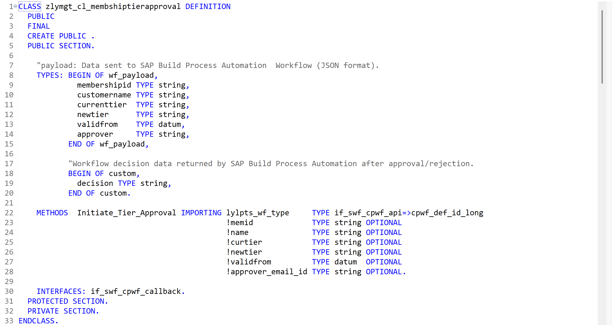


## 3. Implement methods to invoke workflow in the Class Implementation Section.

Implement the method **Initiate_Tier_Approval** to call the RAP façade I_CPWF_INST using EML (Entity Manipulation language).

With the released Business Object Interface, **I_CPWF_INST** you can invoke workflow from your BTP ABAP environment for example, in this case in SAP Build Process Automation

1️⃣ Insert the following code snippet in the method. You can use the **F1** help to get detailed information on each EML statement.

```abap

    METHOD  Initiate_Tier_Approval.

    DATA(payload)  = VALUE wf_payload(

     membershipid  = memid
     customername  = name
     currenttier   = curtier
     newtier       = newtier
     validfrom     = validfrom
     approver      = approver_email_id
       ).

    "Gets SAP Build Process Automation Workflow API instance. Converts ABAP structure payload into JSON.
    TRY.
        DATA(lo_cpwf_api) = cl_swf_cpwf_api_factory_a4c=>get_api_instance( ).
        DATA(json_conv) = lo_cpwf_api->get_json_converter( iv_capital_letter = abap_false iv_uppercase = abap_false ).
        DATA(payload_json) = json_conv->serialize( data = payload ).
      CATCH cx_swf_cpwf_api INTO DATA(cpwf_api_error).
        cpwf_api_error->get_longtext( ).
    ENDTRY.

    "Register the workflow.
    MODIFY ENTITIES OF i_cpwf_inst
         ENTITY CPWFInstance
         EXECUTE registerWorkflow
         FROM VALUE #( (
                         %key-CpWfHandle        = ''
                         %param-RetentionTime   = zlymgt_if_constants=>lylpts_retention_days
                         %param-PaWfDefId       = zlymgt_if_constants=>lylpts_wf_defid
                         %param-CallbackClass   = zlymgt_if_constants=>callback_class
                         %param-Consumer        = zlymgt_if_constants=>consumer ) )
           MAPPED   DATA(mapped_wf)
           FAILED   DATA(failed_wf)
           REPORTED DATA(reported_wf)  ##NO_LOCAL_MODE.

    "If workflow registration succeeded, attach payload JSON.
    "Returns cp_wf_handle (Workflow Instance ID).
    IF mapped_wf IS NOT INITIAL.

      "pass the Payload to workflow
      MODIFY ENTITIES OF i_cpwf_inst
       ENTITY CPWFInstance
       EXECUTE setPayload
       FROM VALUE #( (
                        %key-CpWfHandle = mapped_wf-cpwfinstance[ 1 ]-CpWfHandle
                       %param-context = payload_json ) )
             MAPPED   mapped_wf
             FAILED   failed_wf
             REPORTED reported_wf  ##NO_LOCAL_MODE.
    ENDIF.

  ENDMETHOD.
```

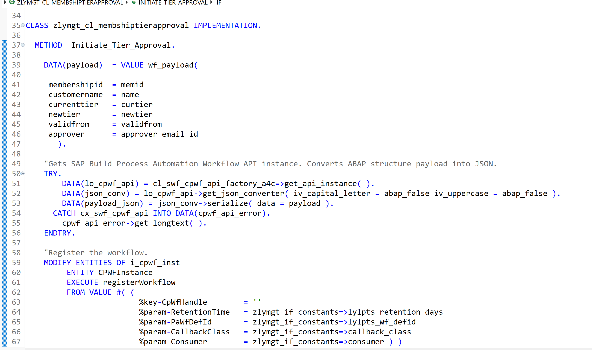

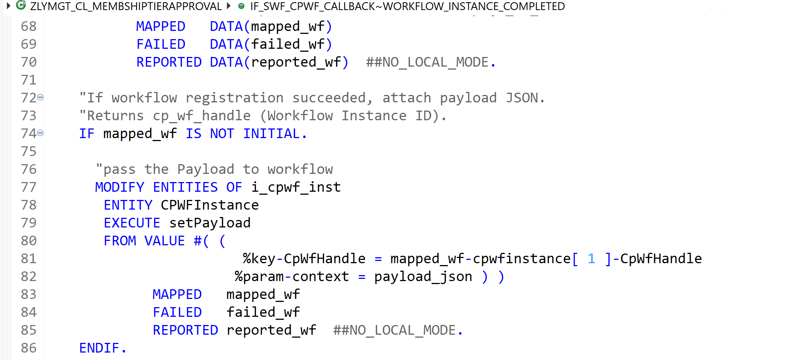

The Initiate_Tier_Approval method is responsible for triggering a SAP Build Process Automation workflow from ABAP using RAP Business Object i_cpwf_inst. It performs three main tasks:
- **Prepare Workflow Payload**: It collects membership details (membership ID, customer name, current tier, new tier, validity date, approver email, etc.) and converts them into a JSON payload, which is required by        SAP Build Process Automation.
- **Register the Workflow Instance**: Using i_cpwf_inst, the method executes the registerWorkflow action to create a new workflow instance in SAP Build Process Automation. During registration, it passes:
   - Workflow definition ID
   - Retention time
   - Callback class name
   - Consumer information
   If this step succeeds, SAP Build Process Automation returns a unique Workflow Instance Handle (CpWfHandle).
- **Attach Payload to the Workflow**: Once the workflow instance is registered, the method executes the setPayload action to attach the JSON payload created earlier. This payload becomes the initial context for the SAP Build Process Automation workflow.

## 4. Implement methods to handle callback in the class omplementation section

Implement the method **if_swf_cpwf_callback~workflow_instance_completed** to handle callback from SAP Build Process automation on workflow process completion.

   ```abap
    METHOD if_swf_cpwf_callback~workflow_instance_completed.
    "Reads workflow context from SAP Build Process Automation. Extracts decision (Approved/Rejected). Updates Tier entity status

    TYPES: BEGIN OF callback_context,
             start_event TYPE wf_payload,
             custom      TYPE custom,
           END OF callback_context.

    DATA: callback_context TYPE callback_context.

    TRY.

       "Get the API of workflow.
        DATA(workflow_API_instance) = cl_swf_cpwf_api_factory_a4c=>get_api_instance( ).
       "Get the Context of workflow using workflow handler ID in json format
       "Convert it into internal data format callback_context.
        DATA(context_xstring) = workflow_API_instance->get_workflow_context( iv_cpwf_handle = iv_cpwf_handle ).

        workflow_API_instance->get_context_data_from_json(
          EXPORTING
            iv_context      = context_xstring
            it_name_mapping = VALUE #( ( abap = 'start_event' json = 'startEvent' ) ( abap = 'membershipid' json = 'membershipid' )
                                       ( abap = 'custom' json = 'custom' )  ( abap = 'decision' json = 'decision' ) )
          IMPORTING
            ev_data         = callback_context
        ).

      CATCH cx_swf_cpwf_api INTO DATA(wf_context_exception).
        wf_context_exception->get_longtext( ).
    ENDTRY.

    DATA(decision) = callback_context-custom-decision.
    DATA(lyty_membershipid) = callback_context-start_event-membershipid.
    DATA(status) = COND #( WHEN decision = 'Approved'
                                THEN zlymgt_if_constants=>workflow_status_active
                                ELSE
                                zlymgt_if_constants=>workflow_status_rejected ).

    SELECT SINGLE membershipuuid FROM zlymgt_r_membership
    WHERE membershipid = @lyty_membershipid
      INTO @DATA(lyty_membershipuuid).

    SELECT SINGLE tieruuid FROM zlymgt_r_membershiptier WHERE
    Membershipuuid = @lyty_membershipuuid AND tierstatus = @zlymgt_if_constants=>workflow_status_pending INTO @DATA(tier_uuid).

    IF sy-subrc = 0.
      MODIFY ENTITIES OF zlymgt_r_membership
                  ENTITY MembershipTiers
                  UPDATE FIELDS ( Tierstatus  )
                  WITH VALUE #( (
                                       Tieruuid = tier_uuid
                                       Tierstatus  = status  ) ).
      COMMIT ENTITIES.
    ENDIF.

  ENDMETHOD.

 ```
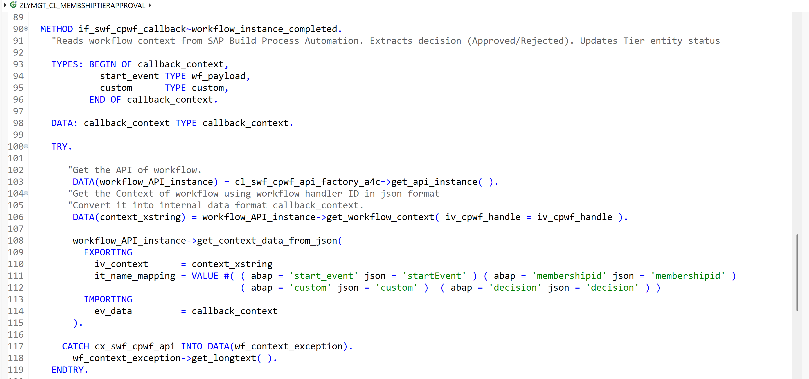

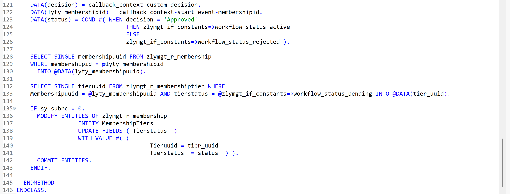

This callback method is automatically invoked when the SAP Build Process Automation workflow finishes (Approved or Rejected). It's purpose is to read the workflow result and update the corresponding Tier record in the ABAP system.

✔️ 1. Read Workflow Context

The method retrieves the workflow context using the Workflow Instance Handle (iv_cpwf_handle).
SAP Build Process Automation returns the context in JSON format, so the method converts it into an internal structure (callback_context) that contains:

start_event → original payload sent during workflow initiation

custom → workflow outcome (Approval decision)

✔️ 2. Extract the Decision

From the custom data, it reads the workflow’s final decision:

- Approved
- Rejected

Based on this, it determines the new tier status.

✔️ 3. Identify the Tier Record

Using the membership ID from the callback payload: It fetches the corresponding membershipuuid

Then reads the pending tier record (tierstatus = Waiting for approval)

✔️ 4. Update Tier Status in RAP Business Object

If a matching pending tier entry exists, it updates it using RAP: 

- Sets the tier status to Active if approved
- Or Rejected if the workflow was rejected

Finally, the changes are saved with COMMIT ENTITIES.

### The Entire code should look like this:

```abap

CLASS zlymgt_cl_membshiptierapproval DEFINITION
  PUBLIC
  FINAL
  CREATE PUBLIC .
  PUBLIC SECTION.

    "payload: Data sent to SAP Build Process Automation  Workflow (JSON format).
    TYPES: BEGIN OF wf_payload,
             membershipid TYPE string,
             customername TYPE string,
             currenttier  TYPE string,
             newtier      TYPE string,
             validfrom    TYPE datum,
             approver     TYPE string,
           END OF wf_payload,

           "Workflow decision data returned by SAP Build Process Automation after approval/rejection.
           BEGIN OF custom,
             decision TYPE string,
           END OF custom.

    METHODS  Initiate_Tier_Approval IMPORTING lylpts_wf_type     TYPE if_swf_cpwf_api=>cpwf_def_id_long
                                              !memid             TYPE string OPTIONAL
                                              !name              TYPE string OPTIONAL
                                              !curtier           TYPE string OPTIONAL
                                              !newtier           TYPE string OPTIONAL
                                              !validfrom         TYPE datum  OPTIONAL
                                              !approver_email_id TYPE string OPTIONAL.

    INTERFACES: if_swf_cpwf_callback.
  PROTECTED SECTION.
  PRIVATE SECTION.
ENDCLASS.

CLASS zlymgt_cl_membshiptierapproval IMPLEMENTATION.

  METHOD  Initiate_Tier_Approval.

    DATA(payload)  = VALUE wf_payload(

     membershipid  = memid
     customername  = name
     currenttier   = curtier
     newtier       = newtier
     validfrom     = validfrom
     approver      = approver_email_id
       ).

    "Gets SAP Build Process Automation Workflow API instance. Converts ABAP structure payload into JSON.
    TRY.
        DATA(lo_cpwf_api) = cl_swf_cpwf_api_factory_a4c=>get_api_instance( ).
        DATA(json_conv) = lo_cpwf_api->get_json_converter( iv_capital_letter = abap_false iv_uppercase = abap_false ).
        DATA(payload_json) = json_conv->serialize( data = payload ).
      CATCH cx_swf_cpwf_api INTO DATA(cpwf_api_error).
        cpwf_api_error->get_longtext( ).
    ENDTRY.

    "Register the workflow.
    MODIFY ENTITIES OF i_cpwf_inst
         ENTITY CPWFInstance
         EXECUTE registerWorkflow
         FROM VALUE #( (
                         %key-CpWfHandle        = ''
                         %param-RetentionTime   = zlymgt_if_constants=>lylpts_retention_days
                         %param-PaWfDefId       = zlymgt_if_constants=>lylpts_wf_defid
                         %param-CallbackClass   = zlymgt_if_constants=>callback_class
                         %param-Consumer        = zlymgt_if_constants=>consumer ) )
           MAPPED   DATA(mapped_wf)
           FAILED   DATA(failed_wf)
           REPORTED DATA(reported_wf)  ##NO_LOCAL_MODE.

    "If workflow registration succeeded, attach payload JSON.
    "Returns cp_wf_handle (Workflow Instance ID).
    IF mapped_wf IS NOT INITIAL.

      "pass the Payload to workflow
      MODIFY ENTITIES OF i_cpwf_inst
       ENTITY CPWFInstance
       EXECUTE setPayload
       FROM VALUE #( (
                        %key-CpWfHandle = mapped_wf-cpwfinstance[ 1 ]-CpWfHandle
                       %param-context = payload_json ) )
             MAPPED   mapped_wf
             FAILED   failed_wf
             REPORTED reported_wf  ##NO_LOCAL_MODE.
    ENDIF.

  ENDMETHOD.

  METHOD if_swf_cpwf_callback~workflow_instance_completed.
    "Reads workflow context from SAP Build Process Automation. Extracts decision (Approved/Rejected). Updates Tier entity status

    TYPES: BEGIN OF callback_context,
             start_event TYPE wf_payload,
             custom      TYPE custom,
           END OF callback_context.

    DATA: callback_context TYPE callback_context.

    TRY.

       "Get the API of workflow.
        DATA(workflow_API_instance) = cl_swf_cpwf_api_factory_a4c=>get_api_instance( ).
       "Get the Context of workflow using workflow handler ID in json format
       "Convert it into internal data format callback_context.
        DATA(context_xstring) = workflow_API_instance->get_workflow_context( iv_cpwf_handle = iv_cpwf_handle ).

        workflow_API_instance->get_context_data_from_json(
          EXPORTING
            iv_context      = context_xstring
            it_name_mapping = VALUE #( ( abap = 'start_event' json = 'startEvent' ) ( abap = 'membershipid' json = 'membershipid' )
                                       ( abap = 'custom' json = 'custom' )  ( abap = 'decision' json = 'decision' ) )
          IMPORTING
            ev_data         = callback_context
        ).

      CATCH cx_swf_cpwf_api INTO DATA(wf_context_exception).
        wf_context_exception->get_longtext( ).
    ENDTRY.

    DATA(decision) = callback_context-custom-decision.
    DATA(lyty_membershipid) = callback_context-start_event-membershipid.
    DATA(status) = COND #( WHEN decision = 'Approved'
                                THEN zlymgt_if_constants=>workflow_status_active
                                ELSE
                                zlymgt_if_constants=>workflow_status_rejected ).

    SELECT SINGLE membershipuuid FROM zlymgt_r_membership
    WHERE membershipid = @lyty_membershipid
      INTO @DATA(lyty_membershipuuid).

    SELECT SINGLE tieruuid FROM zlymgt_r_membershiptier WHERE
    Membershipuuid = @lyty_membershipuuid AND tierstatus = @zlymgt_if_constants=>workflow_status_pending INTO @DATA(tier_uuid).

    IF sy-subrc = 0.
      MODIFY ENTITIES OF zlymgt_r_membership
                  ENTITY MembershipTiers
                  UPDATE FIELDS ( Tierstatus  )
                  WITH VALUE #( (
                                       Tieruuid = tier_uuid
                                       Tierstatus  = status  ) ).
      COMMIT ENTITIES.
    ENDIF.

  ENDMETHOD.
ENDCLASS.
```
</details>

<!-----
➡️ [Create and Implement the Workflow Handler Class](/03-REUSE/02-INTEGRATION/01-SAP_BUILD_PROCESS_AUTOMATION/06_Extend_Loyalty_Application_to_integrate_Workflow/)
----->
