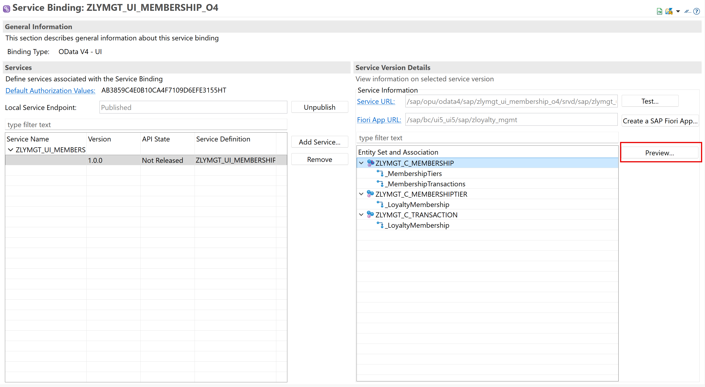
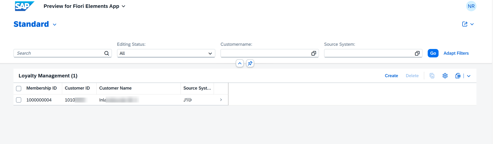
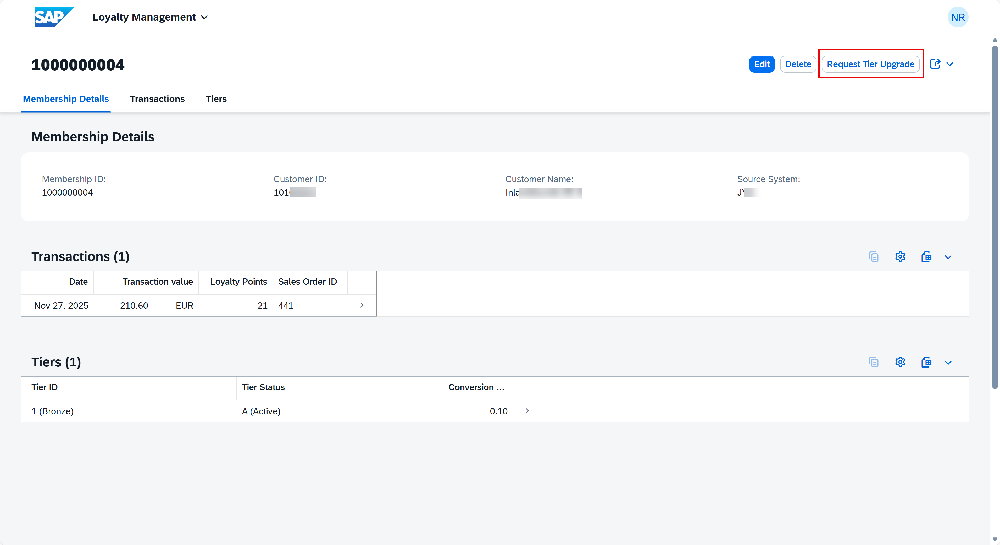
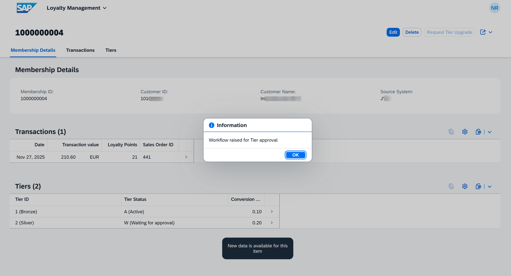
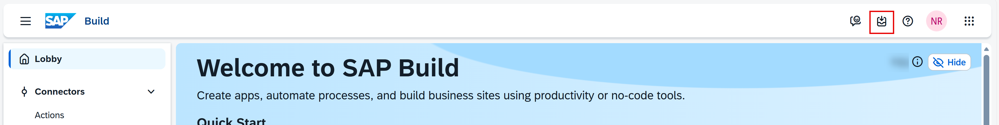
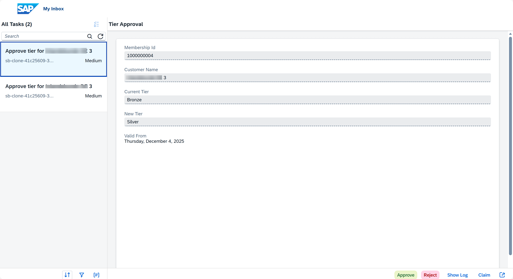
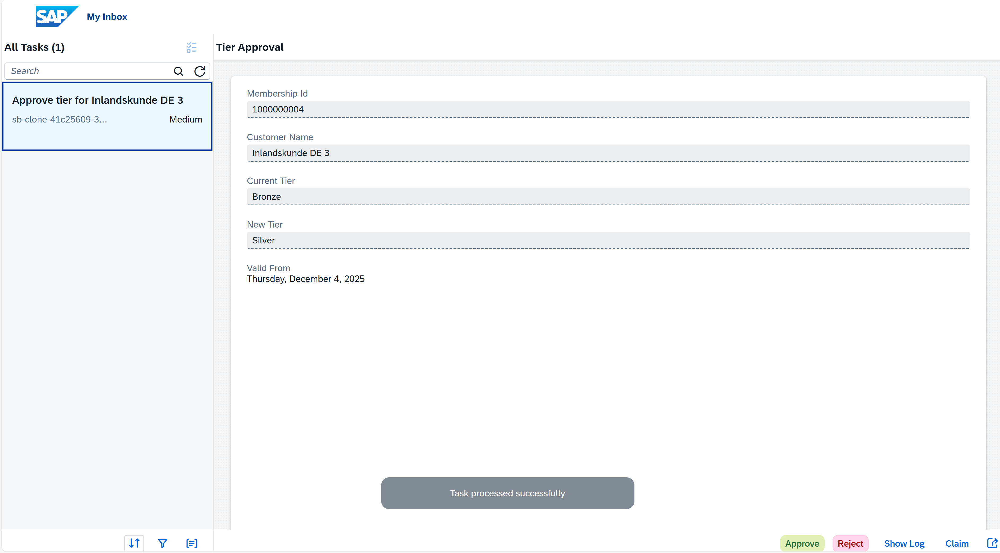
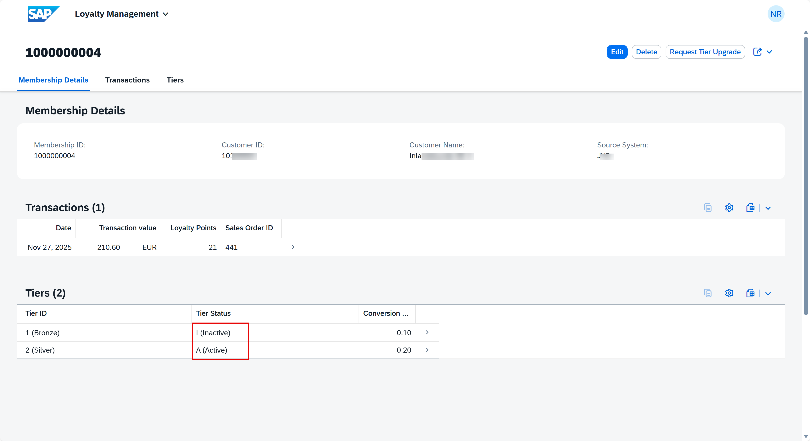

# Run End-to-End Business Process for Loyalty Application.

The end-to-end business process starts from creating a sales order, requesting tier upgrade, checking the inbox in SAP Build Process Automation for triggered workflow processes, actioning the approval form and also checking for tier status update during workflow trigger and call back.
   
1. Creating a sales order.
  
2. Go to Service Binding of your application. Choose **Entity > Preview**.

3. Choose one entry from application.

4. Click on **Request Tier Upgrade** button.

5. Workflow raised for tier approval with tier status as waiting for approval.

## Go to SAP Build Process Automation to Action the Workflow.

1. From the SAP Build Process Automation Lobby, choose **My Inbox** to access the Approval Form.

Here you can see the workflow task created.

2. In the TierApprovalForm choose the task for customer that you created. This will display the Approval Form with the Loyalty Membership Details.

3. Click **Approve** to approve the Tierapproval form. A message **Task Processed Successfully** appears on successful approval of the form.

## Go back to the Loyalty Application.

In this you can Tier status turned **Active** for Silver Tier and Previous Tier Status became **Inactive**.

<!---
➡️ [Build a Unified Site with Workzone](../../../../03-REUSE/02-INTEGRATION/02-WORKZONE/0_Setup_workzone)
--->

