# Design Your Site With the SAP Build Work Zone Experience
<!-- description --> Create a page, assign it to a space, and then add apps to your page.

> The naming of roles/objects here is not a recommendation on standard/guidelines/conventions

## Prerequisites
- Make sure you've selected **Spaces and Pages - New Experience** view mode for your site in the Site Settings screen. 

## You will learn
- How to create a page  
- How to add apps to a page  
- How to create a space and assign pages to it                    

## Introduction 
If you select the **Spaces and Pages - New Experience** view mode, you can create custom Spaces and Pages. A Space consists of Pages, a page consists of a single or multiple sections, a section consists of a single or multiple tiles (apps) and Cards.

> **📌 Note:**  
> The **Manage Gift Cards , Standard Sales Order** applications from **SAP Cloud ERP (SAP S/4HANA Cloud)**  and **Loyalty Points Management** is already added to the launchpad spaces during deployment. Therefore, these apps are automatically reflected in the SAP Build Work Zone site without the need to manually create a space or page for them.
>
> However, to add the **My Inbox** application to a space, follow the steps in the next section.

---

## 1. Create a Page

1️⃣ Open the **Content Manager**.  

   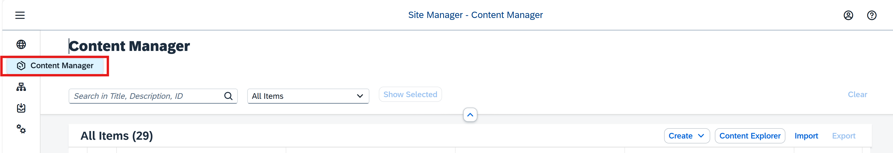

2️⃣ Click **Create** and from the dropdown list, select **Page**.  

   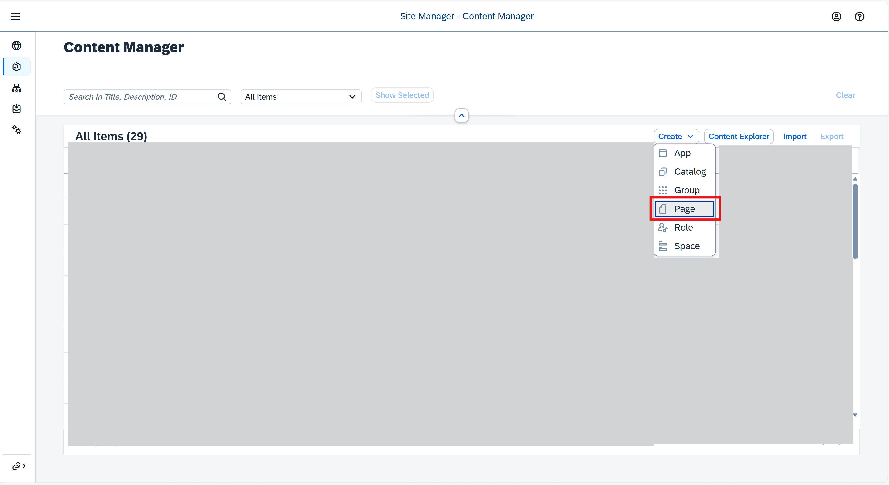

3️⃣ Enter a title for the page: **SAP Build Process Automation** and select **Save**.  

   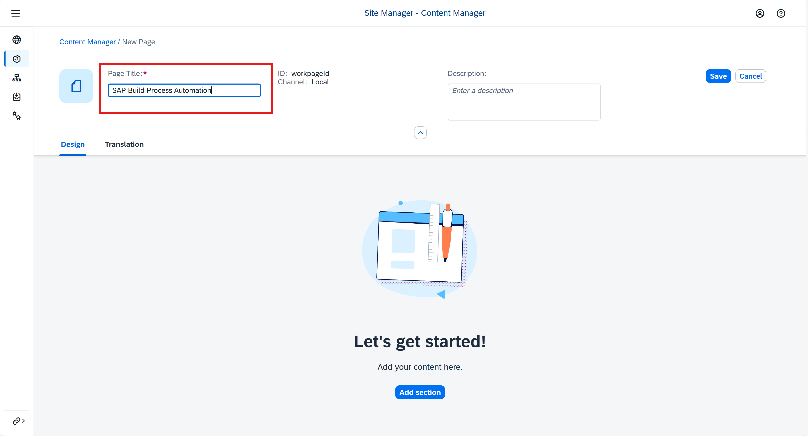

---

## 2. Add Apps to the Page

Follow these steps to add the **My Inbox** app to a space and page.

1️⃣ In the **Design** tab, click **Edit**.

   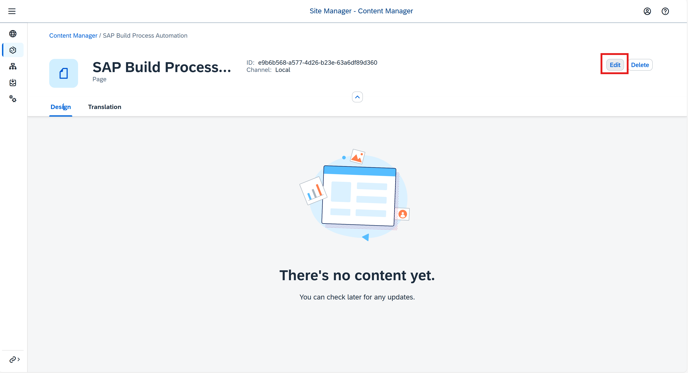

2️⃣ Click **Add Section**.

   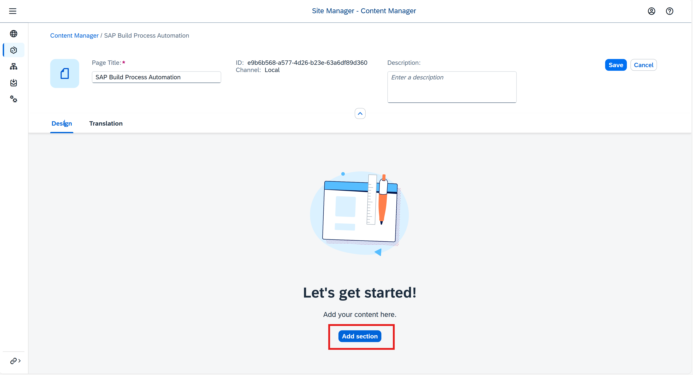

3️⃣ Give the section a title, `SAP Build Process Automation` and click **Add Widget**.

   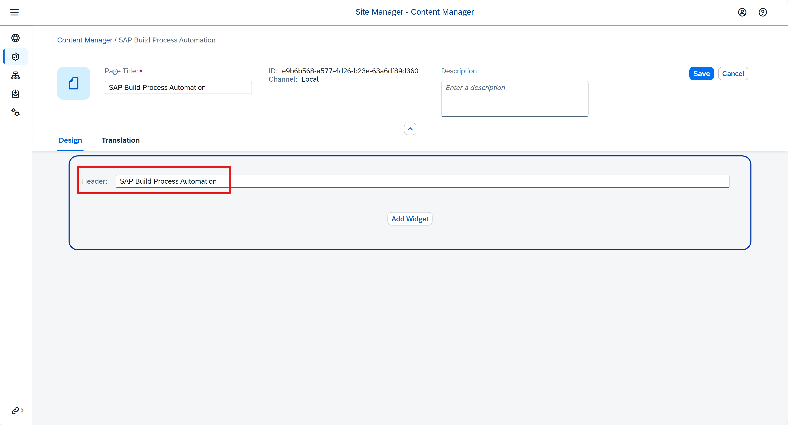

4️⃣ In the **Add Widgets** screen, click **Tiles**.

> In this screen you'll see all the apps that you can access from your subaccount. 

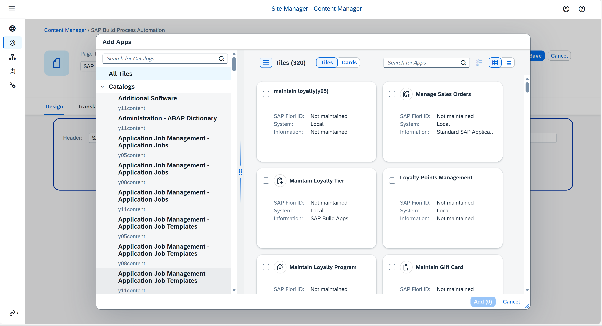

5️⃣ Select the `My Inbox` (from SAP Build Process Automation) app and click **Add**.

> You can select one or more apps to add to your page - they will display side by side in a section.

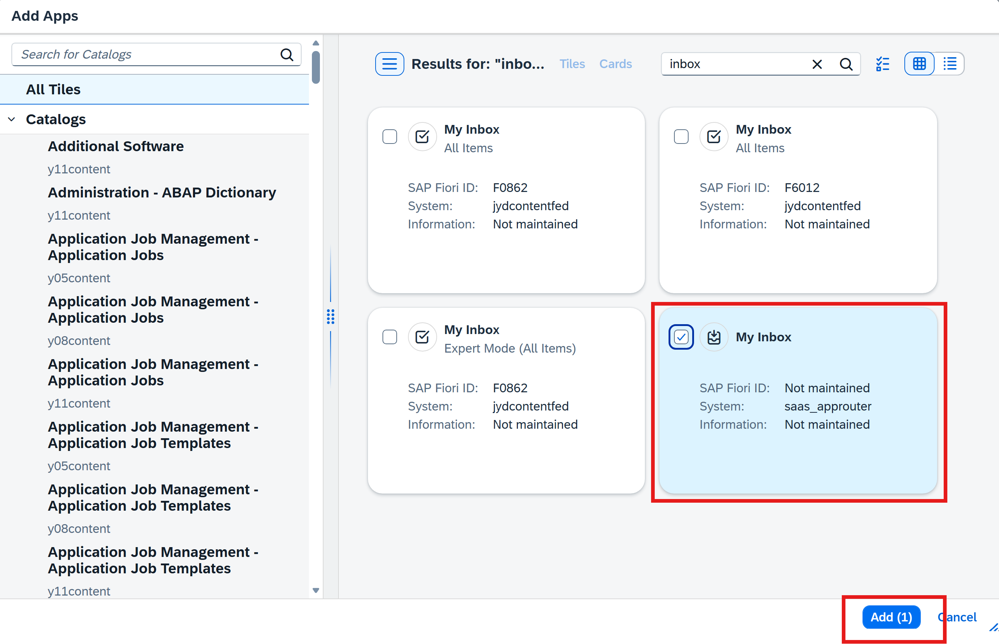

6️⃣ Click **Save**. This is how your page looks:

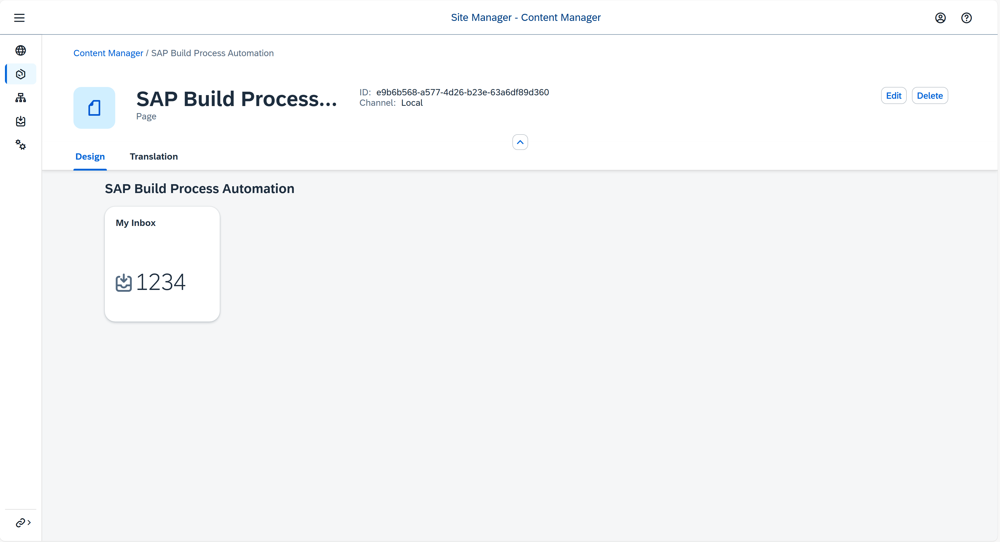

7️⃣Go back to your **Content Manager** using the breadcrumbs at the top.

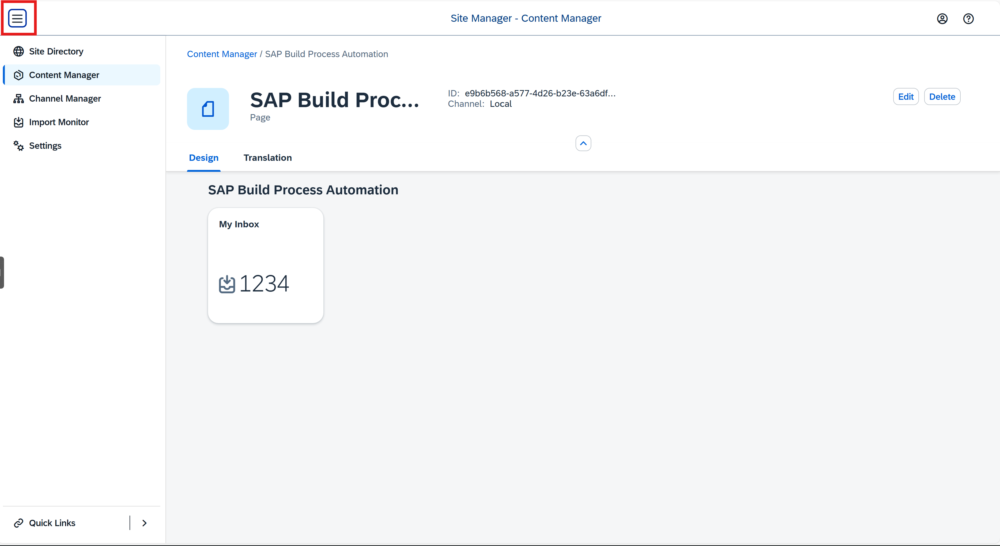

8️⃣ Verify if the page you created is in the list of content items.

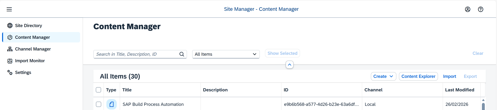

## 3. Create a Space

1️⃣ In the Content Manager click **Create** and then select **Space**.

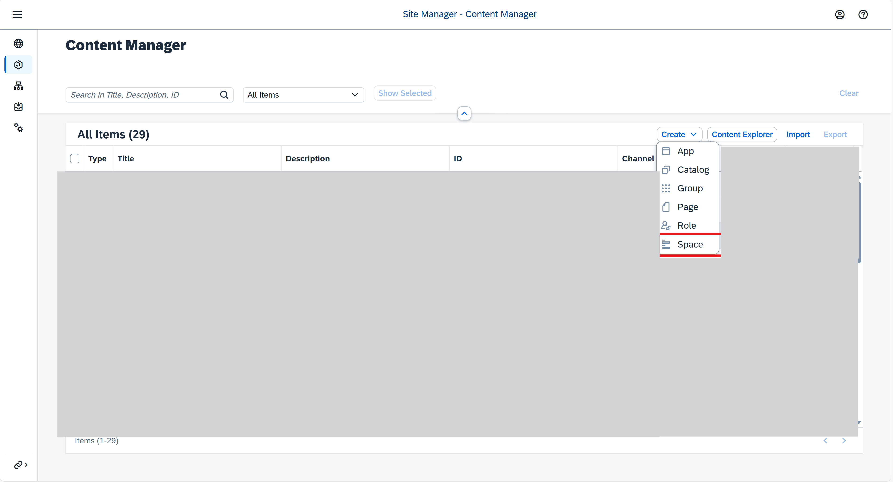

2️⃣ Enter a title for the space: `SAP Build Process Automation`.

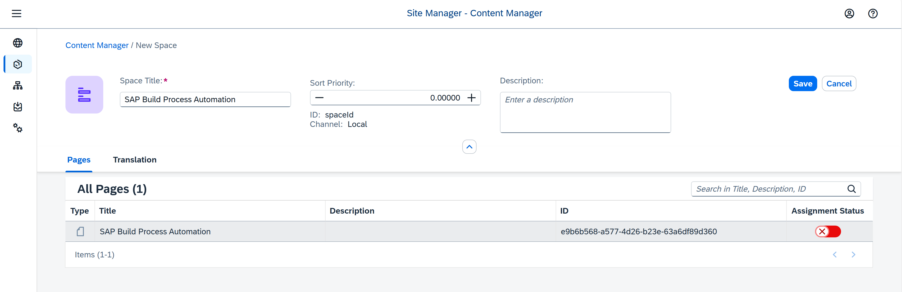

3️⃣In the **Pages** tab, you'll see a list of pages and from here you can assign as many pages as you want to the space. We only have one page - the 'SAP Build Process Automation' page. From the **Assignment Status** column, click the toggle to assign the `Overview` page to the `Home` space.

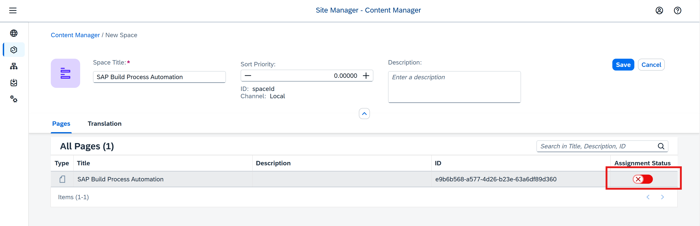

4️⃣ Click **Save**. 

5️⃣ Go back to the **Content Manager** using the breadcrumbs at the top. You'll see that the space you created is added to the list of content items.

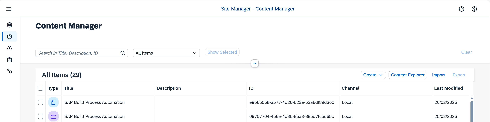

## 4. Assign the space to a role

In this step, you'll assign the space to the `Everyone` role. 

> Spaces are assigned to a role and users assigned to a specific role are able to access the space and see the relevant pages assigned to it. Content assigned to the `Everyone` role is visible to all users.

1️⃣ From the Content Manager, click the `Build process automation role` role.

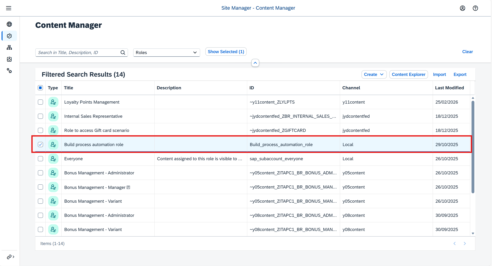

2️⃣ Click **Edit**.

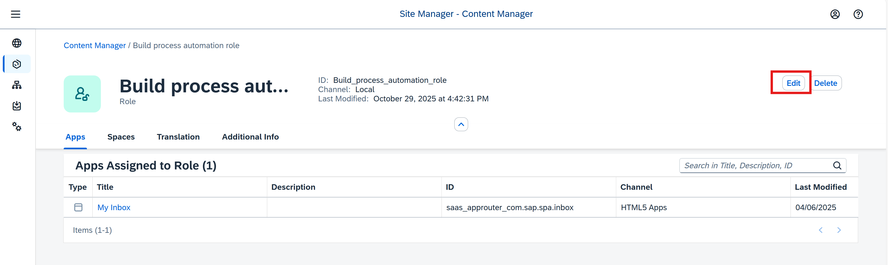

3️⃣ Under the **Spaces** tab, you'll see the `SAP Build Process Automation` space you just created. Click the toggle to assign the `SAP Build Process Automation` space to the `Build process automation` role. Then click **Save**.

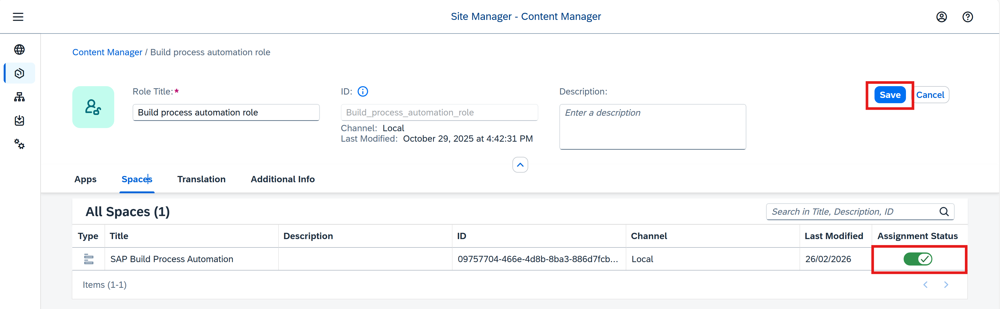

## 5. Assign Roles for SAP Build Work Zone, Standard Edition

Once you have created a site, you must assign roles to any user who needs access to the spaces, apps and pages within the site(including your own user account).

1️⃣ Navigate to **SAP Business Technology Platform Cockpit subaccount > Security > Users**.  

2️⃣ Select the **user** to whom you want to assign roles.  

3️⃣ Click **Assign Role Collection**.  

4️⃣ Select the following role collections:  
   - **~jydcontent_ZBR_INTERNAL_SALES_REP**  (May vary based on the role name created) - This is to access the Manage sales order app
   - **~jydcontent_ZGIFTCARD**  (May vary based on the role name created) - This is to access the Manage Gift Card app
   - **~Build_process_automation_role**  (May vary based on the role name created) - This is to access the My Inbox
   - **~y11content_ZLYLPTS**  (May vary based on the role name created) - This is to access the Loyalty Points Management solution

5️⃣ Click **Assign Role Collection** to confirm.

### 🎉 You’re All Set — Configuration Complete!

Congratulations! You have successfully completed all the required configurations. Your SAP Build Work Zone site is now fully set up and ready to use.

Your site should now look like this:

✨ The configured spaces, pages, and applications are now available.  
🚀 You can start accessing your business content and launching applications directly from your Work Zone site.  

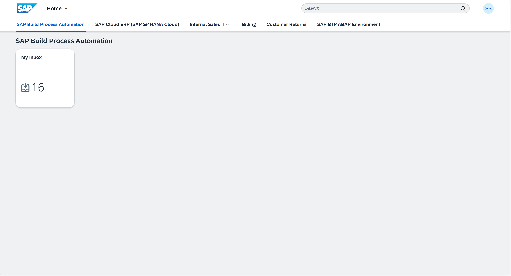

<!-----
➡️ [Finally, let's run the process!](.././5_EndtoEndRun)
----->

