# Run the scenario

In the next steps, you will run the scenario end-to-end using **SAP Build Work Zone**, **SAP Cloud ERP**, and **SAP Build Process Automation**.

---

## 🌐 Access the SAP Build Work Zone Site

1. Log in to your **SAP Build Work Zone** site.

2. From the top navigation, select **SAP Cloud ERP**.

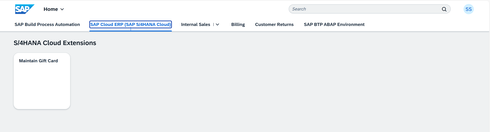

3. Click on **Maintain Gift Card**.

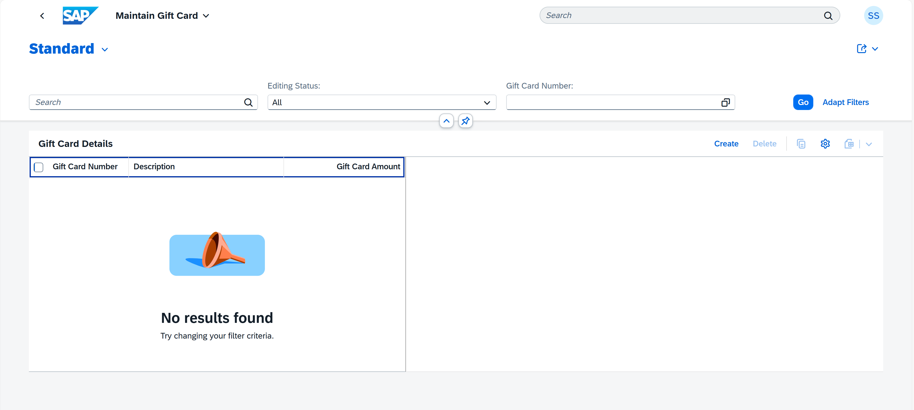

4. Maintain the required gift card value in **Maintain Gift Cards**.

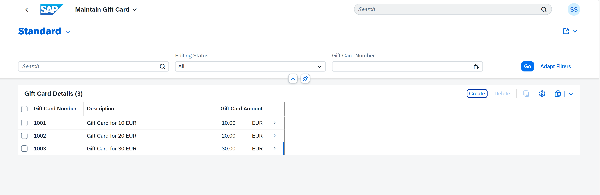

5. Navigate back to the **Internal sales** space.
   
6. Select **Manage Sales Orders**.

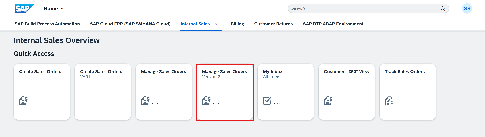

---

## 1️⃣ Create a Sales Order and Include a Gift Card

1. Choose **Create → Create Sales Order**. Enter the following:

   - **Sales Order Type**: Standard Order (OR)
   - **Sales Organization**: Dom. Sales Org DE (1010)
   - **Distribution Channel**: Direct Sales (10)
   - **Division**: Product Division 00 (00)

2. Choose **Continue**.

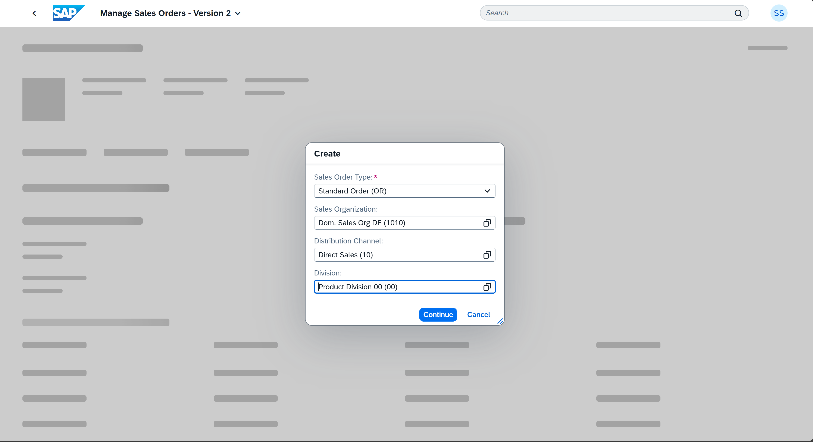

3. On the **General Information** tab choose the **Basic Data** section. Enter the following information:

   - **Sold-to Party**: <Enter Customer ID>

---

4. On the **Items** tab, enter the following details:

   - **Product**: Trad.Good 11, PD, Reg.Trading (TG11)
   - **Requested Quantity**: 10 Pc

---

Since the net value of the sales order is **EUR 175.50**, the **Use Gift Card** button becomes active.

5. Choose **Use Gift Card** and enter **Gift Card**: EUR 40 Gift Card (1001).
   
6. Choose **Use Gift Card** again.

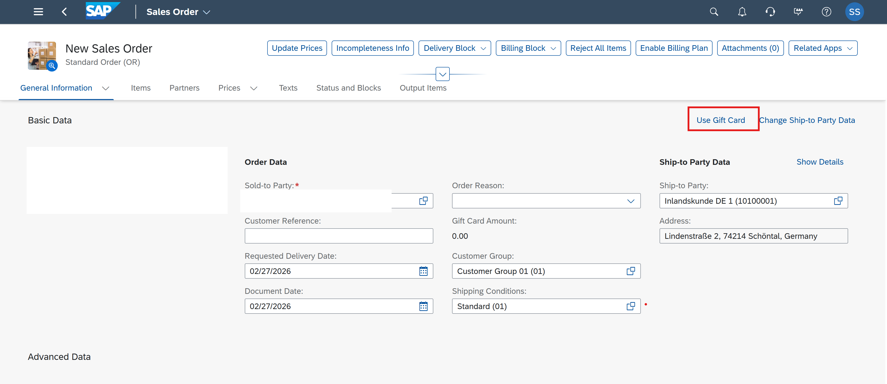

---

7. Navigate to **Prices → Price Elements**. A price element with condition type **DRV1** is created. The gift card amount is deducted from the net value.

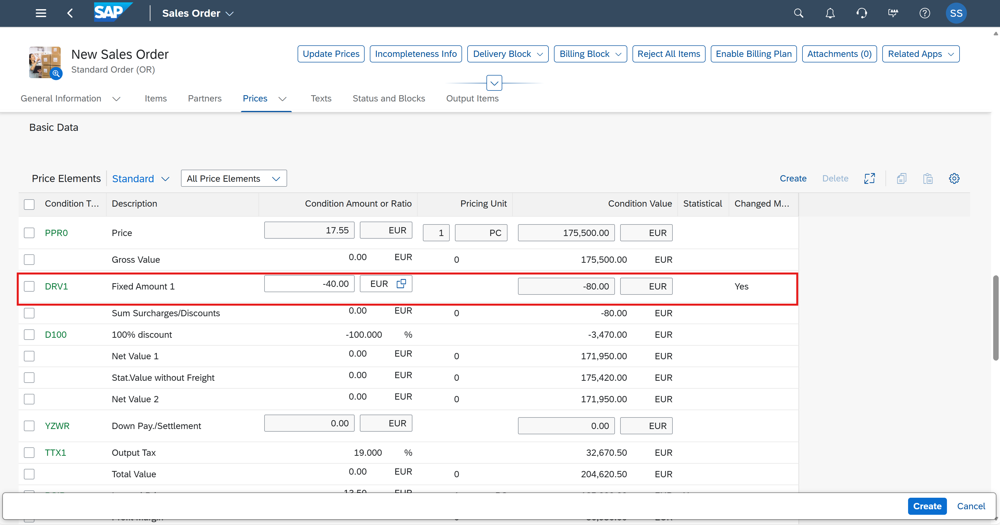

8. Create the **sales order**.

---

## 🏆 Loyalty and Tier Approval

1. Navigate to **SAP BTP ABAP Environment**.

2. Click on **Loyalty Point Management**.

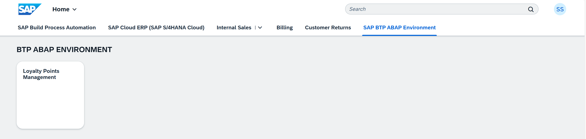

3. Verify that the created **Sales Order** is reflected under the **Transactions**.

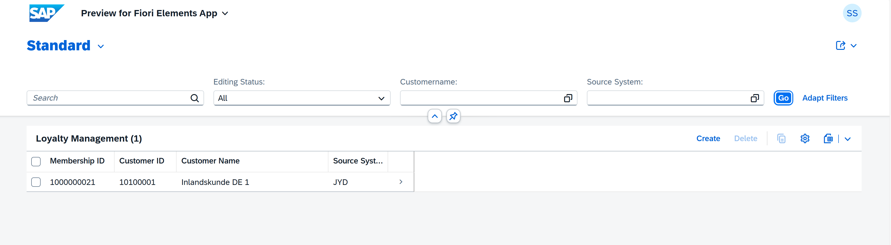

4. The default tier **Bronze** is created. 

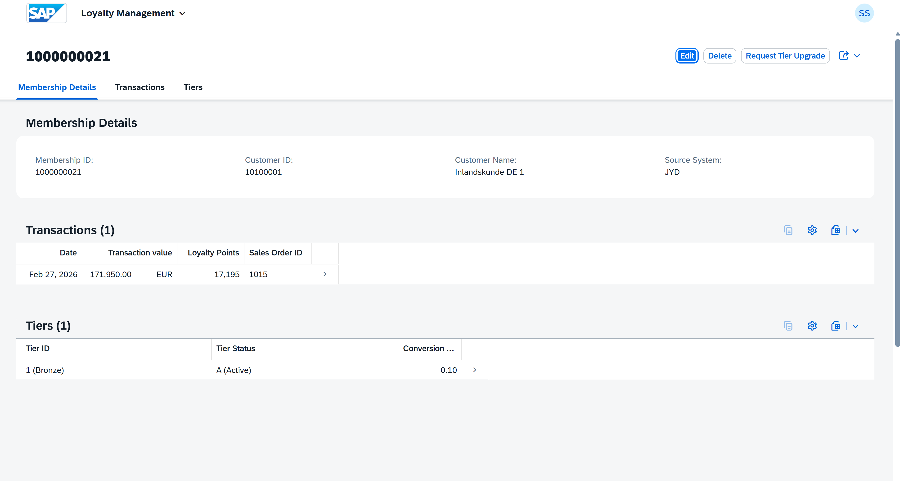

5. Click **Request Tier Upgrade**.
⚠️ Make sure:
- The total amount is above **100** to trigger the approval.
- The correct date format is used: `YYYY-MM-DD`

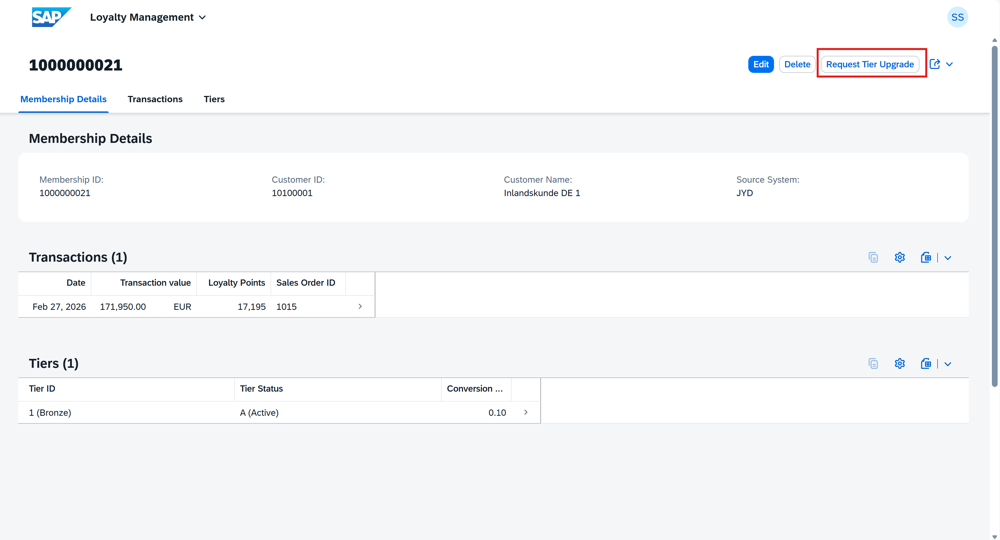

6. The approval request is sent to the approver’s **My Inbox**.

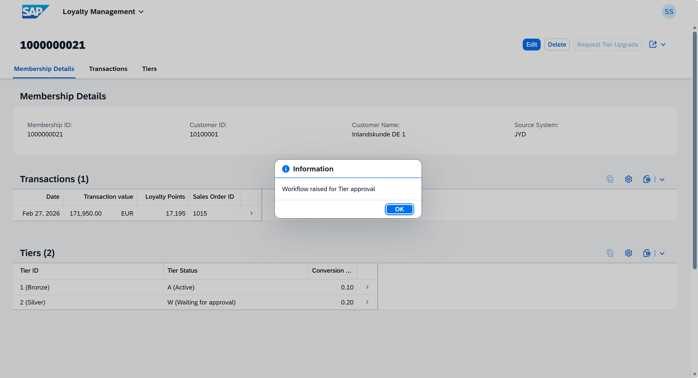

---

## Approve the Task in My Inbox

1. Go back to the **SAP Build Process Automation** space (as shown in the navigation bar).

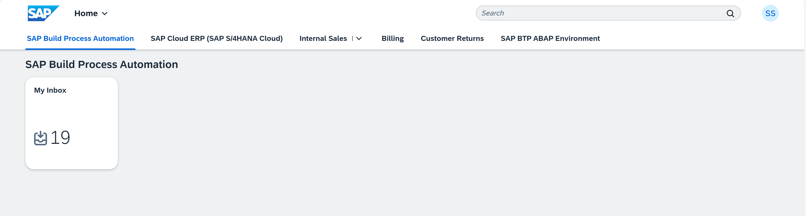

2. Open the **My Inbox** tile.
3. The new task appears with all previously entered details.

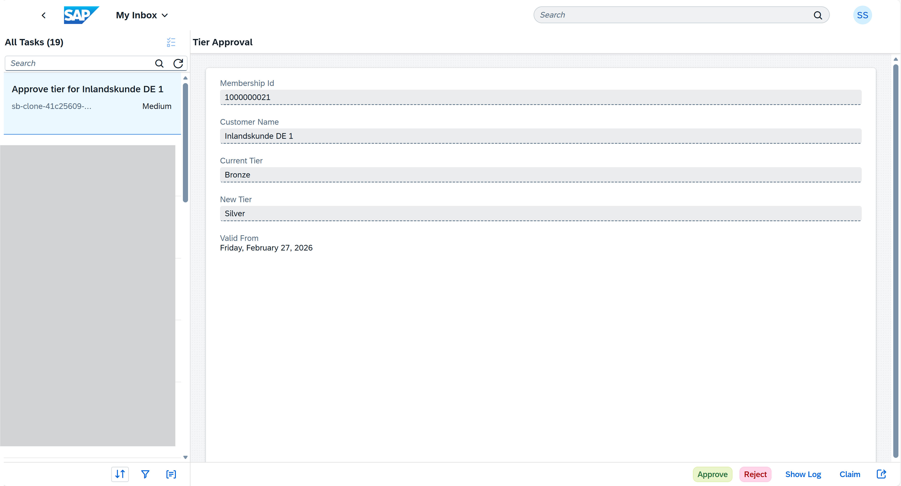

4. Review the information.
5. Choose:
   - ✅ **Approve**
   - ❌ **Reject**

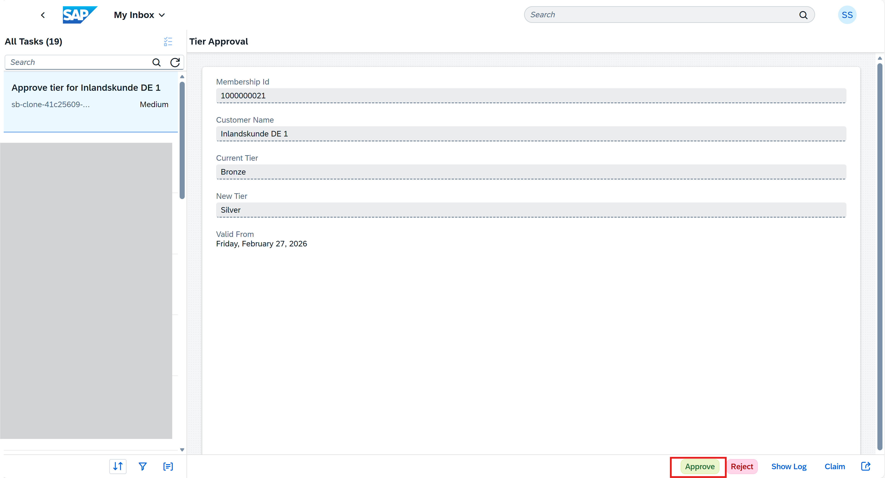

Choose **Approve**.

6. Navigate back to the **Loyalty Points Management** under the space **SAP BTP ABAP Environment**.

7. Check for the upgraded tier `silver` under the **Tiers**.

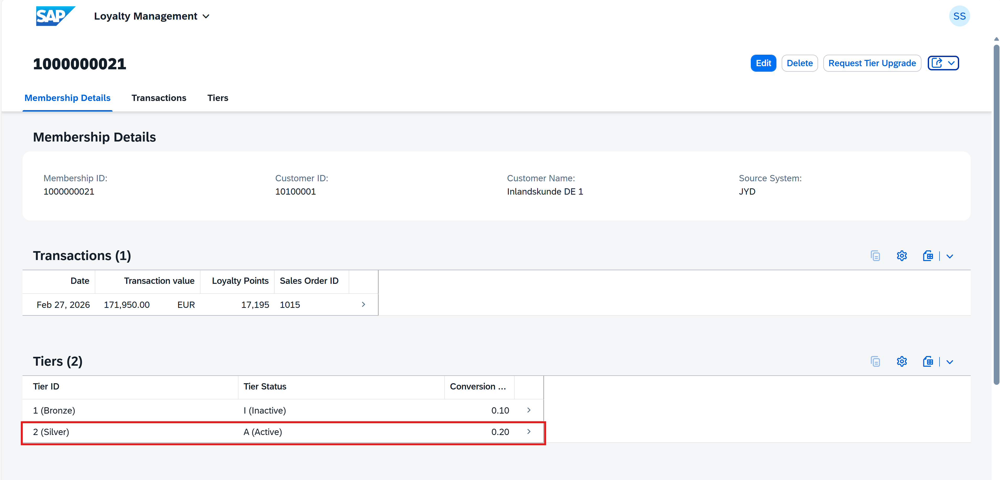

---

# ✅ Summary

🎉 Congratulations! You have successfully completed the end-to-end scenario.

You have:

- Maintained Gift Card data  
- Created a Sales Order in **SAP Cloud ERP**  
- Applied a Gift Card  
- Triggered a Loyalty Tier Approval  
- Processed the approval via **My Inbox** in **SAP Build Process Automation**

Your SAP Build Work Zone site now integrates business processes seamlessly across spaces such as:

- **SAP Build Process Automation**
- **SAP Cloud ERP**
- **Internal Sales**
- **SAP BTP ABAP Environment**

🚀 Your integrated digital workplace is now fully operational!
In case you want to learn more, please use these tutorials: 

- [SAP Build Process Automation](https://developers.sap.com/tutorial-navigator.html?tag=software-product%3Atechnology-platform%2Fsap-build%2Fsap-build-process-automation)
- [SAP Build Work Zone, advanced edition](https://developers.sap.com/tutorial-navigator.html?tag=software-product%3Atechnology-platform%2Fsap-build%2Fsap-build-work-zone-advanced-edition)
- [SAP Build Work Zone, standard edition](https://developers.sap.com/tutorial-navigator.html?tag=software-product%3Atechnology-platform%2Fsap-build%2Fsap-build-work-zone-standard-edition)

